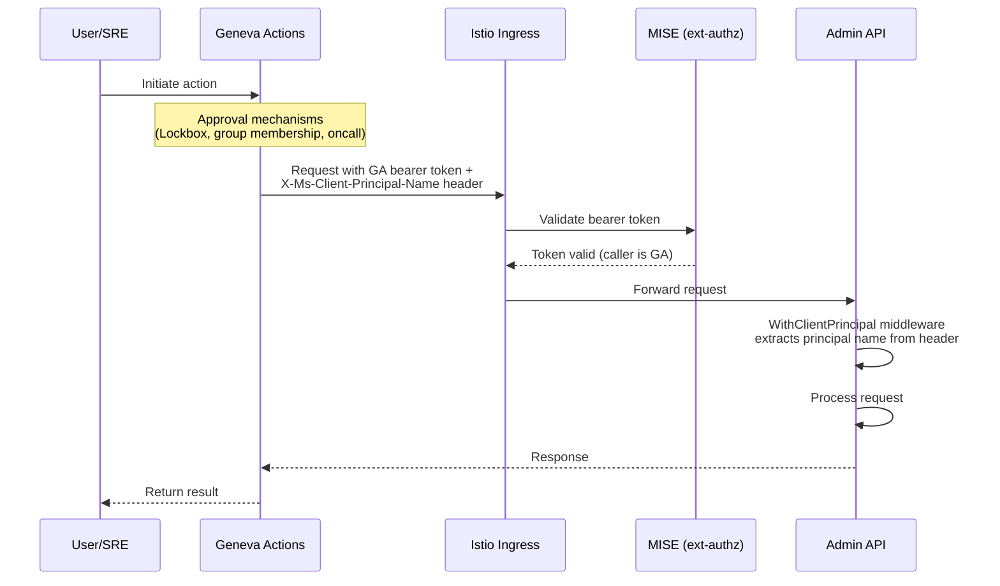

# ARO HCP Admin API

## Overview

The ARO HCP Admin API is a REST API deployed on each regional service cluster, offering administrative endpoints for SREs and platform operators invoked via Geneva Actions. Use cases include breakglass access to HCP clusters and cluster diagnostics.

## API Endpoints

All HCP-scoped endpoints include the full Azure resource ID in the path:

```
/admin/v1/hcp/subscriptions/{subscriptionId}/resourcegroups/{resourceGroupName}/providers/Microsoft.RedHatOpenshift/hcpOpenShiftClusters/{clusterName}
```

This prefix is abbreviated as `{resourceId}` below.

| Method | Path | Description |
|--------|------|-------------|
| `PUT` | `/admin/v1/hcp{resourceId}/breakglass?group=...&ttl=...` | Create a breakglass session ([details](breakglass.md)) |
| `GET` | `/admin/v1/hcp{resourceId}/breakglass/{sessionName}/kubeconfig` | Get kubeconfig for a breakglass session ([details](breakglass.md)) |
| `GET` | `/admin/v1/hcp{resourceId}/cosmosdump` | Cosmos DB dump for a cluster |
| `GET` | `/admin/v1/hcp{resourceId}/helloworld` | HCP hello world (dev/test) |
| `GET` | `/admin/helloworld` | Hello world (dev/test) |
| `GET` | `/healthz/ready` | Readiness probe |
| `GET` | `/healthz/live` | Liveness probe |
| `GET` | `/metrics` | Prometheus metrics (served on the metrics port) |

## Authentication

Authentication and authorization is layered across infrastructure and application:

1. **MISE** (external authorization via Istio): validates the Geneva Actions bearer token, proving the request comes from an authorized Geneva Action. Applied to all paths except `/metrics`.
2. **`WithClientPrincipal` middleware**: requires the `X-Ms-Client-Principal-Name` header on specific routes, returning 401 if missing. This header is set by Geneva Actions to identify the user or service principal who triggered the action. The Admin API trusts this header because MISE has already verified the caller is Geneva Actions.



## Development Workflow

The Admin API can be built and tested locally and in personal DEV environments using a set of Makefile targets.

- **make run:** runs the Admin API binary locally
- **make deploy:** builds the admin API container image, uploads it to the DEV service ACR and deploys it to a personal DEV cluster

The `Makefile` has access to a set of environment variables representing configuration from the `config/config.yaml` file. The environment variables are made available via the `include ../setup-templatize-env.mk` directive in the `Makefile`, which processes and includes the [Env.mk](Env.mk) file. This is the file you need to modify to provide additional environment variables fueled by `config.yaml`.

### Local Run

Using the `make run` target, the Admin API binary can be run locally. At this point, the Admin API does not integrate with any other service like the RP Frontend, CS or Maestro. Hence there are no dedicated dependencies on infrastructure that need to be met upfront. This will change soon.

### Personal DEV Environment deployment

The local code can also be deployed directly into a personal DEV environment by running `make deploy`. Understand that this requires such an environment to be created first via `make personal-dev-env` from the root of the repository.

`make deploy` builds a custom developer image from the local code and uploads it to the DEV service ACR (`arohcpsvcdev`) into a developer specific repository. This way developer images will not conflict with other developer images or CI built ones. The actual deployment is delegated to the pipeline/AdminAPI target in the root of the repository, providing a configuration override for `adminApi.image.repository` and `adminApi.image.digest` respectively.

## Deployment

The [pipeline.yaml](pipeline.yaml) file in this directory contains the pipeline definition for the Admin API. It is integrated into the [topology.yaml](../topology.yaml) file and runs as part of the service cluster deployment.
