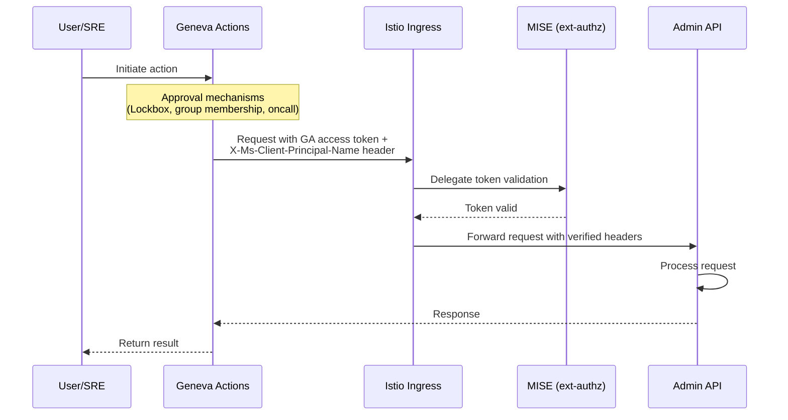
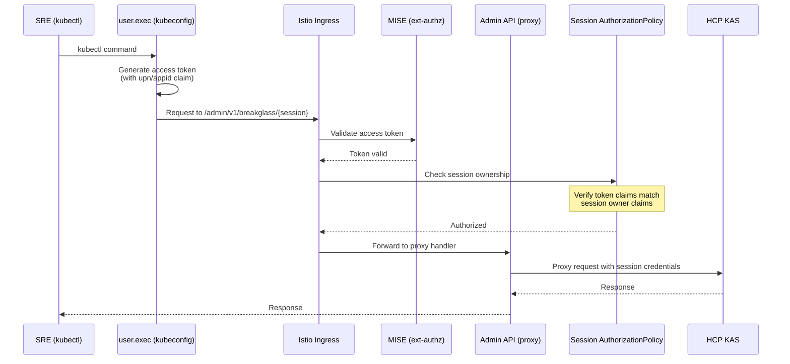

# ARO HCP Admin API

## Overview

The ARO HCP Admin API is a REST API deployed on each regional service cluster, offering a set of endpoints for administrative tasks for SREs and platform operators invoked via Geneva Actions.

## Development Workflow

The Admin API can be built and tested locally and in personal DEV environments using a set of Makefile targets.

- **make run:** runs the Admin API binary locally
- **make deploy:** builds the admin API container image, uploads it to the DEV service ACR and deploys it to a personal DEV cluster

The `Makefile` has access to a set of environment variables representing configuration from the `config/config.yaml` file. The environment variables are made available via the `include ../setup-templatize-env.mk` directive in the `Makefile`, which processes and includes the [Env.mk](Env.mk) file. This is the file you need to modify to provide additional environment variables fueled by `config.yaml`.

### Local Run

Using the `make run` target, the Admin API binary can be run locally. At this point, the Admin API does not integrate with any other service like the RP Fronent, CS or Maestro. Hence there are no dedicated dependencies on infrastructure that need to be met upfront. This will change soon.

### Personal DEV Environment deployment

The local code can also be deployed directly into a personal DEV environment by running `make deplioy`. Understand that this requires such an environment to be created first via `make personal-dev-env` from the root of the repository.

`make deploy` builds a custom developer image from the local code and uploads it to the DEV service ACR (`arohcpsvcdev`) into a developer specific repository. This way developer images will not conflict with other develooper images or CI built ones. The actual deployment is delegated to the pipeline/AdminAPI target in the root of the repository, providing a configuration override for `adminApi.image.repository` and `adminApi.image.digest` respectively.

## Authentication Flows

The Admin API has two distinct authentication flows depending on the endpoint type.

### Geneva Actions Flow

All Admin API endpoints invoked via Geneva Actions follow this authentication flow.

```mermaid
sequenceDiagram
    participant User as User/SRE
    participant GA as Geneva Actions
    participant Istio as Istio Ingress
    participant MISE as MISE (ext-authz)
    participant Admin as Admin API

    User->>GA: Initiate action
    Note over GA: Approval mechanisms<br/>(Lockbox, group membership, oncall)
    GA->>Istio: Request with GA access token +<br/>X-Ms-Client-Principal-Name header
    Istio->>MISE: Delegate token validation
    MISE-->>Istio: Token valid
    Istio->>Admin: Forward request with verified headers
    Admin->>Admin: Process request
    Admin-->>GA: Response
    GA-->>User: Return result
```

Key points:

- Geneva Actions uses an ARO HCP-specific identity to authenticate to the Admin API
- The `X-Ms-Client-Principal-Name` header contains the identity of the user who initiated the action
- MISE validates the access token before the request reaches the Admin API
- The Admin API trusts the verified headers after passing through MISE

### Breakglass Session Usage Flow (direct HCP access)

Once the SRE has a kubeconfig, they access the HCP directly through the Admin API's proxy endpoint.

```mermaid
sequenceDiagram
    participant SRE as SRE (kubectl)
    participant Exec as user.exec (kubeconfig)
    participant Istio as Istio Ingress
    participant MISE as MISE (ext-authz)
    participant Admin as Admin API (proxy)
    participant AuthPolicy as Session AuthorizationPolicy
    participant HCP as HCP KAS

    SRE->>Exec: kubectl command
    Exec->>Exec: Generate access token<br/>(with upn/appid claim)
    Exec->>Istio: Request to /admin/v1/breakglass/{session}
    Istio->>MISE: Validate access token
    MISE-->>Istio: Token valid
    Istio->>AuthPolicy: Check session ownership
    Note over AuthPolicy: Verify token claims match<br/>session owner claims
    AuthPolicy-->>Istio: Authorized
    Istio->>Admin: Forward to proxy handler
    Admin->>HCP: Proxy request with session credentials
    HCP-->>Admin: Response
    Admin-->>SRE: Response
```

Key points:

- No Geneva Actions involvement - direct access from the SREs SAW device to the admin API proxy endpoint
- The kubeconfig's `user.exec` generates an access token with identity claims
- Per-session Istio AuthorizationPolicy validates that token claims match the session owner
- The proxy forwards requests to the HCP KAS using session-specific credentials

### Principal Type Inference

The Admin API needs to know whether the caller is a user or service principal because:

1. The kubeconfig's `user.exec` command differs for users vs service principals
2. Access token claims are credential-type specific (`upn` for users, `appid` for service principals)

Currently, Geneva Actions only provides the principal name without indicating the type. The code infers the type by checking if the name is a UUID (service principal) or email format (user). See `getPrincipalType()` in `handlers/hcp/breakglass/create.go`.

## Deployment

The [pipeline.yaml](pipeline.yaml) file in this directory contains the pipeline definition for the Admin API. It is integrated into the [topology.yaml](../topology.yaml) file and runs as part of the service cluster deployment.
