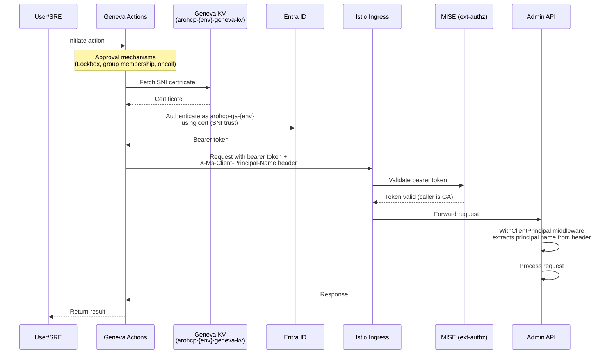

# ARO HCP Admin API

## Overview

The ARO HCP Admin API is a REST API deployed on each regional service cluster, offering administrative endpoints for SREs and platform operators invoked via Geneva Actions. Use cases include breakglass access to HCP clusters and cluster diagnostics.

## API Endpoints

All HCP-scoped endpoints include the full Azure resource ID in the path:

```
/admin/v1/hcp/subscriptions/{subscriptionId}/resourcegroups/{resourceGroupName}/providers/Microsoft.RedHatOpenshift/hcpOpenShiftClusters/{clusterName}
```

This prefix is abbreviated as `{resourceId}` below.

| Method | Path | Description |
|--------|------|-------------|
| `PUT` | `/admin/v1/hcp{resourceId}/breakglass?group=...&ttl=...` | Create a breakglass session ([details](breakglass.md)) |
| `GET` | `/admin/v1/hcp{resourceId}/breakglass/{sessionName}/kubeconfig` | Get kubeconfig for a breakglass session ([details](breakglass.md)) |
| `GET` | `/admin/v1/hcp{resourceId}/serialconsole?vmName=...` | Retrieve serial console logs for a VM |
| `GET` | `/admin/v1/hcp{resourceId}/cosmosdump` | Cosmos DB dump for a cluster |
| `POST` | `/admin/v1/hcp{resourceId}/desiredcontrolplanesize` | Set or clear the SRE-selected control-plane sizing tier |
| `GET` | `/admin/v1/hcp{resourceId}/backupschedules` | Get backup schedule state and per-schedule status |
| `PATCH` | `/admin/v1/hcp{resourceId}/backupschedules` | Enable or disable scheduled backups |
| `GET` | `/admin/v1/hcp{resourceId}/backups` | List on-demand backups |
| `POST` | `/admin/v1/hcp{resourceId}/controlplaneversionpin` | Pin a cluster's control plane to a specific z-stream version for rollback, or clear the pin (omit `exactVersion`) |
| `POST` | `/admin/v1/versionrollouts/{channel}/controlplaneversionpin` | Set or clear control-plane pins for existing clusters in a regional y-stream channel |
| `GET` | `/healthz/ready` | Readiness probe |
| `GET` | `/healthz/live` | Liveness probe |
| `GET` | `/metrics` | Prometheus metrics (served on the metrics port) |

### Version pins

`POST /controlplaneversionpin` accepts `exactVersion` and an optional `untilExactVersion`
auto-release threshold. The pin affects the control plane, not worker node pool
versions. Both version fields require a full `X.Y.Z` semantic version. The target
must be the most recent distinct successfully installed
z-stream in the mirrored HostedCluster's control-plane version history, in the
cluster's requested major.minor release line and older than the newest history
entry. This is not necessarily the numerically adjacent z-stream release. For a
direct upgrade from `4.22.0` to `4.22.10`, the history records `4.22.0` as the
previously installed version, so a pin to `4.22.0` is allowed. Pins to `4.22.5`
or `4.22.9` are rejected because neither was installed. If `4.22.9` was installed
between `4.22.0` and `4.22.10`, only `4.22.9` is a valid rollback target. A
`Partial` history entry represents an incomplete or failed control-plane rollout;
it does not establish that the version was successfully installed across the
control plane. Only `Completed` entries qualify as rollback targets.

| Request field | Meaning |
|---------------|---------|
| `exactVersion` | Previously installed control-plane z-stream to pin. Omit it or send `null` to clear the pin. An empty string is rejected; a non-null version must match the cluster's requested release line and observed rollback history. |
| `untilExactVersion` | Optional fleet best-version threshold that automatically clears the pin when reached. Omit it or send `null` to keep the pin until it is cleared explicitly. A non-null value requires `exactVersion` and must be in the same major.minor release line and greater than or equal to `exactVersion`. An empty string is rejected. |

The response returns the pin's versions as canonical semantic-version strings.
`exactVersion` is omitted after a clear; `untilExactVersion` is omitted when the
pin has no auto-release threshold or has been cleared. Neither field is returned
as an empty string or `null`, and `untilExactVersion` is present only with
`exactVersion`.

Rollback requires the mirrored HostedCluster's `status.controlPlaneVersion.history`.
The field is present in HyperShift 4.22 and was backported to
[release-4.20](https://github.com/openshift/hypershift/pull/9055) and
[release-4.21](https://github.com/openshift/hypershift/pull/9054); the backports
appear in the OpenShift [4.20.33](https://amd64.ocp.releases.ci.openshift.org/releasetag/4.20.33?from=4.20.0)
and [4.21.28](https://amd64.ocp.releases.ci.openshift.org/releasetag/4.21.28?from=4.21.4)
release payloads, respectively. Availability depends on the HyperShift operator
deployed on the management cluster and on the observed history, not only on the
hosted cluster's OpenShift version. The history may be absent because the mirror
has not populated it yet or because the deployed operator predates this support.
Setting a pin is unavailable without that history, even if
`status.version.history` is populated.

Setting a pin returns HTTP 400 if observed control-plane history is unavailable
or does not establish a valid previous version. There is no fallback to guest
version history or the provider's distilled active versions. Send `{}` or
`{"exactVersion":null}` to clear the pin; clearing does not require version history.
Both setting and clearing require an existing ServiceProviderCluster document and
reject clusters marked for deletion with HTTP 409; the endpoint never creates a
provider document.

Setting a version pin is not supported for nightly clusters. Nightly builds
use experimental exact-version overrides rather than z-stream rollouts. An
existing pin on a nightly cluster can still be cleared.

### Fleet version pins

`POST /admin/v1/versionrollouts/stable-4.22/controlplaneversionpin` accepts the same body and
rollback validation as the single-cluster endpoint. It applies to existing
ServiceProviderCluster documents in this Admin API's regional Resources container.
It does not persist a channel-wide policy or pin clusters created after the request.

Membership follows the rollout controllers: the backing cluster's channel group
must match, and the provider's desired version must have the channel's major.minor.
If desired version is absent, the oldest completed active version determines
membership. Deleting clusters, orphaned provider documents, and clusters with no
channel group or known effective minor are excluded. Active versions determine
membership only; rollback validation still requires the mirrored control-plane
history. A pin must also match each cluster's requested release line.

The handler finishes listing and validates every pin change before writing. A
validation failure returns HTTP 400 with per-cluster details and makes no writes.
An identical persisted pin is counted as unchanged, without revalidating rollback
history or rewriting the document; this lets callers retry after a rollback has
completed. Clearing pins needs no observed history and does not create documents.

Writes use each provider document's ETag independently. The operation is not
atomic across clusters: it continues after individual failures and returns the
successful writes and failed cluster IDs. HTTP 200 means all writes succeeded;
HTTP 409 means writes encountered ETag conflicts; HTTP 500 means at least one
write had another failure (or listing failed before any writes).

A response after the write phase contains:

```json
{
  "channel": "stable-4.22",
  "matchedCount": 3,
  "affectedCount": 1,
  "unchangedCount": 1,
  "failedCount": 1,
  "failures": [
    {
      "resourceId": "/subscriptions/.../hcpOpenShiftClusters/cluster-name",
      "code": "Conflict",
      "message": "ETag conflict, retry the operation"
    }
  ]
}
```

`affectedCount` counts successful document writes, not completed rollbacks.
`matchedCount` equals `affectedCount + unchangedCount + failedCount`. An empty
selection returns HTTP 200 with zero counts. Request validation, including
channel/release-line and nightly restrictions, applies even to an empty selection.

Inspect failed clusters before retrying; a new fleet request recomputes membership
and can include newly created clusters.
For a narrowly scoped retry, use the single-cluster endpoint on the failed IDs.

## Authentication

Authentication and authorization is layered across infrastructure and application:

1. **Geneva Actions authenticates to Entra ID**: mints its bearer token by authenticating as our `arohcp-ga-{env}` Entra service principal, using a Subject Name/Issuer (SNI) certificate it reads from our `arohcp-{env}-geneva-kv` Key Vault — no client secret is shared with Geneva.
2. **MISE** (external authorization via Istio): validates the Geneva Actions bearer token, proving the request comes from an authorized Geneva Action. Applied to all paths except `/metrics`.
3. **`WithClientPrincipal` middleware**: requires the `X-Ms-Client-Principal-Name` header on specific routes, returning 401 if missing. This header is set by Geneva Actions to identify the user or service principal who triggered the action. The Admin API trusts this header because MISE has already verified the caller is Geneva Actions.


```mermaid
sequenceDiagram
    participant User as User/SRE
    participant GA as Geneva Actions
    participant KV as Geneva KV<br/>(arohcp-{env}-geneva-kv)
    participant AAD as Entra ID
    participant Istio as Istio Ingress
    participant MISE as MISE (ext-authz)
    participant Admin as Admin API

    User->>GA: Initiate action
    Note over GA: Approval mechanisms<br/>(Lockbox, group membership, oncall)
    GA->>KV: Fetch SNI certificate
    KV-->>GA: Certificate
    GA->>AAD: Authenticate as arohcp-ga-{env}<br/>using cert (SNI trust)
    AAD-->>GA: Bearer token
    GA->>Istio: Request with bearer token +<br/>X-Ms-Client-Principal-Name header
    Istio->>MISE: Validate bearer token
    MISE-->>Istio: Token valid (caller is GA)
    Istio->>Admin: Forward request
    Admin->>Admin: WithClientPrincipal middleware<br/>extracts principal name from header
    Admin->>Admin: Process request
    Admin-->>GA: Response
    GA-->>User: Return result
```

## Development Workflow

The Admin API can be built and tested locally and in personal DEV environments using a set of Makefile targets.

- **make run:** runs the Admin API binary locally
- **make deploy:** builds the admin API container image, uploads it to the DEV service ACR and deploys it to a personal DEV cluster

The `Makefile` has access to a set of environment variables representing configuration from the `config/config.yaml` file. The environment variables are made available via the `include ../setup-templatize-env.mk` directive in the `Makefile`, which processes and includes the [Env.mk](Env.mk) file. This is the file you need to modify to provide additional environment variables fueled by `config.yaml`.

### Local Run

Using the `make run` target, the Admin API binary can be run locally. At this point, the Admin API does not integrate with any other service like the RP Frontend, CS or Maestro. Hence there are no dedicated dependencies on infrastructure that need to be met upfront. This will change soon.

### Personal DEV Environment deployment

The local code can also be deployed directly into a personal DEV environment by running `make deploy`. Understand that this requires such an environment to be created first via `make personal-dev-env` from the root of the repository.

`make deploy` builds a custom developer image from the local code and uploads it to the DEV service ACR (`arohcpsvcdev`) into a developer specific repository. This way developer images will not conflict with other developer images or CI built ones. The actual deployment is delegated to the pipeline/AdminAPI target in the root of the repository, providing a configuration override for `adminApi.image.repository` and `adminApi.image.digest` respectively.

## Deployment

The [pipeline.yaml](pipeline.yaml) file in this directory contains the pipeline definition for the Admin API. It is integrated into the [topology.yaml](../topology.yaml) file and runs as part of the service cluster deployment.
