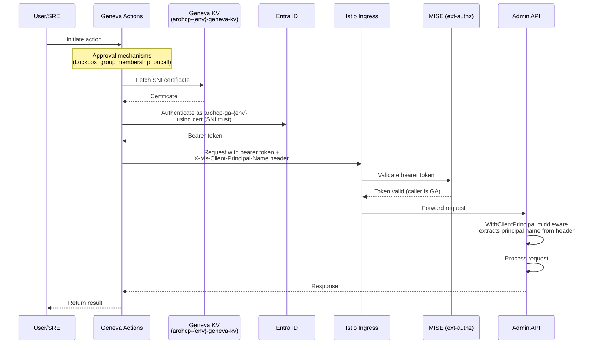

# ARO HCP Admin API

## Overview

The ARO HCP Admin API is a REST API deployed on each regional service cluster, offering administrative endpoints for SREs and platform operators invoked via Geneva Actions. Use cases include breakglass access to HCP clusters and cluster diagnostics.

## API Endpoints

All HCP-scoped endpoints include the full Azure resource ID in the path:

```
/admin/v1/hcp/subscriptions/{subscriptionId}/resourcegroups/{resourceGroupName}/providers/Microsoft.RedHatOpenshift/hcpOpenShiftClusters/{clusterName}
```

This prefix is abbreviated as `{resourceId}` below.

| Method | Path | Description |
|--------|------|-------------|
| `PUT` | `/admin/v1/hcp{resourceId}/breakglass?group=...&ttl=...` | Create a breakglass session ([details](breakglass.md)) |
| `GET` | `/admin/v1/hcp{resourceId}/breakglass/{sessionName}/kubeconfig` | Get kubeconfig for a breakglass session ([details](breakglass.md)) |
| `GET` | `/admin/v1/hcp{resourceId}/serialconsole?vmName=...` | Retrieve serial console logs for a VM |
| `GET` | `/admin/v1/hcp{resourceId}/cosmosdump` | Cosmos DB dump for a cluster |
| `POST` | `/admin/v1/hcp{resourceId}/desiredcontrolplanesize` | Set or clear the SRE-selected control-plane sizing tier |
| `GET` | `/admin/v1/hcp{resourceId}/backupschedules` | Get backup schedule state and per-schedule status |
| `PATCH` | `/admin/v1/hcp{resourceId}/backupschedules` | Enable or disable scheduled backups |
| `GET` | `/admin/v1/hcp{resourceId}/backups` | List on-demand backups |
| `POST` | `/admin/v1/hcp{resourceId}/controlplaneversionpin` | Pin a cluster's control plane to a version in its release line, or clear the pin (omit `exactVersion`) |
| `GET` | `/healthz/ready` | Readiness probe |
| `GET` | `/healthz/live` | Liveness probe |
| `GET` | `/metrics` | Prometheus metrics (served on the metrics port) |

### Version pins

`POST /controlplaneversionpin` accepts `exactVersion` and an optional `untilExactVersion`
auto-release threshold. The pin affects the control plane, not worker node pool
versions. Both version fields require a full `X.Y.Z` semantic version, optionally
with a pre-release identifier but without build metadata. The pin must be in
the cluster's requested major.minor release line. If the mirrored HostedCluster
has a control-plane history, a target equal to or newer than its latest entry
is accepted to hold or advance that version. A lower target is accepted only
when it is the most recent distinct `Completed` version in the history, older
than the latest entry. For a direct upgrade from `4.22.0` to `4.22.10`, a pin
to the previously installed `4.22.0` is allowed; `4.22.5` is rejected as a
rollback target because it was not installed. `4.22.10` can be held, and a
newer version in the same release line can be pinned. A `Partial` entry is the
latest attempted version, but does not qualify as an installed rollback target.

| Request field | Meaning |
|---------------|---------|
| `exactVersion` | Control-plane version to pin. Omit it or send `null` to clear the pin. An empty string is rejected; a non-null version must match the cluster's requested release line. Rollbacks below the latest observed version require the immediately previous `Completed` version. |
| `untilExactVersion` | Optional fleet best-version threshold that automatically clears the pin when reached. Omit it or send `null` to keep the pin until it is cleared explicitly. A non-null value requires `exactVersion` and must be in the same major.minor release line and greater than or equal to `exactVersion`. Nightly clusters cannot use this threshold. An empty string is rejected. |

The response returns the pin's versions as canonical semantic-version strings.
`exactVersion` is omitted after a clear; `untilExactVersion` is omitted when the
pin has no auto-release threshold or has been cleared. Neither field is returned
as an empty string or `null`, and `untilExactVersion` is present only with
`exactVersion`.

Rollback validation uses the mirrored HostedCluster's
`status.controlPlaneVersion.history`. The field was backported to HyperShift
[release-4.20](https://github.com/openshift/hypershift/pull/9055) and
[release-4.21](https://github.com/openshift/hypershift/pull/9054), and
[Azure CPO image overrides](https://github.com/openshift/hypershift/pull/9211)
provide the backported code for earlier 4.20 and 4.21 patch releases. The
backend may not have mirrored the history yet when the HostedCluster is first
observed.

If the control-plane history has not been mirrored yet, the pin is accepted;
the API cannot classify it as a rollback without an observed version. A lower
target is rejected with HTTP 400 when available history does not establish a
valid previous version. Guest version history and the provider's distilled
active versions are not used for rollback validation. Send `{}` or
`{"exactVersion":null}` to clear the pin; clearing does not require version history.
An observed latest version, or a `Completed` history entry examined for a
rollback, returns HTTP 400 if it contains build metadata: semantic-version
comparisons ignore `+build`, while pin requests do not accept it.
Both setting and clearing require an existing ServiceProviderCluster document and
reject clusters marked for deletion with HTTP 409; the endpoint never creates a
provider document.

Nightly clusters can be pinned to a previous or newer version, but their
channels have no fleet rollout best version to trigger auto-release. Requests
with `untilExactVersion` return HTTP 400 for nightly clusters; a nightly pin
without a threshold remains until explicitly cleared.

## Authentication

Authentication and authorization is layered across infrastructure and application:

1. **Geneva Actions authenticates to Entra ID**: mints its bearer token by authenticating as our `arohcp-ga-{env}` Entra service principal, using a Subject Name/Issuer (SNI) certificate it reads from our `arohcp-{env}-geneva-kv` Key Vault — no client secret is shared with Geneva.
2. **MISE** (external authorization via Istio): validates the Geneva Actions bearer token, proving the request comes from an authorized Geneva Action. Applied to all paths except `/metrics`.
3. **`WithClientPrincipal` middleware**: requires the `X-Ms-Client-Principal-Name` header on specific routes, returning 401 if missing. This header is set by Geneva Actions to identify the user or service principal who triggered the action. The Admin API trusts this header because MISE has already verified the caller is Geneva Actions.


```mermaid
sequenceDiagram
    participant User as User/SRE
    participant GA as Geneva Actions
    participant KV as Geneva KV<br/>(arohcp-{env}-geneva-kv)
    participant AAD as Entra ID
    participant Istio as Istio Ingress
    participant MISE as MISE (ext-authz)
    participant Admin as Admin API

    User->>GA: Initiate action
    Note over GA: Approval mechanisms<br/>(Lockbox, group membership, oncall)
    GA->>KV: Fetch SNI certificate
    KV-->>GA: Certificate
    GA->>AAD: Authenticate as arohcp-ga-{env}<br/>using cert (SNI trust)
    AAD-->>GA: Bearer token
    GA->>Istio: Request with bearer token +<br/>X-Ms-Client-Principal-Name header
    Istio->>MISE: Validate bearer token
    MISE-->>Istio: Token valid (caller is GA)
    Istio->>Admin: Forward request
    Admin->>Admin: WithClientPrincipal middleware<br/>extracts principal name from header
    Admin->>Admin: Process request
    Admin-->>GA: Response
    GA-->>User: Return result
```

## Development Workflow

The Admin API can be built and tested locally and in personal DEV environments using a set of Makefile targets.

- **make run:** runs the Admin API binary locally
- **make deploy:** builds the admin API container image, uploads it to the DEV service ACR and deploys it to a personal DEV cluster

The `Makefile` has access to a set of environment variables representing configuration from the `config/config.yaml` file. The environment variables are made available via the `include ../setup-templatize-env.mk` directive in the `Makefile`, which processes and includes the [Env.mk](Env.mk) file. This is the file you need to modify to provide additional environment variables fueled by `config.yaml`.

### Local Run

Using the `make run` target, the Admin API binary can be run locally. At this point, the Admin API does not integrate with any other service like the RP Frontend, CS or Maestro. Hence there are no dedicated dependencies on infrastructure that need to be met upfront. This will change soon.

### Personal DEV Environment deployment

The local code can also be deployed directly into a personal DEV environment by running `make deploy`. Understand that this requires such an environment to be created first via `make personal-dev-env` from the root of the repository.

`make deploy` builds a custom developer image from the local code and uploads it to the DEV service ACR (`arohcpsvcdev`) into a developer specific repository. This way developer images will not conflict with other developer images or CI built ones. The actual deployment is delegated to the pipeline/AdminAPI target in the root of the repository, providing a configuration override for `adminApi.image.repository` and `adminApi.image.digest` respectively.

## Deployment

The [pipeline.yaml](pipeline.yaml) file in this directory contains the pipeline definition for the Admin API. It is integrated into the [topology.yaml](../topology.yaml) file and runs as part of the service cluster deployment.
