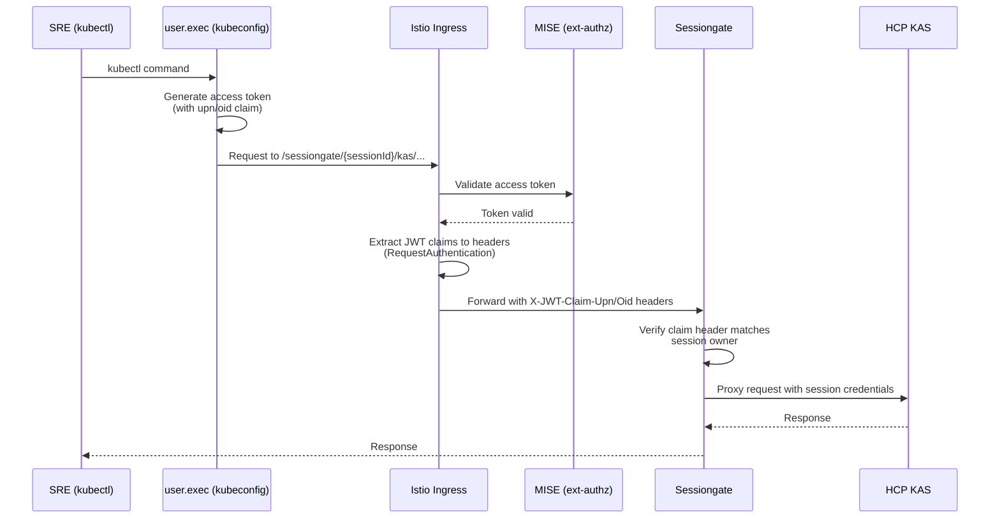

# Breakglass Access

Breakglass provides SREs with temporary, identity-scoped kubectl access to HCP clusters for debugging and emergency operations. The Admin API handles session creation and kubeconfig retrieval, while [sessiongate](../sessiongate/README.md) handles the actual proxying of kubectl traffic to the target cluster.

## Lifecycle

**Session creation** (via Geneva Actions → Admin API):

```
1. SRE triggers Geneva Action
2. Geneva Action → Admin API: POST .../breakglass with {"group":"...","ttl":"..."}
3. Admin API creates a Session CR in Kubernetes → returns 202 + Location header
4. SRE/GA polls: GET .../breakglass/{sessionName}/kubeconfig
   - Sessiongate controller mints credentials and ensures a network path to the HCP is established
   - Admin API returns 202 with status until ready
5. Session ready → Admin API returns 200 with kubeconfig YAML
   - kubeconfig server URL points at sessiongate: https://sessiongate.{region}.{zone}/sessiongate/{sessionId}/kas
```

**Cluster access** (via kubectl → Sessiongate):

```
6. SRE uses kubeconfig with kubectl → traffic flows through sessiongate to HCP
```

## API

`{resourceId}` refers to the full Azure resource ID path as described in the [Admin API README](README.md#api-endpoints).

### Create session

```
POST /admin/v1/hcp{resourceId}/breakglass
```

- Required header: `X-Ms-Client-Principal-Name` (identity of the calling user/SP)
- Request body (JSON):
  - `group` (required) - the RBAC group for the session (e.g. `aro-sre-csa`)
  - `ttl` (required) - session lifetime (e.g. `1h`, `30m`), bounded by server-configured min/max
- Returns `202 Accepted` with a `Location` header pointing to the kubeconfig endpoint

Example:

```json
{"group": "aro-sre-csa", "ttl": "1h"}
```

### Get kubeconfig

```
GET /admin/v1/hcp{resourceId}/breakglass/{sessionName}/kubeconfig
```

- Required header: `X-Ms-Client-Principal-Name`
- While the session is being set up: returns `202 Accepted` with `Retry-After` header and a JSON body `{"status": "..."}` describing progress
- When ready: returns `200 OK` with `Content-Type: application/yaml` (the kubeconfig) and an `Expires` header with the session expiration time (RFC 3339)

## Cluster Access via Sessiongate

Once the SRE has a kubeconfig, they access the HCP through sessiongate's proxy endpoint. The kubeconfig points at sessiongate, not the Admin API.



Key points:

- No Geneva Actions involvement - direct access from the SRE's SAW device to the sessiongate proxy endpoint
- The kubeconfig's `user.exec` generates an access token with identity claims
- MISE validates the JWT; Istio's `RequestAuthentication` extracts claims (`upn`, `oid`) into request headers
- Sessiongate's own middleware checks that the claim header matches the session owner before proxying
- Sessiongate proxies requests to the HCP KAS using session-specific credentials
