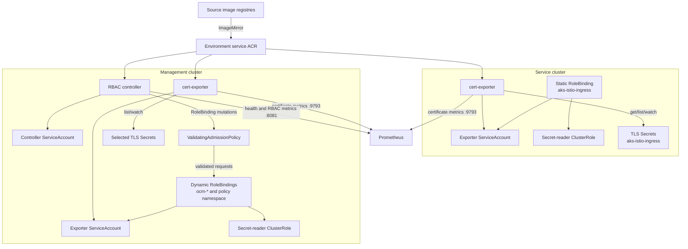
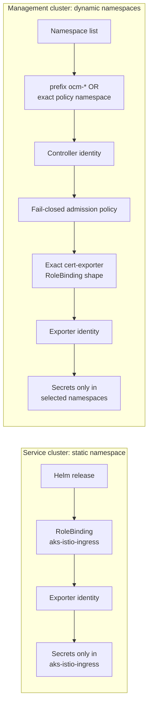
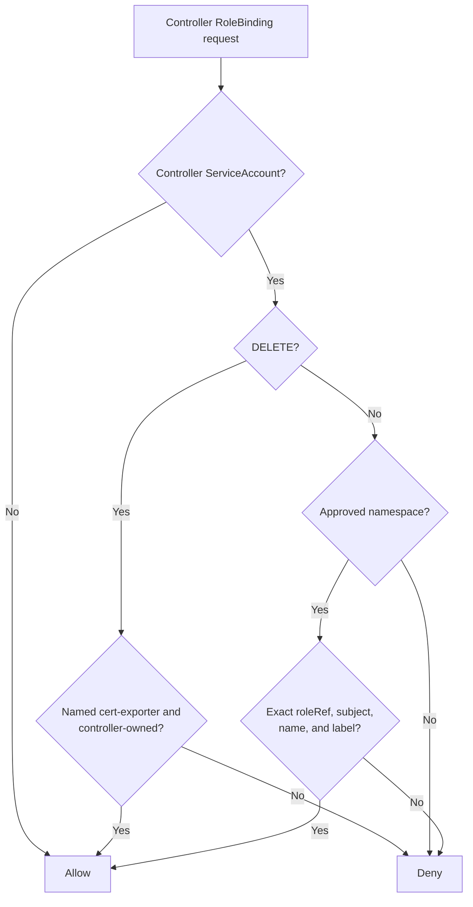
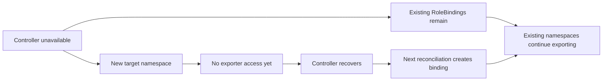

# Certificate Exporter Architecture

## Deployment Architecture



## Authorization Boundaries



The RoleBindings in both clusters refer to a ClusterRole, but Kubernetes limits
the granted permissions to each RoleBinding's namespace. Neither exporter
ServiceAccount receives a Secret-reader ClusterRoleBinding.

## Management Reconciliation Sequence

```mermaid
sequenceDiagram
    participant C as RBAC controller
    participant N as Namespace API
    participant A as Admission policy
    participant R as RoleBinding API
    participant E as cert-exporter
    participant S as TLS Secrets

    C->>N: List namespaces
    N-->>C: Current namespace names
    loop Every selected namespace
        C->>R: Get cert-exporter RoleBinding
        alt Binding is missing
            C->>A: Create fixed RoleBinding shape
            A->>R: Allow validated request
        else Owned binding drifted
            C->>A: Update or recreate fixed shape
            A->>R: Allow validated request
        else Unmanaged name collision
            C-->>C: Record error; do not adopt
        end
    end
    loop Every no-longer-selected namespace
        C->>A: Delete owned RoleBinding
        A->>R: Allow cleanup
    end
    E->>S: List and watch through namespaced grants
    S-->>E: TLS certificate data
```

## Request Validation



The policy matches the controller identity. Requests from other identities are
outside this policy's match condition and remain subject to Kubernetes RBAC and
other cluster admission controls.

## Failure and Recovery



This behavior preserves monitoring for existing hosted clusters while keeping
new namespace authorization fail-closed until the controller reconciles.
