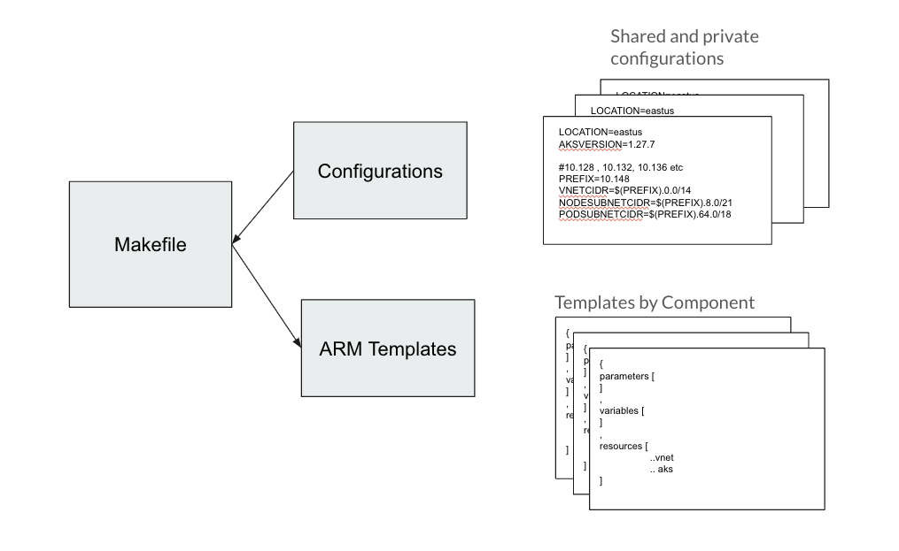
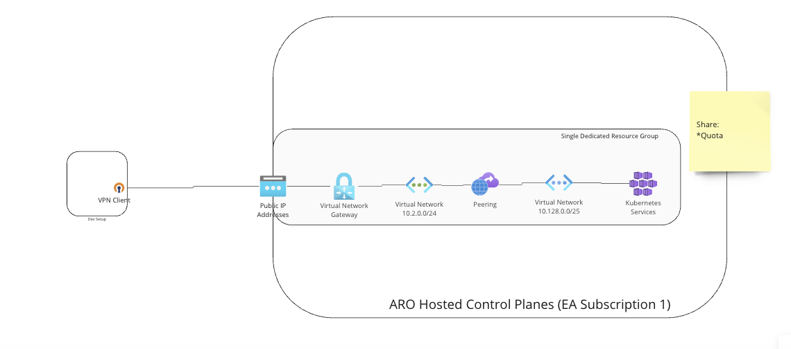
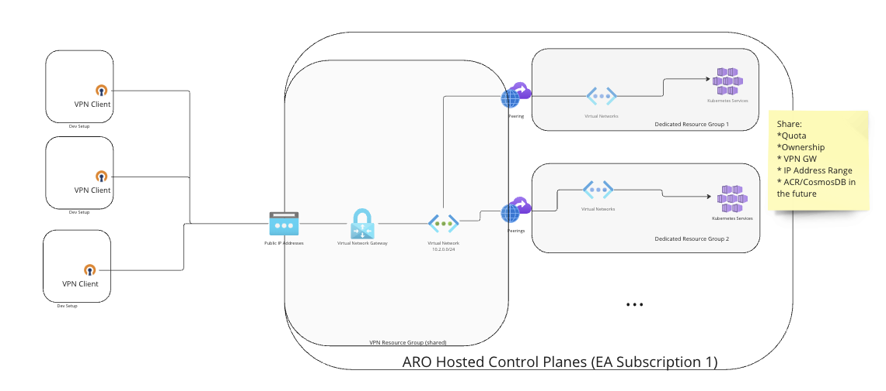

# Development setup

## Background

The idea of this repo is to provide means to create AKS clusters that resemble the (future) production setup in a repeatable way.

In order to do so, the creation of all infrastructure resources is (currently) based on ARM templates that are fed with named configurations through a Makefile. 



### Scenarios
At the moment the configuration files cover two scenarios:

- A standalone setup with a VPN Gateway and a single AKS cluster (shared nothing - build time about 45 minutes)



- and a shared setup, where a new AKS cluster is linked to an existing VPN Gateway (shared IP address space and other resources - build time is about 10 minutes)




## Preparation
* If you are on MACOS you need to 'linuxify' your setup (for example via  https://github.com/darksonic37/linuxify/tree/master ) so that you use the GNU versions of various commands (like base64 for example) rather than the MacOS versions. 
* Install the `az` cli (see https://learn.microsoft.com/en-us/cli/azure/install-azure-cli) 
* Install the `openvpn` client and `openssl` from your favourite source

* Verify your access to the dev subscription `"ARO Hosted Control Planes (EA Subscription 1)"` 

   Run `az login` and follow the instructions

   Run `az account list -o table`  and make sure the above subscription is listed

* Clone this repo and navigate within the `dev-infrastructure` directory

* Acquire the necessary shared secrets by running

   `AKSCONFIG=standalone SECRET_SA_ACCOUNT_NAME=hcpsharedsecretsdev make secrets-download`

   The `AKSCONFIG` can point to any file located in `configurations`. This downloads the latest shared secrets from a blob storage container in our subscription and places them in an untracked `secrets` folder in your repo. These secrets are required for example to create a shared VPN Gateway

   > Please note that running `make secrets-download` will overwrite any local changes you've made to this folder. Keep non-shared secrets in the `localsecrets` folder.


## Installation of an AKS cluster

> Please note that all resource groups not tagged with `persist=true` will be deleted by our cleanup pipeline after 48 hours 

### Stand alone scenario

This is the simple, but slow path (expected run time is about 45 minutes) . Pick the `standalone` configuration and the stand alone make task by running

`AKSCONFIG=standalone make aks.standalone`

This will create a setup in the eastus region. If you want to land in another region, you probably want to create a copy of the standalone configuration file and adapt the LOCATION parameter accordingly.

If you need more than one stand alone setup, you will need duplicate the standalone configuration file and adapt the RESOURCEGROUP parameter, so that new setup goes into its own resourcegroup.

### Shared VPN GW Scenario

As mentioned before, in this case you are sharing an IP Address space with other clusters behind the same VPN Gateway, but gain in installation time (expected run time is about 10 minutes).

#### Step 1: Check for a free IP Address range

Run `./scripts/showLinks.sh` to show the current list of AKS clusters and how they are linked to a VPN GW. In the example below there is a cluster in resource group `hcp-uli-10.144` linked/peered to a VPN GW in resource group `hcp-eastus-shared-rg` and a VPN GW in `hcp-westeurope-shared-rg` without  AKS cluster. 

> Please note the IP address range in the peering link line. Your configuration needs to use a different range.

```
✗./scripts/showLinks.sh                                                              
Gateway Peerings
------------------------
-ResourceGroup: hcp-eastus-shared-rg VNet: dev-vpn-vnet Location: eastus
 peering-aks-10.144-net    Connected       /hcp-uli-10.144/aks-10.144-net             10.144.0.0/14 
 
-ResourceGroup: hcp-westeurope-shared-rg VNet: dev-vpn-vnet Location: eastus
 
 
AKS Clusters
Name                 RG              ProvisionState
-------------------  --------------  ----------------
aro-hcp-cluster-001  hcp-uli-10.144  Succeeded
```

#### Step 2: Pick or create a configuration

* Pick a gateway in the region that you want to use (nearest to you, if latency plays a role). 
   > At the time of writing this there are two permanent VPN GWs in Eastus and Westeurope
   > in the `hcp-eastus-shared-rg` and the `hcp-westeurope-shared-rg` resourcegroup

* Look for the examples in the `configurations` folder and create a your own copy in the folder. 
* Adapt the IP range in your file by changing the `PREFIX` value, if required. There are example for three different ranges in the folder.

#### Step 3: Check your configuration:

`AKSCONFIG=<your configuration> make show` should show you the effective values produced by your configuration

```
✗ AKSCONFIG=westeurope-linked-aks-example-132 make show
AKS Clustername (from Makefile) : aro-hcp-cluster-001
Resource group                  : hcp-uli-10.132
VPN resource group              : hcp-westeurope-shared-rg
AddressSpace prefix             : 10.132
AKS version                     : 1.27.7
Location                        : westeurope
AKS VNet Name                   : aks-10.132-net
DNSZone/deployment              : hcp-uli-aks-cluster
```

If you want to use the same configuration frequently consider checking it into the repository, so others can see your settings

#### Step 4: Run the Installation

* Run `AKSCONFIG=<your configuration> make aks.linked`

After about 10 minutes this should have created your AKS cluster and you should be able to see it your resourcegroup either in the Azure portal or using the `az` cli for example by running `az aks list -o table`

The output should be similar to 
```
✗ az aks list -o table
Name                 Location    ResourceGroup    KubernetesVersion    CurrentKubernetesVersion    ProvisioningState    Fqdn
-------------------  ----------  ---------------  -------------------  --------------------------  ------------------- ------------------------------------------------
aro-hcp-cluster-001  eastus      hcp-<your user>-rg       1.27.7              1.27.7                     Succeeded            aro-hcp-cluster-001-xxx.hcp.eastus.azmk8s.io
```

## Accessing your Cluster 

### Step 1: Get the VPN Configuration
Create the VPN configuration via `AKSCONFIG=<your configuration> make vpn.localconfig`

Example:
```
✗ AKSCONFIG=westeurope-linked-aks-example-132 make vpn.localconfig 
( RESOURCEGROUP=hcp-westeurope-shared-rg LOCATION=westeurope scripts/vpn-config.sh vpn-hcp-westeurope-shared-rg.ovpn ) 
########## VPN Configuration for RG hcp-westeurope-shared-rg to localsecrets/vpn-hcp-westeurope-shared-rg.ovpn ##########
writing RSA key
```

This will create an ovpn-formated file `vpn-<location>.ovpn` in your `localsecrets` folder.

### Step 2: Start your VPN Connection

Run `sudo openvpn localsecrets/vpn-example.ovpn` in a separate terminal

> Please note that this needs to run while you work with your cluster.

> If you are frequently using the same VPN GW, you may want to consider importing the configuration into your Red Hat provided VPN client (Viscosity on MacOS) and start the connection from there.


This should establish the vpn connection and start routing traffic for 10.2.0.0/24 and 10/128.0.0/25 through the VPN
```
✗ sudo openvpn secrets/vpn-eastus.ovpn 
Password:
2023-11-15 13:07:01 OpenVPN 2.6.7 aarch64-apple-darwin23.0.0 [SSL (OpenSSL)] [LZO] [LZ4] [PKCS11] [MH/RECVDA] [AEAD]
2023-11-15 13:07:01 library versions: OpenSSL 3.1.4 24 Oct 2023, LZO 2.10
2023-11-15 13:07:01 TCP/UDP: Preserving recently used remote address: [AF_INET]20.102.120.150:443
2023-11-15 13:07:01 Socket Buffers: R=[131072->131072] S=[131072->131072]
2023-11-15 13:07:01 Attempting to establish TCP connection with [AF_INET]20.102.120.150:443
2023-11-15 13:07:01 TCP connection established with [AF_INET]20.102.120.150:443
2023-11-15 13:07:01 TCPv4_CLIENT link local: (not bound)
2023-11-15 13:07:01 TCPv4_CLIENT link remote: [AF_INET]20.102.120.150:443
2023-11-15 13:07:01 TLS: Initial packet from [AF_INET]20.102.120.150:443, sid=a09452ee 2383eaa6
2023-11-15 13:07:02 VERIFY OK: depth=2, C=US, O=DigiCert Inc, OU=www.digicert.com, CN=DigiCert Global Root G2
2023-11-15 13:07:02 VERIFY OK: depth=1, C=US, O=Microsoft Corporation, CN=Microsoft Azure RSA TLS Issuing CA 08
2023-11-15 13:07:02 VERIFY KU OK
2023-11-15 13:07:02 Validating certificate extended key usage
...
...
/sbin/route add -net 10.128.0.0 192.168.255.1 255.252.0.0
add net 10.128.0.0: gateway 192.168.255.1
2023-11-15 13:07:03 /sbin/route add -net 10.2.0.0 192.168.255.1 255.255.255.0
add net 10.2.0.0: gateway 192.168.255.1
...
...

```

#### Debugging the VPN connection
> Increase the debug level of the VPN client by adapting the `verb` value in the ovpn file 
> (default is 3, set it to 6 or 9)

### Step 3: Get your kubeconfig

Run `AKSCONFIG=<your configuration> make aks.kubeconfig`.
This should create a file called `aks.kubeconfig` in your current folder, with an admin kubeconfig for the aks cluster in the resourcegroup your configation points to.

```
✗ AKSCONFIG=<your configuration> make aks.kubeconfig
az aks get-credentials -n aro-hcp-cluster-001 -g "<your resource group>" --public-fqdn -a -f aks.kubeconfig
Merged "aro-hcp-cluster-001-admin" as current context in aks.kubeconfig
```

### Step 4: Access the Cluster

Now we are ready to access the cluster

```
✗ KUBECONFIG=aks.kubeconfig oc get node
NAME                                 STATUS   ROLES   AGE    VERSION
aks-systempool-14428664-vmss000000   Ready    agent   4h4m   v1.26.6
aks-systempool-14428664-vmss000001   Ready    agent   4h3m   v1.26.6
```

### Step 99: Deleting Things

The Azure philosophy is that everything that has the same lifecycle lives in the same resource group, meaning deleting things that belong together is 'just' deleting your resourcegroup.

Run `AKSCONFIG=<your configuration> make clean` or run `az group delete -g <whatever your resourcegroup name is>` directly. 

> Please note that the vpn gateway can take quite some time to delete, which may lead to a timeout of the deletion command. In this case you may have to delete the vpn gw manually and then rerun the resource group deletion.

## Preparing a new VPN GW

If you need an additional VPN GW to share, create a copy of an existing `vpn-only-*` configurations and adapt the LOCATION and/or the RESOURCEGROUP as required.


Run `AKSCONFIG=<your configuration> make vpngw` to create a new instance. This will take about 30-45 minutes.


## Creating your own "First Party Application"
In order for a resource provider to interact with a customers tenant, we create a special type of Application + Service Principal called a First Party Application. This applications' service principal is then granted permissions over certain resources / resource groups within the customers tenant. In the dev tenant we do not need nor can create a First Party Application (they are tied to AME). Instead, we create a Third Party Application, and grant it permissions over our dev subscription so the RP can then interact and create the required resources.

### Step 1 - Log into the dev account
Follow the "Preparation" steps

### Step 2 - Create the Application and its dependancies

Make sure you have `jq` installed on the system running the script. It is used to modify the role definition json file.

```bash
cd dev-infrastructure/scripts
sh dev-application.sh create
```
A unique prefix for all resources created by the script is a 20 character combination of the values $USER and $LOCATION.
To change which region the resources are deployed in, update $LOCATION in the script.

This will create:
1. A resource group
1. A keyvault
1. A default certificate in the keyvault
1. A custom role definition with required access as defined in `dev-infrastructure/scripts/mock-dev-role-definition.json`
1. A service principal/application using the created cert as its authentication, and given access based on the custom role definition

### Step 3 (optional) - log in as the mock application
You may need to manually interact with resources as the service principal, however this shouldn't be required. If you do need to, the 'login' command will download the cert and login with it. Don't forget to logout of the service principal in order to log back in via your personal account. 

```bash
cd dev-infrastructure/scripts
sh dev-application.sh login
```

### Step 99 - Delete the application

```bash
cd dev-infrastructure/scripts
sh dev-application.sh delete
```

This will delete:
1. All role assignments using the custom role
1. The service principal
1. The app registration
1. The custom role definition
1. The keyvault, then purge the keyvault
1. The resource group