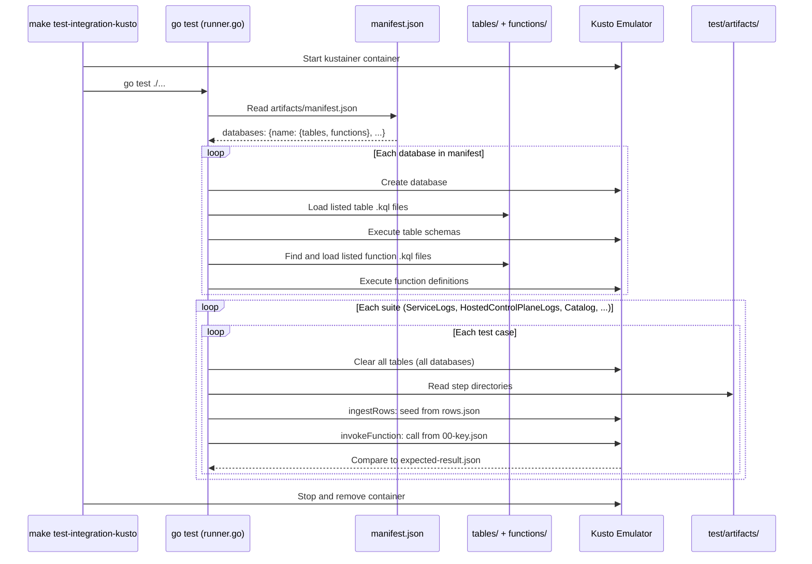

# Kusto Function Integration Tests

Declarative, artifact-driven integration tests for KQL stored functions. This framework is borrowed from the top-level [test-integration](../../../../../test-integration/) folder which tests Frontend/Cosmos/Backend interactions, but instead, it runs a [kusto emulator](https://learn.microsoft.com/en-us/azure/data-explorer/kusto-emulator-overview) and validates table schemas, functions, and outputs of functions. It uses the same KQL we use to define our production logging structure.

## Why?

**This test suite is an attempt to establish a contract between engineering and people that care heavily about consistent production log structure** (e.g. SRE/BU). It highlights what tables and columns or other schema are critically relevant to our daily work (and, indirectly, what isn't), via function definitions - which can be leveraged equally by engineers, dashboards, AI Agents, etc. Broken tests indicate that something we rely on in logs will foundationally impact how we build our product backlog or run production. It means broken reports, broken triage, higher MTTR... in short, it means there's real customer impact.

**Important: While the integration tests will fail on breaking schema changes (e.g. removal of a column referenced in a function), it will NOT fail if log content is changed.** Our mock data may not accurately reflect what is actually logged. The mock data ensures that at least our minimal expected log content continues to import correctly, and also gives us assurance that queries are written correctly and display accurate results based on what we think logs look like.

## Running

```bash
make test-integration-kusto
```

Starts the kustainer emulator, loads table schemas and function definitions from `artifacts/manifest.json`, runs all test suites, and cleans up the container. Set `KUSTO_DEBUG=1` for detailed step-level output.

## How It Works



## Writing a Test Case

No Go code changes required. A test case is a directory of numbered step subdirectories under `artifacts/<Suite>/<FunctionName>/<test-case>/`. Steps run sequentially and follow the `NN-<type>-<name>` naming convention.

### Database Manifest

A single `artifacts/manifest.json` declares the database topology shared by all suites. Each database is an explicit bucket listing its own tables and functions.

```json
{
  "databases": {
    "HostedControlPlaneLogs": {
      "tables": ["containerLogs"],
      "functions": ["hcpComponentLogs"]
    }
  }
}
```

For cross-database functions, add the referenced database as another key:

```json
{
  "databases": {
    "ServiceLogs": {
      "tables": ["cosmosResourceSnapshots"],
      "functions": ["crossDbResolver"]
    },
    "HostedControlPlaneLogs": {
      "tables": ["containerLogs"]
    }
  }
}
```

- `databases`: map of database name to its spec. Databases are created in manifest key order, so list referenced databases before databases whose functions depend on them.
- `tables`: table names (matching filenames in `tables/` without `.kql`). Only list tables that test fixtures actually ingest into or that functions under test depend on.
- `functions`: function names (matched by filename anywhere under `functions/`). Only list functions that test cases invoke.

The manifest should be a subset of what `main.bicep` deploys to production. It defines the minimal contract: the smallest set of schema the integration suite needs to validate its functions. Tests fail if `manifest.json` is missing.

TL;DR: **If you are testing a new function or table, update the manifest; only bring what you need.**

### Step types

**`ingestRows`**: Seeds a table with test data. `00-key.json` declares the target database and table. Place additional `.json` files in the directory, each an array of row objects. Keys match column names; missing columns get type-appropriate defaults.

```
00-ingestRows-cosmosResourceSnapshots/
  00-key.json     # {"database": "ServiceLogs", "table": "cosmosResourceSnapshots"}
  rows.json       # [{"resourceID": "...", "content": {...}, ...}]
```

**`invokeFunction`**: Calls a stored function. `00-key.json` specifies the database, function, and args:

```
01-invokeFunction-resolve-cluster-id/
  00-key.json               # {"database": "ServiceLogs", "function": "ResolveClusterId", "args": ["...", "datetime(2020-01-01)"]}
  expected-result.json      # [{"cluster_id": "abc-123-def"}]
```

**`invokeQuery`**: Runs raw KQL. `00-key.json` specifies the database and query:

```
02-invokeQuery-count-rows/
  00-key.json               # {"database": "ServiceLogs", "query": "cosmosResourceSnapshots | count"}
  expected-result.json      # [{"Count": "2"}]
```

**`invokeMgmt`**: Runs a management command (e.g. `.show functions`). Not expected to be used frequently; it exists for reflection cases where you need to validate metadata about the database itself rather than query results. The `Catalog/ShowFunctions` tests use this to verify function names, folders, and docstring structure. `00-key.json` specifies the database and command:

```
00-invokeMgmt-list-functions/
  00-key.json               # {"database": "HostedControlPlaneLogs", "command": ".show functions | project Name, Folder"}
  expected-result.json      # [{"Name": "HCPComponentLogs", "Folder": "Triage\\HCP"}]
```

For all invoke types, include one of:
- `expected-result.json`: array of expected row objects (column-by-column comparison)
- `expected-error.txt`: expected error substring (negative test)
- Neither: smoke test (validates execution succeeds)

### Example: ResolveClusterId round-trip

```
artifacts/ServiceLogs/ResolveClusterId/round-trip/
  00-ingestRows-cosmosResourceSnapshots/          # Seed 2 rows into the table
    rows.json
  01-invokeFunction-resolve-cluster-id/           # ARM ID -> cluster_id
    00-key.json
    expected-result.json
  02-invokeFunction-resolve-resource-id/          # cluster_id -> ARM ID
    00-key.json
    expected-result.json
```

## Function Docstring Format

The `Catalog/ShowFunctions` tests validate that every function's `docstring` follows a structured format. The Catalog test runs `.show functions` and parses each docstring using pipe-delimited sections:

```
Description | Returns: what the function returns | Example: FunctionName("arg1", "arg2", ago(10m), now())
```

All three sections are required. The Catalog test extracts and compares them individually, so the exact wording matters. See the `expected-result.json` files under `artifacts/Catalog/ShowFunctions/` for the authoritative expected values.

## Framework Internals

```
test/
  kusto_test.go             # Entry point: TestKustoFunctions (auto-discovers suites)
  runner.go                 # Walks artifact tree, wires emulator lifecycle
  emulator.go               # Kusto emulator client (create DB, load .kql)
  embed.go                  # //go:embed artifacts/*
  step.go                   # Step interface + NN-<type>-<name> discovery
  step_ingest_rows.go       # Reads table schema, builds datatable(), ingests
  step_invoke_function.go   # Calls stored function, compares results
  step_invoke_query.go      # Runs raw KQL, compares results
  results.go                # Converts query.Dataset to []map[string]any
```
