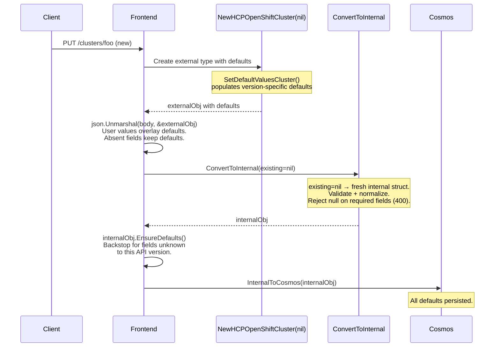
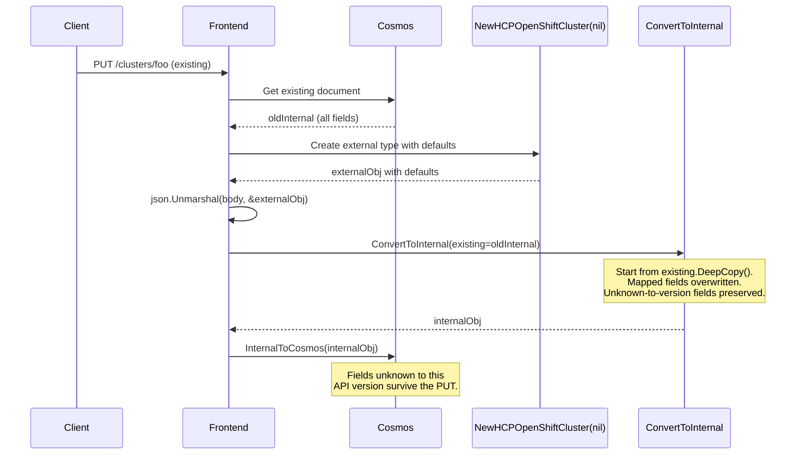
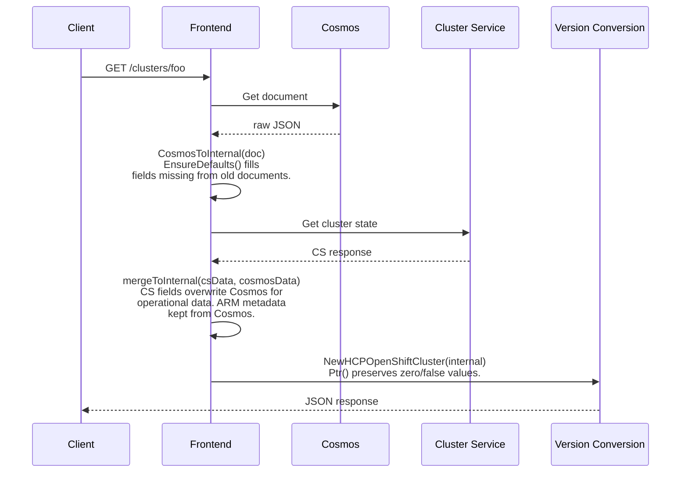
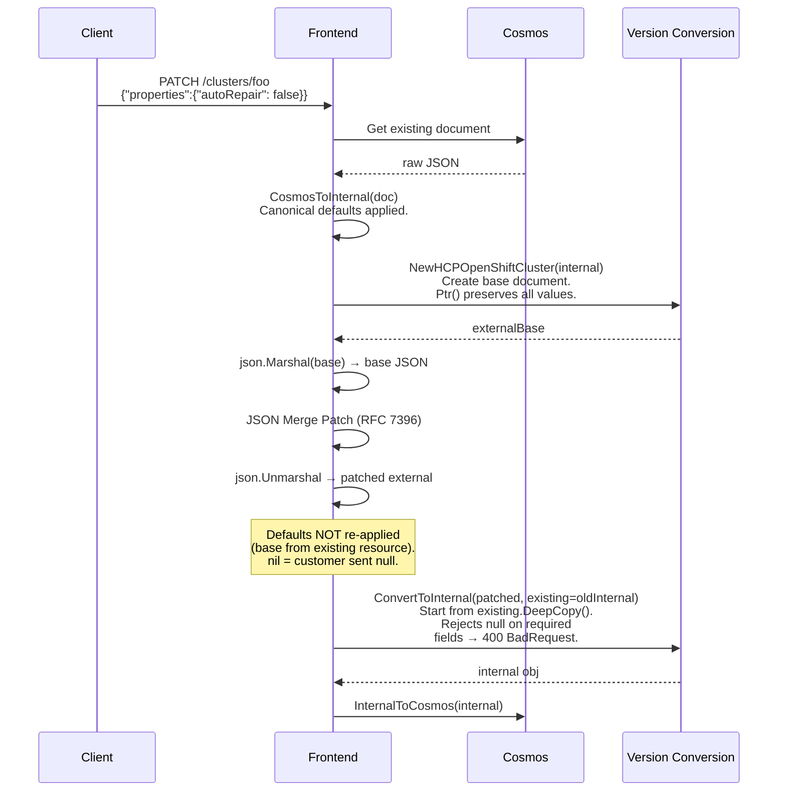
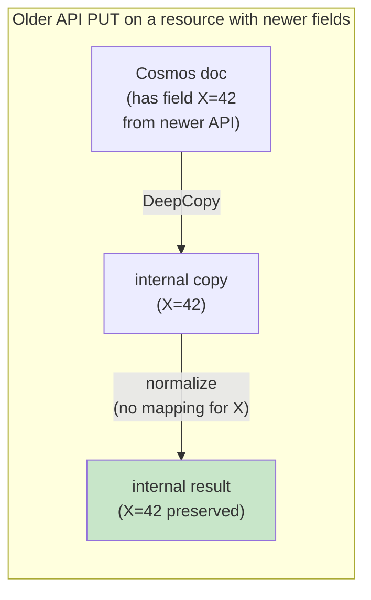
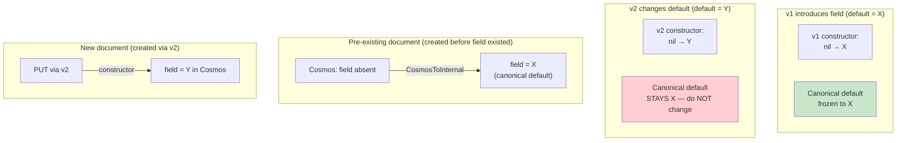
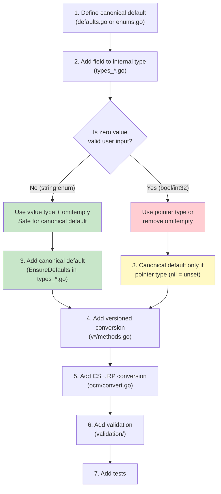
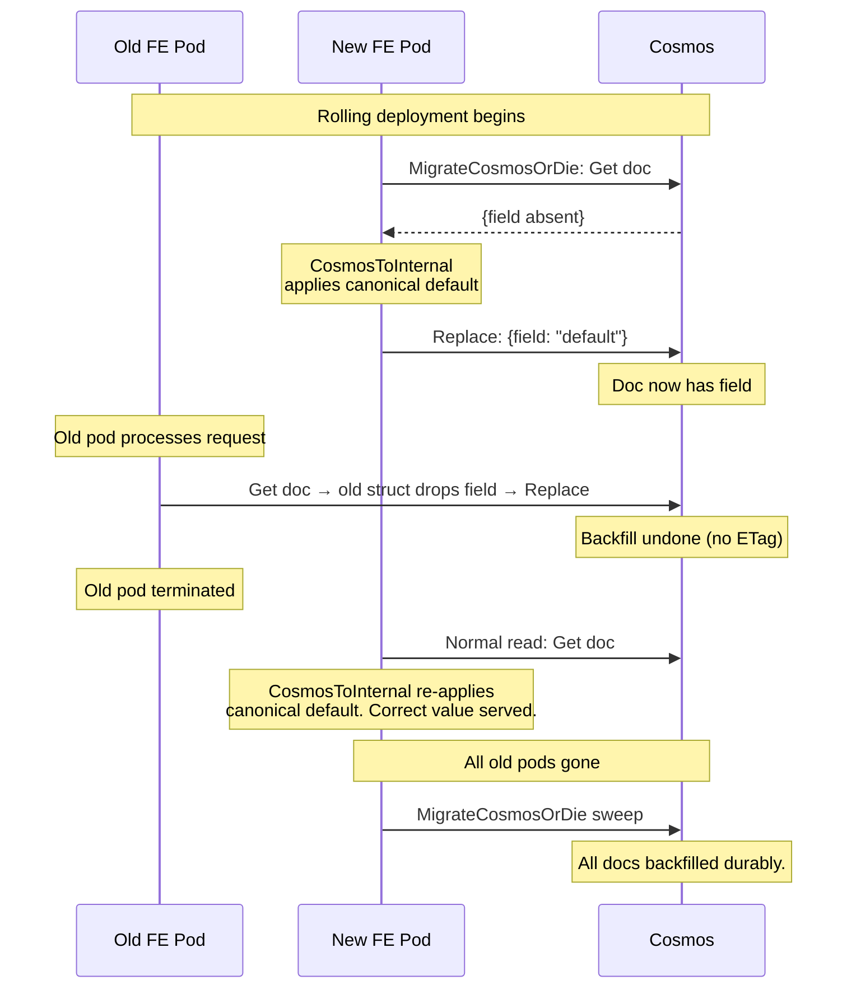

# DDR: API Version Defaults and Storage Consistency

- **Status:** Accepted
- **Date:** 2026-02-23
- **Authors:** @sudobrendan
- **Context:** Adding 2nd API with new features like Ephemeral OS Disk (adding `diskStorageAccountType` field to NodePool)

## Decision

When a new API version introduces a field with a default value, pre-existing
Cosmos documents lack that field. ARO-HCP has two independent Cosmos readers
(Frontend and Backend), so defaults must be applied consistently for both.

We use **two-layer defaulting**:

1. **Constructor defaults** (write path): `NewHCPOpenShiftCluster(nil)` calls
   `SetDefaultValuesCluster()` internally, populating version-specific defaults
   before `json.Unmarshal` overlays the request body. Absent fields keep their
   defaults because `json.Unmarshal` into a pre-populated struct preserves
   existing values for missing JSON keys.

2. **Canonical defaults** (read path + create/preflight): `CosmosToInternal*()`
   calls `EnsureDefaults()` on the internal type after unmarshaling from Cosmos.
   Every reader — FE, BE, `MigrateCosmosOrDie` — gets correct defaults
   regardless of when the document was written. `EnsureDefaults()` is also
   called on the CREATE and PREFLIGHT paths after `ConvertToInternal(nil)` as
   a backstop for fields unknown to the requesting API version's
   `SetDefaultValues*()`. This ensures that when a CREATE comes via an older
   API version, fields introduced in newer versions still get their canonical
   defaults. `EnsureDefaults()` is NOT called on PUT-update or PATCH paths —
   those start from `ConvertToInternal(existing)` where the existing resource
   already has defaults from the Cosmos read path. Explicitly nulling a
   required field on PATCH should produce a 400 validation error, not be
   silently re-defaulted.

This is inspired by Kubernetes's `Scheme.Default()` pattern on versioned types,
adapted for our multi-reader architecture. ARO Classic uses a similar layered
approach (`api.SetDefaults` on write, `clusterEnricher.Enrich` on read).

## Data Flows

### PUT (Create)

### PUT (Replace)

### GET (Read)

Canonical defaults in `CosmosToInternal*()` are harmlessly overwritten for
CS-sourced fields on the FE GET path. Their primary consumers are BE
controllers (which never call CS) and `MigrateCosmosOrDie`.

CS→RP conversion functions must return the same default as canonical defaults
for empty values. This is enforced by `convert_defaults_consistency_test.go`.

### PATCH

PATCH uses the existing resource as a base (not `nil`), so constructor
defaults are not re-applied. A nil pointer after merge means the customer
explicitly sent `null`. Required fields reject null with 400; this is
ARM-compliant (Azure guidelines: "If field cannot be deleted, return
400-BadRequest").

`ConvertToInternal` receives `existing` (the old internal object) so that
fields unknown to the requesting API version are preserved via DeepCopy.
Only fields mapped by the version's normalize functions are overwritten.

## Cross-Version Field Preservation

When a newer API version adds a field, an older API version's PUT or PATCH
must not silently zero that field. `ConvertToInternal(existing)` handles
this on the **write path** (complementing canonical defaults on the read path).

`ConvertToInternal` follows the Classic ARO `ToInternal(ext, out)` pattern:

- **CREATE** (`existing == nil`): start from a fresh internal struct.
- **UPDATE** (`existing != nil`): start from `existing.DeepCopy()`.
  Normalize functions overwrite all fields mapped by that API version.
  Fields unknown to the version are never touched, so they survive.

### Normalize function conventions

Normalize functions should use **unconditional writes** (`api.Deref()`) for
leaf fields. On PATCH, the external type is pre-populated from the existing
resource via `NewHCPOpenShiftCluster(internal)`, so nil only occurs when the
customer explicitly sent `null`. Parent struct nil checks remain for panic
prevention and section-level null clearing (RFC 7396).

When adding a new API version, follow the unconditional write pattern. This
ensures PATCH explicit null correctly clears optional fields (ARM-compliant
RFC 7396 behavior) while DeepCopy preserves fields unknown to the version.

## Frozen Defaults

Canonical defaults are frozen at the value from the API version that **first
introduced the field**. If a future API version wants a different default,
the canonical default stays frozen — only the version constructor changes.

This ensures old documents always get a consistent default regardless of when
they are read. Documents created with v2 store `Y` explicitly — the
canonical default only fires when the stored value is the zero value.

## Adding a New Field

### Decision Flowchart

### Checklist

**0. Canonical default** (`internal/api/defaults.go` or `enums.go`)
- [ ] String enum → typed constant in `enums.go`
- [ ] Non-enum (CIDR, int32, bool, string) → named constant in `defaults.go`
- [ ] Naming: `Default<Resource><Field>` (e.g., `DefaultNetworkHostPrefix`)

**1. Internal type** (`internal/api/types_*.go`)
- [ ] Add field. String enum → value type + `omitempty`. Bool/int where zero
  is valid → `*bool`/`*int32` or remove `omitempty`.
- [ ] Add default to `NewDefault*()` constructor.

**2. Versioned conversion** (`internal/api/v*/methods.go`)
- [ ] `SetDefaultValues*()`: `if field == nil { field = default }`
- [ ] `ConvertToInternal`: normalize + null rejection for required fields
- [ ] `NewHCPOpenShiftCluster*()`: internal→external mapping. Use `Ptr()` (not
  `PtrOrNil()`) for fields where zero is valid user input.
- [ ] Older API versions that don't expose the field: force default in normalize.

**3. Canonical defaults** (`internal/api/types_*.go`)
- [ ] Add to the `EnsureDefaults()` method on the internal type
  (`HCPOpenShiftCluster`, `HCPOpenShiftClusterNodePool`, or
  `HCPOpenShiftClusterExternalAuth`).
- [ ] Only default if safe (zero never valid) or pointer type (nil = unset).
- [ ] Never default ARM-managed fields (`provisioningState`, `systemData`,
  `id`/`name`/`type`, `tags`) — these come from `ResourceDocument`.
- [ ] Canonical defaults are append-only. Use the frozen default value.

**4. CS→RP conversion** (`internal/ocm/convert.go`)
- [ ] RP→CS: error on unexpected zero values (constructor guarantees non-empty).
- [ ] CS→RP: map empty to the same default as canonical defaults.
- [ ] Consistency test enforces agreement.

**5. Validation** (`internal/validation/`)
- [ ] Allowed values. Immutability constraints.

**6. Tests**
- [ ] `internal/database/convert_defaults_consistency_test.go`:
  - [ ] Add field to `TestEnsureDefaultsConsistency*` (verifies canonical↔constructor↔versioned agreement)
  - [ ] Add field to `TestCSToRPDefaultsConsistency*` (verifies CS→RP matches canonical default)
  - [ ] Add field to `TestPreExistingData*` (verifies old Cosmos docs get the default)
  - [ ] Add field to `TestCanonicalDefaultsConsistency*` (verifies constructor uses canonical constant)
- [ ] `test-integration/frontend/artifacts/` — update `read-old-data` integration test artifacts
- [ ] `test-integration/frontend/cross_version_roundtrip_test.go` — verify cross-version round-trip tests pass

## Rolling Deployment

`MigrateCosmosOrDie` runs at FE startup and does a Get→Replace sweep on all
documents. After canonical defaults are implemented, the Get leg applies defaults
and the Replace leg persists them — no additional migration code needed.

Read-time defaults make deploy ordering irrelevant for correctness. The
backfill becomes durable only after all old pods are terminated. Old pods
dropping unknown fields is a pre-existing codebase characteristic, not
introduced by canonical defaults.

## Open Issues

**v20240610preview uses conditional nil checks in normalize functions.**
This shipped API version does not use the unconditional `api.Deref()` write
pattern. PATCH with explicit null on nested structs (e.g.,
`{"properties": {"dns": null}}`) does not clear the section per RFC 7396 —
the existing value is preserved instead. v20251223preview fixes this with
unconditional writes and `else` branches. We cannot change v2024 behavior
post-ship. When adding new API versions, follow the v2025 pattern.

**`omitempty` on value types in the internal type.** Fields like `AutoRepair
bool` and `Replicas int32` with `omitempty` drop their zero values (`false`,
`0`) during Cosmos serialization. On read-back, Go's zero value is
indistinguishable from "field was never set." The `Ptr()` fix on the external
type prevents GET-then-PUT data loss, but the Cosmos storage ambiguity
remains for `AutoRepair`, `Replicas`, `AutoScaling.Min/Max`, `HostPrefix`,
and `ClusterAutoscalingProfile` fields. When adding new bool/int fields, use
pointer types or remove `omitempty` to avoid this. See existing precedent:
`EnableEncryptionAtHost bool` uses no `omitempty`.

## Quick Reference

| Layer | Cluster | NodePool | ExternalAuth | File |
|-------|---------|----------|--------------|------|
| Constructor defaults | `SetDefaultValuesCluster()` | `SetDefaultValuesNodePool()` | `SetDefaultValuesExternalAuth()` | `v*/methods.go` |
| Canonical defaults | `HCPOpenShiftCluster.EnsureDefaults()` | `HCPOpenShiftClusterNodePool.EnsureDefaults()` | `HCPOpenShiftClusterExternalAuth.EnsureDefaults()` | `internal/api/types_*.go` |
| CS→RP defaults | `convertVersionIDCSToRP()` | `convertDiskStorageAccountTypeCSToRP()` | — | `internal/ocm/convert.go` |
| Internal constructors | `NewDefaultHCPOpenShiftCluster()` | `NewDefaultHCPOpenShiftClusterNodePool()` | — | `internal/api/types_*.go` |
| Canonical constants | `DefaultClusterVersionID`, etc. | `DiskStorageAccountTypePremium_LRS`, etc. | `UsernameClaimPrefixPolicyNone` | `internal/api/defaults.go`, `enums.go` |
| Migration | `MigrateCosmosOrDie()` | (included in cluster loop) | (included in cluster loop) | `frontend/pkg/frontend/migrate_cosmos.go` |

## References

- [Kubernetes `Scheme.Default()`](https://github.com/kubernetes/kubernetes/blob/60433d43cf0bb83a2ac7d5e767137b3d510026ec/staging/src/k8s.io/apimachinery/pkg/runtime/scheme.go#L413)
- [Kubernetes versioning codec](https://github.com/kubernetes/kubernetes/blob/60433d43cf0bb83a2ac7d5e767137b3d510026ec/staging/src/k8s.io/apimachinery/pkg/runtime/serializer/versioning/versioning.go#L170)
- [Kubernetes `SetDefaults_Deployment`](https://github.com/kubernetes/kubernetes/blob/60433d43cf0bb83a2ac7d5e767137b3d510026ec/pkg/apis/apps/v1/defaults.go#L32-L67)
- [Kubernetes StorageVersionMigrator](https://github.com/kubernetes-sigs/kube-storage-version-migrator)
- [ARO Classic `api.SetDefaults()`](https://github.com/Azure/ARO-RP/blob/f173264b1a723fdb9d4c1ddd907eb75c6bed9649/pkg/api/defaults.go#L10-L65)
- [ARO Classic write-path defaults](https://github.com/Azure/ARO-RP/blob/f173264b1a723fdb9d4c1ddd907eb75c6bed9649/pkg/frontend/openshiftcluster_putorpatch.go#L348)
- [ARO Classic read-path enricher](https://github.com/Azure/ARO-RP/blob/f173264b1a723fdb9d4c1ddd907eb75c6bed9649/pkg/frontend/openshiftcluster_get.go#L50)
- [ARO Classic `ToInternal(ext, out)` (cross-version preservation)](https://github.com/Azure/ARO-RP/blob/f173264b1a723fdb9d4c1ddd907eb75c6bed9649/pkg/api/v20240812preview/openshiftcluster_convert.go)
- [ARO-HCP `MigrateCosmosOrDie`](https://github.com/Azure/ARO-HCP/blob/a98a017a0b7ab57bf2a30a25f07d1b8f729c45e4/frontend/pkg/frontend/migrate_cosmos.go)
