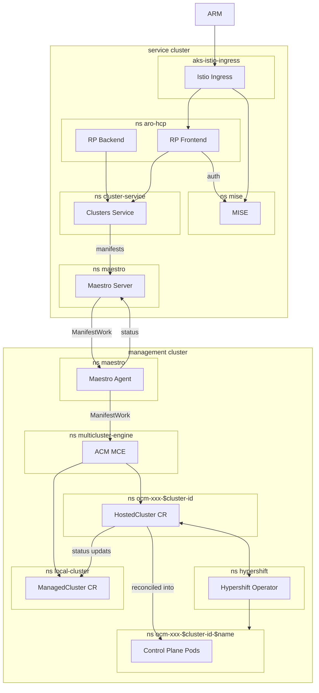

# ARO HCP Debugging Cheatsheet

This document is a cheatsheet for debugging ARO HCP cluster creation issues. It shows the rough flow of the cluster creation process through the individual service components. Each component is described in a separate section, including how to access it and how to query for the relevant resources.

>[!NOTE]
> This document it neither a complete overview of the ARO HCP architecture nor a comprehensive SOP/TSG for debugging during oncall. It is meant as a quick reference and should be considered a learning resource. PTAL at the respective SOPs/TSGs for all platform and service components (once they are available).

## Cluster Creation Flow in a Nutshell



## RP Frontend

* The RP frontend is the primary regional API entry point for the ARO HCP service, as it receives requests from ARM
* It delegates authentication to [MISE](../frontend/deploy/charts/mise) through an Istio [AuthorizationPolicy](../frontend/deploy/templates/ext-authz.authorizationpolicy.yaml)
* It keeps track of cluster state in CosmosDB
* It delegates the HCP creation to Clusters Service
* Communication with Clusters Service is done via the Istio with mTLS and policies in place

### Port Forward to the RP Frontend

In order to access the RP frontend without going through ARM, you can port forward to the service. This is useful for debugging and testing purposes, especially in non-production environments where there is no ARM route to the service.
Keep in mind that the port-forwarded service does not require authentication and does not enforce authorization!

```sh
kubectl port-forward -n aro-hcp svc/aro-hcp-frontend 8443:8443
```

### Query the State of an HCP

You can query the state of a hosted control plane by sending a GET request to the port-forwarded service. The URL should include the resource ID of the hosted control plane you want to query, so something matching this:

```sh
RESOURCE_ID="/subscriptions/.../resourceGroups/.../providers/Microsoft.RedHatOpenshift/hcpOpenShiftClusters/..."
curl -s localhost:8443${RESOURCE_ID}$?api-version=2024-06-10-preview | jq
```

Noteworthy fields:

* `.id` - the resource ID of the hosted control plane
* `.properties.provisioningState` - the provisioning state of the hosted control plane
* `.properties.api.url` - the HCP KAS URL
* `.properties.dns.baseDomain` - the base DNS zone for the HCP (exists in our infrastructure)

## RP Backend

* Updates the state of the hosted control plane in CosmosDB to support async operations

## Clusters Service

* orchestrates HCP creation by
  * provisioning Azure cloud resources within the customer tenant and ARO HCP service tenants
  * placing Hypershift related manifests onto the managemenet clusters (via Maestro) to drive the actual control plane creation
* support day 2 operations like
  * node pool management
  * upgrade management
  * breakglass credential management
* Clusters Service communicates with the Maestro Server via GRPC over Istio
* Clusters Service is not exposed outside of the service cluster

### Port Forward to Clusters Service

In order to access Clusters Service for debugging purposes, you can port forward to the service.
Keep in mind that the port-forwarded service does not require authentication and does not enforce authorization!

```sh
kubectl port-forward -n cluster-service svc/clusters-service 8001:8000
```

### Query the State of an HCP

To query the state of an HCP on the Clusters Service, you can use the following command based on information from the HCP resource ID.

```sh
export HCP_SUBSCRIPTION_ID=$(echo "$RESOURCE_ID" | cut -d'/' -f3)
export HCP_RESOURCE_GROUP_NAME=$(echo "$RESOURCE_ID" | cut -d'/' -f5)

curl -sG http://localhost:8001/api/clusters_mgmt/v1/clusters --data-urlencode "search=azure.subscription_id='$HCP_SUBSCRIPTION_ID' and azure.resource_group_name='$HCP_RESOURCE_GROUP_NAME'" | jq
```

>[!NOTE]
> This command does not filter on the resource name of the HCP because the search in CS does not offer filter functionality on the `azure.resource_name` field yet. As long as there is only one HCP resource per resource group, this is not a problem.

Noteworthy fields:

* `.id` - the Clusters Service ID of the hosted control plane - this is not the Azure Resource ID of the HCP!!
* `.href` - the base resource URL for the HCP in Clusters Service - needed if you want to query for subresources
* `.status` - contains details about the state of the HCP, including provisioning errors
* `.azure.subscription_id` - the Azure subscription ID of the customer
* `.azure.resource_group_name` - the Azure resource group name within the customer subscription, where the HCP was created
* `.azure.resource_name` - the Azure resource name of the HCP

### Query for the Management Cluster of an HCP

Once you have clusters `.href`, you can query the provision shard endpoint to find details about the management cluster of an HCP.

```sh
curl -sG http://localhost:8001/${CLUSTER_HREF}/provision_shard | jq
```

Currently this endpoint does not return yet direct management cluster metadata, but the management cluster can be inferred from the stamp number at the end of the CX KV URL `.azure_shard.cx_managed_identities_key_vault_url`. Look for a management cluster in the same region that has the same stamp number in the AKS name and/or the Azure resource group.

## Maestro Server

* In a nutshell, Maestro is a `kubectl apply over MQTT` service to bridge the gap between Clusters Service and the management cluster
* The Maestro Server is transfering `ManifestWork` resources from Clusters Service to the management cluster
* ... and transfers status back for Clusters Service to read (e.g. `HostedCluster` status)
* The Maestro Server runs on the service cluster in the `maestro` namespace
* The Maestro Server is not exposed outside of the service cluster
* ... because only Clusters Service and Backplane need to access it
* It uses a certificate from the mgmt KV to authenticate with the Eventgrid Namespace MQTT broker
* ... and consums it via CSI secret store

### Port Forward to the Maestro Server

The Maestro Server is not exposed at all outside of the service cluster, as it is usually only used by the Clusters Service and Backplane. In order to access it for debugging purposes, you can port forward to the service.
Keep in mind that the port-forwarded service does not require authentication and does not enforce authorization!

```sh
kubectl port-forward -n maestro svc/maestro 8002:8000
```

### Query for ManifestWork

To query for the `ManifestWork` Clusters Service creates in Maestro for an HCP, you can use the following command based on information from the HCP Clusters Service resource ID. This ID can be queried using the approach described in the [Query the State of an HCP on Clusters Service](#query-the-state-of-an-hcp-on-clusters-service) section and looking for the `id` field.

```sh
curl -sG http://localhost:8002/api/maestro/v1/resource-bundles --data-urlencode "search=payload->'metadata'->'labels'->>'api.openshift.com/id'='${CLUSTERS_SERVICE_ID}'" | jq
```

Noteworthy fields:

* `.updated_at` - the time when the resource bundle received an update
* `.status` - the status of the resource bundle
* `.status.conditions` - the conditions of `Manifestwork` - e.g. was it applied correctly on the management cluster?
* `.status.resourceStatus[].statusFeedback.values[].fieldValue.jsonRaw | fromjson | .resourceStatus.manifests[].statusFeedback` - the contents of the innermost resource status feedback

## Maestro Agent

* The Maestro Agent is the client component of Maestro running on each management cluster
* ... receiving `ManifestWork` resources from the Maestro Server via MQTT (Azure Eventgrid Namespaces)
* ... applying them to the management cluster
* ... and sending status updates back to the Maestro Server
* The Maestro Agent runs on the management cluster in the `maestro` namespace
* It uses a certificate from the mgmt KV to authenticate with the Eventgrid Namespace MQTT broker
* ... and consums it via CSI secret store

## ACM

### Query for ManifestWork on the Management Cluster

The `ManifestWork` from Maestro can be found on the management cluster in the `local-cluster` namespace. They share the same labels as the resource bundles in Maestro. To list all `ManifestWork` for a Clusters Service cluster ID, you can use the following command:

```sh
kubectl get manifestwork -l "api.openshift.com/id=${CLUSTERS_SERVICE_ID}" -n local-cluster
```

### Query for ManagedClusters on the Management Cluster

Each HCP is represented by a `ManagedCluster` ACM CR on the management cluster. To list all `ManagedCluster` resources, you can use the following command:

```sh
kubectl get managedclusters
```

Expect to see one `ManagedCluster` per HCP named after the Clusters Service cluster ID.

## Hypershift

* Hypershift is an operator for hosted controlplanes running on the management cluster in the `hypershift` namespace
* `HostedCluster` CRs are create by Clusters Service in `ocm-xxx-${CLUSTER_ID}` namespaces (via Maestro)
* Hypershift reacts to `HostedCluster` CRs and provisiones control planes for each of them
* ... by creating an `ocm-xxx-${CLUSTER_ID}-${CLUSTER_NAME}` namespace to host the control plane pods, secrets, etc.

### List Hypershift HostedCluster CRs

```sh
kubectl get hostedclusters -A
```

This shows the `HostedCluster` resources in the `ocm-xxx-${CLUSTER_ID}` namespace. The `ocm-xxx-${CLUSTER_ID}` namespace contains the hosted control plane (e.g. pods, secrets, ...). The `ocm-xxx-${CLUSTER_ID}-${CLUSTER_NAME}` namespace contains Hypershift CRs and secrets for an HCP.
