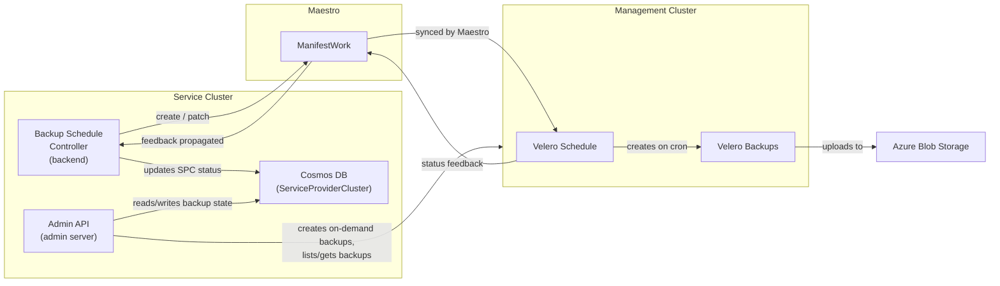

# HCP Backups

## Overview

ARO-HCP uses [Velero](https://velero.io/) to perform automated backups of Hosted Control Plane (HCP) resources. The backup system is composed of:

- A **backup schedule controller** in the backend service that creates and manages Velero Schedule resources on management clusters via Maestro.
- An **admin API** that exposes endpoints for on-demand backup creation, listing, and pause/resume of scheduled backups.
- **Velero** deployed on each management cluster with the Azure and HyperShift plugins.
- **Azure Blob Storage** as the backup storage backend.

Backups capture the Kubernetes resources that define a hosted control plane — not volume data. This allows disaster recovery by recreating the control plane from backed-up manifests.

## Architecture



### Data Flow

1. The backup schedule controller watches clusters in the Cosmos DB. When a cluster reaches an operational state (Ready, Error, or Updating), the controller creates a Maestro ManifestWork containing a Velero Schedule.
2. Maestro syncs the ManifestWork to the appropriate management cluster, which creates the Velero Schedule in the `velero` namespace.
3. Velero executes backups according to the cron schedule, uploading backup data to Azure Blob Storage.
4. The Velero Schedule status (last backup time, phase) propagates back through ManifestWork feedback rules.
5. The controller extracts this feedback and persists it in the ServiceProviderCluster record in Cosmos DB.
6. The admin API reads from Cosmos DB for profile state and connects directly to management clusters for backup listing and on-demand creation.

## What Gets Backed Up

Each backup targets the two namespaces associated with a hosted control plane: the hosted cluster namespace and the hosted control plane namespace.

The list of included Kubernetes resource types is defined in `internal/recovery/backup.go` (the `backupIncludedResources` variable). This is the authoritative source for what resources are captured. At a high level, it includes HyperShift resources (HostedCluster, HostedControlPlane, NodePool), Cluster API resources (Cluster, Machine, MachineDeployment, etc.), Azure-specific resources (AzureCluster, AzureMachine, etc.), and standard workload resources (Deployments, StatefulSets, ConfigMaps, Secrets, Services, etc.).

Volume snapshots are enabled. Backups capture Kubernetes resource manifests and volume snapshot data (with `SnapshotMoveData` enabled to move snapshots to the backup storage location).

## Backup Schedule Controller

The backup schedule controller runs in the backend service. Its source is in `backend/pkg/controllers/backupcontroller/`.

### Cluster Selection

The controller watches all HCP clusters stored in Cosmos DB. Only clusters whose Cluster Service state is Ready, Error, or Updating are eligible for backup scheduling. Clusters that are still provisioning or being deleted are skipped.

### Reconciliation

Each sync cycle follows a step-chain pattern where at most one mutating action is performed:

1. **Ensure ManifestWork created** — If no ManifestWork exists in Maestro for this cluster, create one containing the desired Velero Schedule.
2. **Ensure ManifestWork patched** — If the ManifestWork exists but its spec has drifted from the desired state (e.g., schedule changed, pause state toggled), patch it.
3. **Record ManifestWork in status** — If the ServiceProviderCluster record does not yet reference the ManifestWork name, update it.
4. **Extract feedback** — Read the ManifestWork status feedback from Maestro and update the ServiceProviderCluster with the last backup time and phase.

The controller stops after the first step that produces an action. On the next sync cycle, it picks up where it left off. This keeps each reconciliation simple and predictable. Since the controller runs every 5 minutes, a new cluster takes up to 4 reconciliation cycles (~20 min) to fully converge through all steps.

### ManifestWork Structure

The ManifestWork wraps one or more Velero Schedule resources (one per schedule in the config). It uses the ServerSideApply update strategy and includes FeedbackRules that extract the `.status` field from each Velero Schedule, enabling backup status to propagate back through Maestro without direct management cluster access.

- ManifestWork name: `<clusterID>-dr`
- ManifestWork namespace: Maestro consumer name from the cluster's provision shard
- Label: `aro-hcp.azure.com/backup-managed-by: backup-schedule-controller`
- Velero Schedule name: `<clusterID>-<scheduleName>` (e.g., `abc123-daily`)

See `backend/pkg/controllers/backupcontroller/manifestwork.go` for the full construction.

## Schedule Configuration

The backend loads schedule configuration from a YAML file specified by the `--backup-config-path` CLI flag (default: `/configs/backup-config/config.yaml`). The file is injected at deployment time through the backend's Helm chart ConfigMap (`backend/deploy/templates/backend.backup-config.configmap.yaml`).

```yaml
schedules:
  - name: daily
    schedule: "0 2 * * *"    # 2 AM UTC daily
    ttl: "168h"              # 7-day retention
    paused: false
  - name: weekly
    schedule: "0 3 * * 0"    # 3 AM UTC Sunday
    ttl: "720h"              # 30-day retention
    paused: false
```

Each schedule entry has four fields:

| Field | Description |
|-------|-------------|
| `name` | Unique identifier for the schedule. Becomes part of the Velero Schedule name (`<clusterID>-<name>`). |
| `schedule` | Cron expression controlling how often Velero creates backups. |
| `ttl` | Go duration string controlling how long backups are retained before Velero garbage-collects them. |
| `paused` | When `true`, pauses this schedule for **all** clusters. |

Validation requires at least one schedule, unique names, non-empty cron expressions (note: cron syntax is not validated), and valid Go duration TTLs. See `backend/pkg/controllers/backupcontroller/config.go`.

## Pause and Resume

Backup schedules can be paused at two levels:

- **Per-schedule pause** — Set via the `paused` field on a schedule entry in the backup config YAML. When `true`, that schedule is paused for all clusters. Requires a backend redeployment to take effect.
- **Per-cluster pause** — Set via the admin API by patching the backup profile for a specific cluster. The BackupState field on the ServiceProviderCluster is set to Paused. When paused, all schedules for that cluster are paused.

If either the per-schedule or per-cluster pause is set, the resulting Velero Schedule is paused. The controller evaluates both on every sync cycle and updates the ManifestWork if the pause state changes.

## Admin API Endpoints

> **TODO:** These endpoints are not yet wired up to Geneva Actions. They are currently accessible only via direct HTTP calls to the admin service.

All backup admin API endpoints are scoped to a specific HCP cluster, identified by its full ARM resource ID in the URL path. The endpoints are registered in `admin/server/server/admin.go` and implemented in `admin/server/handlers/hcp/backups.go` and `admin/server/handlers/hcp/backup_profile.go`.

| Method | Path Suffix | Description |
|--------|------------|-------------|
| GET | `/backups` | Lists all Velero Backups for the cluster on its management cluster, filtered by cluster label. |
| GET | `/backups/{backupName}` | Returns a single backup by name. Validates that the backup belongs to the requesting cluster. Returns 404 if the backup does not exist or belongs to a different cluster. |
| POST | `/backups` | Creates an on-demand Velero Backup on the management cluster. The backup name includes a timestamp (7-day TTL). Uses the same resource list and configuration as scheduled backups. |
| GET | `/backupprofile` | Returns the backup profile for the cluster, including the current schedule state (Active or Paused) and the last backup time and status from Velero feedback. |
| PATCH | `/backupprofile` | Updates the backup schedule state for the cluster. Accepts a state of Active or Paused. Returns 400 for invalid state values. |

The backup and backup list endpoints connect directly to the management cluster hosting the HCP's control plane. They resolve the management cluster by looking up the cluster's provision shard in Cluster Service, then create a controller-runtime client to query Velero resources in the `velero` namespace.

The backup profile endpoints read from and write to the ServiceProviderCluster record in Cosmos DB. Changes to the backup state are picked up by the backup schedule controller on its next sync cycle (~5 min).

### Example: Get backup profile

```
GET /admin/v1/hcp/{resourceID}/backupprofile
```

```json
{
  "resourceID": "/subscriptions/.../Microsoft.RedHatOpenShift/hcpOpenShiftClusters/mycluster",
  "state": "Active",
  "lastBackupTime": "2026-05-27 02:00:15 +0000 UTC",
  "lastBackupStatus": "Completed"
}
```

### Example: Pause backups for a cluster

```
PATCH /admin/v1/hcp/{resourceID}/backupprofile
```

```json
{"state": "Paused"}
```

### Example: Trigger an on-demand backup

```
POST /admin/v1/hcp/{resourceID}/backups
```

Returns 201 with the backup object. Check progress with `GET .../backups`.

## Orphaned ManifestWork Cleanup

A separate controller (`delete_orphaned_backup_manifestworks.go`) runs every 10 minutes (with jitter) to clean up backup ManifestWorks that are no longer associated with any cluster. This handles cases like cluster deletion or controller recovery after failures.

The cleanup process:

1. Lists all ServiceProviderCluster records from Cosmos DB.
2. Groups them by provision shard (management cluster).
3. For each shard, lists all ManifestWorks in Maestro that carry the backup-managed-by label.
4. Deletes any ManifestWork whose name is not referenced by any ServiceProviderCluster's backup schedule ManifestWork name field.

## Infrastructure

### Storage

Backup data is stored in Azure Blob Storage. The storage account is provisioned via Bicep templates in `dev-infrastructure/modules/hcp-backups/`. The storage account uses Cool access tier for cost optimization and zone-redundant storage (ZRS) where available, falling back to locally-redundant storage (LRS).

### Velero Deployment

Velero is deployed to each management cluster via the Helm chart in `velero/deploy/`. The deployment uses Velero's CLI-based installation (not the upstream Helm chart) wrapped in a Kubernetes Job. Two plugins are included:

- **Azure plugin** — Provides the Azure Blob Storage backend for backup data.
- **HyperShift plugin** — Handles HyperShift-specific backup and restore operations.

### Authentication

Velero authenticates to Azure Blob Storage using workload identity. The Velero service account is annotated with the managed identity's client ID. The identity is granted Storage Blob Data Contributor, Storage Account Key Operator, and Reader roles on the backup storage account. Role assignments are managed in `dev-infrastructure/modules/hcp-backups/storage-rbac.bicep`.

## Operational Procedures

### Check backup status for a cluster

```
GET /admin/v1/hcp/{resourceID}/backupprofile
```

Look at `lastBackupTime` and `lastBackupStatus`. A healthy cluster shows `"Completed"` with a recent timestamp matching the configured schedule.

### Pause backups for a single cluster

```
PATCH /admin/v1/hcp/{resourceID}/backupprofile
{"state": "Paused"}
```

Backups stop after the next reconciliation cycle (~5 min). Existing backups and their retention are unaffected.

### Resume backups for a single cluster

```
PATCH /admin/v1/hcp/{resourceID}/backupprofile
{"state": "Active"}
```

### Pause a schedule for all clusters

Edit the backup config YAML to set `paused: true` on the target schedule entry. Redeploy the backend service. All clusters will have that schedule paused on the next reconciliation cycle.

### Trigger an on-demand backup

```
POST /admin/v1/hcp/{resourceID}/backups
```

Creates a one-off backup with 7-day TTL. Check status with:

```
GET /admin/v1/hcp/{resourceID}/backups
```

### Investigate missing or failed backups

1. Check the backup profile: `GET .../backupprofile` -- is the cluster paused?
2. Check the backup list: `GET .../backups` -- what phase is the latest backup in?
3. Check the backend logs for `BackupSchedule` controller errors.
4. Verify the ManifestWork exists in Maestro for the cluster's provision shard (name: `<clusterID>-dr`).
5. On the management cluster, check Velero Schedule and Backup objects in the `velero` namespace.
