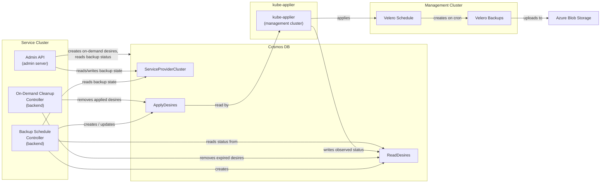

# HCP Backups

## Overview

ARO-HCP uses [Velero](https://velero.io/) to perform automated backups of Hosted Control Plane (HCP) resources. The backup system is composed of:

- A **backup schedule controller** in the backend service that creates and manages Velero Schedule resources on management clusters via kube-applier desires.
- An **on-demand backup cleanup controller** in the backend service that removes desires for on-demand backups after they have been applied and after Velero has expired them.
- An **admin API** that exposes endpoints for on-demand backup creation, backup status lookup, and pause/resume of backup schedules.
- **Velero** deployed on each management cluster with the Azure and HyperShift plugins.
- **Azure Blob Storage** as the backup storage backend.

Backups capture the Kubernetes resources that define a hosted control plane, along with volume snapshot data. This allows disaster recovery by recreating the control plane from backed-up manifests and restoring persistent volumes from snapshots.

## Architecture



### Data Flow

1. The backup schedule controller watches clusters in Cosmos DB. Once a cluster has a billing document (created after it first reaches Succeeded state) and is not marked for deletion, the controller writes Velero Schedule definitions into the kube-applier Cosmos container as ApplyDesires, and creates corresponding ReadDesires to observe their status.
2. kube-applier reads the ApplyDesires and applies the Velero Schedule resources to the appropriate management cluster in the `velero` namespace.
3. Velero executes backups according to each schedule's cadence, uploading backup data to Azure Blob Storage.
4. kube-applier reads the Velero Schedule status and writes it back into ReadDesire status in Cosmos DB.
5. The admin API reads ReadDesire statuses to serve per-schedule backup time and phase. The ServiceProviderCluster record stores only the backup schedule enabled/paused state.

## What Gets Backed Up

Each backup targets the two namespaces associated with a hosted control plane: the hosted cluster namespace and the hosted control plane namespace.

Captured resources include:

- HyperShift resources: `hostedcluster`, `nodepool`, `hostedcontrolplane`
- Cluster API resources: `cluster`, `machinedeployment`, `machineset`, `machine`, `clusterdeployment`
- Azure-specific resources: `azurecluster`, `azuremachine`, `azuremachinetemplate`
- Standard workload resources: `deployments`, `statefulsets`, `pod`, `configmap`, `secrets`, `services`, `sa`, `role`, `rolebinding`, `secretproviderclass`, `route`
- Policy resources: `priorityclasses`, `pdb`
- Storage resources: `pvc`, `pv`

Volume snapshots are enabled. Snapshot data is moved to the backup storage location so it is durable outside of the originating Azure region.

## Components

### Backup Schedule Controller

The controller runs as part of the backend service and reconciles on a periodic basis. Its responsibilities are:

- **Schedule lifecycle** — Creates and maintains Velero Schedule resources for each cluster by writing ApplyDesires to kube-applier. When schedule configuration changes (cadence, pause state), the controller updates the corresponding desires.
- **Cluster eligibility** — Only clusters that have previously reached Succeeded state (indicated by a billing document being present) and are not being deleted receive backup schedules. Clusters that have never reached Succeeded state, or that have a deletion timestamp set, are skipped.
- **Stale cleanup** — When a schedule is no longer configured, the controller replaces the existing ApplyDesire with a Delete-type desire, signaling kube-applier to remove the Velero Schedule from the management cluster. Once the Delete-type desire reports success, both the ApplyDesire and ReadDesire are removed from Cosmos.

### On-Demand Backup Cleanup Controller

The controller runs as part of the backend service. After an on-demand backup ApplyDesire has been successfully applied by kube-applier, the controller removes it. This prevents kube-applier from recreating the Velero Backup object after Velero expires it on its TTL. The controller also removes the corresponding ReadDesire once Velero has deleted the backup on the management cluster (signaled by nil KubeContent in the ReadDesire status).

### Cluster Deletion

When a cluster is deleted, the cluster child resources cleanup controller converts any remaining backup schedule ApplyDesires from ServerSideApply type to Delete type, causing kube-applier to remove the Velero Schedules from the management cluster. Once each Delete-type desire reports success, both the ApplyDesire and ReadDesire are purged from Cosmos.

### Admin API

The admin API exposes HTTP endpoints for operators to inspect and control backup behavior per cluster. It reads schedule state from Cosmos DB and surfaces per-schedule status from ReadDesires.

### kube-applier

kube-applier bridges the service cluster and each management cluster. It reads ApplyDesires from Cosmos DB and applies the corresponding Velero resources on the management cluster. It also reads Velero Schedule status and writes it back to ReadDesire status, making it visible to the backup controller and admin API.

### Velero

Velero runs on each management cluster and performs the actual backup and restore operations. It is configured with the Azure plugin (Blob Storage backend) and the HyperShift plugin (HyperShift-aware backup and restore logic).

## Schedule Cadences

Two cadence tiers are available, selected at backend deployment time:

- **Production** — Three overlapping schedules with progressively longer retention:
  - `hourly` — cron `0 */1 * * *`, TTL 48 hours
  - `daily` — cron `0 2 * * *`, TTL 336 hours (14 days)
  - `weekly` — cron `0 3 * * 0`, TTL 2160 hours (90 days)
- **Testing** — A single accelerated schedule suitable for CI and development environments:
  - `5min` — cron `*/5 * * * *`, TTL 1 hour

All schedules run with volume snapshots enabled. Retention is configured per cadence tier as above.

## Pause and Resume

Backup schedules can be paused at two levels:

- **Global pause** — Controlled by a backend deployment configuration value. When set, all schedules for all clusters are paused. Takes effect on the next reconciliation cycle after the backend is redeployed.
- **Per-cluster pause** — Controlled via the admin API for a specific cluster. The cluster's backup state in Cosmos DB is updated; the controller picks up the change on its next sync and updates the Velero Schedule accordingly.

If either global or per-cluster pause is active, the resulting Velero Schedule is paused. Existing backups and their retention are unaffected by a pause.

### Pause independence and operational impact

The two pause levels have no knowledge of each other. Removing the global pause does **not** clear per-cluster pauses, and pausing or unpausing a cluster via the admin API has no effect on the global pause.

Practical consequence for incident response:

1. **SRE pauses specific clusters via the admin API** — sets `spc.Spec.BackupState = Paused` for those clusters.
2. **Global pause is activated** (config change + redeploy) — all clusters, including newly created ones, have their schedules paused. The previously admin-paused clusters remain paused by both levers.
3. **Incident resolves; global pause is removed** (config change + redeploy) — all clusters that were only globally paused resume. Clusters that were also paused via the admin API remain paused because `spc.Spec.BackupState` is still `Paused`. The controller sees `globalPaused=false || clusterPaused=true` and keeps their Velero Schedules paused.
4. **To resume those clusters**, each one requires an explicit admin API call: `PATCH .../backupschedules {"state": "Enabled"}`.

Additionally, the `GET /backupschedules` response surfaces only `spc.Spec.BackupState` (the per-cluster value). It does not indicate whether the global pause is active. During a global pause, clusters that were not individually paused will show `state: Enabled` in the API response even though their Velero Schedules are paused on the management cluster.

## Admin API Reference

All endpoints are scoped to a specific HCP cluster identified by its ARM resource path. The base path for all backup endpoints is:

```
/admin/v1/hcp/subscriptions/{subscriptionId}/resourcegroups/{resourceGroupName}/providers/microsoft.redhatopenshift/hcpopenshiftclusters/{resourceName}
```

> **Note:** These endpoints are not yet wired up to Geneva Actions and are currently accessible only via direct HTTP calls to the admin service.

| Method | Path (relative to base) | Description |
|--------|--------------------------|-------------|
| GET | `/backupschedules` | Returns the backup schedule state and per-schedule status for the cluster. |
| PATCH | `/backupschedules` | Sets the backup schedule state for the cluster (`Enabled` or `Paused`). Returns updated state. |
| POST | `/backups` | Creates an on-demand Velero Backup with a 7-day TTL. Returns 202 with the backup name and initial phase. |
| GET | `/backups/{backupName}` | Returns status for a specific on-demand backup. Returns 404 if not found. |

### Example: Get backup schedules

```
GET .../backupschedules
```

```json
{
  "resourceID": "/subscriptions/.../Microsoft.RedHatOpenShift/hcpOpenShiftClusters/mycluster",
  "state": "Enabled",
  "schedules": [
    {"name": "...-hourly", "lastBackupTime": "2026-05-27T02:00:15Z", "backupSchedulePhase": "Enabled", "paused": false},
    {"name": "...-daily",  "lastBackupTime": "2026-05-27T02:00:00Z", "backupSchedulePhase": "Enabled", "paused": false},
    {"name": "...-weekly", "lastBackupTime": "2026-05-25T03:00:00Z", "backupSchedulePhase": "Enabled", "paused": false}
  ]
}
```

### Example: Pause backups for a cluster

```
PATCH .../backupschedules
{"state": "Paused"}
```

Response:
```json
{"resourceID": "/subscriptions/.../...", "state": "Paused"}
```

### Example: Trigger an on-demand backup

```
POST .../backups
```

Returns `202 Accepted`:
```json
{"name": "<clusterID>-20260527120000", "phase": "New", "startTimestamp": "", "completionTimestamp": ""}
```

Poll status with:

```
GET .../backups/{backupName}
```

Response:
```json
{
  "resourceID": "/subscriptions/.../Microsoft.RedHatOpenShift/hcpOpenShiftClusters/mycluster",
  "backup": {
    "name": "<clusterID>-20260527120000",
    "phase": "Completed",
    "startTimestamp": "2026-05-27T12:00:05Z",
    "completionTimestamp": "2026-05-27T12:04:32Z"
  }
}
```

The `phase` field reflects the Velero Backup phase (`New`, `InProgress`, `Completed`, `Failed`, etc.). Before the backup is applied by kube-applier the phase is `New`. If the ReadDesire KubeContent cannot be unmarshaled, phase is `Unknown`.

## Infrastructure

### Storage

Backup data is stored in Azure Blob Storage. The storage account is provisioned via Bicep templates and uses Cool access tier for cost optimization and zone-redundant storage (ZRS) where available, falling back to locally-redundant storage (LRS).

### Velero Deployment

Velero is deployed to each management cluster via a Helm chart that wraps Velero's CLI-based installation in a Kubernetes Job. Two plugins are included:

- **Azure plugin** — Provides the Azure Blob Storage backend.
- **HyperShift plugin** — Handles HyperShift-specific backup and restore logic.

### Authentication

Velero authenticates to Azure Blob Storage using workload identity. The Velero service account is annotated with the managed identity's client ID. The identity holds Storage Blob Data Contributor, Storage Account Key Operator, and Reader roles on the backup storage account.

## Operational Procedures

All examples below use the admin base path defined in [Admin API Reference](#admin-api-reference).

### Check backup status for a cluster

```
GET .../backupschedules
```

A healthy cluster shows each schedule with a recent `lastBackupTime` consistent with the configured cadence tier and `backupSchedulePhase: Enabled`.

### Pause backups for a single cluster

```
PATCH .../backupschedules
{"state": "Paused"}
```

Backups stop after the next reconciliation cycle. Existing backups and their retention are unaffected.

### Resume backups for a single cluster

```
PATCH .../backupschedules
{"state": "Enabled"}
```

### Pause all schedules for all clusters

Update the global pause configuration in the backend deployment and redeploy. All clusters will have their schedules paused on the next reconciliation cycle.

### Trigger an on-demand backup

```
POST .../backups
```

Creates a one-off backup with a 7-day TTL. Check status with:

```
GET .../backups/{backupName}
```

### Investigate missing or failed backups

1. Check the backup schedule — is the cluster or a global pause active?
2. Check the backend logs for backup schedule controller errors.
3. Verify that ApplyDesires and ReadDesires exist in the kube-applier Cosmos container for the cluster's management cluster.
4. On the management cluster, check Velero Schedule and Backup objects in the `velero` namespace.
