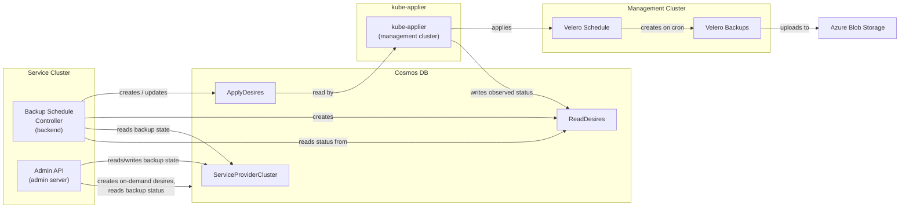

# HCP Backups

## Overview

ARO-HCP uses [Velero](https://velero.io/) to perform automated backups of Hosted Control Plane (HCP) resources. The backup system is composed of:

- A **backup schedule controller** in the backend service that creates and manages Velero Schedule resources on management clusters via kube-applier desires.
- An **admin API** that exposes endpoints for on-demand backup creation, backup status lookup, and pause/resume of backup schedules.
- **Velero** deployed on each management cluster with the Azure and HyperShift plugins.
- **Azure Blob Storage** as the backup storage backend.

Backups capture the Kubernetes resources that define a hosted control plane, along with volume snapshot data. This allows disaster recovery by recreating the control plane from backed-up manifests and restoring persistent volumes from snapshots.

## Architecture



### Data Flow

1. The backup schedule controller watches clusters in Cosmos DB. When a cluster reaches an operational state (provisioning state is Succeeded, Failed, or Updating), the controller creates ApplyDesires and ReadDesires in the kube-applier Cosmos container. Each ApplyDesire contains a Velero Schedule; each ReadDesire observes the Schedule's status on the management cluster.
2. kube-applier reads the ApplyDesires and applies the Velero Schedule resources to the appropriate management cluster in the `velero` namespace.
3. Velero executes backups according to the cron schedule, uploading backup data to Azure Blob Storage.
4. kube-applier reads the Velero Schedule status and writes it back into the ReadDesire's status in Cosmos DB.
5. The admin API reads ReadDesire statuses to extract the latest backup time and phase from the Velero Schedule status, serving them directly in the backup schedule response. The ServiceProviderCluster record only stores the backup schedule state (Active or Paused).
6. The admin API reads from Cosmos DB for schedule state and backup status.

## What Gets Backed Up

Each backup targets the two namespaces associated with a hosted control plane: the hosted cluster namespace and the hosted control plane namespace.

The list of included Kubernetes resource types is defined in `internal/backup/backup.go` (the `backupIncludedResources` variable). This is the authoritative source for what resources are captured. At a high level, it includes HyperShift resources (HostedCluster, HostedControlPlane, NodePool), Cluster API resources (Cluster, Machine, MachineDeployment, MachineSet, etc.), Azure-specific resources (AzureCluster, AzureMachine, AzureMachineTemplate), and standard workload resources (Deployments, StatefulSets, ConfigMaps, Secrets, Services, PVCs, PVs, etc.).

Volume snapshots are enabled. Backups capture Kubernetes resource manifests and volume snapshot data (with `SnapshotMoveData` enabled to move snapshots to the backup storage location).

## Backup Schedule Controller

The backup schedule controller runs in the backend service. Its source is in `backend/pkg/controllers/backupcontroller/`.

### Cluster Selection

The controller watches all HCP clusters stored in Cosmos DB. Only clusters whose provisioning state is Succeeded, Failed, or Updating are eligible for backup scheduling. Clusters that are still provisioning or being deleted are skipped. Additionally, the cluster must have a ClusterServiceID and a BaseDomainPrefix set.

### Reconciliation

The controller syncs every 5 minutes. Each sync cycle runs all steps sequentially in a single pass:

1. **Ensure desires created** — For each configured schedule, if no ApplyDesire exists, create an ApplyDesire (containing a Velero Schedule) and a corresponding ReadDesire in the kube-applier Cosmos container.
2. **Ensure desires updated** — If any existing ApplyDesire's content has drifted from the desired state (e.g., schedule changed, pause state toggled), replace it.
3. **Delete stale desires** — If there are ApplyDesires with the `backup-` prefix that no longer correspond to a configured schedule, convert the ApplyDesire to Delete type (to remove the Velero Schedule from the management cluster) and delete the stale ApplyDesire and ReadDesire.
4. **Check pause state** — Read the backup schedule state from the ServiceProviderCluster record (Active or Paused) and ensure ApplyDesires reflect the current pause state. Per-schedule backup time and phase are read from ReadDesires at query time by the admin API, not persisted on the SPC.
5. **Cleanup completed on-demand backups** — Remove ApplyDesires for on-demand backups that have been successfully applied, preventing kube-applier from re-creating the Backup object after Velero deletes it when its TTL expires.

### Desire Naming

- ApplyDesire / ReadDesire name for scheduled backups: `backup-<clusterID>-<scheduleName>` (e.g., `backup-abc123-daily`)
- ApplyDesire / ReadDesire name for on-demand backups: `ondemand-<backupName>`
- Velero Schedule name: `<clusterID>-<scheduleName>` (e.g., `abc123-daily`)

See `backend/pkg/controllers/backupcontroller/desires.go` for the desire construction.

## Schedule Configuration

The backend receives schedule configuration via two CLI flags passed to the backend deployment:

| Flag | Default | Description |
|------|---------|-------------|
| `--backup-schedule-cadence` | `production` | Either `"production"` or `"testing"`. Controls which set of hardcoded schedules is used. |
| `--backup-schedule-state` | `active` | Either `"active"` or `"paused"`. When `"paused"`, pauses all backup schedules for all clusters. |

These flags are set in the backend's Helm deployment template (`backend/deploy/templates/backend.deployment.yaml`) using the `backupCadence` and `backupPaused` Helm values.

Schedules are not individually configurable. They are determined by the cadence:

**Normal cadence** (production):

| Schedule | Cron | TTL |
|----------|------|-----|
| `hourly` | `0 */1 * * *` (every hour) | 48h (2 days) |
| `daily` | `0 2 * * *` (2 AM UTC) | 336h (14 days) |
| `weekly` | `0 3 * * 0` (3 AM UTC Sunday) | 2160h (90 days) |

**Testing cadence** (CI/dev):

| Schedule | Cron | TTL |
|----------|------|-----|
| `hourly` | `*/5 * * * *` (every 5 min) | 1h |

Validation requires `cadence` to be either `"production"` or `"testing"` and `state` to be either `"active"` or `"paused"`. See `backend/cmd/root.go` for validation and `backend/pkg/controllers/backupcontroller/config.go` for schedule definitions.

## Pause and Resume

Backup schedules can be paused at two levels:

- **Global pause** — Set via the `--backup-schedule-state` CLI flag (or the `backupPaused` Helm value). When set to `"paused"`, all schedules for all clusters are paused. Requires a backend redeployment to take effect.
- **Per-cluster pause** — Set via the admin API by patching the backup schedule state for a specific cluster. The BackupState field on the ServiceProviderCluster is set to Paused. When paused, all schedules for that cluster are paused.

If either the global pause or per-cluster pause is set, the resulting Velero Schedule is paused. The controller evaluates both on every sync cycle and updates the ApplyDesire if the pause state changes.

## Admin API Endpoints

> **TODO:** These endpoints are not yet wired up to Geneva Actions. They are currently accessible only via direct HTTP calls to the admin service.

All backup admin API endpoints are scoped to a specific HCP cluster. The cluster is identified by the standard ARM resource path segments in the URL. The endpoints are registered in `admin/server/server/admin.go` and implemented in `admin/server/handlers/hcp/backups.go`.

The base path for all endpoints is:

```
/admin/v1/hcp/subscriptions/{subscriptionId}/resourcegroups/{resourceGroupName}/providers/microsoft.redhatopenshift/hcpopenshiftclusters/{resourceName}
```

| Method | Path Suffix | Description |
|--------|------------|-------------|
| GET | `/backups/{backupName}` | Returns a single on-demand backup by name. Looks up the corresponding ReadDesire and returns the backup status. Returns 404 if the backup does not exist. |
| POST | `/backups` | Creates an on-demand Velero Backup by writing an ApplyDesire and ReadDesire to Cosmos DB. The backup name includes a timestamp (7-day TTL). Uses the same resource list and configuration as scheduled backups. |
| GET | `/backupschedules` | Returns the backup schedule state for the cluster, including the current state (Active or Paused) and per-schedule status extracted from ReadDesires. |
| PATCH | `/backupschedules` | Updates the backup schedule state for the cluster. Accepts a state of Active or Paused. Returns 400 for invalid state values. |

The backup endpoints read and write kube-applier desires in Cosmos DB. They resolve the management cluster by looking up the ServiceProviderCluster record, then use the kube-applier database client for that management cluster to interact with ApplyDesires and ReadDesires.

The backup schedule endpoints read the schedule state from the ServiceProviderCluster record in Cosmos DB and query per-schedule status from backup ReadDesires. Changes to the backup state are picked up by the backup schedule controller on its next sync cycle (~5 min).

### Example: Get backup schedule

```
GET /admin/v1/hcp/subscriptions/{subscriptionId}/resourcegroups/{resourceGroupName}/providers/microsoft.redhatopenshift/hcpopenshiftclusters/{resourceName}/backupschedules
```

```json
{
  "resourceID": "/subscriptions/.../Microsoft.RedHatOpenShift/hcpOpenShiftClusters/mycluster",
  "state": "Active",
  "schedules": [
    {"name": "abc123-hourly", "lastBackupTime": "2026-05-27 02:00:15 +0000 UTC", "lastBackupPhase": "Enabled"},
    {"name": "abc123-daily", "lastBackupTime": "2026-05-27 02:00:00 +0000 UTC", "lastBackupPhase": "Enabled"},
    {"name": "abc123-weekly", "lastBackupTime": "2026-05-25 03:00:00 +0000 UTC", "lastBackupPhase": "Enabled"}
  ]
}
```

### Example: Pause backups for a cluster

```
PATCH /admin/v1/hcp/subscriptions/{subscriptionId}/resourcegroups/{resourceGroupName}/providers/microsoft.redhatopenshift/hcpopenshiftclusters/{resourceName}/backupschedules
```

```json
{"state": "Paused"}
```

### Example: Trigger an on-demand backup

```
POST /admin/v1/hcp/subscriptions/{subscriptionId}/resourcegroups/{resourceGroupName}/providers/microsoft.redhatopenshift/hcpopenshiftclusters/{resourceName}/backups
```

Returns 202 Accepted with the backup name and initial phase. Check progress with `GET .../backups/{backupName}`.

## Stale Desire Cleanup

The backup schedule controller handles cleanup of stale desires as part of its regular reconciliation cycle (step 3 above). When a schedule is removed from the config, or the cadence changes, the controller:

1. Lists all ApplyDesires with the `backup-` prefix for the cluster.
2. Identifies any that no longer correspond to a currently configured schedule.
3. Converts the ApplyDesire to Delete type (so kube-applier removes the Velero Schedule from the management cluster).
4. Deletes the stale ApplyDesire and ReadDesire from Cosmos DB.

## Infrastructure

### Storage

Backup data is stored in Azure Blob Storage. The storage account is provisioned via Bicep templates in `dev-infrastructure/modules/hcp-backups/`. The storage account uses Cool access tier for cost optimization and zone-redundant storage (ZRS) where available, falling back to locally-redundant storage (LRS).

### Velero Deployment

Velero is deployed to each management cluster via the Helm chart in `velero/deploy/`. The deployment uses Velero's CLI-based installation (not the upstream Helm chart) wrapped in a Kubernetes Job. Two plugins are included:

- **Azure plugin** — Provides the Azure Blob Storage backend for backup data.
- **HyperShift plugin** — Handles HyperShift-specific backup and restore operations.

### Authentication

Velero authenticates to Azure Blob Storage using workload identity. The Velero service account is annotated with the managed identity's client ID. The identity is granted Storage Blob Data Contributor, Storage Account Key Operator, and Reader roles on the backup storage account. Role assignments are managed in `dev-infrastructure/modules/hcp-backups/storage-rbac.bicep`.

## Operational Procedures

### Check backup status for a cluster

```
GET /admin/v1/hcp/subscriptions/{subscriptionId}/resourcegroups/{resourceGroupName}/providers/microsoft.redhatopenshift/hcpopenshiftclusters/{resourceName}/backupschedules
```

Look at per-schedule `lastBackupTime` and `lastBackupPhase`. A healthy cluster shows each schedule with a recent timestamp matching the configured cadence.

### Pause backups for a single cluster

```
PATCH /admin/v1/hcp/subscriptions/{subscriptionId}/resourcegroups/{resourceGroupName}/providers/microsoft.redhatopenshift/hcpopenshiftclusters/{resourceName}/backupschedules
{"state": "Paused"}
```

Backups stop after the next reconciliation cycle (~5 min). Existing backups and their retention are unaffected.

### Resume backups for a single cluster

```
PATCH /admin/v1/hcp/subscriptions/{subscriptionId}/resourcegroups/{resourceGroupName}/providers/microsoft.redhatopenshift/hcpopenshiftclusters/{resourceName}/backupschedules
{"state": "Active"}
```

### Pause all schedules for all clusters

Set the `backupPaused` Helm value to `true` (which sets `--backup-schedule-state` to `"paused"`). Redeploy the backend service. All clusters will have their schedules paused on the next reconciliation cycle.

### Trigger an on-demand backup

```
POST /admin/v1/hcp/subscriptions/{subscriptionId}/resourcegroups/{resourceGroupName}/providers/microsoft.redhatopenshift/hcpopenshiftclusters/{resourceName}/backups
```

Creates a one-off backup with 7-day TTL. Check status with:

```
GET /admin/v1/hcp/subscriptions/{subscriptionId}/resourcegroups/{resourceGroupName}/providers/microsoft.redhatopenshift/hcpopenshiftclusters/{resourceName}/backups/{backupName}
```

### Investigate missing or failed backups

1. Check the backup schedule: `GET .../backupschedules` — is the cluster paused?
2. Check the on-demand backup status: `GET .../backups/{backupName}` — what phase is the backup in?
3. Check the backend logs for `BackupSchedule` controller errors.
4. Verify ApplyDesires and ReadDesires exist in the kube-applier Cosmos container for the cluster's management cluster.
5. On the management cluster, check Velero Schedule and Backup objects in the `velero` namespace.