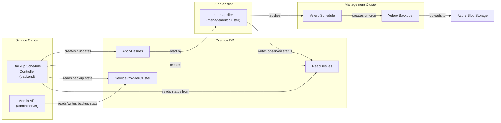

# HCP Backups

## Overview

ARO-HCP uses [Velero](https://velero.io/) to perform automated backups of Hosted Control Plane (HCP) resources. The backup system is composed of:

- A **backup schedule controller** in the backend service that creates and manages Velero Schedule resources on management clusters via kube-applier desires.
- An **admin API** that exposes endpoints for inspecting backup schedule status and pause/resume of backup schedules.
- **Velero** deployed on each management cluster with the Azure and HyperShift plugins.
- **Azure Blob Storage** as the backup storage backend.

Backups capture the Kubernetes resources that define a hosted control plane, along with volume snapshot data. This allows disaster recovery by recreating the control plane from backed-up manifests and restoring persistent volumes from snapshots.

## Architecture


```mermaid
flowchart LR
    subgraph SVC["Service Cluster"]
        BC["Backup Schedule\nController\n(backend)"]
        Admin["Admin API\n(admin server)"]
    end

    subgraph Cosmos["Cosmos DB"]
        SPC["ServiceProviderCluster"]
        AD["ApplyDesires"]
        RD["ReadDesires"]
    end

    subgraph KA["kube-applier"]
        KAC["kube-applier\n(management cluster)"]
    end

    subgraph MGMT["Management Cluster"]
        VS["Velero Schedule"]
        VB["Velero Backups"]
    end

    Blob["Azure Blob Storage"]

    BC -- "creates / updates" --> AD
    BC -- "creates" --> RD
    BC -- "reads backup state" --> SPC
    AD -- "read by" --> KAC
    KAC -- "applies" --> VS
    VS -- "creates on cron" --> VB
    VB -- "uploads to" --> Blob
    KAC -- "writes observed status" --> RD
    BC -- "reads status from" --> RD
    Admin -- "reads/writes backup state" --> SPC
```

### Data Flow

1. The backup schedule controller watches clusters in Cosmos DB. Once a cluster has a billing document (created after it first reaches Succeeded state) and is not marked for deletion, the controller writes Velero Schedule definitions into the kube-applier Cosmos container as ApplyDesires, and creates corresponding ReadDesires to observe their status.
2. kube-applier reads the ApplyDesires and applies the Velero Schedule resources to the appropriate management cluster in the `velero` namespace.
3. Velero executes backups according to each schedule's cadence, uploading backup data to Azure Blob Storage.
4. kube-applier reads the Velero Schedule status and writes it back into ReadDesire status in Cosmos DB.
5. The admin API reads ReadDesire statuses to serve per-schedule backup time and phase. The ServiceProviderCluster record stores only the per-cluster backup schedule state (`spc.Spec.BackupScheduleState`, `Enabled` or `Disabled`).

## What Gets Backed Up

Each backup targets the two namespaces associated with a hosted control plane: the hosted cluster namespace and the hosted control plane namespace.

Captured resources include:

- HyperShift resources: `hostedcluster`, `nodepool`, `hostedcontrolplane`
- Cluster API resources: `cluster`, `machinedeployment`, `machineset`, `machine`, `clusterdeployment`
- Azure-specific resources: `azurecluster`, `azuremachine`, `azuremachinetemplate`
- Standard workload resources: `deployments`, `statefulsets`, `pods`, `configmap`, `secrets`, `services`, `sa`, `role`, `rolebinding`, `secretproviderclass`, `route`
  - `pods` must be included for the [etcd snapshot hooks](#etcd-snapshot-hooks) to fire — Velero only runs exec hooks against pods that are part of the backup.
- Policy resources: `priorityclasses`, `pdb`
- Storage resources: `pvc`, `pv`
- Swift Networking resources: `multitenantpodnetworkconfigs`, `podnetworks`,

Volume snapshots are enabled. Snapshot data is moved to the backup storage location so it is durable outside of the originating Azure region.

### etcd snapshot hooks

A raw block-level snapshot of etcd PVCs does not provide a method to reset informer/kubelet caches on the dataplane, therefore backup hooks
are used to capture an etcd snapshot. Each backup carries a Velero exec hook (`etcd-snapshot`), scoped to the control-plane namespace and
selecting pods labeled `app=etcd`, with both a pre-backup and a post-backup phase that run inside the `etcd` container.

**Pre-backup hook** (`onError: Fail`, 10-minute timeout) — takes the logical snapshot and flushes it to the underlying block device:

```sh
ETCDCTL_API=3 etcdctl \
  --endpoints=https://etcd-client.<control-plane-ns>.svc:2379 \
  --cacert /etc/etcd/tls/etcd-ca/ca.crt \
  --cert /etc/etcd/tls/client/etcd-client.crt \
  --key /etc/etcd/tls/client/etcd-client.key \
  snapshot save /var/lib/backup.db \
  && sync -f /var/lib/backup.db
```

The trailing `sync -f` is required for restore correctness. `etcdctl snapshot save` writes to `<path>.part`, fsyncs that file, then atomically renames it to `<path>` — but it does **not** fsync the parent directory. Because the CSI snapshot captures block-device state, the rename (a directory metadata operation still sitting in page cache / the filesystem journal) can be missing from the snapshot, leaving only `backup.db.part` on the restored PVC. `sync -f <path>` issues `syncfs()` on the data PVC, committing the file data **and** the rename to the block device before Velero snapshots the volume. Velero runs the pre-hook to completion before snapshotting the pod's volumes, so the flush is guaranteed to land first.

**Post-backup hook** (`onError: Continue`, 2-minute timeout) — deletes the snapshot to reclaim space on the data PVC once Velero has finished snapshotting the pod's volumes:

```sh
rm -f /var/lib/backup.db /var/lib/backup.db.part
```

The post-hook uses `onError: Continue` because the snapshot has already been captured by the time it runs; a failed cleanup should not fail the backup. (This replaces the previous behavior of leaving `/var/lib/backup.db` in place to be overwritten on the next run.)

The pre-backup hook plays two independent roles:

- **Where the snapshot data comes from** — the `--endpoints` value is the `etcd-client` ClusterIP Service, not a pod or the headless discovery service. `etcd-client` leaves `publishNotReadyAddresses` unset (false), so it routes only to Ready endpoints; the etcd `readinessProbe` (`readyz` on port 9980) reflects serving health, so the Service load-balances to a healthy member. `etcdctl snapshot save` opens a single gRPC connection, so the snapshot is pulled from exactly one healthy member — the readiness semantics do the "pick a healthy member" for us. The headless `etcd-discovery` service must **not** be used here: it sets `publishNotReadyAddresses: true` and could hand back a crash-looping member.
- **Which pods Velero execs into** — the hook selects all etcd members via the `app=etcd` label. Velero runs the exec once per matched pod, so every running member writes a `backup.db` to its own PVC. This is deliberately independent of any single pod's health: the backup does not hinge on `etcd-0` being up. The snapshot *data* in every case still comes from a healthy member via the Service, so each member's `backup.db` is equally consistent.

`/var/lib/backup.db` sits on the member's data PVC (mounted at `/var/lib`) but outside etcd's live data directory (`/var/lib/data`, set via `ETCD_DATA_DIR`), so live etcd ignores the file while the CSI snapshot of that PVC still captures it. Velero runs the pod pre-hook before snapshotting that pod's volumes, so the clean snapshot is present when the volume snapshot is taken. The post-hook removes the file after the volume snapshot completes, so it does not accumulate on the data PVC between runs.

The pre-hook uses `onError: Fail`. If a member's exec fails, Velero records the error, skips that pod, and continues — the other members' snapshots and all CSI volume snapshots are still taken, and the backup is marked **PartiallyFailed** (it does *not* abort the whole backup). This makes a failing member visible rather than letting a total failure (e.g. a bad cert path on every member) silently pass as it would with `onError: Continue`.

### Restoring from the etcd snapshot

All etcd PVCs (`data-etcd-0/1/2`) are CSI-snapshotted, and each running member's snapshot contains its own `backup.db`. Because the pre-hook fires per-pod at slightly different instants, those files are individually consistent but usually captured at different revisions, so there is no single designated "primary" snapshot.

The full restore procedure — selecting a backup, picking the freshest snapshot, and rebuilding a 3-member etcd cluster from it — is documented in [etcd-restore.md](etcd-restore.md).

## Components

### Backup Schedule Controller

The controller runs as part of the backend service and reconciles on a periodic basis. Its responsibilities are:

- **Schedule lifecycle** — Creates and maintains Velero Schedule resources for each cluster by writing ApplyDesires to kube-applier. When schedule configuration changes (cadence, pause state), the controller updates the corresponding desires.
- **Cluster eligibility** — Only clusters that have previously reached Succeeded state (indicated by a billing document being present) and are not being deleted receive backup schedules. Clusters that have never reached Succeeded state, or that have a deletion timestamp set, are skipped.
- **Stale cleanup** — When a schedule is no longer configured, the controller replaces the existing ApplyDesire with a Delete-type desire, signaling kube-applier to remove the Velero Schedule from the management cluster. Once the Delete-type desire reports success, both the ApplyDesire and ReadDesire are removed from Cosmos.

### Cluster Deletion

Backup teardown on deletion is handled by the **backup schedule controller itself**, not the generic cluster child resources cleanup controller. In fact, the cluster child resources cleanup controller explicitly *skips* any desire whose name carries the `backupschedule-` prefix, so as not to interfere with the graceful teardown in progress.

When a cluster is marked for deletion (its `DeletionTimestamp` is set) and its management-cluster placement is known, the backup schedule controller's deletion path drives each backup desire through an Apply→Delete→Wait→Purge lifecycle:

1. Each backup schedule ApplyDesire is converted from `ServerSideApply` type to `Delete` type (clearing its `ServerSideApply` content), signaling kube-applier to remove the Velero Schedule from the management cluster.
2. Once the Delete-type desire reports success (and its observed status is cleared), the ApplyDesire is purged from Cosmos.
3. After all ApplyDesires are gone, the corresponding backup schedule ReadDesires are deleted from Cosmos.

### Admin API

The admin API exposes HTTP endpoints for operators to inspect and control backup behavior per cluster. It reads schedule state from Cosmos DB and surfaces per-schedule status from ReadDesires.

### kube-applier

kube-applier bridges the service cluster and each management cluster. It reads ApplyDesires from Cosmos DB and applies the corresponding Velero resources on the management cluster. It also reads Velero Schedule status and writes it back to ReadDesire status, making it visible to the backup controller and admin API.

### Velero

Velero runs on each management cluster and performs the actual backup and restore operations. It is configured with the Azure plugin (Blob Storage backend) and the HyperShift plugin (HyperShift-aware backup and restore logic).

## Schedule Cadences

Two cadence tiers are available, selected at backend deployment time:

- **production** — Three overlapping schedules with progressively longer retention:
  - `hourly` — cron `0 */1 * * *`, TTL 168 hours (7 days)
  - `daily` — cron `0 2 * * *`, TTL 720 hours (30 days)
  - `weekly` — cron `0 3 * * 0`, TTL 2160 hours (90 days)
- **testing** — A single accelerated schedule suitable for CI and development environments:
  - `10min` — cron `*/10 * * * *`, TTL 1 hour

All schedules run with volume snapshots enabled. Cadence and retention are selected via `backend.backupCadenceProfile` in [`../config/config.yaml`](../config/config.yaml), set to one of the tier names above (`production` or `testing`, lowercase).

## Pause and Resume

Backup schedules can be paused at two independent levels. Both are expressed as a `BackupScheduleState` of `Enabled` or `Disabled`; a `Disabled` state at either level maps to `spec.paused=true` on the resulting Velero Schedule.

- **Global pause** — Controlled by the backend deployment configuration value `backend.backupScheduleState` in [`../config/config.yaml`](../config/config.yaml). Its default is `Enabled`; setting it to `Disabled` pauses all schedules for all clusters. Takes effect on the next reconciliation cycle after the backend is redeployed.
- **Per-cluster pause** — Controlled via the [Admin API](#admin-api-reference) for a specific cluster, which sets `spc.Spec.BackupScheduleState` on the cluster's ServiceProviderCluster document in Cosmos DB. The controller picks up the change on its next sync and updates the Velero Schedule accordingly.

The controller computes the Velero Schedule's pause flag as `globalState == Disabled || clusterState == Disabled` — so if either level is `Disabled`, the schedule is paused. Existing backups and their retention are unaffected by a pause.

### Pause independence and operational impact

The two pause levels have no knowledge of each other. Removing the global pause does **not** clear per-cluster pauses, and pausing or unpausing a cluster via the admin API has no effect on the global pause.

Practical consequence for incident response:

1. **SRE pauses specific clusters via the admin API** — sets `spc.Spec.BackupScheduleState = Disabled` for those clusters.
2. **Global pause is activated** (`backend.backupScheduleState: Disabled` config change + redeploy) — all clusters, including newly created ones, have their schedules paused. The previously admin-paused clusters remain paused by both levers.
3. **Incident resolves; global pause is removed** (`backend.backupScheduleState: Enabled` config change + redeploy) — all clusters that were only globally paused resume. Clusters that were also paused via the admin API remain paused because `spc.Spec.BackupScheduleState` is still `Disabled`. The controller sees `globalState == Disabled` is now false but `clusterState == Disabled` is still true, and keeps their Velero Schedules paused.
4. **To resume those clusters**, each one requires an explicit admin API call: `PATCH .../backupschedules {"state": "Enabled"}`.

Additionally, the `GET /backupschedules` response surfaces only `spc.Spec.BackupScheduleState` (the per-cluster value). It does not indicate whether the global pause is active. During a global pause, clusters that were not individually paused will show `state: Enabled` in the API response even though their Velero Schedules are paused on the management cluster.

## Admin API Reference

All endpoints are scoped to a specific HCP cluster identified by its ARM resource path. The base path for all backup endpoints is:

```
/admin/v1/hcp/subscriptions/{subscriptionId}/resourcegroups/{resourceGroupName}/providers/microsoft.redhatopenshift/hcpopenshiftclusters/{resourceName}
```

> **Note:** These endpoints are not yet wired up to Geneva Actions and are currently accessible only via direct HTTP calls to the admin service.

| Method | Path (relative to base) | Description |
|--------|--------------------------|-------------|
| GET | `/backupschedules` | Returns the backup schedule state and per-schedule status for the cluster. |
| PATCH | `/backupschedules` | Sets the backup schedule state for the cluster (`Enabled` or `Disabled`). Returns updated state. |

### Example: Get backup schedules

```
GET .../backupschedules
```

```json
{
  "state": "Enabled",
  "schedules": [
    {"name": "...-hourly", "lastBackupTime": "2026-05-27T02:00:15Z", "phase": "Enabled", "backupExecutionState": "Active"},
    {"name": "...-daily",  "lastBackupTime": "2026-05-27T02:00:00Z", "phase": "Enabled", "backupExecutionState": "Active"},
    {"name": "...-weekly", "lastBackupTime": "2026-05-25T03:00:00Z", "phase": "Enabled", "backupExecutionState": "Active"}
  ]
}
```

### Example: Pause backups for a cluster

```
PATCH .../backupschedules
{"state": "Disabled"}
```

Response:
```json
{"state": "Disabled"}
```

## Infrastructure

### Storage

Backup data is stored in Azure Blob Storage. The storage account is provisioned via Bicep templates and uses Cool access tier for cost optimization and zone-redundant storage (ZRS) where available, falling back to locally-redundant storage (LRS).

### Velero Deployment

Velero is deployed to each management cluster via a Helm chart that wraps Velero's CLI-based installation in a Kubernetes Job. Two plugins are included:

- **[Azure plugin](https://github.com/vmware-tanzu/velero-plugin-for-microsoft-azure)** — Provides the Azure Blob Storage backend.
- **[HyperShift plugin](https://github.com/openshift/hypershift-oadp-plugin)** — Handles HyperShift-specific backup and restore logic.

### Authentication

Velero authenticates to Azure Blob Storage using workload identity. The Velero service account is annotated with the managed identity's client ID. The identity holds Storage Blob Data Contributor, Storage Account Key Operator, and Reader roles on the backup storage account.

## Operational Procedures

All examples below use the admin base path defined in [Admin API Reference](#admin-api-reference).

### Check backup status for a cluster

```
GET .../backupschedules
```

A healthy cluster shows each schedule with a recent `lastBackupTime` consistent with the configured cadence tier, `phase: Enabled`, and `backupExecutionState: Active`.

### Pause backups for a single cluster

```
PATCH .../backupschedules
{"state": "Disabled"}
```

Backups stop after the next reconciliation cycle. Existing backups and their retention are unaffected.

### Resume backups for a single cluster

```
PATCH .../backupschedules
{"state": "Enabled"}
```

### Pause all schedules for all clusters

Set `backend.backupScheduleState` to `Disabled` in the backend deployment configuration and redeploy. All clusters will have their schedules paused on the next reconciliation cycle.

### Investigate missing or failed backups

1. Check the backup schedule — is the cluster or a global pause active?
2. Check the backend logs for backup schedule controller errors.
3. Verify that ApplyDesires and ReadDesires exist in the kube-applier Cosmos container for the cluster's management cluster.
4. On the management cluster, check Velero Schedule and Backup objects in the `velero` namespace.
