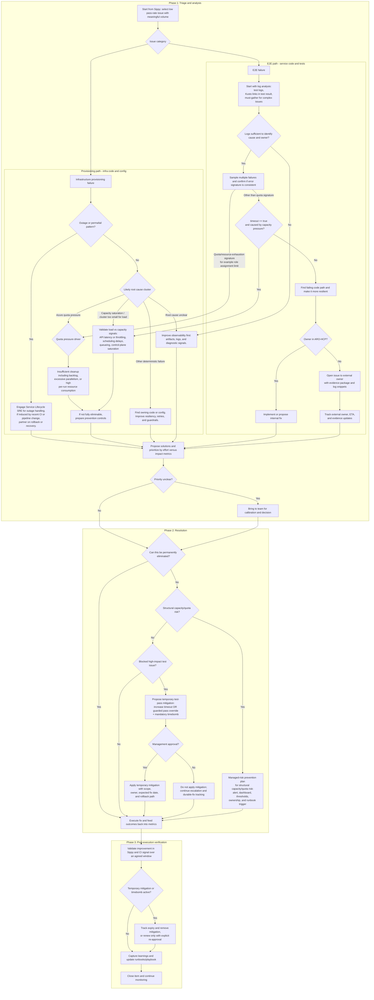

# CI/CD and E2E Stability Decision Tree (Draft)

This document is primarily intended for the CI "Get Well" tiger team, and is also useful for anyone investigating CI failures.

It is an early-stage work in progress and should evolve continuously alongside the metrics, tooling, and operating practices used by the team/s.

## Entry points in Sippy

- E2E test stability in presubmits: [Sippy Presubmits - rp-api-compat-all/parallel](https://sippy.dptools.openshift.org/sippy-ng/tests/Presubmits?filters=%257B%2522items%2522%253A%255B%257B%2522columnField%2522%253A%2522suite_name%2522%252C%2522operatorValue%2522%253A%2522equals%2522%252C%2522value%2522%253A%2522rp-api-compat-all%252Fparallel%2522%257D%252C%257B%2522columnField%2522%253A%2522current_runs%2522%252C%2522operatorValue%2522%253A%2522%253E%2522%252C%2522value%2522%253A%252210%2522%257D%255D%252C%2522linkOperator%2522%253A%2522and%2522%257D&period=default&sort=asc&sortField=current_pass_percentage)

- Infra provisioning success in PR checks: [Sippy Presubmits - pipeline step](https://sippy.dptools.openshift.org/sippy-ng/tests/Presubmits?filters=%257B%2522items%2522%253A%255B%257B%2522columnField%2522%253A%2522name%2522%252C%2522operatorValue%2522%253A%2522contains%2522%252C%2522value%2522%253A%2522pipeline%2520step%2522%257D%252C%257B%2522columnField%2522%253A%2522current_runs%2522%252C%2522operatorValue%2522%253A%2522%253E%2522%252C%2522value%2522%253A%252210%2522%257D%255D%252C%2522linkOperator%2522%253A%2522and%2522%257D&period=default&sort=asc&sortField=current_pass_percentage)

## Workflow phases

1. **Triage and analysis**: from issue intake to a clear root-cause and prioritization decision.

2. **Resolution**: from eliminability decision to durable fix, managed-risk controls, or approved temporary mitigation.

3. **Post-execution verification**: confirm measurable improvement, remove temporary exceptions on time, and capture learnings.

## Decision tree overview (Mermaid)

## Analysis hints [section need refinement, with specific URLs and examples]

Use these heuristics to prioritize and route issues consistently.

### Impact (what hurts most now)

1. In Sippy test tables, use `current_runs` and failure/pass percentages to estimate current failing volume for a test or suite.

2. In Search OpenShift CI, query the suspected signature and count:
   - distinct job run URLs (run impact),
   - distinct job names (blast radius).

3. Prioritize by lane:
   - Provision lane first (it blocks all downstream E2E),
   - then E2E lane by largest run impact and blast radius.

### Recurrence (is this repeating or a one-off)

1. Compare short and long windows for the same signature:
   - short: last 2d,
   - long: last 7d.

2. Treat as recurrent if the same signature appears repeatedly across multiple days/jobs rather than a single burst.

3. In Sippy, verify recurrence by checking the same low-performing test(s) and associated failed runs over multiple windows.

### Outage/permafail detection (is this an incident pattern)

1. Treat as outage candidate when the same signature appears across multiple required jobs in a short period.

2. Treat as permafail candidate when pass rate collapses near zero with meaningful run volume and similar failure text.

3. Escalate early to Service Lifecycle SRE when outage/permafail criteria are met, even before deep root-cause analysis.

## Detailed playbook (complements the chart)

Use this checklist together with the flowchart.

### Phase 1: Triage and analysis

#### Infrastructure provisioning issues (infra code and config path)

1. First determine whether the failure is part of an outage/permafail pattern.
   - Quick hint: in Search OpenShift CI, run the suspected signature against provision job regex and compare 6h vs 7d hit volume and job spread.
   - Quick hint: in Sippy, validate that affected provision checks show a sharp current pass-rate drop with meaningful run count.

2. If outage/permafail is confirmed: involve Service Lifecycle SRE; if change-induced, work jointly on rollback/recovery.

3. If not outage/permafail: classify the likely root-cause cluster as one of:
   - Azure quota pressure,
   - capacity saturation / cluster too small for load,
   - other deterministic failure,
   - root cause unclear.

4. For quota pressure, use a consolidated driver model: insufficient cleanup including backlog, excessive parallelism, or high per-run resource consumption.
   - Quick hint: use Search OpenShift CI signature grouping to estimate which driver is currently highest impact.

5. For capacity saturation, validate load-vs-capacity evidence (for example API throttling/latency, scheduling delays, queueing, control-plane saturation).

6. For other deterministic failures, identify the owning code/config path and define resilience guardrails.

7. If root cause is unclear, improve observability first (artifacts/logging/diagnostic signals) before attempting a fix.

8. Route outcomes to prioritization (`Z`) for effort-vs-impact ordering.

#### E2E failures (service code and tests path)

1. Start with log-first triage using test logs, Kusto links in the test result, and must-gather for complex issues.
   - Quick hint: use Search OpenShift CI with exact signature regex and `groupBy=job` to confirm cross-job spread.
   - Quick hint: use Sippy `current_runs` plus current pass/fail percentages to estimate immediate impact.

2. Decide whether current logs are sufficient to identify cause and owner.

3. If logs are not sufficient, run this evidence sequence before declaring root cause unclear:
   - Spyglass view for failed run details and failing stage context.
   - Run-specific debug info page for direct links.
   - Kusto and service logs for timeline/dependency context.
   - Must-gather for deeper multi-component correlation when needed.
   If still inconclusive after this sequence, route to the observability-improvement path (`C10`) and re-enter analysis with stronger diagnostics.

4. If logs are sufficient, sample multiple failures and confirm whether the error signature is consistent.

5. If signature indicates quota/resource exhaustion (for example role assignment limits), route to quota pressure in the infrastructure path (`C5`).

6. For non-quota signatures, evaluate the gate `timeout == true && caused by capacity pressure`.

7. If the gate is true, route to the capacity saturation path (`C12`).

8. If the gate is false, identify failing code path and make it more resilient (`D6`), then determine ownership:
   - If owner is in ARO-HCP, implement/propose internal fix (`D8`).
   - If owner is external, open issue with evidence and track ETA/updates (`D9`/`D10`).

9. Route outcomes to prioritization (`Z`) for effort-vs-impact ordering.

### Phase 2: Resolution

1. Ask whether the issue can be permanently eliminated (`R`).

2. If yes, execute the durable fix and feed outcomes back into metrics (`Z3`).

3. If not, decide whether this is a structural capacity/quota risk (`R2`).

4. If structural, create a managed-risk prevention plan (`P`) with alerting, dashboard, thresholds, ownership, and runbook trigger.

5. If not structural, decide whether this is a blocked high-impact test issue (`P2`).

6. For blocked high-impact test issues, propose temporary test-pass mitigation (`T1`) and require management approval (`T2`) before applying.
   - If approved, apply temporary mitigation with scope, owner, expected fix date, and rollback path (`T3`).
   - If not approved, do not mitigate; continue escalation and durable-fix tracking (`T4`).

7. Continue through execution/metrics feedback (`Z3`) regardless of which resolution branch is selected.

### Timebomb exception policy (temporary test-pass mitigation)

1. Use only for blocked high-impact issues where immediate durable remediation is unavailable.

2. Allowed forms include timeout increase or guarded pass override.

3. Management approval is required before merging.

4. Every exception must include: owner, linked tracking issue, expected fix date, explicit timebomb expiry, and rollback plan.

5. The exception is temporary by design and must be removed when durable fix is available (or when timebomb expires).

### Phase 3: Post-execution verification

1. Validate that the implemented change improves target metric trends in Sippy and CI results.
   - Quick hint: compare before/after windows in both Sippy rates and Search OpenShift CI signature hits.

2. Verify that no new regressions were introduced in adjacent signals.

3. If a temporary mitigation is active, track timebomb expiry and remove it on schedule (or re-approve explicitly if extension is required).

4. Capture key learnings and update diagnostics, runbooks, and this decision tree.
   - Quick hint: explicitly record whether the issue was one-off, bursty, or recurrent so recurrence handling improves over time.
