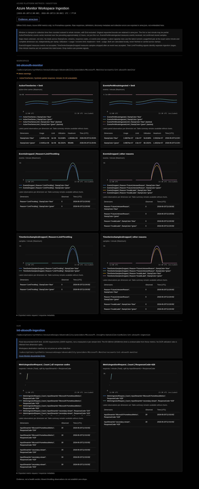
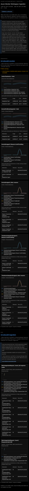

# AMW Platform Observability

`aro-hcp-tests gather-observability` includes an **AMW** pane and `amw.json`
evidence before running its existing Prometheus metric panels. This collection
uses read-only Azure Resource Manager APIs only: no metric-name discovery,
PromQL, label scanning, SQLite, or diagnostic-settings changes.

For a quick AMW-only collection using the same rendered configuration and timing
inputs as normal gathering:

```sh
aro-hcp-tests gather-observability --amw-only \
  --rendered-config /path/to/rendered-config.yaml \
  --subscription-id "$SUBSCRIPTION_ID" \
  --timing-input /path/to/test-artifacts \
  --output /path/to/amw-artifacts
```

If timing artifacts are unavailable, provide `--start-time-fallback` in RFC3339
format. Use the normal Azure SDK credential selection, for example
`AZURE_TOKEN_CREDENTIALS=AzureCLICredential` after signing in with Azure CLI.
The AMW-only path skips alerts, JUnit evaluation, utilization collection, and all
Prometheus APIs. Open the resulting `observability-summary.html` locally. SVG
charts and tables need neither JavaScript nor network access.

## Evidence

The collector reads these six workspace metrics at one-minute `Maximum`
aggregation, retaining `StampColor` and, for drops, `Reason`:

- `ActiveTimeSeries` and `ActiveTimeSeriesLimit`
- `EventsPerMinuteIngested` and `EventsPerMinuteIngestedLimit`
- `EventsDropped`
- `TimeSeriesSamplesDropped`

Utilization and headroom are calculated from numeric usage and limit observations
at the same timestamp and complete dimension set. Different stamps are never
summed or paired. The table states the observation time; it does not claim that
an old observation is the workspace's current state.

Workspace event throttling and active-series sample throttling have separate
graphs, alongside other drop reasons. One-minute maxima are not summed into total
losses. Missing, invalid, or ambiguous data is unknown, never zero. Active series
is Azure's preceding approximately 12-hour inventory; events received are not
the same measurement as samples successfully stored.

DCR discovery lists rules in each selected workspace's subscription, across
resource groups, and matches monitoring-account destinations. It does not discover
rules in other subscriptions or prove that a matched destination has an active
data flow. Each matching DCR contributes `MetricIngestionRequest_Count` at
one-minute `Total`, split by `InputStreamId` and `ResponseCode`. Request 429s have
their own graph. The documented 15,000 requests/minute limit is per DCR, not per
stream. The 50 GB/minute limit has no corresponding Prometheus byte metric here.

`amw.json` retains requested/effective time bounds, resource IDs, decoded SDK
metric responses, metric definitions, DCR discovery pages, and errors. These
artifacts may contain sensitive infrastructure metadata, including unrelated DCRs
on retained subscription discovery pages; handle them like other CI evidence.
The report embeds summaries, not raw responses. Definitions are supplementary
and are collected last so they cannot consume the capacity-data budget.

## Bounds

- 60 seconds total collection time; 10 seconds per request; no automatic retries.
- Four workspaces, 32 matching DCRs, ten discovery pages per subscription.
- 8 MiB per response and 32 MiB total response bodies.
- One-minute intervals, at most 24 hours after outward rounding. Future grace
  periods are clamped to collection time, without waiting for more data.
- Explicit 1,000-series request limit. Reaching any bound is reported as incomplete.
- Twelve plotted series per graph and 96 per report; up to 100 summary rows per
  graph. Omitted visual series remain in JSON.

Collection failures are best-effort diagnostics, not new e2e gates. They remain
visible in JSON and HTML. AMW-only artifact publication failures return an error;
normal gathering logs AMW publication failures without changing alert verdicts.
There is no runtime increase or dependency on the full label-analysis workflow.

## Preview

Synthetic data only. Before this change the combined report had no AMW pane.




