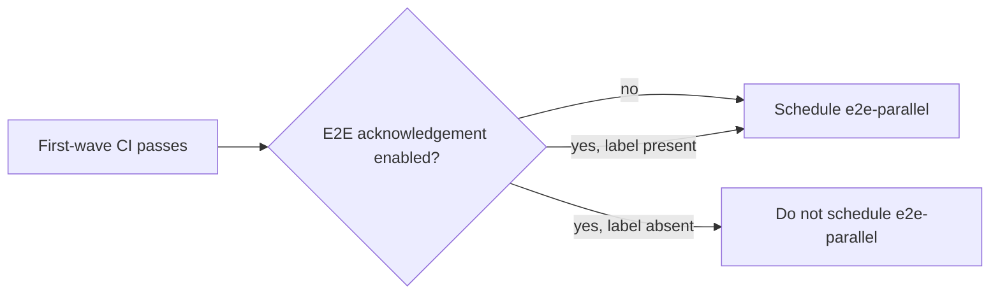

# Incident-Only E2E Acknowledgement

## Problem

A known CI or platform incident can make ARO HCP E2E results non-actionable.
Cheap PR validation must continue, while automatic E2E is restricted to approved
critical fixes.

## Decision

Use `aro-hcp/e2e-critical-fix` as a temporary requirement on the existing
`e2e-parallel` second-wave test.

There is no lock file, no new ProwJob, and no E2E workflow guard. Normal E2E is
automatic and label-free. During an incident, `e2e-parallel` alone requires the
acknowledgement label; other present and future second-wave jobs remain
unaffected.

The label authorizes scheduling only while this incident policy is enabled. The
incident owner removes it from every open PR carrying it during incident
cleanup, including PRs that never started E2E; a later incident requires a new
authorization.



## Configuration

The E2E source configuration carries the requirement only during an incident:

```yaml
- as: e2e-parallel
  always_run: false
  pipeline_required_labels:
  - aro-hcp/e2e-critical-fix
```

`openshift/ci-tools` propagates this field to the generated Prow annotation.
`pipeline-controller` reads the annotation before it posts the existing
`/test e2e-parallel` command. Adding the label after first-wave success
schedules the existing E2E job without a new commit.

## Incident procedure

### Prerequisites

- Pipeline-controller support for `pipeline_required_labels` is deployed.
- ci-operator Prowgen support for the field is deployed.
- The release targets are available.
- The Prow `/label aro-hcp/e2e-critical-fix` command is restricted to
  the configured incident authorities. GitHub users with label-edit permission
  can also add it directly; this procedure trusts repository writers.

### Enable

1. Open or link the incident ticket.
2. On a fresh `openshift/release` branch, run:

   ```text
   make enable-arohcp-e2e-critical-fixes-only
   ```

3. Review the diff: it must add the label requirement to `e2e-parallel` and
   update only its generated Prow job.
4. Merge the release PR. Do not leave it as a draft or under `/hold`: the
   configuration cannot take effect until it merges.
5. Confirm an unlabelled PR with a green first wave receives no E2E `/test`
   command. Apply the acknowledgement label to an approved critical-fix PR and
   confirm the existing E2E job is scheduled.

### Disable

1. Record incident resolution.
2. Run:

   ```text
   make disable-arohcp-e2e-critical-fixes-only
   ```

3. Review and merge the generated E2E-only change.
4. Remove `aro-hcp/e2e-critical-fix` from every open PR carrying it,
   including PRs that did not run E2E.
5. Use `/retest` for every PR that was waiting for E2E while the policy was
   enabled.

## Scope

This controls pipeline-controller's automatic scheduling of `e2e-parallel`.
It does not add a CI context, cancel a running job, or change direct, periodic,
postsubmit, or EV2 E2E triggers.

## Validation

- With no field, an unlabelled PR schedules E2E normally after the first wave.
- With the field, new automatic scheduling decisions for an unlabelled PR do not
  emit an E2E `/test` command.
- Adding the label after first-wave success schedules that same existing E2E.
- Reverting the field restores normal automatic E2E after `/retest` re-evaluates
  PRs that waited during the incident.
