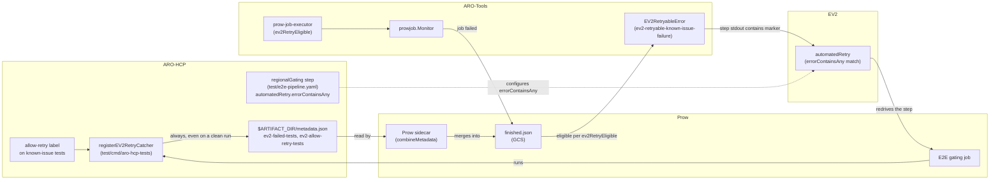
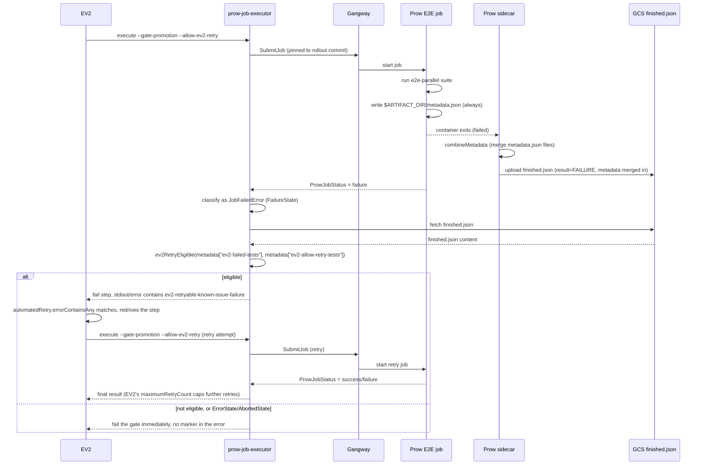

# EV2 Retry Catcher

This document describes the design behind automatically retrying an EV2 gating E2E run when it fails on a small, deliberately labeled set of known-issue tests.

> **Status (as of 2026-08-06):** the code referenced below (`labels.AllowRetry`, `registerEV2RetryCatcher`, `writeEV2RetryMetadata`, and the ARO-Tools `prowjob` changes) is not yet merged to `main`. It lives in the implementation PRs linked in [Where to look](#where-to-look). This doc describes the design those PRs implement.
>
> The retry mechanism itself changed after the first round of this design: rather than `prow-job-executor` resubmitting the job internally through Gangway, it now fails with a distinctly matchable error and lets EV2's own `automatedRetry` step property redrive the whole gating step. See [Consuming the signal](#3-consuming-the-signal-aro-tools) and [Retrying via EV2's automatedRetry](#4-retrying-via-ev2s-automatedretry-sdp-pipelines--aro-hcp) below.

## Problem

EV2 Stage and Prod rollouts gate promotion on an E2E run against the pinned rollout commit (see [CI EV2 Integration](ev2-integration.md)). When that gating run fails because of a single test with a known, already-tracked issue, someone still has to notice the failure, review the Prow output, and manually retrigger the run before the rollout can continue.

For Stage this means starting a brand new full rollout just to retry the E2E step. For Prod it means booting up a SAW device just to click retry. Both add real latency and churn to every rollout, for a class of failure that is already understood and already has a fix in flight.

## Goal

Automate exactly the manual step SREs already perform today: retry the gating E2E run once when it fails narrowly on tests known to have an open issue, and leave everything else (infra errors, timeouts, broad or unexpected failures) to fail the gate and page a human as usual.

This is scoped to EV2 Stage/Prod gating steps only. Periodic and pre-merge/PR-validation jobs are not affected.

## Non-goals

- Blind retry-until-green. Every failure is still triaged; this only removes the manual retrigger latency for a pre-agreed, narrow case.
- Retrying on infra or management-cluster failures. Those need a different, separate mechanism (see the discussion in AROSLSRE-1721).
- A permanent allowlist. Labeled tests are expected to carry a fix commitment and come off the label once fixed (see [Expiration configuration](#expiration-configuration) below).

## Design

The mechanism is split across two repositories, each responsible for one half of the signal:



### End-to-end flow

The full sequence for a single EV2 gating attempt, from rollout to (possible) retry:



Two properties fall out of this directly:

- **Only `FailureState` is inspected.** `ErrorState` (infra/tooling error) and `AbortedState` (cancellation/timeout) go straight to failing the gate; `finished.json` is never fetched for those, since they are not the class of failure this mechanism is meant to catch.
- **`prow-job-executor` never resubmits the job itself.** On an eligible failure it returns a wrapped `EV2RetryableError`, whose `Error()` string always contains the literal marker `ev2-retryable-known-issue-failure`. The step then fails as usual; the retry is entirely EV2's doing, driven by the `automatedRetry.errorContainsAny` list configured directly on the `regionalGating` step in `test/e2e-pipeline.yaml` (see [Retrying via EV2's automatedRetry](#4-retrying-via-ev2s-automatedretry-sdp-pipelines--aro-hcp) below). How many times EV2 retries, and how long it waits between attempts, is controlled entirely by that step's `maximumRetryCount`/`durationBetweenRetries`, not by anything in `prow-job-executor`.

### 1. E2E tagging (ARO-HCP)

The signal starts as an ordinary Ginkgo label, using the same mechanism ARO-HCP's E2E suite already uses for other test metadata (`test/util/labels/labels.go`):

```go
// AllowRetry marks a test as safe to auto-retry during an EV2 Stage/Prod
// gating run when it fails due to a known, actively tracked issue. This is
// a temporary measure with a TTL: every use must have an owner and a
// tracking issue, and the label must be removed once the underlying issue
// is fixed. See AROSLSRE-1721.
AllowRetry = ginkgo.Label("allow-retry")
```

A test opts in by adding `labels.AllowRetry` to its own label list on the `It(...)` call, alongside any other labels it already carries, e.g.:

```go
It("...", labels.RequireHappyPathInfra, labels.AllowRetry, func(ctx context.Context) {
    ...
})
```

At suite build time, `registerEV2RetryCatcher` (`test/cmd/aro-hcp-tests/main.go`) walks the full `ExtensionTestSpecs` once, before the suite runs, and precomputes the set of test names that carry the label:

```go
allowRetryNames := map[string]bool{}
for _, spec := range specs {
    if spec.Labels.Has(labels.AllowRetry[0]) {
        allowRetryNames[spec.Name] = true
    }
}
```

It then registers `AddAfterEach` / `AddAfterAll` hooks (from `openshift-tests-extension`'s lifecycle API) that, guarded by a mutex, track every failure as it happens and check whether it's in `allowRetryNames`. This correlate-by-name approach exists because `openshift-tests-extension`'s `ExtensionTestResult` does not carry a `Labels` field on the result itself - the label set has to be captured from the pre-run spec list up front.

At `AddAfterAll`, once the whole suite has finished, the accumulated failures and their allow-retry subset become the reported facts (see [Writing the retry facts](#2-writing-the-retry-facts-aro-hcp) below).

### 2. Writing the retry facts (ARO-HCP)

Once the suite finishes, the catcher always merges these keys into `$ARTIFACT_DIR/metadata.json` - even when nothing failed, in which case the two lists are empty:

```json
{
  "ev2-failed-tests": ["spec name 1", "spec name 2"],
  "ev2-allow-retry-tests": ["spec name 1"],
  "ev2-suite-summary": {
    "total": 42,
    "passed": 40,
    "failed": 2,
    "skipped": 0,
    "duration-seconds": 187.3
  }
}
```

`ev2-failed-tests` is every spec that failed; `ev2-allow-retry-tests` is the subset of those that carried `labels.AllowRetry`. aro-hcp-tests reports only these raw facts - it does not decide whether the run qualifies for an automatic retry. That decision is policy (how many failures are tolerable, etc.) that belongs to prow-job-executor (see [Consuming the signal](#3-consuming-the-signal-aro-tools) below), which can evolve independently of an ARO-HCP release.

`ev2-suite-summary` isn't read by the retry decision either. It exists so anyone triaging a gating run from `finished.json` alone (a human, or a future dashboard) can see the run's basic shape (how many specs ran, how many of each result, how long the suite took wall-clock) without opening the Prow job UI. It's a nested object rather than more flat `ev2-*` keys so its field names don't read as confusingly similar to `ev2-failed-tests` (a name list, not a count); `duration-seconds` is rounded to one decisecond since a suite-level duration doesn't need nanosecond precision.

Writing unconditionally, rather than only when a run happens to qualify, removes an ambiguity the original design had: with a conditional write, an absent key could mean either "nothing failed" or "failures happened but didn't qualify" - both looked identical from the consuming side, which caused confusion more than once while verifying this against real Prow runs. Now the keys' presence means the step ran at all; their content is the whole picture.

`$ARTIFACT_DIR/metadata.json` is Prow's own, standard mechanism for a test step to attach structured data to the job's result: any Prow-decorated container can write that file, and Prow's `sidecar` reads it (if present) and merges its top-level keys into `finished.json`'s `metadata` object once the job completes (see `sigs.k8s.io/prow/pkg/sidecar`'s `combineMetadata`). This was chosen over the two alternatives considered:

- **A custom `finished.json` "result" value** (e.g. `RETRIABLE_FAILURE`) isn't possible - `result` is hardcoded by Prow's sidecar to `SUCCESS`/`FAILURE`/`ABORTED` based on the container exit code, and isn't something test code or ci-operator config can influence.
- **Grepping a marker line out of `build-log.txt`** (the original design) works but is fragile: risk of truncation on multi-MB logs, needs a tail-range fetch and a chunked scan, and matches on unstructured text instead of a typed value. `metadata.json` avoids all of that.

The write is merge-safe: if some other step already wrote `$ARTIFACT_DIR/metadata.json` (nothing does today, but a future step might), the existing content is read first and only the `ev2-*` keys above are added or overwritten. `ARTIFACT_DIR` being unset (e.g. a local, non-Prow run) is not an error - the write is simply skipped.

### 3. Consuming the signal (ARO-Tools)

`prow-job-executor`'s `prowjob.Monitor` gets an `allowEV2Retry bool` field (set from the `--allow-ev2-retry` CLI flag). `ExecuteAndWait` submits the job through Gangway exactly once and polls `GetJobStatus` until a terminal state, same as before. The change is entirely in what happens after a `FailureState`:

1. it fetches `finished.json` from GCS (via `finishedJSONURLFromViewURL`, bounded by a byte cap and a fetch timeout) and reads its top-level `metadata` object's `ev2-failed-tests`/`ev2-allow-retry-tests` lists, via `jobAllowsEV2Retry` / `fetchFinishedJSONAllowsRetry`,
2. it evaluates `ev2RetryEligible(failed, allowRetry, maxAutoRetryFailures)`: the run qualifies only when it failed at all, no more than `maxAutoRetryFailures` tests failed, and every one of them appears in the allow-retry list (`maxAutoRetryFailures` is set from `--max-ev2-auto-retry-failures`, default `prowjob.DefaultMaxEV2AutoRetryFailures = 2`),
3. on a positive match, it returns `&EV2RetryableError{Cause: err}` instead of the original error. `EV2RetryableError.Error()` always contains the literal `EV2RetryableMarker` constant (`ev2-retryable-known-issue-failure`), so the step's stdout/failure output substring-matches EV2's `automatedRetry.errorContainsAny` (see [Retrying via EV2's automatedRetry](#4-retrying-via-ev2s-automatedretry-sdp-pipelines--aro-hcp) below). `EV2RetryableError` wraps the original cause via `Unwrap()`, so callers using `errors.Is`/`errors.As` on the underlying failure still work.
4. on a non-match (ineligible failure, or `ErrorState`/`AbortedState`), the original error is returned unchanged - no marker, so EV2's `automatedRetry` condition never matches and the gate fails immediately.

Keeping the eligibility check (`ev2RetryEligible`) here, rather than in ARO-HCP, means the failure-count threshold can be tuned via `--max-ev2-auto-retry-failures` without an ARO-HCP rebuild, and any future policy change (e.g. weighting by which tests failed) only touches this one function.

`prow-job-executor` itself never resubmits anything - the earlier design (an internal Gangway resubmit with a shallow-copied `Monitor` guarded by `allowEV2Retry=false`) was replaced with this fail-with-a-marker approach specifically so the number of retry attempts, the backoff between them, and the actual redrive mechanism are all owned by EV2's own step configuration, not duplicated in ARO-Tools.

`--allow-ev2-retry` and `--max-ev2-auto-retry-failures` are only wired into the `execute` subcommand's options (`RawExecuteOptions` / `completedExecuteOptions` in `options.go`); the separate read-only `monitor` subcommand always passes `false`/the default cap to `NewMonitor`, since it observes a job it didn't submit and has no meaningful way to trigger a retry for it.

### 4. Retrying via EV2's automatedRetry (sdp-pipelines / ARO-HCP)

The actual retry is driven entirely by EV2's native step-level `automatedRetry` property, set directly on the `regionalGating` `ProwJob` validation step in `test/e2e-pipeline.yaml`:

```yaml
automatedRetry:
  errorContainsAny:
  - "failed to establish a new connection"
  - "failed to get token"
  - "Failed to connect to MSI"
  - "ev2-retryable-known-issue-failure"
  - "ev2-retryable-infra-precondition-failure"
  maximumRetryCount: 1
  durationBetweenRetries: 1m
```

EV2 substring-scans the step's output for any of the `errorContainsAny` strings and, on a match, redrives the whole step up to `maximumRetryCount` times, waiting `durationBetweenRetries` in between. Setting `automatedRetry` explicitly on a step **replaces** sdp-pipelines' default retry policy for that step (which only covers the three MSI/connection-failure phrases above) rather than extending it - so the three default phrases have to be repeated here alongside the new markers, or the gate would lose its existing infra-retry behavior. `ev2-retryable-infra-precondition-failure` is the marker for the `InfraPreconditionEligible` case (AROSLSRE-1926): a gate failure where no step's `finished.json` ever carried the `ev2-failed-tests` metadata key at all, because a shared pre-step (e.g. `aro-hcp-lease-acquire` exhausting the e2e slot pool) failed before the `aro-hcp-tests` step got a chance to run and write it - distinct from `ev2-retryable-known-issue-failure`, which covers a per-test allow-retry decision once results were reported.

`sdp-pipelines`'s `tooling/pkg/types/pipeline/prow.go` passes `--allow-ev2-retry` to every generated `ProwJob` step's command unconditionally; this is safe because the flag is inert unless `gate-promotion` is also set on the step, which is only true for the Stage/Prod EV2 gating steps and never for periodic or pre-merge jobs.

**This now takes effect in stg and int too, not just prod (AROSLSRE-1764).** `stg` and `int` both set `useExclusiveLocks: true` in sdp-pipelines' `hcp/stages.yaml`, which makes the generator treat those stages as fail-fast. `orchestratedStepFor`/`buildOnFailure` (`tooling/pkg/ev2/manifests/generate/graph_step.go`) used to ignore any explicit `automatedRetry` whenever a stage is fail-fast, falling back to the default MSI-only policy instead - so a stage gating run needed a manual retry. The generator now merges a step's custom `errorContainsAny` patterns into the fail-fast retry instead of dropping them, while still keeping `MaxRetryAttempts`/`WaitDurationBetweenRetry` pinned and `FallbackToManualMitigation: false` (preserving the "don't hold the exclusive lock for a week" intent behind fail-fast).

> ⚠️ Do not reproduce the literal strings `ev2-retryable-known-issue-failure` or `ev2-retryable-infra-precondition-failure` anywhere else that could end up in a gating step's stdout (comments in `common.sh`, other steps' `automatedRetry` lists, etc.). EV2's substring scan is applied to the whole step output, and a stray match would cause a genuinely failed, non-eligible run to be spuriously retried - exactly the class of bug described in AROSLSRE-1292.

## Expiration configuration

There is currently no automated enforcement of the TTL described below - it is a documented convention, not a CI-enforced check. This section describes what exists today and what a stronger mechanism could look like.

**Current state (convention only):** the `AllowRetry` label's doc comment in `test/util/labels/labels.go` requires that every use have an owner and a tracking issue, and that the label be removed once the issue is fixed. There is no code path today that reads an expiry date, and nothing fails CI if a labeled test lingers.

**Options for a stronger mechanism** (not yet implemented, tracked as a follow-up):

- **Per-test expiry annotation.** Extend the label usage convention to require a comment with a tracking issue and a target removal date directly above each `labels.AllowRetry` usage, e.g. `// allow-retry until 2026-09-30, see AROSLSRE-XXXX`, and add a lint/CI check (a small Go analyzer or a grep-based presubmit check) that fails the build once that date has passed.
- **Central manifest.** Instead of inline comments, maintain a small YAML/JSON file (e.g. `test/util/labels/allow-retry.yaml`) mapping test name -> tracking issue -> expiry date, loaded by `registerEV2RetryCatcher` to validate expiry at suite-build time and fail fast (or at least log loudly) if a label has expired.
- **Periodic audit.** A scheduled job (or a recurring SRE Jira card) that lists all `allow-retry`-labeled tests and their age, independent of any code enforcement, as a lighter-weight starting point before investing in the above.

Any of these can be layered on without changing the metadata-write or retry-consumption contract described above, since they only affect whether a test is allowed to carry the label in the first place, not how the signal is consumed once present.

## Naming

The label and signal names went through some discussion (`flaky`, `retry-during-rollout`, `retryable-during-rollout`, `known-issue`, `ev2-retriable`) before settling on `allow-retry` for the label and `ev2-failed-tests`/`ev2-allow-retry-tests` for the reported facts, specifically to avoid implying anything about flakiness or root cause. The intent is purely operational: make it easy for SREs to decide when an automatic retry is reasonable, without conflating it with terms already used for other purposes (e.g. actual flaky-test quarantine).

## Where to look

- `test/util/labels/labels.go` - `AllowRetry` label definition
- `test/cmd/aro-hcp-tests/main.go` - `registerEV2RetryCatcher`, `writeEV2RetryMetadata`
- `test/e2e/README.md` - test-author-facing documentation of the label
- `test/e2e-pipeline.yaml` - `regionalGating` step's `automatedRetry` configuration
- ARO-Tools `tools/prow-job-executor/prowjob/monitor.go` - `EV2RetryableError`, `EV2RetryableMarker`, `Monitor.allowEV2Retry`, `Monitor.maxAutoRetryFailures`, `ExecuteAndWait`
- ARO-Tools `tools/prow-job-executor/prowjob/retrymarker.go` - `finishedJSONURLFromViewURL`, `jobAllowsEV2Retry`, `fetchFinishedJSONAllowsRetry`, `ev2RetryEligible`
- ARO-Tools `tools/prow-job-executor/options.go` - `--allow-ev2-retry`/`--max-ev2-auto-retry-failures` flags, `AllowEV2Retry`/`MaxEV2AutoRetryFailures` option wiring
- sdp-pipelines `tooling/pkg/types/pipeline/prow.go` - `--allow-ev2-retry` wired into the generated `ProwJob` step command
- sdp-pipelines `tooling/pkg/ev2/manifests/generate/graph_step.go` - `orchestratedStepFor`/`buildOnFailure`, how `automatedRetry` becomes EV2's `onFailure.retry`
- [Azure/ARO-HCP#6409](https://github.com/Azure/ARO-HCP/pull/6409) - label + metadata.json signal implementation
- [Azure/ARO-HCP#6464](https://github.com/Azure/ARO-HCP/pull/6464) - `regionalGating` `automatedRetry` step configuration
- [Azure/ARO-Tools#282](https://github.com/Azure/ARO-Tools/pull/282) - retry-catcher implementation (fail-with-marker design)

## Follow-ups

- Pick and implement one of the [expiration configuration](#expiration-configuration) options above so the TTL/timebomb intent is enforced rather than just documented.

## See also

- [CI EV2 Integration](ev2-integration.md)
- [CI Execution](execution.md)
- [E2E Testing In CI](e2e-testing.md)

