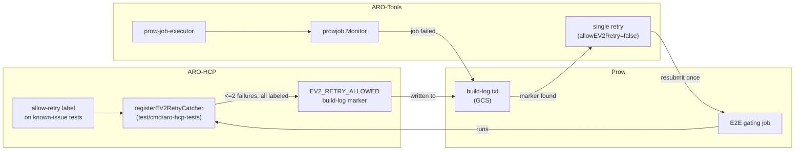
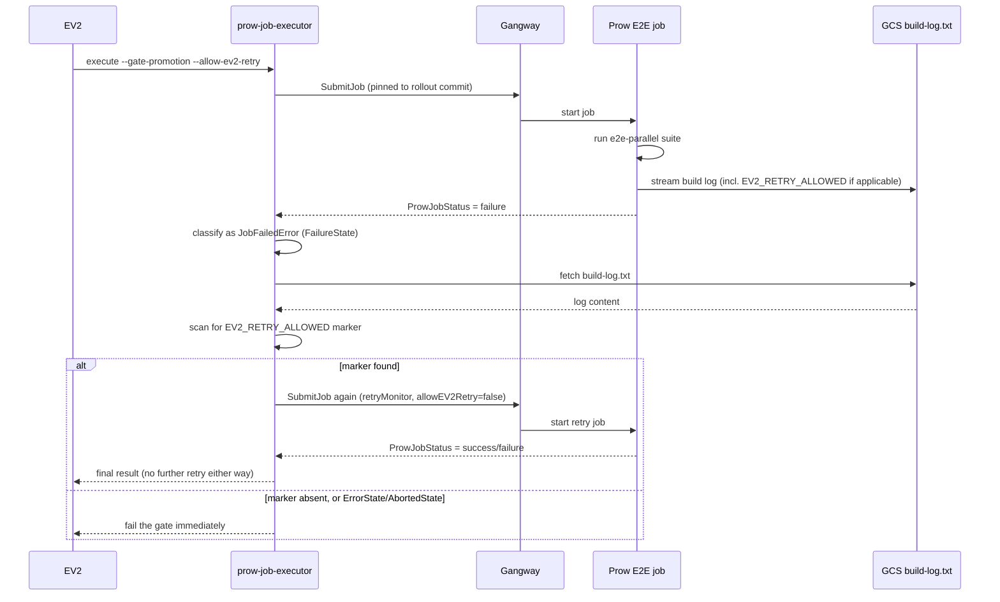

# EV2 Retry Catcher

This document describes the design behind automatically retrying an EV2 gating E2E run when it fails on a small, deliberately labeled set of known-issue tests.

## Problem

EV2 Stage and Prod rollouts gate promotion on an E2E run against the pinned rollout commit (see [CI EV2 Integration](ev2-integration.md)). When that gating run fails because of a single test with a known, already-tracked issue, someone still has to notice the failure, review the Prow output, and manually retrigger the run before the rollout can continue.

For Stage this means starting a brand new full rollout just to retry the E2E step. For Prod it means booting up a SAW device just to click retry. Both add real latency and churn to every rollout, for a class of failure that is already understood and already has a fix in flight.

## Goal

Automate exactly the manual step SREs already perform today: retry the gating E2E run once when it fails narrowly on tests known to have an open issue, and leave everything else (infra errors, timeouts, broad or unexpected failures) to fail the gate and page a human as usual.

This is scoped to EV2 Stage/Prod gating steps only. Periodic and pre-merge/PR-validation jobs are not affected.

## Non-goals

- Blind retry-until-green. Every failure is still triaged; this only removes the manual retrigger latency for a pre-agreed, narrow case.
- Retrying on infra or management-cluster failures. Those need a different, separate mechanism (see the discussion in AROSLSRE-1721).
- A permanent allowlist. Labeled tests are expected to carry a fix commitment and come off the label once fixed (see [TTL / "timebomb" intent](#ttl--timebomb-intent) below).

## Design

The mechanism is split across two repositories, each responsible for one half of the signal:



### End-to-end flow

The full sequence for a single EV2 gating attempt, from rollout to (possible) retry:



Two properties fall out of this directly:

- **Only `FailureState` is inspected.** `ErrorState` (infra/tooling error) and `AbortedState` (cancellation/timeout) go straight to failing the gate; the build log is never fetched for those, since they are not the class of failure this mechanism is meant to catch.
- **The retry is unconditional once triggered.** Whatever the retried run's outcome is (pass or fail), the executor does not evaluate the marker again and does not resubmit again - the shallow-copied `Monitor` used for the retry has `allowEV2Retry` hardcoded to `false`, so there is no code path back into the retry branch.

### 1. E2E tagging (ARO-HCP)

The signal starts as an ordinary Ginkgo label, using the same mechanism ARO-HCP's E2E suite already uses for other test metadata (`test/util/labels/labels.go`):

```go
// AllowRetry marks a test as safe to auto-retry during an EV2 Stage/Prod
// gating run when it fails due to a known, actively tracked issue. This is
// a temporary measure with a TTL: every use must have an owner and a
// tracking issue, and the label must be removed once the underlying issue
// is fixed. See AROSLSRE-1721.
AllowRetry = ginkgo.Label("allow-retry")
```

A test opts in by adding `labels.AllowRetry` to its own label list on the `It(...)` call, alongside any other labels it already carries, e.g.:

```go
It("...", labels.RequireHappyPathInfra, labels.AllowRetry, func(ctx context.Context) {
    ...
})
```

At suite build time, `registerEV2RetryCatcher` (`test/cmd/aro-hcp-tests/main.go`) walks the full `ExtensionTestSpecs` once, before the suite runs, and precomputes the set of test names that carry the label:

```go
allowRetryNames := map[string]bool{}
for _, spec := range specs {
    if spec.Labels.Has(labels.AllowRetry[0]) {
        allowRetryNames[spec.Name] = true
    }
}
```

It then registers `AddAfterEach` / `AddAfterAll` hooks (from `openshift-tests-extension`'s lifecycle API) that, guarded by a mutex, track every failure as it happens and check whether it's in `allowRetryNames`. This correlate-by-name approach exists because `openshift-tests-extension`'s `ExtensionTestResult` does not carry a `Labels` field on the result itself - the label set has to be captured from the pre-run spec list up front.

At `AddAfterAll`, once the whole suite has finished, the accumulated counts decide whether to emit the marker (see [Emitting the retry marker](#2-emitting-the-retry-marker-aro-hcp) below).

### 2. Emitting the retry marker (ARO-HCP)

If, once the suite finishes:

- at least one test failed, and
- the total number of failed tests is at most `maxAutoRetryFailures` (currently `2`, a `const` in `test/cmd/aro-hcp-tests/main.go`), and
- every failed test is in `allowRetryNames` (i.e. `nonRetriableFailures == 0`)

then the catcher writes a single, easy-to-grep line to stderr:

```text
EV2_RETRY_ALLOWED: N known-issue test(s) failed (max 2 allowed), all labeled "allow-retry": [test names...]
```

Any failure outside that narrow condition - more than 2 failures, or any failure without the label mixed in - means no marker is written at all, so the gate fails exactly as it does today with no behavior change. Stderr (not stdout) is used because that's where ci-operator/Prow persist step logs into `build-log.txt`, which is what the consumer side reads back.

### 3. Consuming the marker (ARO-Tools)

`prow-job-executor`'s `prowjob.Monitor` gets a `allowEV2Retry bool` field (set from the new `--allow-ev2-retry` CLI flag) and a dedicated `JobFailedError` type that carries the `ProwExecutionID` and `Status.URL` of a job that ended in `FailureState`. This type only exists so `ExecuteAndWait` can distinguish "the job ran and a test failed" from any other error via `errors.As`.

`ExecuteAndWait` is split into a public wrapper and a private `executeAndWaitOnce`:

- `executeAndWaitOnce` is the original submit-and-poll logic, unchanged: submit through Gangway, poll `GetJobStatus` until a terminal state, return `nil`/error accordingly.
- `ExecuteAndWait` calls `executeAndWaitOnce` once. If it returns a `JobFailedError` and `allowEV2Retry` is set, it:
  1. converts the job's Prow "view" status URL (`https://<prow-host>/view/gs/<bucket>/<path>`) into its plain-text GCS log URL (`https://storage.googleapis.com/<bucket>/<path>/build-log.txt`), via `buildLogURLFromViewURL`,
  2. fetches that log (bounded by a byte cap and a fetch timeout) and scans it for the `EV2_RETRY_ALLOWED` marker, via `buildLogContainsEV2RetryMarker` / `fetchLogContainsEV2RetryMarker`,
  3. on a marker match, builds a shallow copy of the `Monitor` (`retryMonitor := *m; retryMonitor.allowEV2Retry = false`) and calls `executeAndWaitOnce` again on that copy.

The shallow copy is what makes "exactly one retry" a structural guarantee rather than a counter that could be bypassed: the copy's `allowEV2Retry` is always `false`, so even if the retried run also fails with a marker present, there is no code path that resubmits a third time. The `client *Client` field is a pointer, so the copy safely shares the same HTTP client/backoff state as the original.

`--allow-ev2-retry` is only wired into the `execute` subcommand's options (`RawExecuteOptions` / `completedExecuteOptions` in `options.go`); the separate read-only `monitor` subcommand always passes `false` to `NewMonitor`, since it observes a job it didn't submit and has no meaningful way to resubmit it.

## Expiration configuration

There is currently no automated enforcement of the TTL described below - it is a documented convention, not a CI-enforced check. This section describes what exists today and what a stronger mechanism could look like.

**Current state (convention only):** the `AllowRetry` label's doc comment in `test/util/labels/labels.go` requires that every use have an owner and a tracking issue, and that the label be removed once the issue is fixed. There is no code path today that reads an expiry date, and nothing fails CI if a labeled test lingers.

**Options for a stronger mechanism** (not yet implemented, tracked as a follow-up):

- **Per-test expiry annotation.** Extend the label usage convention to require a comment with a tracking issue and a target removal date directly above each `labels.AllowRetry` usage, e.g. `// allow-retry until 2026-09-30, see AROSLSRE-XXXX`, and add a lint/CI check (a small Go analyzer or a grep-based presubmit check) that fails the build once that date has passed.
- **Central manifest.** Instead of inline comments, maintain a small YAML/JSON file (e.g. `test/util/labels/allow-retry.yaml`) mapping test name -> tracking issue -> expiry date, loaded by `registerEV2RetryCatcher` to validate expiry at suite-build time and fail fast (or at least log loudly) if a label has expired.
- **Periodic audit.** A scheduled job (or a recurring SRE Jira card) that lists all `allow-retry`-labeled tests and their age, independent of any code enforcement, as a lighter-weight starting point before investing in the above.

Any of these can be layered on without changing the marker-emission or retry-consumption contract described above, since they only affect whether a test is allowed to carry the label in the first place, not how the label is consumed once present.

## Naming

The label and marker names went through some discussion (`flaky`, `retry-during-rollout`, `retryable-during-rollout`, `known-issue`, `ev2-retriable`) before settling on `allow-retry` / `EV2_RETRY_ALLOWED`, specifically to avoid implying anything about flakiness or root cause. The intent is purely operational: make it easy for SREs to decide when an automatic retry is reasonable, without conflating it with terms already used for other purposes (e.g. actual flaky-test quarantine).

## Where to look

- `test/util/labels/labels.go` - `AllowRetry` label definition
- `test/cmd/aro-hcp-tests/main.go` - `registerEV2RetryCatcher`, `maxAutoRetryFailures`, marker emission
- `test/e2e/README.md` - test-author-facing documentation of the label
- ARO-Tools `tools/prow-job-executor/prowjob/monitor.go` - `JobFailedError`, `Monitor.allowEV2Retry`, single-retry `ExecuteAndWait`/`executeAndWaitOnce`
- ARO-Tools `tools/prow-job-executor/prowjob/retrymarker.go` - `buildLogURLFromViewURL`, `buildLogContainsEV2RetryMarker`, `fetchLogContainsEV2RetryMarker`
- ARO-Tools `tools/prow-job-executor/options.go` - `--allow-ev2-retry` flag, `AllowEV2Retry` option wiring
- [Azure/ARO-HCP#6409](https://github.com/Azure/ARO-HCP/pull/6409) - label + marker emission implementation
- [Azure/ARO-Tools#282](https://github.com/Azure/ARO-Tools/pull/282) - retry-catcher implementation

## Follow-ups

- Wire `--allow-ev2-retry=true` into the actual EV2 pipeline step definitions (`sdp-pipelines` / `openshift/release` step registry) for the environments that should use it.
- Pick and implement one of the [expiration configuration](#expiration-configuration) options above so the TTL/timebomb intent is enforced rather than just documented.

## See also

- [CI EV2 Integration](ev2-integration.md)
- [CI Execution](execution.md)
- [E2E Testing In CI](e2e-testing.md)

