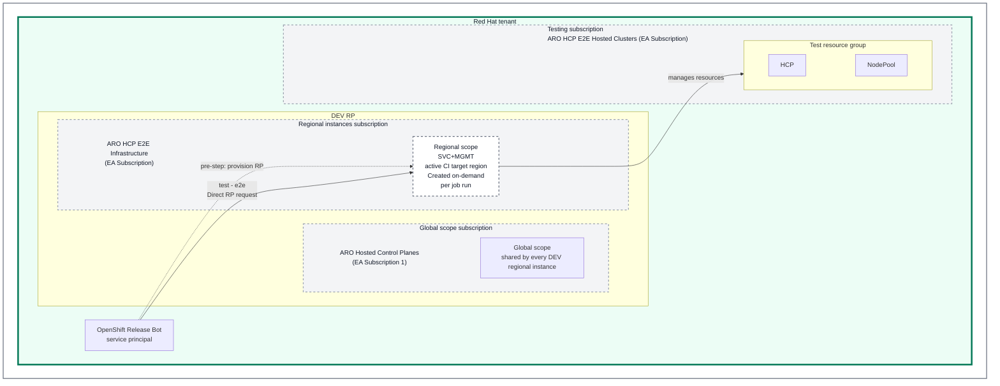
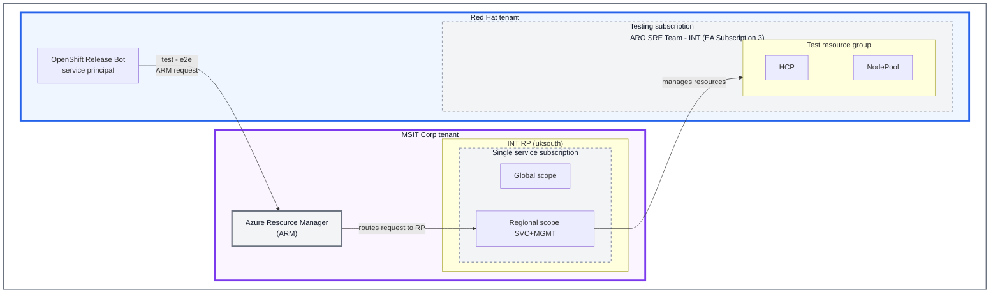
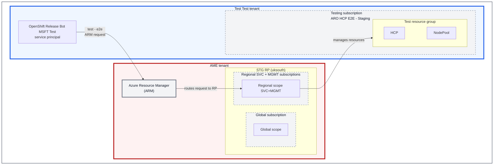
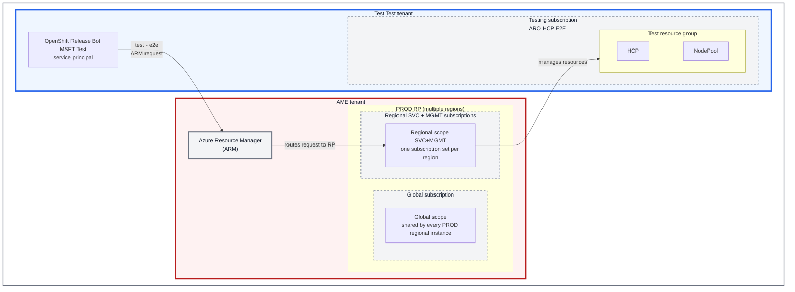

# CI Execution

ARO HCP uses OpenShift's Prow-based CI infrastructure for pull-request validation, rollout gating, and background hygiene. The Prow jobs themselves are defined in `openshift/release`, while this repository holds the product code, test code, EV2 wiring, and most of the behavior those jobs ultimately execute.

This document explains the execution model: what each CI mode validates, how Azure request paths differ across environments, how leases and shared identities are consumed during a run, and why some CI modes can validate undeployed changes while others cannot.

## What CI Validates

CI does not answer a single question. Different job families validate different parts of the system:

- **Build and simulation jobs** answer "does this repository still build, render, and pass fast checks?"
- **DEV PR E2E** answers "does this unmerged change work when CI provisions an on-demand DEV service footprint and exercises it end to end?"
- **Higher-environment PR E2E** answers "does this test code behave correctly against the already-deployed shared environment?"
- **EV2 gating** answers "does the exact commit being rolled out pass E2E checks before promotion continues?"
- **Periodic jobs** answer "are shared environments still healthy, and is background cleanup keeping pace with resource churn?"

The most common misunderstanding is to assume every E2E job validates the same thing. That is not true:

- `e2e-parallel` in DEV can validate undeployed RP or infrastructure changes because the RP footprint is created on demand for the job.
- `integration-e2e-parallel`, `stage-e2e-parallel`, and `prod-e2e-parallel` run against persistent environments that already exist in Azure, so before merge they mainly validate changes in test code and test expectations.
- EV2-triggered jobs validate a specific rollout commit, not whatever happens to be at `HEAD` when the job starts.

## Execution Modes

### PR Validation In DEV

DEV PR validation combines fast repository checks with an end-to-end path that can exercise unmerged service and infrastructure changes:

- required build and simulation jobs such as `images` and `frontend-simulation`
- the always-run and required `e2e-parallel` job
- DEV-specific environment provisioning through the `aro-hcp-local-e2e` workflow in `openshift/release`

This is the only PR mode that provisions the RP footprint on demand as part of the job run. That makes DEV PR CI the place to validate unmerged RP changes and shared deployment artifacts such as pipeline definitions, Helm charts, Bicep templates, and alerting. It is still not a perfect proxy for higher-environment rollouts, because create-from-scratch CI behavior and in-place updates exercise different paths.

In image terms, this is also the only PR path that normally builds both the runner images and the service images that get injected into the freshly provisioned DEV environment. The on-demand footprint is therefore running the exact service image revision produced by that job.

The on-demand DEV environments depend on pre-existing **global shared infrastructure** that is not provisioned by the E2E job itself. Shared resources such as ACRs, parent DNS zones, Key Vault, Grafana, and Kusto are maintained by the `global-pipeline-postsubmit` Prow job, which runs automatically after merge when changes touch `config/config.yaml`, `observability/dashboards.yaml`, or anything under `dev-infrastructure/`. If the global postsubmit fails or drifts, on-demand DEV environments will fail at provision time. The global scope lives in a shared subscription, while regional, SVC, and MGMT infrastructure is deployed into CI infrastructure subscriptions.

### PR Validation In INT, STG, And PROD

The higher-environment presubmit jobs are triggered manually when needed:

- `integration-e2e-parallel`
- `stage-e2e-parallel`
- `prod-e2e-parallel`

These jobs target persistent environments that already exist in Azure:

- **INT** runs tests from the Red Hat tenant against the service footprint in the MSIT Corp tenant
- **STG** and **PROD** run tests from the Test Test Azure Red Hat OpenShift tenant against service footprints in the AME tenant

Because those environments are already deployed before the PR merges, these jobs are most useful for validating E2E test changes and for checking behavior against a known shared environment. They are not the right signal for undeployed RP or infrastructure changes.

These runs are also lighter from an image perspective. They usually need the test runner image, not the full service image set, because they target services that are already deployed in Azure.

### EV2 Gating Jobs

EV2 gating uses postsubmit-style Prow jobs that are triggered programmatically through Gangway. These jobs exist to trigger rollout validation against the exact commit being promoted through Microsoft environments.

The important properties are:

- the job name is selected from `config/config.msft.clouds-overlay.yaml`
- `test/e2e-pipeline.yaml` passes that job name into the EV2 pipeline as `PROW_JOB_NAME`
- the `prow-job-executor` extracts the ARO-HCP commit SHA from `EV2_ROLLOUT_VERSION` and triggers the job with `--base-sha`
- promotion can be gated when `gatePromotion: true` is configured for that environment

In other words, EV2 gating is not "just another periodic." It is rollout validation with commit pinning.

### Periodic Jobs

Periodic jobs run against `HEAD` on a schedule. They are not rollout-gating and they are not exact replacements for PR jobs. Their role is ongoing health and hygiene:

- scheduled E2E checks in persistent environments
- cleanup of expired or orphaned resources
- image-updater tooling validation

If a periodic fails, that usually points to shared-environment drift, backlog in cleanup, or a regression that was not tied to a specific active rollout.

## CI Azure Flow

E2E jobs in CI can be summarized as follows: the job authenticates as a test identity, that shared identity creates one test resource group per test in a testing subscription, and each request is then sent to the environment's RP entrypoint. In higher environments that request flows through ARM; in DEV it is a direct RP call. The RP then creates the ARO HCP cluster resource back into that test's resource group.

The charts below focus on that transaction path and the tenant and subscription boundaries it crosses:

- **DEV** is a same-tenant, cross-subscription flow inside the Red Hat tenant.
- **INT** runs tests from the Red Hat tenant against an RP footprint in the MSIT Corp tenant.
- **STG / PROD** run tests from the Test Test Azure Red Hat OpenShift tenant against RP footprints in the AME tenant.
- **Global scope** is shared by every regional RP instance in that environment.
- **Regional scope** is the environment's regional service footprint; depending on the environment, `SVC` and `MGMT` can share a subscription or span multiple subscriptions.

Each diagram below shows one representative per-test resource group. A full job run creates one such resource group for each test or spec that executes.

### DEV

### INT

### STG

### PROD

## How An E2E Run Works

### Authentication And Test Identity

Each E2E mode starts from a CI identity:

- **DEV and INT** use the `OpenShift Release Bot` service principal on the test side.
- **STG and PROD** use the `OpenShift Release Bot MSFT Test` service principal in the Test Test Azure Red Hat OpenShift tenant.

That identity is the caller that initiates the test-side Azure request. Across the job run, it creates one test resource group per test or spec.

### Environment Selection And Step Wiring

The job selection and environment wiring live in `openshift/release`:

- ci-operator configuration selects the job family and step-registry workflow
- step-registry workflows decide whether the run provisions a fresh DEV RP or targets a persistent environment
- the `aro-hcp-tests` binary is carried inside the `aro-hcp-e2e-tests` image used by the test steps
- local DEV E2E also builds the service images that `aro-hcp-provision-environment` injects into the temporary environment
- persistent-environment E2E usually only needs the runner image because the service footprint already exists

This is why the same test binary can participate in multiple CI modes while still exercising very different Azure topologies.

See [CI Image Lifecycle](image-lifecycle.md) for the full image graph, including shared CI images, job-local builds, and the boundary between CI promotion and ACR mirroring.

### Request Path And Created Resources

For every environment, each test or spec that creates Azure resources gets its own **test resource group** in a testing subscription. The request path then diverges:

- in **DEV**, CI provisions the regional service footprint first and then calls the RP directly inside the Red Hat tenant
- in **INT**, **STG**, and **PROD**, the request flows through ARM into the environment's RP footprint in another tenant

For tests that create HCP clusters, the RP creates the cluster resource back into that test's resource group. Not every test reaches this point; negative and validation tests may only exercise API behavior without creating a cluster.

### Cleanup Handoff

Once a test has created resources, cleanup responsibility moves into one of three deliberately different paths:

- strict per-test cleanup in the E2E framework
- targeted environment teardown for explicit DEV cleanup
- background hygiene from periodic jobs

See [CI Cleanup](cleanup.md) for the cleanup model and why these modes intentionally do not behave the same way.

## Identity And Lease Mechanisms

### Managed Identity Container Pool

The E2E suites use a managed identity pool backed by Boskos leases so that CI does not need to recreate the full set of Azure managed identities for every spec.

The core behavior is:

- `POOLED_IDENTITIES=true` enables pooled mode, which is the default in CI
- `POOLED_IDENTITIES=false` uses direct per-cluster identity creation and is mainly for local or ad-hoc runs
- `LEASED_MSI_CONTAINERS` carries a space-separated list of leased identity-container resource groups for the job
- the test framework stores those leases in a shared YAML state file and moves each container through `free -> assigned -> busy -> free`
- parallel Ginkgo workers coordinate through that shared file and a lock file, so identity usage stays consistent across processes

Operationally, the important point is that pooled identities are a CI scaling primitive. They are not just an implementation detail inside the test binary.

See [CI Identity Leasing](identity-leasing.md) for the full lease lifecycle, state-file coordination model, pool-sizing assumptions, and failure modes.

### Prow, Ci-Operator, And Boskos

The Boskos resource types that back those identity containers are defined in `openshift/release` by `core-services/prow/02_config/generate-boskos.py`.

Today ARO HCP uses two acquire paths for those containers:

- DEV `e2e-parallel` uses the `aro-hcp-local-e2e` workflow, whose `aro-hcp-lease-acquire` step calls `slot-manager acquire`
- higher-environment presubmit, EV2-gating, and periodic jobs still use ci-operator `leases:` directly

Operationally, the important distinction is:

- the slot-manager path resolves a slot from the catalog, exports `SELECTED_LOCATION`, `CUSTOMER_SUBSCRIPTION`, and `LEASED_MSI_CONTAINERS`, and then hands the same leased identity-container set to the test framework
- the legacy path still requests environment-specific identity-container resource types in job config and populates `LEASED_MSI_CONTAINERS` directly

This document intentionally does not freeze the currently active runtime region in prose. If you need the live region or override for a job, inspect the current `openshift/release` ci-operator config.

### MSI Mock Service Principal Pool

DEV local E2E also spreads ARM traffic by leasing one MSI mock service principal from a Boskos-backed pool:

- each job gets a single value in `LEASED_MSI_MOCK_SP`
- the provisioning step uses that lease to look up the mock SP's client ID, principal ID, and cert name from `dev-infrastructure/openshift-ci/msi-mock-pool.yaml`
- personal development environments continue to use the shared non-pooled mock SP values

This pool exists so concurrent DEV jobs do not all share ARM throttle budget through the same actor. It remains a separate Boskos lease by design and is not part of the slot-manager rollout.

See [CI Identity Leasing](identity-leasing.md#msi-mock-service-principal-pool) for the pool setup, Boskos counts, and provisioning-time lookup path.

## EV2 Commit Pinning

The connection between EV2 and Prow is established through configuration in this repository:

- `config/config.msft.clouds-overlay.yaml` selects the environment-specific `prowJobName`
- `test/e2e-pipeline.yaml` passes that value to the EV2 pipeline as `PROW_JOB_NAME`
- `prow-job-executor` extracts the commit SHA from `EV2_ROLLOUT_VERSION` and triggers the job with `--base-sha`

That commit pinning is the key distinction between EV2 gating and periodic E2E. A periodic job always tests `HEAD`; an EV2-triggered job tests the exact revision being rolled out.

See [CI EV2 Integration](ev2-integration.md) for the full EV2-to-Prow wiring, Gangway auth path, `__e2e` job variant, rollout metadata, and promotion-gating model.

For how to identify a specific EV2-triggered run after it has started, see [CI EV2 Integration](ev2-integration.md#identifying-rollouts-from-prow-metadata).

## See Also

- [CI Overview](README.md)
- [CI Image Lifecycle](image-lifecycle.md)
- [CI Identity Leasing](identity-leasing.md)
- [CI EV2 Integration](ev2-integration.md)
- [CI Cleanup](cleanup.md)
- [E2E Testing In CI](e2e-testing.md)
- [CI Operations](operations.md)
- [Test E2E README](../../test/e2e/README.md)
