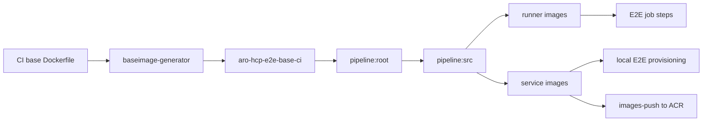

# CI Image Lifecycle

ARO HCP CI uses several different image lifecycles at once, and most confusion comes from mixing them together.

The important distinction is that an E2E job does not usually just run a single prebuilt container. Depending on the job family, ci-operator may:

- import a shared CI image that was built by an earlier postsubmit
- build job-local runner and service images for the exact source revision under test
- provision a temporary environment with those just-built service images
- promote selected CI images for reuse inside OpenShift CI
- mirror selected service images into the ARO service ACR for deployment outside CI

This page explains that full lifecycle. For the higher-level execution model, start with [CI Execution](execution.md). For registry topology and post-CI image distribution, see [ACRs and Images](../acrs-and-images.md).

## Lifecycle Overview



Read the chart left to right:

- the shared CI build-root image is built and published separately
- each ci-operator run imports that shared base into its temporary namespace
- the run builds a job-local source image for the exact revision under test
- downstream job-local images fan out from that source image
- runner images execute CI steps, while service images are either deployed into DEV local E2E or mirrored to ACR after merge

## CI Image Model

The cleanest mental model is to think in **three layers**:

1. **Persistent shared CI images**
   Built by dedicated CI jobs and reused by later jobs.
2. **Job-local pipeline images**
   Built inside a specific ci-operator run in that run's temporary namespace.
3. **Runtime distribution of selected service images**
   After merge, selected service images are mirrored out of CI into Azure Container Registry for actual environment deployment.

The layers describe **lifecycle stage**, not only image names. A few image names appear in more than one stage:

- `aro-hcp-e2e-tests` is built job-locally during many runs, but selected postsubmit runs also promote it for reuse inside CI.
- service images such as `aro-hcp-backend` and `aro-hcp-frontend` exist first as job-local CI outputs and later, after `images-push-postsubmit`, as ACR content used by deployments.

There are also a few specialized job-local images that do not fit the simple runner-vs-service split perfectly, such as:

- `nested-podman-src`
- `aro-hcp-api-tools`
- `aro-hcp-automation-image-update`

Those still belong to the job-local CI graph. They are not shared CI base images and they are not runtime service images.

## Shared CI Images

### Shared CI Build Root

Most ARO HCP jobs do not rebuild their toolchain or root image every time. Instead, the main ci-operator config imports an already-published build root:

```yaml
build_root:
  image_stream_tag:
    name: aro-hcp-ci-images
    namespace: aro-hcp
    tag: aro-hcp-e2e-base-ci
```

That shared base image is built by the dedicated `baseimage-generator` variant:

```yaml
build_root:
  from_repository: true
images:
  items:
  - dockerfile_path: dev-infrastructure/openshift-ci/Dockerfile
    from: src
    to: aro-hcp-e2e-base-ci
promotion:
  to:
  - name: aro-hcp-ci-images
    namespace: aro-hcp
```

The lifecycle is:

1. `dev-infrastructure/openshift-ci/Dockerfile` defines the contents of the CI base image.
2. `baseimage-generator` jobs validate and rebuild that image when the relevant inputs change.
3. successful postsubmit runs promote `aro-hcp-e2e-base-ci` into the `aro-hcp/aro-hcp-ci-images` ImageStream.
4. later jobs import that shared image into their temporary namespace as `pipeline:root`.

That is why ci-operator logs include lines like:

```text
Tagging aro-hcp/aro-hcp-ci-images:aro-hcp-e2e-base-ci into pipeline:root
```

That line means "import the shared CI build root into this specific job namespace."

### Shared CI Test Runner Image

`aro-hcp-e2e-tests` has a separate but related lifecycle.

The image itself layers on top of the shared base image:

```dockerfile
FROM registry.ci.openshift.org/aro-hcp/aro-hcp-ci-images:aro-hcp-e2e-base-ci
WORKDIR /opt/app-root/src/github.com/Azure/ARO-HCP
COPY . .
RUN make build-hcpctl && \
    make -C tooling/templatize templatize && \
    make -C test/ build
```

In `Azure-ARO-HCP-main.yaml`, ci-operator can build `aro-hcp-e2e-tests` from the exact source revision under test, and the promotion stanza selects it as the main reusable CI output:

```yaml
promotion:
  to:
  - additional_images:
      aro-hcp-e2e-tests: aro-hcp-e2e-tests
    excluded_images:
    - '*'
    namespace: aro-hcp
    tag: latest
    tag_by_commit: true
```

That means:

- PR jobs often build a job-local `pipeline:aro-hcp-e2e-tests`
- merged postsubmit runs can promote that image for reuse inside OpenShift CI
- periodic variants can then import `aro-hcp-e2e-tests:latest` as a shared CI input instead of rebuilding it

After promotion, the image is available from the build farm registry:

```text
quay-proxy.ci.openshift.org/aro-hcp/aro-hcp-e2e-tests:latest
```

To pull this image locally, read [Summary of available registries](https://docs.ci.openshift.org/how-tos/use-registries-in-build-farm/#summary-of-available-registries) and follow [How do I gain access to QCI?](https://docs.ci.openshift.org/how-tos/use-registries-in-build-farm/#how-do-i-gain-access-to-qci) in the OpenShift CI docs for RBAC on **app.ci** and logging in to `quay-proxy.ci.openshift.org`.

For example, the periodic E2E variant does exactly that:

```yaml
base_images:
  aro-hcp-e2e-tests:
    name: aro-hcp-e2e-tests
    namespace: aro-hcp
    tag: latest
```

## What Ci-Operator Builds Inside A Job

Once the shared build root is available, ci-operator creates the job-local source image:

- `pipeline:src`

This image contains the exact source revision under test. In PR jobs that is usually a synthetic merge of the base branch plus the PR changes.

The rough sequence is:

1. resolve the repository state to test
2. import the shared build root into the job namespace as `pipeline:root`
3. create `pipeline:src` from the checked-out source
4. build images needed by the requested target

## Runner Images Vs Service Images

For ARO HCP local E2E, the job-local image graph splits into two distinct classes.

### Runner Images

Runner images are the containers that actually execute step-registry scripts.

The two most important ones are:

- `aro-hcp-e2e-tests`
- `aro-hcp-e2e-tools`

Examples:

```yaml
ref:
  as: aro-hcp-write-config
  from: aro-hcp-e2e-tests
```

```yaml
ref:
  as: aro-hcp-test-local
  from: aro-hcp-e2e-tests
```

```yaml
ref:
  as: aro-hcp-provision-environment
  from: aro-hcp-e2e-tools
```

There are also specialized runner-style images for specific targets, for example:

- `nested-podman-src` for nested-podman jobs such as the mega-linter path
- `aro-hcp-api-tools` for API validation
- `aro-hcp-automation-image-update` for image-updater periodics

### Service Images Under Test

Service images are the images that get deployed into the temporary ARO HCP environment or mirrored to ACR after merge.

The main set in `Azure-ARO-HCP-main.yaml` includes:

- `aro-hcp-backend`
- `aro-hcp-frontend`
- `aro-hcp-admin-api`
- `aro-hcp-sessiongate`
- `aro-hcp-fleet`
- `aro-hcp-mgmt-agent`
- `aro-hcp-kube-applier`
- `aro-hcp-hcp-recovery`
- `aro-hcp-oc-mirror`
- `aro-hcp-exporter`

The provisioning step requests a subset of those images as ci-operator dependencies:

```yaml
dependencies:
  - name: "pipeline:aro-hcp-backend"
    env: BACKEND_IMAGE
  - name: "pipeline:aro-hcp-frontend"
    env: FRONTEND_IMAGE
  - name: "pipeline:aro-hcp-admin-api"
    env: ADMIN_API_IMAGE
  - name: "pipeline:aro-hcp-sessiongate"
    env: SESSIONGATE_IMAGE
  - name: "pipeline:aro-hcp-hcp-recovery"
    env: HCP_RECOVERY_IMAGE
  - name: "pipeline:aro-hcp-fleet"
    env: FLEET_IMAGE
  - name: "pipeline:aro-hcp-mgmt-agent"
    env: MGMT_AGENT_IMAGE
  - name: "pipeline:aro-hcp-kube-applier"
    env: KUBE_APPLIER_IMAGE
```

The provision script then rewrites the temporary config to use those exact immutable pullspecs for the environment it is about to create.

That is the core of local E2E image management:

- build fresh service images from the source revision under test
- inject their digests into the provision step
- create the environment with those exact images
- test the resulting environment

## Why Local E2E Builds Many Images

The `aro-hcp-local-e2e` workflow explains why `e2e-parallel` has such a wide image graph:

```yaml
workflow:
  as: aro-hcp-local-e2e
  steps:
    pre:
      - ref: aro-hcp-lease-acquire
      - ref: aro-hcp-write-config
      - ref: aro-hcp-provision-environment
    test:
      - ref: aro-hcp-test-local
    post:
      - ref: aro-hcp-gather-provision-failure
      - ref: aro-hcp-gather-visualization
      - ref: aro-hcp-gather-test-visualization
      - ref: aro-hcp-gather-custom-link-tools
      - ref: aro-hcp-gather-observability
      - ref: aro-hcp-gather-snapshot
      - ref: aro-hcp-deprovision-environment
      - ref: aro-hcp-lease-release
```

The identity-container lease for DEV local E2E is now acquired at runtime through `aro-hcp-lease-acquire`, which calls `slot-manager`. The provisioning step still carries its own separate Boskos lease for the MSI mock service-principal pool.

This workflow needs:

- `aro-hcp-e2e-tests` for config render, test, and many gather steps
- `aro-hcp-e2e-tools` for provision and deprovision
- service images because `aro-hcp-provision-environment` deploys them into the temporary DEV environment

That is why the ci-operator graph for `e2e-parallel` includes multiple image builds before the test phase starts.

## Why Persistent-Environment E2E Builds Fewer Images

Persistent-environment E2E is lighter because it targets services that are already deployed.

The dedicated `main__e2e` variant only defines the test runner image:

```yaml
build_root:
  image_stream_tag:
    name: aro-hcp-ci-images
    namespace: aro-hcp
    tag: aro-hcp-e2e-base-ci
images:
  items:
  - dockerfile_path: test/Containerfile.e2e
    from: src
    to: aro-hcp-e2e-tests
```

That means EV2-triggered and other persistent-environment runs in this variant do **not** build the full service image set. They only build the runner image needed to execute the suite against an already-existing environment.

The periodic E2E variant is lighter again: it does not rebuild `aro-hcp-e2e-tests` at all, and instead pulls the promoted `latest` runner image as a shared CI input.

So the general pattern is:

- **local DEV E2E** builds runner images and service images because it provisions a fresh environment
- **persistent-environment E2E** usually only needs runner images
- **periodic E2E** can be lighter still by consuming the promoted shared runner image

## Promotion Vs Push

This is the distinction that most often gets blurred.

### Promotion Inside OpenShift CI

In ci-operator, promotion means publishing selected CI-built images into a persistent ImageStream on the build farm so later jobs can import them.

For ARO HCP, the important promoted CI images are:

- `aro-hcp-e2e-base-ci`, promoted by the `baseimage-generator` variant
- `aro-hcp-e2e-tests`, promoted by selected runs of `Azure-ARO-HCP-main.yaml`

Those images are reused **inside OpenShift CI**.

### Push And Mirror To ACR

Service images follow a different path.

The `images-push-postsubmit` job in `Azure-ARO-HCP-main.yaml` runs:

```yaml
- as: images-push-postsubmit
  postsubmit: true
  steps:
    test:
    - ref: aro-hcp-images-push
```

That step receives CI-built service images as dependencies:

```yaml
dependencies:
  - name: aro-hcp-backend
    env: ARO_HCP_BACKEND
  - name: aro-hcp-frontend
    env: ARO_HCP_FRONTEND
  - name: aro-hcp-admin-api
    env: ARO_HCP_ADMIN_API
```

and mirrors them into the service ACR.

So the clean boundary is:

- **promotion** keeps images reusable **inside OpenShift CI**
- **images-push** makes selected service images available **outside CI** for environment deployment and later cross-environment mirroring

## How To Read Ci-Operator Logs

The startup logs are easiest to understand as a dependency graph.

### `Resolved source ... merging: #...`

ci-operator resolved the exact source revision to test. In PR jobs this is usually a synthetic merge of the base branch plus the PR.

### `Using namespace .../ci-op-...`

This is the temporary namespace for the run. All `pipeline:*` images live only there.

### `Tagging ... aro-hcp-e2e-base-ci into pipeline:root`

Import the shared build root into the temporary namespace.

### `Building src`

Create the source image `pipeline:src` from the resolved checkout.

### `Building aro-hcp-e2e-tools`, `Building aro-hcp-frontend`, and similar lines

These are downstream image builds that the current target requires. The presence of a build line does not mean the corresponding test step has started yet.

### `Image .../pipeline:aro-hcp-frontend created digest=...`

The image is now available at an immutable digest for downstream steps or for later mirroring.

### `Running [input:root], lease-proxy-server, src, ..., e2e-parallel`

This is the ci-operator dependency graph, not the beginning of the test phase.

The most important nodes are:

- `input:root`: imported shared build root
- `src`: checked-out source image
- `aro-hcp-*`: job-local output image builds
- `lease-proxy-server`: ci-operator and Boskos infrastructure, not an ARO HCP application image
- `e2e-parallel`: final target node, which can run only after its prerequisites are ready

### `Found existing build ...`

ci-operator found an existing Build object for that node and reused it. The important artifact is still the final image digest that downstream steps consume.

## Where To Look

When you need to change or debug the CI image lifecycle, start here:

- main ci-operator config: `openshift/release: ci-operator/config/Azure/ARO-HCP/Azure-ARO-HCP-main.yaml`
- base image generator: `openshift/release: ci-operator/config/Azure/ARO-HCP/Azure-ARO-HCP-main__baseimage-generator.yaml`
- EV2 and persistent-env runner-only variant: `openshift/release: ci-operator/config/Azure/ARO-HCP/Azure-ARO-HCP-main__e2e.yaml`
- periodic runner reuse: `openshift/release: ci-operator/config/Azure/ARO-HCP/Azure-ARO-HCP-main__periodic.yaml`
- image-updater tooling image: `openshift/release: ci-operator/config/Azure/ARO-HCP/Azure-ARO-HCP-main__image-updater.yaml`
- local workflow: `openshift/release: ci-operator/step-registry/aro-hcp/local-e2e/aro-hcp-local-e2e-workflow.yaml`
- provision step and service-image injection: `openshift/release: ci-operator/step-registry/aro-hcp/provision/environment/`
- ACR push step: `openshift/release: ci-operator/step-registry/aro-hcp/images-push/`
- shared CI base contents: `dev-infrastructure/openshift-ci/Dockerfile`
- test runner image definition: `test/Containerfile.e2e`
- registry and mirroring model: [ACRs and Images](../acrs-and-images.md)

## See Also

- [CI Overview](README.md)
- [CI Execution](execution.md)
- [CI Operations](operations.md)
- [CI EV2 Integration](ev2-integration.md)
- [ACRs and Images](../acrs-and-images.md)
