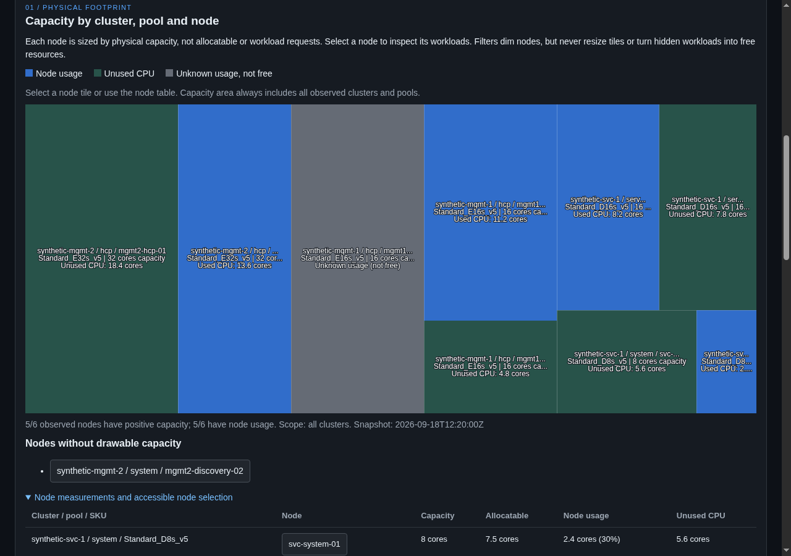
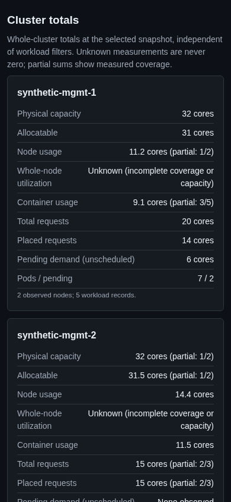
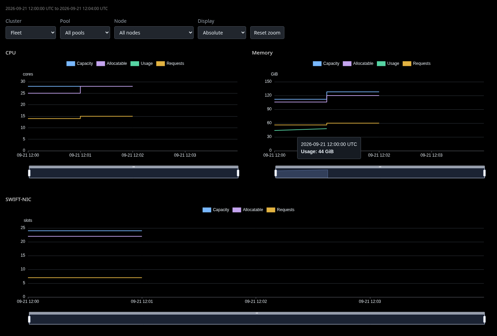
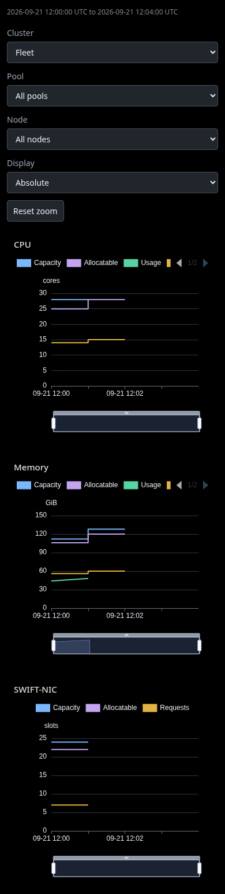
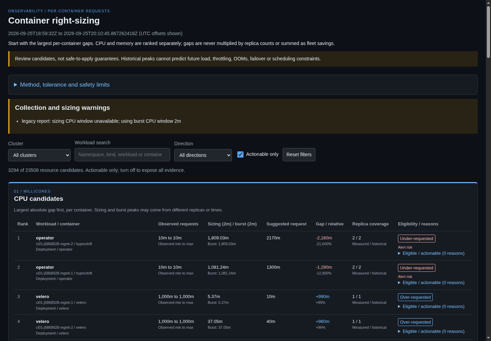
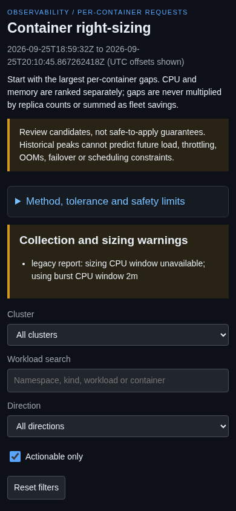

# CI Operations

This document is the operator and maintainer view of ARO HCP CI. Use it when you need to inspect a failing run, change the underlying CI configuration, or troubleshoot.

For DEV CI PagerDuty and Slack alerts, start with [DEV CI Monitoring and Alert Response](dev-ci-monitoring.md). For the execution model and cross-tenant request flow, start with [CI Execution](execution.md). For contributor-facing E2E usage including how to trigger jobs, see [E2E Testing In CI](e2e-testing.md).

For a DEV regional provision-health incident, use
[DEV CI Regional Load Management](dev-region-failover.md).

## Inspecting Runs

The normal observation path is:

1. check the PR's **Checks** tab for presubmit status
2. open the job run in the [Prow dashboard](https://prow.ci.openshift.org/?repo=Azure%2FARO-HCP)
3. inspect logs and artifacts for the failing step
4. correlate the failure with the target environment and execution mode

Useful signals include:

- job history in the Prow dashboard
- artifacts from the `aro-hcp-tests` run
- GitHub checks status on the PR
- Slack notifications in [`#forum-ocp-testplatform`](https://redhat.enterprise.slack.com/archives/CBN38N3MW) for build-farm-side failures and repeated issues

### Post-Job Observability Artifacts

For DEV E2E runs, open the artifacts for the
`aro-hcp-gather-observability` post-step before looking for a separate Grafana
dashboard. The step runs before environment deletion and queries only the
run's bounded time window from the regional Azure Monitor workspaces.

- `observability-summary.html` contains fired-alert details and the selected
  Frontend, Backend, Fleet, Maestro, service-container, and management-cluster
  charts. Use the service-workload charts to identify the highest CPU and
  memory consumers and the running pod count during the failure window, then
  correlate their cluster, namespace, pod, and container labels with the test
  logs.
- `alerts.json` contains the alert data used by the summary.
- `utilization.json` contains the versioned data behind the summary's Utilization
  and Resource History tabs, including minute-by-minute node resources,
  selected peak minutes, node capacity, workload demand, and
  completeness warnings. It can be rendered again without Azure access.
- The **Right-Sizing** tab and standalone `right-sizing.html` show per-container
  request suggestions derived from `replica-peaks.json`; `right-sizing.json` is
  the machine-readable input for the offline request updater described below.
- `junit_alerts.xml` records unexpected fired alerts as test failures for Prow.

Known alert firings can be temporarily excluded from this CI gate in
[`knownIssues.yaml`](../../test/cmd/aro-hcp-tests/gather-observability/known-issues/knownIssues.yaml).
Each entry requires a reason and an alert name; optional label patterns narrow
the match. An optional `expiresAfter: "YYYY-MM-DD"` date timebombs that exception.
It applies through the named UTC date. From 00:00 UTC on the following day, a
matching firing is unexpected again and fails the observability step. Entries
without `expiresAfter` keep their current behavior. If the alert no longer fires,
an expired entry does not itself fail CI. Remove resolved entries rather than
extending their dates; review still-active issues before renewing an expiry.
This classification only affects CI results and artifacts, not Azure Monitor
alert firing or notification routing.

Tabs and artifact writes are attempted independently. An unavailable alert API,
workspace, or chart does not suppress unrelated output. Incomplete alert
collection still fails the step and produces an explicit JUnit failure; it does
not produce passing assertions that no alerts fired. Individual chart queries
and utilization collection remain informational, with failures shown in their
tabs. Artifact-writing failures still fail the step after other writes are
attempted.

The uploaded summary preserves the selected chart samples after the ephemeral
environment is deleted, subject to OpenShift CI artifact retention. It is not a
raw cross-run metrics store. The chart descriptions and copyable PromQL are the
source of truth for interpreting each signal; the maintained query catalog is
[`queries.yaml`](../../test/cmd/aro-hcp-tests/gather-observability/queries.yaml).

### Utilization Snapshots

The Utilization tab helps assess whether underlay node SKUs are oversized and
which workloads consume them. It is evidence for a human sizing decision, not a
recommendation to remove capacity or change requests.

Synthetic-data desktop and mobile previews:





The collector searches from the earliest test start through the existing cleanup
allowance (45 minutes after the latest recorded test finish), capped at collection
start. It evaluates whole-node CPU and memory utilization at UTC minute boundaries,
using two-minute CPU rates and one-minute memory averages. CPU counts non-idle
modes, including iowait and steal, without double-counting guest time. Memory usage
is total minus available memory. The denominators are historical capacity, not
the nodes present when collection runs.

Each cluster contributes its CPU and memory peak minute. Two additional selections
find overall CPU and memory utilization, weighted by capacity across all expected
clusters. Coincident minutes are deduplicated and retain all selection reasons;
ties select the earliest minute. Three clusters therefore produce at most eight
snapshots. Every snapshot shows all clusters at the same instant. These are not
independently selected node or pool peaks.

Collection covers all underlay clusters advertised by the regional workspace's
`underlay_clusters{source="bicep"}` inventory, including all pools and namespaces,
but not customer worker clusters. DEV CI workspaces are job-specific. In shared
environments, the report measures regional load during the test interval; it does
not attribute all that load to this test run. Missing inventory prevents peak
selection; incomplete node coverage excludes the affected minute from ranking.
The overall peak requires complete coverage across expected clusters.

The capacity treemap gives each node an area proportional to its physical CPU or
memory capacity. It explicitly shows unused CPU, available memory, or unknown
usage. Filters dim nodes without resizing their capacity or relabeling hidden
workloads as unused space. Select a node to inspect its workloads, or use the
accessible node table. Workload details group HCP components across namespaces,
then expose exact owning workloads and container-name aggregates. Unscheduled
requests are a separate demand bucket, never assigned to a guessed pool.

Container CPU and memory working set do not exactly reconcile with whole-node
load. Requests are declared ordinary-container sums, not scheduler-effective
reservations including init-container rules and overhead. Finite limit sums and
unlimited-instance counts are separate. Missing measurements are unknown, not
zero. Ownership, placement, and pod incarnation must match before usage is
attributed; ambiguous or stale samples are excluded with warnings. SKU and pool
labels require the updated OSS kube-state-metrics deployment; older samples show
unknown enrichment rather than guessed values.

The collector runs automatically with a ten-minute budget and at most two
concurrent Prometheus requests. It fetches node history first, then request
history in 30-minute batches, then workload details only for selected peak
minutes. Timeout preserves collected history and selected snapshots with
explicitly incomplete details. The JSON contains normalized aggregates, not raw
Prometheus responses, full-run workload history, or individual pod records.

### Resource History

Synthetic-data desktop and mobile previews:





The Resource History tab retains every evaluated minute, not just peak samples.
Select the fleet, a cluster, pool, or historical node to inspect CPU, memory,
and SWIFT-NIC resources. The three charts share time zoom, not hover. Hovering
a complete line shows its timestamp and value; legends remain visible. Partial
requests have visible point markers and a tooltip explaining their coverage.
Changing scope preserves the time window. Absolute units (cores, GiB, slots) are the
default; percentage mode divides aggregate quantities by aggregate capacity.
Pool membership and node placement are evaluated at each sample, including
nodes deleted before collection. Unknown pool labels are not inferred from names.

CPU and memory plot capacity, allocatable, whole-node usage, and assigned
regular-container requests. Both capacity lines use Kubernetes node resources;
in particular, history memory capacity differs from the peak view's node-exporter
MemTotal denominator. Usage still uses the same two-minute CPU rates and
one-minute averages of host total-minus-available memory as the peak view.
Requests combine the services and HCP workspaces without counting replicas
twice. Empty HCP results are legitimate when both workspace queries succeed
and the shared KSM collector has inventory evidence in the services workspace.

SWIFT-NIC plots advertised capacity, allocatable and assigned requested slots,
not measured NIC usage or traffic. Missing or non-applicable capacity remains
a gap rather than zero. Requests exclude
init-container reservations, pod overhead and unassigned demand; spec-backed
container inventory can also miss unobserved containers. These are not exact
scheduler reservations or a guarantee that new pods will fit. NotReady and
cordoned nodes remain included, and shared environments show regional load
during the run, not load attributable exclusively to that run.

Incomplete request totals retain safely placed observations in a separate orange,
dashed **Partial requests (lower bound)** series. It combines complete node totals
with partial node sums without double counting. Conflicts with known candidate
nodes affect only those nodes; unbounded placement or failed workspace coverage
makes the cluster partial rather than discarding its known demand. Selecting an
unaffected node or pool still shows complete requests. Missing observations are
not zero, and ambiguous or potentially terminal pod contributions are excluded.
The additive `partialRequests` JSON field retains these sums for replay. Older
artifacts that discarded partial sums cannot recover them merely by re-rendering.

Other incomplete measurements create gaps in the affected aggregate line. Known
absolute usage can still be shown when capacity is unavailable, but percentage
mode requires a complete positive capacity denominator. Saved JSON retains
collection diagnostics, shown in a collapsed **Data quality** section with scoped
warnings and inclusive minute intervals. The collector cannot detect nodes or
pods absent from every input metric. There is no interpolation, silent partial
summation, or zero-filling. The charts require the ECharts CDN.

To iterate on the UI with an existing artifact:

```bash
./test/aro-hcp-tests gather-observability render-utilization \
  --input utilization.json --output /tmp/utilization-preview
```

This writes `utilization-summary.html` and `resource-history-summary.html` using
the same renderers as the live tabs. Older JSON without history still renders
peak snapshots, with "History not recorded" in the history output.
No rendered configuration or Azure credentials are needed. Unsupported schema
versions and invalid inputs are rejected. Charts use the existing ECharts CDN;
the separate peak view retains its summary tables without that asset. The synthetic
fixture at `test/cmd/aro-hcp-tests/gather-observability/testdata/utilization-synthetic.json`
can also be used as input for local UI testing.
For history previews, use
`test/cmd/aro-hcp-tests/gather-observability/testdata/utilization-history-synthetic.json`.

### Replica Peak Evidence

`gather-observability` also writes `replica-peaks.json` automatically, before the
metrics panels and utilization collector. This is compact input for offline
request sizing, not another time-series chart. Prometheus evaluates the full
report window server-side and returns only per-container summaries and ownership
metadata. No kubeconfig, Kusto access, or additional flags are required.

The version-1 artifact contains:

- `start`, `end`, `generatedAt`, `gridStep`, `cpuWindow`, `sizingCPUWindow`, and
  `memoryWindow`; the end is capped at collection start.
- `clusters`: underlay clusters discovered across the report window, including
  clusters no longer present at collection time.
- `queries`: each cluster/workspace/query's `success`, `empty`, or `error` status,
  returned series count, and error details. Check these before using the data.
- `containers`: normalized summary records, one per metric identity and source,
  **not one row per pod**. Each retains cluster, namespace, pod, container,
  `podUID` when resolvable, workspace, query name, original identity labels, and
  a `summary` with `max`, `count`, `first`, and `last`. Request summaries also
  include `min`; their `labels.resource` identifies CPU or memory.
- `metadata`: deduplicated runtime-container and controller-owner evidence from
  both workspaces. The `metric` label identifies the original KSM metric family.
- `warnings`: collection failures, invalid observations, and unresolved identities.

The three usage queries are `cpu` (maximum two-minute burst CPU rate),
`cpuSustained` (maximum ten-minute CPU rate for sizing), and `memory` (maximum
raw working-set measurement within the preceding 60 seconds, not an average).
CPU is in cores and memory in bytes, evaluated on UTC minute boundaries.
The grid runs from
`ceil(start)` through `floor(end)`: lookbacks at its first point can include
pre-start activity, and the trailing fractional minute is excluded. `count` is
the number of observed grid points after HA deduplication, not scrape count or
replica count. `first` and `last` are Unix seconds of those observations, **not
timestamps of the peaks**. Instant request/metadata selectors use Prometheus's
normal lookback and staleness behavior. Short-lived containers between grid
points may be missed; sparse observations do not establish lifetime coverage.

`requests` and `initRequests` retain ordinary and init-container request ranges
separately, including native sidecars when their metrics are exported. These are
observed ranges, not necessarily requests at the usage peak. Missing metrics are
unknown, never zero. In particular, absent request metrics do not establish that
a container requests zero. This artifact does not calculate scheduler-effective
pod requests, pod overhead, or concurrent pod/workload peaks.

Match records using cluster, namespace, pod, **pod UID**, and container. Usage
records preserve cgroup IDs, node, and instance labels to distinguish restarts;
UIDs come from cgroup paths or unambiguous runtime-container metadata, never
pod-name guessing. Unmatched usage is retained with a warning. Controller
metadata preserves candidate ownership edges; ambiguous historical owner chains
must not be guessed. Request summaries from the svc and hcp workspaces remain
separate: **do not sum their counts or requests**. Similarly, separate exporters
for the same container must not be treated as additional replicas.

For request sizing, inspect each replica first and use the busiest replica as
evidence for a shared container request. CPU and memory peaks may occur at
different times. Summing independent container or replica maxima does not yield
a measured simultaneous peak, and a low observed peak alone is not a safe
production request recommendation. Request changes, CPU throttling, startup,
missing telemetry, and unobserved load still require investigation. The
Right-Sizing report below proposes requests; collecting scheduling constraints
and simulating placement remain separate steps.

Collection has a three-minute total budget, 30-second HTTP timeouts, and at most
two in-flight queries. Each cluster is queried separately with one evaluation
per request; full workload histories are neither downloaded nor persisted.
Query failures and Prometheus warning responses are reported as unavailable
evidence without failing alert/JUnit checks. An artifact-write failure remains
fatal.

### Right-Sizing Requests

Desktop and mobile previews replaying the first replica-peak artifact (which
contains legacy 2-minute CPU evidence):





The **Right-Sizing** tab groups evidence by cluster, namespace, owning workload,
and container. CPU sizing uses the maximum ten-minute rate across all observed
replicas and the report window, plus 20% headroom; the two-minute burst peak is
displayed separately. Memory uses peak working set across those replicas, also
plus 20%. Amounts and deltas are **per container**, not workload totals or
concurrent demand. Replica counts include historical pod UIDs, not just replicas
running together.

Suggestions round to the nearest 10m CPU or 10Mi memory, ties up, with a minimum
of one step. For `unit = 0.01` cores or `10 * 1024 * 1024` bytes:

```text
nearest = max(1, round(1.2 * peak / unit)) * unit
suggested = max(nearest, ceil(peak / 1.2 / unit) * unit)
```

The floor prevents rounding from leaving `peak > 120%` of the suggestion;
nearest rounding does not guarantee the full 20% headroom. The default deadband
suppresses changes **at or below 10%** of the current request. `--change-threshold`
accepts finite fractions from 0 through 1; 0 disables it. A measured sizing peak
above 120% of current bypasses the deadband, not other safety checks.
The report compares against observed `requestMin`; the updater recomputes against
effective current config rather than trusting report `actionable`/`alertRisk` flags.

Eligibility requires an exact pod-UID owner chain and, for **every observed
replica**, both usage and request evidence with at least 10 grid points covering
at least 90% of each signal's own first-to-last observation span. Missing,
conflicting, or failed evidence is not zero and can make a row ineligible.
This is **not proof of actual full-lifetime coverage or absence of ingestion
loss**: wholly unobserved replicas and missing leading/trailing samples can escape
these checks. Old collected artifacts without `sizingCPUWindow` use the legacy
two-minute CPU peak with an explicit fallback warning. New artifacts declaring
ten-minute sizing never fall back when `cpuSustained` evidence is missing.

The actual `ServiceCPUDrift` and `ServiceMemoryDrift` alerts use a **30-minute
average usage/request ratio >1.2 for 5 minutes**, with CPU based on a **five-minute
rate**. These differ from sizing peaks; neither the guard nor applying suggestions
guarantees alert clearance. Investigate throttling, startup and unobserved load
before accepting changes.

Rebuild both right-sizing artifacts offline, without Azure credentials or rendered
configuration:

```bash
./test/aro-hcp-tests gather-observability render-right-sizing \
  --input replica-peaks.json --output DIR --change-threshold .1
```

Review `DIR/right-sizing.html`, then use `DIR/right-sizing.json` as the updater's
input. From the repository root (below, `right-sizing.json` is the downloaded report):

```bash
go run ./tooling/rightsize-requests --input right-sizing.json \
  --config config/config.yaml --allow-decrease --dry-run
# After reviewing the preview, apply to the local config:
go run ./tooling/rightsize-requests --input right-sizing.json \
  --config config/config.yaml --allow-decrease
```

JSON input mode uses a fixed, explicit `(namespace, container)` mapping and writes
only `clouds.dev.defaults.*.resources.requests.cpu`/`.memory`. It takes the maximum
suggestion across all cluster/workload records mapping to each resource, never
sums them. Unknown mappings are skipped; an ineligible, unknown-owner, init-container
or incomplete mapped row blocks that mapped resource. CPU and memory are independent.
Stale protection requires effective current config to lie in at least one contributing
observed request range (not a gap between ranges), unless already equal to the
suggestion. Decreases require `--allow-decrease`. Limits stay unchanged; suggestions
exceeding an effective limit are skipped. The updater's own `--change-threshold`
(default `.1`) controls its decisions independently of the report's threshold.
This mode obtains no credentials, makes no network queries, and neither renders
configuration nor commits. Review the diff and follow the normal configuration
materialization workflow separately. See the
[updater reference](../../tooling/rightsize-requests/README.md#offline-input)
for validation and mapping details.

## Modifying CI Configuration

ARO HCP Prow job definitions are maintained in `openshift/release`, not in this repository. The generated job manifests under `ci-operator/jobs/Azure/ARO-HCP/` are outputs and should not be edited directly.

When you change CI configuration in `openshift/release`, follow the release-repo regeneration workflow rather than hand-editing generated YAML. In practice that means using the repo's documented `make update` flow so ci-operator config, Prow jobs, and related generated artifacts stay in sync.

Also keep the ARO HCP-side wiring in mind:

- `config/config.msft.clouds-overlay.yaml` maps public-cloud environments to `prowJobName`
- `test/e2e-pipeline.yaml` passes `PROW_JOB_NAME` to EV2 gating

If one side changes without the other, the rollout path can drift even when the individual YAML files still look valid.

For the full list of ci-operator config files and step-registry components, see the "Where To Look" sections in [CI Image Lifecycle](image-lifecycle.md#where-to-look), [CI Identity Leasing](identity-leasing.md#where-to-look), and [CI EV2 Integration](ev2-integration.md#where-to-look).

## Troubleshooting

### Job Stuck Pending

- check for general OpenShift CI load or incidents first
- verify the job is landing on the expected build-farm cluster
- if the problem is widespread or unrelated to ARO HCP configuration, escalate through the OpenShift CI team

### Test Failures In E2E Jobs

- first identify which execution mode failed: DEV PR, higher-environment PR, EV2 gating, or periodic
- confirm whether the failure looks like product behavior, environment drift, lease exhaustion, or test flake
- use [CI Execution](execution.md) to confirm what that specific job could realistically validate

### Cleanup Failures

- distinguish strict per-test cleanup from periodic cleanup before interpreting the signal
- review [CI Cleanup](cleanup.md) to understand whether the failure is supposed to fail loudly or be best-effort
- check for deletion locks, deny assignments, or missing owner components before assuming the cleanup code is wrong

### Getting Help

- build-farm or Prow infrastructure issues: [#forum-ocp-testplatform](https://redhat.enterprise.slack.com/archives/CBN38N3MW)
- ARO HCP-specific test failures: work through the ARO HCP development or SRE owners for the affected component
- CI config changes: submit a PR to `openshift/release` and involve the OpenShift CI reviewers as needed

## Key Job Families And Source Of Truth

- **PR build and simulation**: `pull-ci-Azure-ARO-HCP-main-images`, `pull-ci-Azure-ARO-HCP-main-frontend-simulation` -> `openshift/release: ci-operator/config/Azure/ARO-HCP/Azure-ARO-HCP-main.yaml`
- **DEV PR E2E**: `pull-ci-Azure-ARO-HCP-main-e2e-parallel` -> `openshift/release: ci-operator/config/Azure/ARO-HCP/Azure-ARO-HCP-main.yaml` and `ci-operator/step-registry/aro-hcp/local-e2e/`
- **Higher-environment PR E2E**: `integration-e2e-parallel`, `stage-e2e-parallel`, `prod-e2e-parallel` -> `openshift/release: ci-operator/config/Azure/ARO-HCP/Azure-ARO-HCP-main.yaml`
- **Postsubmit image promotion and CD**: `branch-ci-Azure-ARO-HCP-main-images`, `branch-ci-Azure-ARO-HCP-main-images-push-postsubmit`, `branch-ci-Azure-ARO-HCP-main-cspr-pipeline-postsubmit` -> `openshift/release: ci-operator/config/Azure/ARO-HCP/Azure-ARO-HCP-main.yaml`
- **Postsubmit CI base image**: `branch-ci-Azure-ARO-HCP-main-baseimage-generator-images` -> `openshift/release: ci-operator/config/Azure/ARO-HCP/Azure-ARO-HCP-main__baseimage-generator.yaml`
- **Postsubmit global infra**: `branch-ci-Azure-ARO-HCP-main-global-pipeline-postsubmit` -> `openshift/release: ci-operator/config/Azure/ARO-HCP/Azure-ARO-HCP-main.yaml` (runs on changes to `config/config.yaml`, `observability/observability.yaml`, or `dev-infrastructure/`)
- **EV2 gating E2E**: `branch-ci-Azure-ARO-HCP-main-e2e-*` -> `openshift/release: ci-operator/config/Azure/ARO-HCP/Azure-ARO-HCP-main__e2e.yaml`
- **Periodic cleanup**: `periodic-ci-Azure-ARO-HCP-main-periodic-cleanup-*` -> `openshift/release: ci-operator/config/Azure/ARO-HCP/Azure-ARO-HCP-main__periodic-cleanup.yaml`
- **Periodic E2E**: `periodic-ci-Azure-ARO-HCP-main-periodic-*-e2e-parallel` -> `openshift/release: ci-operator/config/Azure/ARO-HCP/Azure-ARO-HCP-main__periodic.yaml`
- **Image-updater tooling**: `periodic-ci-Azure-ARO-HCP-main-image-updater-*` -> `openshift/release: ci-operator/config/Azure/ARO-HCP/Azure-ARO-HCP-main__image-updater.yaml`

## See Also

- [CI Overview](README.md)
- [CI Execution](execution.md)
- [CI Image Lifecycle](image-lifecycle.md)
- [CI Identity Leasing](identity-leasing.md)
- [CI EV2 Integration](ev2-integration.md)
- [CI Cleanup](cleanup.md)
- [DEV CI Regional Load Management](dev-region-failover.md)
- [E2E Testing In CI](e2e-testing.md)
