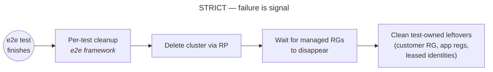
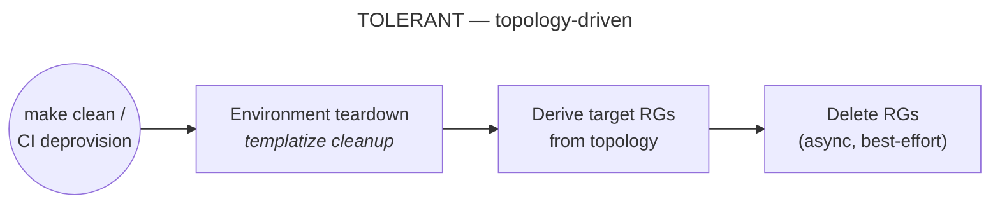
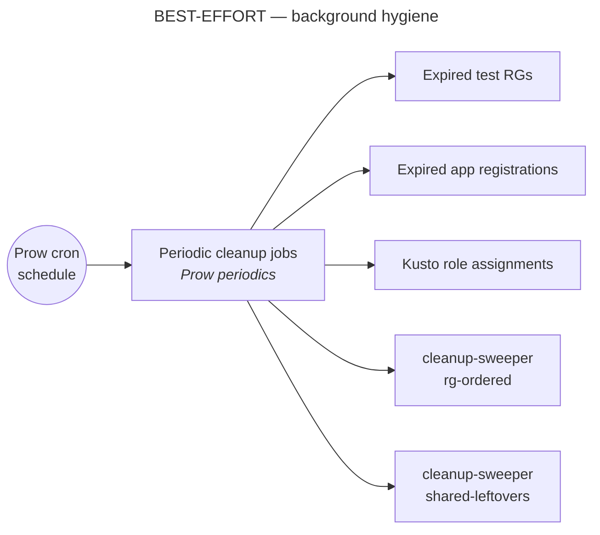

# Cleanup

ARO HCP has three cleanup modes, and they are intentionally different:

1. strict per-test cleanup in the e2e framework
2. targeted environment teardown for personal dev and dev CI
3. background hygiene from periodic cleanup jobs

The differences are deliberate. A cleanup path that is correct for a test is not always the right one for a background janitor job, and a path that is good for dev teardown is not always the one we want in public cloud.

## The Three Cleanup Modes

### Strict per-test cleanup

This runs after each e2e test.

Its job is to clean up what the test created and to fail loudly if cleanup is broken. That is why this path is strict: leaking resources after a test usually means either the product did not delete something correctly or the test created something it did not own properly.

In the normal public-cloud flow, test cleanup:

1. deletes HCP clusters through the RP
2. waits for managed resource groups to disappear
3. finishes cleaning up test-owned leftovers such as the customer resource group, app registrations, and leased identities

This path is not just background hygiene. Cleanup failures are treated as test signal.

### Targeted environment teardown

This is the cleanup path used when we explicitly tear down a known environment, most commonly:

- personal-dev cleanup
- dev e2e CI deprovision

Its job is not to validate cluster deletion correctness. Its job is to remove a known set of environment resource groups derived from topology.

Because of that, it is more tolerant than per-test cleanup:

- it works from a known target set instead of scanning broadly
- it is comfortable with async deletion
- it favors getting the environment moving toward deletion over proving that every step completed synchronously

### Background hygiene

This is the periodic cleanup layer defined in:

- `openshift/release: ci-operator/config/Azure/ARO-HCP/Azure-ARO-HCP-main__periodic-cleanup.yaml`

Its job is to keep subscriptions healthy over time, not to prove that a single test or delete operation behaved perfectly.

Today that periodic layer includes:

- expired test resource-group cleanup
- expired app-registration cleanup
- Kusto role-assignment cleanup
- `cleanup-sweeper` jobs for policy-driven resource-group cleanup and shared leftovers

This path is intentionally best-effort. If one run leaves something behind, the next run can pick it up.

## Why They Behave Differently

### Why periodic cleanup is best-effort

Periodic cleanup runs in the background across shared subscriptions. If it is too aggressive, it becomes its own source of instability and Azure throttling.

That is why the background cleanup jobs are deliberately conservative. In particular, the `cleanup-sweeper` jobs currently run with a single worker, and `rg-ordered` runs with `wait=false`, to be gentler to the Network provider.

The goal is steady pressure in the right direction, not maximum deletion throughput in one run.

### Why e2e cleanup is strict

Per-test cleanup is part of test correctness.

If a test cannot clean up what it created, that usually means:

- cluster deletion did not complete correctly
- test-owned Azure resources were left behind
- the test itself created resources outside the framework's ownership model

That is why the framework treats cleanup failure as meaningful signal instead of just logging and moving on.

### Why dev cleanup actively deletes managed resource groups but public-cloud cleanup does not

This is one of the most common sources of confusion.

In public cloud, managed resource groups are part of the cluster lifecycle owned by the RP and downstream platform components. The correct behavior is to delete the cluster through the RP and wait for the managed resource groups to disappear as a consequence of that owned flow.

Additionally, in public cloud the managed resource groups carry deny assignments that prevent customer principals from modifying them. Any attempt by cleanup jobs to directly delete those resource groups would simply fail with a permission error.

In dev and other `no-rp` situations, that owner may already be gone or unavailable. If cleanup waits for someone else to delete managed resource groups, they can remain forever. In those cases cleanup has to be more direct: find the managed resource groups itself, clean them up, and then clean the parent resource group.

So the difference is not "dev is special" for its own sake. The difference is whether there is still a live owner for managed resource-group deletion.

## How Each Path Works

### E2E test teardown

This is implemented in:

- `test/util/framework/per_test_framework.go`

At the end of a test, the framework cleans:

- resource groups created by the test context
- app registrations created by the test
- leased identity leftovers

There are two cleanup modes in the framework:

- `standard`: used in normal public-cloud teardown
- `no-rp`: used when the RP is unavailable or the infrastructure has already been torn down

`standard` is strict and cluster-aware. `no-rp` is more direct and more best-effort.

### Templatize cleanup

This is implemented in:

- `tooling/templatize/cmd/entrypoint/cleanup/`

This path starts from topology, selects the resource groups that belong to the chosen entrypoint or pipeline, and tears those down.

That makes it a good fit for:

- personal-dev cleanup
- dev e2e CI deprovision

It is targeted cleanup of known resources, not subscription-wide hygiene.

### Periodic cleanup

The consolidated periodic job definition lives in:

- `openshift/release: ci-operator/config/Azure/ARO-HCP/Azure-ARO-HCP-main__periodic-cleanup.yaml`

There are two broad styles of periodic cleanup:

- test-oriented cleanup jobs, such as expired resource groups and old test identities
- `cleanup-sweeper` jobs, which are meant for policy-driven resource-group cleanup and shared leftovers

The important point is that all of these are background hygiene jobs. They are there to keep shared environments healthy and reduce accumulation over time.

## Where To Look

If you need to change behavior, start here:

- consolidated periodic jobs: `openshift/release: ci-operator/config/Azure/ARO-HCP/Azure-ARO-HCP-main__periodic-cleanup.yaml`
- `cleanup-sweeper` CLI: `tooling/cleanup-sweeper/cmd/root/options.go`
- ordered cleanup engine: `tooling/cleanup-sweeper/pkg/engine/resourcegroup_ordered_cleanup.go`
- templatize cleanup: `tooling/templatize/cmd/entrypoint/cleanup/`
- e2e teardown: `test/util/framework/per_test_framework.go`

For the Prow-job view, also see `docs/prow.md`.