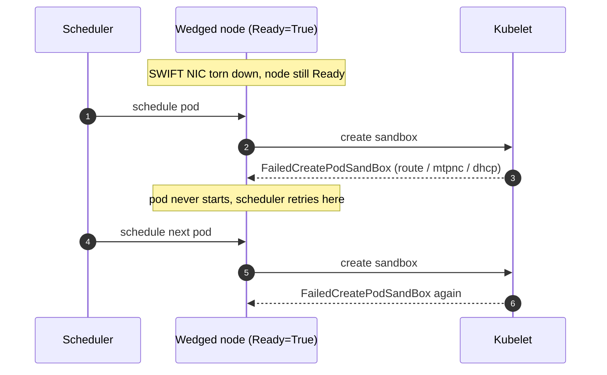
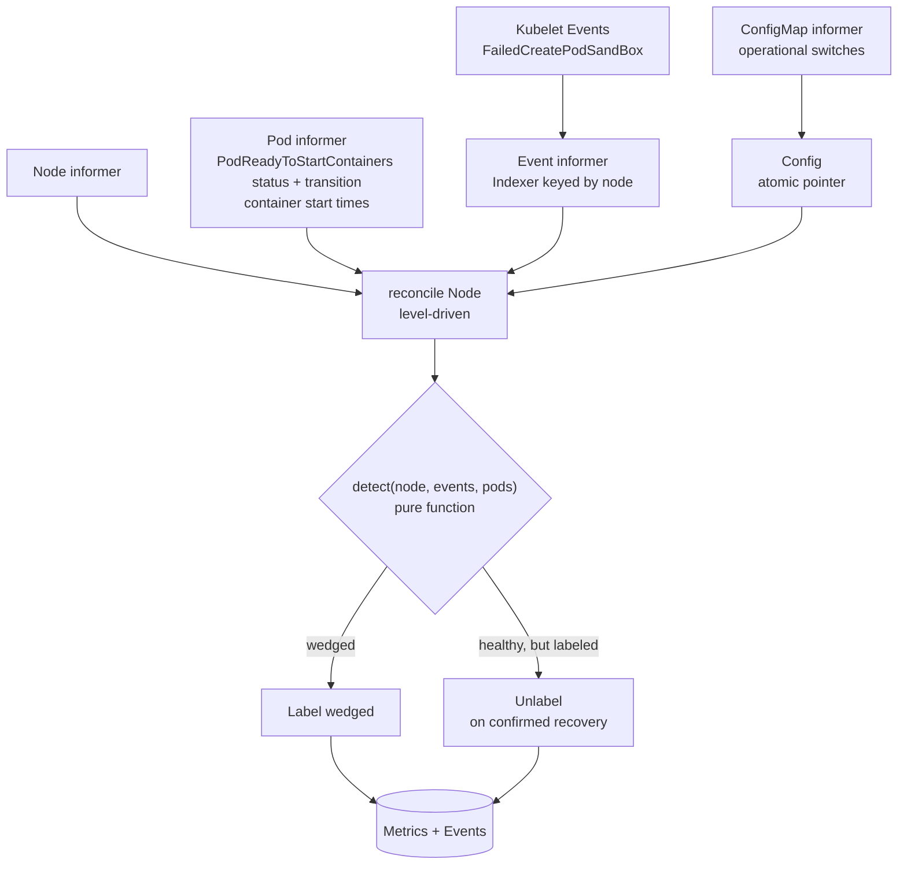
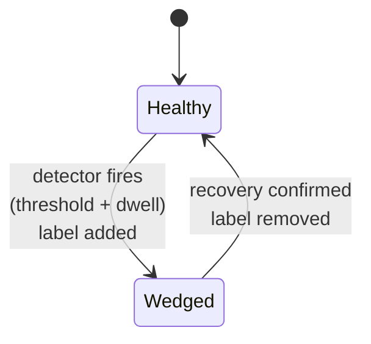

# Node Health

This document describes the design of the **node-health controller**, a management-cluster
controller that detects "Ready but broken" nodes from kubelet Events and
**labels** them so they can be acted on. A separate mitigation controller, out of
scope here, acts on the labeled nodes.

This is a design document. The controller is part of the `mgmt-agent` component,
in package `mgmt-agent/pkg/controller/nodehealth`, and ships as part of the
`mgmt-agent` deployment. Detection and labeling are non-disruptive, so the
controller can run in production and be confirmed before any separate mitigation
controller acts on its labels. See [Monitoring](../monitoring.md) for how the metrics it emits
are collected.

Tracking: [AROSLSRE-1588](https://redhat.atlassian.net/browse/AROSLSRE-1588).

## Problem

SWIFT v2 delegated-NIC nodes on the AKS management clusters can wedge in a state
that is invisible to every normal health signal. The node stays `Ready`, its
`MultitenantPodNetworkConfig` and `NodeNetworkConfig` CRDs stay fully populated
and healthy, and no NodeCondition flips. Yet the kubelet cannot create pod
sandboxes on it: every pod scheduled there fails with a sustained
`FailedCreatePodSandBox` signature (`route ... no such network interface`,
`network is unreachable`, `mtpnc is not ready`, or `dhcp discover ... timed out`),
and no pod ever starts.

Because the node looks `Ready`, the scheduler keeps placing pods on it and they
keep failing. Today an SRE has to notice the pattern, correlate the kubelet
Events, and manually cordon and drain the node. That is slow, it is on-call toil,
and it only happens after workloads have already been stuck on the bad node for a
while.

The failure we are reacting to, in one picture:

## Goal

- **Detect** wedged management-cluster nodes automatically from central kubelet
  Events, with no per-node agent.
- Detection is **hard-coded and modular**: detectors are Go units that share
  common primitives (event-signature match, sustained-storm floor, and the
  load-bearing zero-success-continuity check), each a pure function of the Pods and
  Events currently held for the node, so nothing is carried between reconciles, and
  exhaustively unit-tested. Adding a failure mode is a new tested detector in
  code, not a ConfigMap edit.
- **Label** a detected node (and annotate why), and unlabel it when it recovers.
  Labeling is non-disruptive and reversible; a separate mitigation controller
  consumes the label and owns any disruptive action.
- Labeling is **guarded**: an off switch, live via a ConfigMap. Detection is
  intrinsically scoped (it only considers SWIFT-v2 nodes) and requires a sustained
  storm, so it does not label the wrong node in the first place.

## Non-goals

- **Not a mitigator.** This controller never cordons, evicts, drains, deletes, or
  taints a node or a pod. Mitigating labeled nodes is a separate, asynchronous
  controller (see [Evolution](#evolution-a-separate-mitigation-controller)).
- **Not a NotReady-node handler.** A node that has gone `NotReady` is already
  handled by normal node lifecycle and the cloud provider; the controller explicitly
  skips it. The controller exists precisely for the nodes that stay `Ready` while
  broken.
- **Not a per-node daemon.** Version 1 draws its only signal from central kubelet
  Events read through the API server. There is no host agent, no `ip link`
  probing, no CRD inspection.
- **Not a config-driven matching engine.** SWIFT NIC teardown is the first
  detector, hard-coded and tested. New fault families are added as new detectors
  that reuse the shared detection primitives, in code, not as configuration.
- **Not a blind node-rotator.** Every action is preceded by a durable label, an
  Event, and a metric, so a wedge is always *surfaced* (as a new detector and a
  bug for a signature we do not yet cover) rather than silently recycled. The goal
  is to remove the manual toil of mitigating known faults, not to mask new ones by
  rotating nodes without a diagnosis.

## Background: why Events, and why label-only

The wedge is invisible to CRDs and NodeConditions, so the control-plane objects
cannot be the signal. The one reliable cluster-side symptom is a sustained stream
of kubelet `FailedCreatePodSandBox` Events with a specific reason string and zero
successful container starts on the node. Those Events are already in etcd and
readable through the API server, so a controller can watch them centrally without
touching the host.

Keeping mitigation out of this controller is a deliberate rollout-safety choice.
Detection and labeling are observable and completely non-disruptive, so this
controller runs in production with zero blast radius while confidence is built that
it identifies exactly the right nodes and nothing else. Any disruptive action lives
in a separate mitigation controller that consumes the label and is rolled out on
its own schedule.

## Design overview

The controller runs inside `mgmt-agent`. It watches Nodes, Pods, and kubelet
Events through shared informers, plus a small ConfigMap for its operational
switches. On any watch event it enqueues the affected Node and reconciles it
level-driven, computing the decision as a pure function of what the informers
currently hold for that node: its object, the Events indexed against it, and the
state of its Pods. An `Indexer` on the Event informer, keyed by the node a pod is
scheduled to, returns a node's recent `FailedCreatePodSandBox` Events in a single
lookup. Success is read from Pod state rather than Events (see Reading the signal).

Reconciliation is level-driven. The signal that pushes a node over the threshold
is a kubelet Event, and the controller watches those Events, so the API server
delivers the very Event that crosses the line and the node is reconciled then.
The informers' ordinary resync, together with the Node and Pod watches, is enough
to re-evaluate recovery.

A periodic sweep re-enqueues candidates so a firing that becomes true purely
because the dwell elapsed is still reconciled without a new Event. The sweep is
the union of two selectors rather than every node in the cluster: the SWIFT-v2
nodes, which are the only detection candidates, and the nodes carrying the wedged
label, so a stale label is swept and retired even if the node stopped being a
candidate while the controller was down.

## Detection

### Two failure classes, one error string

The SWIFT NIC fault presents as two mechanisms that emit the **identical** error
string (`route ip+net: no such network interface` from the azure-vnet CNI), so
the string alone is never a trigger. They differ only in whether the node can
still start pods:

- **Flap** (self-heals, do not act): the accelnet VF is still present on the VM;
  the MANA NIC transiently presents the slave secondary NIC to the CNI, which
  races and fails. Route errors come in **bounded bursts with clean gaps**, DHCP
  discover still succeeds on retry, and **pods keep starting between the
  failures**. The node recovers with no operator action.
- **Hard-wedge** (only recovers on node delete): the VF is **gone** from the VM
  (CRP/Compute detachment). Route errors are a **continuous storm with no gaps**,
  DHCP discover never succeeds, and **no pod sandbox is ever created** until the
  node is deleted.

The single reliable discriminator, confirmed across four on-node log collections
and ICM 832382845, is **successful pod-sandbox creation on the node**: a wedged
node has zero successes for the whole failure span; a flapping node keeps
succeeding in the same hours it fails. Everything the detector does is built
around that signal, which is why the zero-successful-sandbox rule (below) is the load-bearing
condition, not the error count.

### Detectors

A detector is a small, hard-coded Go unit that decides, for one fault family,
whether a node is wedged. Every detector implements a common `Detector` interface
(`Applies`, `Evaluate`, `MeetsThreshold`, plus `Name`/`Reason` for surfacing), and the pure
`decide` core iterates a code registry of detectors without depending on any
concrete type. This keeps detection modular: the engine, the shared evaluation
primitives, and each fault family live in separate files, so adding a family means
adding a `Detector`, not editing `decide`.

The `Ready` precondition is part of this logic, not an operational guard: a
`NotReady` node is skipped and left to node lifecycle, because the fault this
controller detects is precisely the one that leaves a node `Ready` while it cannot
start pods. A `NotReady` node is already visible to every other mechanism, so
labeling it would add nothing.

Detectors share a common base rather than duplicating logic. The
`signatureDetector` base implements the interface for the common shape: a
node-applicability predicate that limits the detector to nodes that can physically
exhibit the fault, matching a kubelet Event `reason` plus a message signature,
requiring the failure condition to be currently active and sustained across a
rolling window (continuity, not a cumulative event count), and the load-bearing
zero-successful-sandbox check. A fault family that shares this shape is a
`signatureDetector` value carrying only its own constants; a family that needs
different evidence is a new type implementing the same interface. Each detector is
a pure function of the node's current state and is exhaustively unit-tested.

The first detector, `swift-vf-teardown`, applies only to SWIFT-v2 delegated-NIC
nodes, identified by the `kubernetes.azure.com/podnetwork-swiftv2-enabled=true`
label: a node with no delegated secondary NIC cannot suffer a VF teardown, so it is
never a candidate. On those nodes it matches `FailedCreatePodSandBox` Events in the
`route ip+net: no such network interface` family (plus the network-unreachable,
mtpnc-not-ready, and dhcp-discover-timeout variants seen for this fault). It lives
in its own file and contributes only its specifics; its signature, thresholds, and
node-applicability label are constants in code, not config.

The second detector, `cni-plugin-not-initialized`, covers a different Ready-but-
broken failure. The kubelet repeatedly emits pod-scoped `NetworkNotReady` Events
(`InvolvedObject.Kind: Pod`) whose message contains `cni plugin not initialized`,
and newly scheduled pods cannot get sandboxes. The node stays Ready because
kubelet's `NetworkReady` condition only gates the initial Ready transition; once
the node has been Ready, a CNI failure does not drive it back to NotReady. It is
scoped to SWIFT-v2 nodes and uses a three-pod floor, 10-minute dwell and
window, and zero-success requirement (the same dwell, window, and success gate
as `swift-vf-teardown`, though that detector's floor is 2). The exact Event
message is pinned in the detector tests.

The decision is **rate, continuity, and success-presence, never an absolute error
count**. The measured evidence is explicit about why an absolute count misleads:
a flap node logged more successful DHCP discovers (52) than a genuinely wedged
node (16), and a wedged node whose logs had rotated showed only 12 route errors
on-disk while Kusto still proved a multi-hour storm. So the count of
currently-stuck pods and the window are only a floor to require the storm to be
sustained; the wedge/flap call is made by zero successful sandbox creations holding
continuously across the detection window (10 minutes), not by how large any error
count is. The detection window is deliberately short so a genuinely wedged node is
labeled promptly; the separate mitigation controller confirms over its own, longer
window before it takes any disruptive action. The floor is a count of distinct pods
on the node that are currently stuck without a sandbox (defined in
[Reading the signal](#reading-the-signal)), never a windowed count of Events.

### Reading the signal

The controller reads the failure and success signals directly from the shared
informers, and it is built so every load-bearing number comes from **durable Pod
state**, not from Events the apiserver garbage-collects.

**Finding a node's failures.** An `Indexer` on the Event informer keys each
`FailedCreatePodSandBox` Event by `Event.Source.Host`, the node whose kubelet
emitted it, so a node's failure Events are one lookup and the index never resolves
through a Pod that may already be gone. Kubelet sets `Source.Host` to the node name
on the Events it raises, which is what makes the index deletion-safe where keying
through the involved Pod would not be. The Events supply two things only: that the
failure is `FailedCreatePodSandBox`, and that its message matches the SWIFT
signature. They are not counted.

**The floor is a count of pods each stuck past the dwell, not a count of Events.**
Absolute Event counts are unreliable in both directions (see
[Detectors](#detectors)), and a `count`-aggregated Event is a cumulative lifetime
tally, not a windowed rate. So the floor is defined over Pods: the number of
**distinct pods on the node that are currently stuck and have each been stuck longer
than the dwell**, where a stuck pod is the subject of a matching
`FailedCreatePodSandBox` Event and still reports `PodReadyToStartContainers=False`.
An Event is tied to its Pod by the Event's `InvolvedObject.UID`, not its
namespace/name: a UID is unique to a single Pod object, so a new pod that reuses a
deleted pod's name cannot inherit the old pod's failure Events. A node clears the
floor when at least the required number of pods have **each individually** been
stuck past the dwell, so one long-stuck pod plus a burst of brand-new stuck pods
does not clear it. This integer is well-defined, reads only live Pod state, and does
not move when Events aggregate or age out.

A pod that has reached a terminal phase (`Succeeded` or `Failed`) is never counted
as stuck. Its sandbox was torn down when it finished, so it reports
`PodReadyToStartContainers=False` as a matter of course, arbitrarily long after it
ran perfectly well. Real SWIFT nodes carry several of these at any moment from
ordinary Job and CronJob turnover, and the evidence captured from the wedged
production node held four. Counting them would let routine churn drift the floor on
its own, on a node with nothing wrong with it.

**Dwell comes from the pod condition, not from pod age.** A pod can sit in
`ContainerCreating` for unrelated reasons (image pull, volume attach, scheduling),
so pod age is not the dwell, and there is no "`ContainerCreating` timestamp" on the
Pod API to read. The durable per-pod timestamp is the `PodReadyToStartContainers`
condition's `lastTransitionTime` while it is `False`. Dwell is measured **per pod**,
from each stuck pod's own such `lastTransitionTime`, and a pod counts toward the
floor only once its own dwell has elapsed. This reads straight from the Pod informer
and is independent of Event GC.

**Success is a fresh sandbox, read from Pod state.** A non-host-network pod whose
`PodReadyToStartContainers` condition transitioned to `True` with a
`lastTransitionTime` inside the window proves a fresh pod sandbox and its SWIFT
network were created, which a hard-wedge cannot do. Keying on the transition, not on
pod age, is deliberate: a container restart inside an existing sandbox does not
re-transition the condition, while a pod that was pending a while but whose sandbox
finally comes up in the window is correctly counted as recovery. Host-network pods
are excluded, since they reach `PodReadyToStartContainers` without a delegated NIC.

A pod that has already finished counts too, timed by its container's start rather
than the condition. A completed pod drops `PodReadyToStartContainers` back to
`False` as a matter of course, so reading only the condition would leave a node
whose recent traffic was short-lived `Job` and `CronJob` pods looking like it had
never started anything. A container can only start inside a sandbox, so its first
start is proof the node could attach a NIC. A pod that failed *before* any
container ran carries no such timestamp, which is exactly the sandbox-failure
shape we are detecting.

Only a container that ran **exactly once** counts. A terminated state describes
the container's latest run, so on a container that restarted, the start time
belongs to a run inside the sandbox the pod already had. An established sandbox
survives the VF teardown, so that run needed no working network and is not
evidence of anything. Counting it would let a wedged node fabricate a fresh
success out of a container looping in an old sandbox and suppress its own
detection, which is the same reason kubelet `Started` Events are unusable as a
success signal.

The window bound is load-bearing, not a tidiness detail. An established sandbox
survives the VF teardown, so pods that started before the wedge keep reporting
`PodReadyToStartContainers=True` indefinitely while the node is wedged. A wedged
node therefore still shows dozens of successful-looking pods, and treating "this
node ever started a pod" as success would suppress detection permanently on any
long-lived node. Only a transition inside the window is evidence the node can
attach a NIC now.

**The controller keeps no state between reconciles.** Both signals, failures and
successes, are read from the informer caches on every pass, so the only cache the
controller holds is one a `LIST` rebuilds. That is a deliberate constraint rather
than an implementation detail: any success history kept in memory is lost on restart,
and an empty history is the absence of evidence rather than evidence of zero
successes, so a controller that relied on one would need a warm-up window before it
could trust the signal. During that warm-up a genuinely wedged node goes unreported.
Deriving success from the same Pods the failure signal comes from removes the
history, and with it the warm-up: a process that has just started decides exactly
what one running for hours would.

The trade-off is that a success is only visible while its Pod is still in the cache.
Counting finished pods by their container start time covers the case that matters,
a node whose recent successes were short-lived pods, and a pod deleted outright
inside the window is not evidence either way. This is also why the failure side is
counted from live Pod state rather than from Event tallies: neither signal may
depend on objects the apiserver has garbage-collected.

**A missing condition is `Unknown`, never a false zero.** A pod whose
`PodReadyToStartContainers` condition is absent entirely is not counted as stuck
(`PodReadyToStartContainers` is beta and on by default from Kubernetes 1.29 and GA in
1.37, so on the 1.35 management clusters it is beta-but-default-on, verified present
before enablement), so a node is never labeled wedged purely because the condition is
missing.

When an Event arrives, the controller enqueues the `Node` named in the Event's
`Source.Host` and reconciles that node level-driven: it counts the pods on the node
currently stuck without a sandbox, checks the dwell from each stuck pod's
`PodReadyToStartContainers=False` transition, and applies the load-bearing
zero-successful-sandbox rule against the successes visible on the node, which is what
separates a genuinely wedged node (zero fresh sandboxes created, VF gone) from a node
that is merely flapping but still creating some pod sandboxes between failures (VF
present, a race). A single failure burst inside an otherwise-productive window never
labels a node; only a continuous zero-success span does.

### Corroborating signals (optional)

Version 1 needs only the central signal: `FailedCreatePodSandBox` Events for
failures and the `PodReadyToStartContainers` Pod condition (plus container start
times on finished pods) for successes.
If a later revision gains node or CNS access, two signals strongly confirm a
hard-wedge before any disruptive action: CNS reporting
`SecondaryInterfacesExist: false` across the window, and the delegated MAC being
absent from `ip link` on the node (the VF is physically gone). Conversely, a DHCP
discover that succeeds on retry within seconds, or route-error bursts separated by
clean gaps, confirm a flap. These are corroboration only; the Event-based
zero-success rule remains the primary trigger.

## Safety guards

The only operational guard is the off switch, live via the ConfigMap. The
detection thresholds, the SWIFT-v2 node scoping, the dwell, and the `Ready`
precondition are deliberately *not* here: they are part of the detection logic,
not operational guards.

- **`enabled`**: a hard off switch. When false the controller keeps its informers
  running but records no state, enqueues nothing, reconciles nothing, and takes no
  action on any node. The config is parsed strictly, so an unknown key in the
  ConfigMap is a logged error that retains the previous config rather than a
  silent no-op.

## Actions

### Label and unlabel

When a detector fires on a `Ready` node (detection already requires a SWIFT-v2 node
and a sustained storm), the controller
sets a health label and explanatory annotations via a server-side patch under the
field manager `mgmt-agent-node-health`:

- label `node-health.aro-hcp.azure.com/status=wedged`
- annotation `.../detector`: which detector fired
- annotation `.../reason`: a short human-readable summary (failure/success counts)
- annotation `.../signature`: the detector signature that classified most of the
  failing pods, naming which failure mode within the detector's family the node
  is showing
- annotation `.../observed-at`: RFC3339 timestamp of the first label in this episode

The single label is the whole selectable surface. Everything descriptive stays an
annotation on purpose: anything selectable becomes a contract, and the contract
here is deliberately one bit, "this node is wedged". The signature is triage
detail so an operator does not have to go read Events that may already have been
collected, and it is deliberately not a decision input. Mitigation keys on the
detector, since one detector is one fault with one remedy; branching on the
signature would require the mitigator to know detector internals. The same
signature is reported as a label on the detection counter, where the set is
bounded by the hard-coded signature list.

The label and annotations are removed in two cases: when recovery is confirmed
(the detector no longer fires and pods are starting again), and when no detector
applies to the node at all, which retires a label left behind on a node that has
stopped being a detection candidate, for example because it is no longer a
SWIFT-v2 node. Applicability is decided ahead of the `Ready` precondition, since a
node no detector owns is not one to hold a label on whether it is `Ready` or not.
A same-key label carrying a value the controller does not own is never removed.
Labeling is idempotent and non-disruptive. Nothing else happens here: the label is
purely a signal for a human, an alert, or the separate mitigation controller.

The annotations record the detection, they are not a live readout. They are
written when the node is first labeled and refreshed only if the recorded
detector stops matching the one that fires (which also self-heals a record that
was stripped). The reason annotation embeds evidence counts that change
constantly, so reconciling it on every pass would rewrite every wedged node on
every sweep for no operator benefit.

On restart the controller rebuilds its view from the `LIST` of Nodes, Pods, and
retained Events, and that view is all it needs: it carries nothing across the
restart, so it reaches the same verdict a process that had been running for hours
would, with no warm-up. The restart view is still asymmetric on purpose: a node that
still carries the wedged label is only unlabeled on positive evidence of recovery (a
success visible on the node inside the window), never because the view is briefly
empty just after startup. A quiet node with neither a storm nor a success yields
`Unknown`, which leaves any existing label exactly as it was. A disabled→enabled
transition needs no special handling for the same reason: the first reconcile after
the flip acts on the evidence already in cache.

## Configuration

Detection logic, thresholds, and the SWIFT-v2 node scoping are hard-coded, not
configured. The only runtime configuration is the single operational switch the
rollout needs: `enabled`. It ships in the rendered `mgmt-agent`
values (see [`mgmt-agent/values.yaml`](../../mgmt-agent/values.yaml)) **disabled**,
so enabling the controller in an environment stays an explicit, per-environment
decision. There is no config-driven detection engine and no hot-reloaded detector
config to get wrong.

The Helm values in git own the ConfigMap's contents. The controller watches the
ConfigMap and hot-reloads it, so editing it live takes effect within one resync
and is a legitimate break-glass to switch the controller off during an incident,
but the edit is not durable: the next `mgmt-agent` rollout re-renders the
ConfigMap from the chart and restores the value. A setting meant to persist is
changed in git and rolled out, which also keeps the enabled/disabled state of each
environment reviewable rather than living only in cluster state. Deleting the
ConfigMap entirely reverts the controller to its built-in default, which is
disabled, so a rollback by deletion is not surprising.

Keeping the thresholds in code is a deliberate decision, not an omission. Each
detector's signatures, floor, window, dwell, and node-applicability label are
constants in that detector's own Go file, so the detector is a pure function of
node state that is exhaustively unit-tested with no API server, no config parsing,
and nothing to validate or hot-reload. Exposing those numbers through the ConfigMap
was considered and rejected: it would turn a code-reviewed, test-pinned safety
trigger into a live production lever (an operator could widen the dwell and silently
stop the detector firing, or lower the floor and drive false-positive wedged labels
that the mitigation controller then acts on), and it would add config validation,
hot-reload-correctness, and RBAC surface for numbers that change rarely and are
safer to change under code review. A threshold change is a code change, reviewed and
rolled out with the detector.

## Observability

The controller registers Prometheus metrics on the `mgmt-agent` `/metrics`
endpoint (subsystem `nodehealth`):

- `nodehealth_detections_total{detector,signature}`: counts wedged detections
  (label transitions), broken down by the failure mode within the detector's
  family. Both label sets are bounded by the hard-coded detector and signature
  lists.
- `nodehealth_label_actions_total{action,result}`: label/unlabel actions by
  result.
- `nodehealth_wedged_nodes`: gauge of nodes currently carrying the wedged label
  (0 while disabled).
- `nodehealth_node_wedged{node,detector,signature}`: set to 1 for each node
  currently carrying the wedged label, so an alert can name the node and the
  failure mode instead of only a count. The vector is rebuilt from the live list
  of labeled nodes on every resync, so a node that recovers, loses the label out
  of band, or is deleted drops out on the next sweep. That is why the node
  identity lives here and not on `nodehealth_detections_total`: a counter series
  is born on first detection and never retires, so a per-node counter would
  accumulate one series for every node name that ever wedged, including the
  churned and deleted ones. Cardinality here is bounded by the nodes wedged right
  now, and the vector is empty while disabled.

It also emits a Kubernetes Event on the affected node (`NodeHealthLabeled` when it
labels, `NodeHealthUnlabeled` when it clears the label on recovery), so both ends
of a wedge episode are visible in `kubectl describe node` as well as in metrics.

## Test plan

- **Unit** (`mgmt-agent/pkg/controller/nodehealth`, run in the `mgmt-agent` unit
  lane): the core decision is a pure function of node state (the node with its
  indexed Events and Pods, plus an injected clock) returning the desired label
  state, so it is exhaustively table-tested with fixed inputs and no API server:
  failure count over the window, dwell, the zero-successful-sandbox rule, the
  SWIFT-v2 node-applicability label, and the `Ready` precondition, each asserted
  against the expected output.
- **Integration/envtest**: reconcile against a fake API server. A SWIFT-v2 node
  crossing the threshold gets labeled; recovery unlabels; a non-SWIFT node is
  never labeled; after a restart the decision is recomputed from the `LIST` and a
  still-labeled node is not unlabeled without recovery evidence.
- **No new e2e lane**: labeling is non-disruptive, so it is validated in a
  non-production environment against a synthetic wedge by confirming the label and
  unlabel transitions, with no disruptive action to gate.

## Rollout and graduation

The enablement steps are the graduation gates. There is no new API, so these are
rollout criteria, not feature-gate promotion.

1. **Label in non-prod.** Deployed disabled by default, then enabled in a
   non-production environment. Labeling is non-disruptive, so it runs for real;
   metrics and Events confirm it selects exactly the wedged nodes and nothing else
   over a sustained window.
2. **Label in prod.** Enabled in production, with an alert on
   `nodehealth_wedged_nodes` and no confirmed false positives.

Mitigating the labeled nodes is the separate mitigation controller's own rollout,
out of scope here. Each step is independently reversible via the ConfigMap and does
not depend on the next.

## Operations and support

The controller adds no CRD, webhook, or finalizer, so there is no admission
latency to account for. Operationally:

- **Fail-safe.** If the controller is down, no node is labeled and
  nothing is undone; the pre-existing manual SRE procedure still applies. A
  misfire is bounded by the SWIFT-v2 detection scope, and is fully reversible.
- **Alerting.** Suggested alert: `nodehealth_wedged_nodes > 0` for longer than a
  chosen window, per enabled environment. Join on
  `nodehealth_node_wedged{node,detector,signature}` to carry the node and the
  failure mode in the alert payload, so the responder knows which node to look at
  and what wedged it without going to the cluster first.
- **Inspect a flagged node.** `kubectl describe node <node>` shows the
  `node-health.aro-hcp.azure.com/status=wedged` label, the
  `detector`/`reason`/`signature`/`observed-at` annotations, and the
  `NodeHealth*` Events.
- **Disable quickly.** Set `enabled: false` in the ConfigMap to stop all action;
  the change is hot-reloaded and takes effect within one resync. A live edit is
  break-glass, not a durable setting: the Helm values in git own the ConfigMap's
  contents, and the next `mgmt-agent` rollout restores them. A change meant to
  survive a rollout goes in git.
- **Recover a node manually.** Remove the label and annotations; the controller
  will not re-act unless the detector fires again. A label the controller no
  longer has any detector for is retired by the controller itself on the next
  sweep, so a node removed from SWIFT-v2 scope does not keep a stale label.
- **Extend coverage.** Add or adjust a detector (a new Go unit reusing the shared
  detection primitives, with its signature and thresholds as code constants) and
  redeploy `mgmt-agent`; there is no ConfigMap detector config to edit.

### RBAC

The controller's ServiceAccount needs only: `get`/`list`/`watch`/`patch` on Nodes
(the `get` re-checks live state before a write, the `patch` sets and removes the
label and annotations), `list`/`watch` on Pods, `list`/`watch`/`create`/`patch`
on Events (it emits `NodeHealthLabeled` and `NodeHealthUnlabeled`, and the
recorder patches an existing Event when it aggregates repeats), and
`get`/`list`/`watch` on its own ConfigMap. Pods are
read-only, used to read each failing pod's `PodReadyToStartContainers` condition
(its status and `lastTransitionTime`, which supply the dwell and the success
signal) and, on finished pods, the container start times that carry the same
success signal; the controller never mutates a Pod. It needs no access to Secrets or any
guest-cluster resource, which bounds the blast radius of the ServiceAccount to
node scheduling metadata.

## Evolution: a separate mitigation controller

Mitigating a wedged node is intentionally left to a **separate, asynchronous
controller**, not folded into the node-health controller. That controller selects
on the
`node-health.aro-hcp.azure.com/status=wedged` label, and owns the disruptive
mitigation with its own budget,
concurrency, and back-pressure. Keeping detection/labeling and mitigation in
separate controllers means the risky, disruptive logic evolves independently and
can be held back or rolled out on its own schedule, while the node-health controller stays a
small, well-understood detector. The mitigation policy itself is out of scope for
this document and is designed separately, but its intended shape is captured below
so this controller's output (the label) is the right input for it.

The preferred automated mitigation is **taint-and-evict, letting the cluster
autoscaler supply capacity**, rather than the manual cordon/drain/delete runbook
we run today. On a labeled node the mitigation controller:

1. applies a **`NoSchedule` taint** (never `NoExecute`): already-running healthy
   pods are left in place, and no new pod lands on the wedged node;
2. **evicts only the pods that cannot start** (the ones stuck on sandbox/NIC/volume
   creation): eviction, not deletion; they are recreated and rescheduled onto a
   healthy node immediately;
3. **lets the existing cluster autoscaler add capacity**: the evicted-but-unscheduled
   pods create the pod pressure the autoscaler already reacts to, so there is no
   custom scale-up to build and no node-type selection to reinvent.

This reuses machinery Kubernetes already provides (scheduler + autoscaler) and
keeps the disruptive surface minimal. **Draining and deleting the node is the
reserved big gun**, used only for a confirmed hard-wedge where the VF is gone and
the instance only recovers on delete; it is not the default path. The manual
hard-wedge runbook we run today
([AROSLSRE-1613](https://redhat.atlassian.net/browse/AROSLSRE-1613)), cordon,
`drain --disable-eviction`, then delete the node / VMSS instance, is exactly the
toil this replaces, and stays only as the last-resort fallback.

Load-bearing guardrails that must survive into that controller, several of which
are open problems the mitigation design has to solve rather than settled here:

- **Tolerations defeat a taint.** A `NoSchedule` taint only keeps pods off the node
  if they do not tolerate it; pods with broad tolerations (`operator: Exists`, or a
  matching wildcard) still schedule onto or stay on a tainted wedged node. The
  mitigation cannot assume the taint alone drains new work, and must not widen
  tolerations to force it.
- **A PDB can block evicting a stuck pod.** The pods to move are unhealthy, but the
  eviction API still honours PodDisruptionBudgets, so a PDB can refuse the eviction
  of exactly the pods that cannot start. The mitigation has to handle a blocked
  eviction (surface it, back off, or escalate) rather than assume eviction always
  succeeds.
- **Several wedged nodes at once can ping-pong pods.** When more than one node is
  wedged, evicting a stuck pod can land it on another wedged node and evict it
  again. The mitigation must coordinate across the set of wedged nodes, and cap
  concurrency, so rescheduling makes progress instead of looping.
- **AKS owns node lifecycle.** AKS runs its own node auto-repair, upgrade, and
  scaling. Before the reserved delete of a node or VMSS instance, the mitigation has
  to re-validate against what AKS is doing so it does not race or fight an
  AKS-managed operation on the same node.

Beyond those: leave all pod **tolerations alone** (the mitigation must not widen or
narrow tolerations to force a scheduling outcome), and use the `NoSchedule` taint as
the scheduling lever while accounting for tolerating pods per the guardrail above,
rather than assuming the taint alone keeps every pod off the node; act only on a
continuous zero-success span sustained well past the 10-minute detection window (the
mitigation controller applies its own, longer confirmation window and never acts on
a single burst); never disrupt a node showing any success in the
window (that is a flap); bound the blast radius with a **disruption budget** (one
node at a time, and cap the fraction of nodes tainted/evicted concurrently); and
re-verify the signal immediately before the reserved delete. The mitigation
controller's first, smallest action (stop new pods landing on the node) is the same
decision as detection with a reversible action, so it inherits an already-validated
trigger.

## Where each piece lives

- Controller, detectors, detection logic, labeler, metrics:
  `mgmt-agent/pkg/controller/nodehealth` (added by the implementation PR,
  [#6284](https://github.com/Azure/ARO-HCP/pull/6284)).
- Rendered default config and the watched ConfigMap:
  [`mgmt-agent/values.yaml`](../../mgmt-agent/values.yaml) and the `mgmt-agent`
  deploy templates.
- The future mitigation controller is tracked separately.

## Discarded alternatives

- **Watch CRDs / NodeConditions instead of Events.** Rejected: the wedge leaves
  `MultitenantPodNetworkConfig`, `NodeNetworkConfig`, and every NodeCondition
  fully healthy, so those signals never fire. Kubelet Events are the only reliable
  cluster-side symptom.
- **A per-node DaemonSet agent probing `ip link` / dataplane.** Rejected for
  version 1: it adds a privileged host component and its own failure surface. A
  central Event-driven controller needs no host access and is enough to detect the
  wedge. On-host confirmation stays a manual diagnostic step.
- **Cordon/drain in one step on first detection.** Rejected: too much blast radius
  to enable blind. Splitting detection/labeling from a separate mitigation
  controller lets each disruptive step be validated in production before the next
  is enabled.
- **Folding the cordon into this controller.** Rejected: a cordoned node gets no
  new pods, so the `PodReadyToStartContainers` fresh-success signal this controller
  relies on to confirm recovery can never re-appear on it, leaving the detector
  blind to recovery. Keeping this controller cordon-free preserves that signal, and
  the disruptive stop-the-bleeding action (a cordon or a `NoSchedule` taint) lives
  in the separate mitigation controller (see [Evolution](#evolution-a-separate-mitigation-controller)),
  which does not depend on the fresh-success signal to unwind its own action.
- **Automated mitigation as cordon → drain → delete with a custom scale-up.**
  Rejected in favor of `NoSchedule` taint + evict-only-the-failing-pods + the
  existing cluster autoscaler (see [Evolution](#evolution-a-separate-mitigation-controller)).
  Draining and deleting on every detection is a big gun and reinvents scale-up the
  autoscaler already does; taint-and-evict shifts only the pods that cannot start
  and lets pod pressure drive capacity, with drain/delete reserved for a confirmed
  hard-wedge.
- **A config-driven detection engine (signatures and thresholds in a ConfigMap).**
  Rejected: modeling detection patterns in YAML with a matching engine is
  complexity we do not need, shipping code is as easy as shipping config, and
  hard-coded detection is far easier to test exhaustively. Putting the thresholds in
  a live ConfigMap would also turn a code-reviewed safety trigger into a production
  lever an operator could mis-set mid-incident, and would buy validation,
  hot-reload, and RBAC concerns for numbers that change rarely. Detectors are instead
  a small library of hard-coded Go units that share common primitives, each with its
  thresholds as constants in its own file (see [Configuration](#configuration)).
- **Trigger on the error string, or on an absolute error count.** Rejected: the
  flap and the hard-wedge emit the identical `route ip+net: no such network
  interface` string, so presence alone cannot discriminate, and absolute counts
  invert in practice (a flap logged 52 successful DHCP discovers versus 16 on a
  genuinely wedged node, and log rotation shrank a wedged node's on-disk error
  count to 12). Only zero-success continuity discriminates.
- **Use `azure-endpoints.json` / FrontendNIC counts as the signal.** Rejected:
  that file is stateless and rotated on CNI v1.8.6 (confirmed in ICM 832382845),
  and it inverted on real nodes (a wedged node showed `FrontendNIC:1` while a
  flapping node showed `FrontendNIC:2`).

## Provenance

The flap-versus-hard-wedge model and the zero-success discriminator are grounded
in on-node azure-vnet log analysis of four collections (Jul-20, Jul-27, an
Australia collection, and Jul-29) plus the ICM 832382845 root cause: a flap is a
MANA slave/master NIC race with the VF still present, a hard-wedge is a
CRP/Compute VF detachment that only recovers on node delete. Node-level evidence
is attached to
[AROSLSRE-1524](https://redhat.atlassian.net/browse/AROSLSRE-1524),
[AROSLSRE-1585](https://redhat.atlassian.net/browse/AROSLSRE-1585),
[AROSLSRE-1612](https://redhat.atlassian.net/browse/AROSLSRE-1612), and
[AROSLSRE-1613](https://redhat.atlassian.net/browse/AROSLSRE-1613).

The one-hour Event retention the detection relies on was verified live on the INT
management cluster `int-uksouth-mgmt-1`: every Event had a last-seen timestamp
within the past hour, and a recurring Event kept its `firstTimestamp` and a
growing `count` for as long as it kept firing. AKS does not expose the
`--event-ttl` flag, so this is a fixed platform default, not a setting we
configure.

## Open items

- The asynchronous mitigation controller that consumes labeled nodes (and owns the
  cordon/taint/evict/delete actions) is a separate design and implementation.
- Per-environment enablement policy (which environments run labeling, and the alert
  thresholds on `nodehealth_wedged_nodes`) is tracked with the rollout, not in this
  document.
