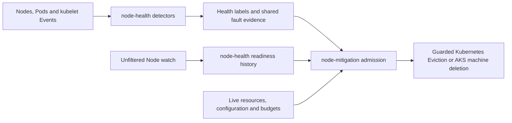
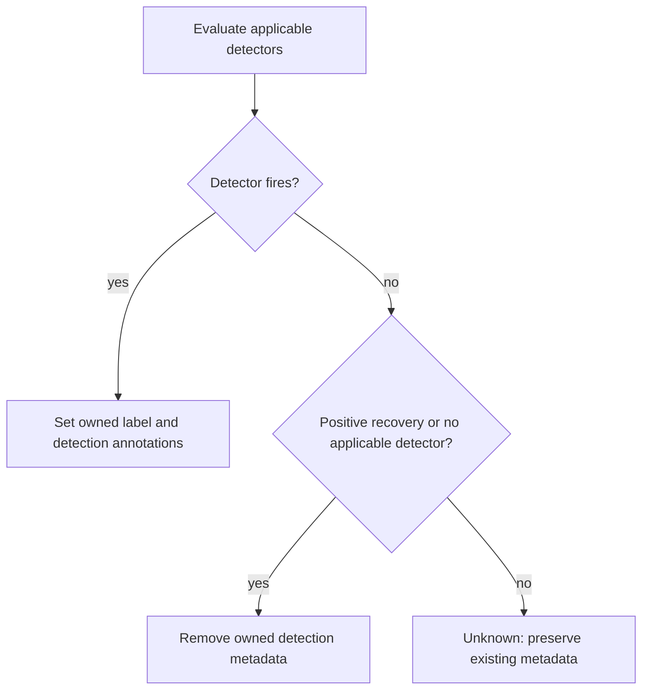

# Node Health

Node-health observes management-cluster faults and publishes evidence.
[Node-mitigation](node-mitigation.md) independently decides whether disruption is
safe and executes it. Both run inside `mgmt-agent`, with separate configuration
and rollout. **A health label is an observation, not permission to act.**

## Architecture and responsibilities

| Component | Owns | Does not own |
| --- | --- | --- |
| Node-health | Detector evaluation, health metadata, readiness evidence, detection metrics and Events. | Cordon, eviction, drain, taints or Pod/Node/machine deletion. |
| Node-mitigation | Fresh action admission, mitigation ownership, disruption accounting and pending AKS operations. | Detector definitions or authorization inferred from a label alone. |

Node-health uses central Kubernetes observations, not a host agent or host
commands. Ready-node sandbox detectors, the NotReady bootstrap candidate and
the unfiltered readiness observer have different eligibility rules. There is no
global Ready-only or Event-only restriction.

Supporting rationale and measurement methodology are in the
[evidence annex](node-mitigation-evidence.md). Detailed observations stay in its
linked Jira evidence record.

## Detector model

Detectors are tested Go units in
[`mgmt-agent/pkg/controller/nodehealth/detectors`](../../mgmt-agent/pkg/controller/nodehealth/detectors).
The registry uses stable names and the `Detector` interface: `Applies`,
`Evaluate`, `MeetsThreshold`, `Name` and `Reason`. Signatures, thresholds and
applicability are code constants, not runtime expressions.

Evaluation reads current Node, Pod and retained Event state with an injected
clock. Shared informers enqueue affected Nodes; an Event index uses
`Event.Source.Host`, without resolving through a potentially deleted Pod.
A periodic sweep covers SWIFT-v2 nodes and nodes already carrying the health
label, allowing time-based detection and stale-label retirement.

### Shared sandbox evidence

These rules apply to the two Ready-node, node-wide sandbox detectors below:

| Evidence | Interpretation |
| --- | --- |
| Scope | `kubernetes.azure.com/podnetwork-swiftv2-enabled=true` and `Ready=True`. |
| Failure identity | Match the detector's Event reason/signature and correlate the involved Pod UID to a live Pod on the emitting node. A reused Pod name cannot inherit evidence. |
| Stuck-pod floor | Count distinct nonterminal Pods with `PodReadyToStartContainers=False`, each individually past the detector's dwell. Event counts are not the floor. |
| Dwell | Use each Pod condition's `lastTransitionTime`, not Pod age, ingestion time or cumulative Event count. |
| Fresh success | A non-host-network Pod's sandbox-ready transition inside the detector window demonstrates sandbox creation. |
| Finished Pods | A first container start with zero restarts can demonstrate success even when the completed Pod's sandbox condition is False. |
| Not fresh success | Host-network Pods, old True conditions and container restarts inside an established sandbox. |
| Unknown | Missing conditions or timestamps cannot establish a stuck Pod or manufacture positive recovery evidence. |

The zero-success requirement concerns fresh sandboxes visible in retained Pod
state. Deleted observations are not proof either way. A detector can rebuild
its current verdict from a LIST of retained objects; this is **not** complete
lifetime readiness history. The [readiness observer](#readiness-history-for-deletion)
has a stricter continuity requirement.

### `swift-vf-teardown`

**Purpose:** detect a sustained node-wide inability to create SWIFT sandboxes,
even while the node reports Ready.

| Requirement | Value |
| --- | --- |
| Scope and evidence | [Shared sandbox evidence](#shared-sandbox-evidence). |
| Event | `FailedCreatePodSandBox`. |
| Signatures | Route-interface missing, network unreachable, MTPNC not ready, or DHCP discover timeout. |
| Distinct stuck Pods | At least two, each with at least 10 minutes of dwell. |
| Success window | No fresh sandbox success in the last 10 minutes. |

The signature alone cannot distinguish transient failures from a sustained
node-wide fault. Fresh sandbox success suppresses this detector; healthy-looking
network configuration objects do not establish that new sandboxes can start.
The detector reports an observed failure pattern, not proof of a physical cause
or authorization to delete a node.

### `cni-plugin-not-initialized`

**Purpose:** detect sustained CNI initialization failure that blocks new
sandboxes while the node still reports Ready.

| Requirement | Value |
| --- | --- |
| Scope and evidence | [Shared sandbox evidence](#shared-sandbox-evidence). |
| Event | Pod-scoped `NetworkNotReady` with `cni plugin not initialized` in the message. |
| Distinct stuck Pods | At least three, each with at least 20 minutes of dwell. |
| Success window | No fresh sandbox success in the last 20 minutes. |

This detector does not fire while the node is NotReady. It evaluates applicable
evidence when Ready returns; it does not infer uninterrupted readiness.

### `never-ready`

**Purpose:** identify possible SWIFT-v2 bootstrap failures for independent
[never-ready admission](node-mitigation.md#never-ready).

| Requirement | Value |
| --- | --- |
| Node scope | SWIFT-v2 label as above. |
| Current condition | Ready condition exists and is not True. |
| Timestamps | Creation and Ready transition are nonzero, correctly ordered, with the transition within two minutes of creation. |
| Age | At least 30 minutes from Node creation. |

**This is a candidate, not proof that the node was never Ready.** A node can
briefly become Ready and return to NotReady inside that tolerance. Deletion
requires the separate history contract below; waiting longer cannot repair
missing history.

### `swift-pod-sandbox-stalled`

**Purpose:** supply pod-scoped rescue evidence without requiring a node-wide
wedge. It is separate from the strong node-health label.

| Requirement | Value |
| --- | --- |
| Node | Assigned SWIFT-v2 node, currently Ready. |
| Pod | Requests or limits `aro.openshift.io/swift-nic` in a regular or init container. Shared selection handles nil Pods. |
| Sandbox | Initial sandbox unready, without container start, termination or restart evidence. |
| Fault | Matching sandbox failures correlated by Pod UID, namespace and `Event.Source.Host`. |
| Duration | Sustained matching fault span of at least 60 seconds, with matching activity within the last 60 seconds. |
| Lower bound | Span starts no earlier than scheduling, Pod creation and the sandbox-false transition. |

Successful neighbors do not suppress this pod-scoped signal. A lone warning,
cumulative Event count, image-pull delay or ordinary application-readiness
failure does not qualify. Detection and mitigation share the resource predicate
using [`SwiftNICResourceName`](../../internal/kuberesources/constants.go).
See the [threshold rationale](node-mitigation-evidence.md#threshold-methodology).

## Readiness history for deletion

This observer is distinct from pure detector evaluation. It consumes an
**unfiltered Node watch before informer/workqueue coalescing**, so intermediate
Ready transitions cannot disappear between reconciliations.

| Contract | Requirement |
| --- | --- |
| Positive readiness | The monotonic `node-health.aro-hcp.azure.com/ever-ready` annotation contains the Node UID. Observing Ready excludes that UID even if persistence fails; errors are reported. |
| Machine identity | Retain immutable VM ID to first Node UID bindings after Node deletion. Same-VM re-registration cannot start fresh history. A different VM may reuse a name or provider path. |
| Complete observation | Only a creation received on the uninterrupted watch can start complete Node history. Admission must observe through the exact resourceVersion from its live Node read. |
| VM lifetime | Azure VM ID must match Node `systemUUID`. Azure `timeCreated` must be strictly after the continuous-observation boundary, no later than Node creation and not in the future. Missing or inconsistent evidence is Unknown. |
| Observation loss | Initial LIST, reconnect, relist, disable and restart invalidate completeness for existing machines, including machines with no Node object. |
| Bounded bindings | At 10,000 entries, invalidate existing eligibility before discarding identity bindings. Deleting a registration without known machine identity also invalidates continuity. |
| Time | Synchronized controller, Azure and Kubernetes UTC clocks are required. A backward clock step must not move the observation boundary backward. |
| Authorization | Requires both deployment authorization for node mitigation and enabled node-health observation. Existing Azure read access suffices; there is no persistent machine-history ledger. |

An absent annotation is not proof of never-ready history. Unknown history,
unconfirmed marker persistence and observation gaps cannot authorize deletion,
even after another detection window. Readiness evidence grants no mitigation
ownership. Cancellation of an unsubmitted action belongs to the
[mitigation cordon contract](node-mitigation.md#cordon-ownership-and-cancellation).

## Health metadata

The field manager `mgmt-agent-node-health` owns these detection fields:

| Field | Meaning |
| --- | --- |
| `node-health.aro-hcp.azure.com/status=wedged` label | Selectable summary of a detector firing. |
| `.../detector` annotation | Stable detector name. |
| `.../reason` annotation | Short evidence summary. |
| `.../signature` annotation | Bounded signature for triage, not an action-routing key. |
| `.../observed-at` annotation | First labeling time for this observation, not a heartbeat. |

Annotations are refreshed when the detector identity changes, not on every
evidence-count change. The controller never removes a foreign value of the
status label.

An empty startup view, quiet node or missing evidence is not recovery. Detection
metadata does not replace the monotonic readiness marker.

## Configuration and operation

- `enabled` is the strictly parsed, hot-reloaded node-health switch. Missing
  configuration defaults to disabled; invalid configuration reports an error
  and retains the last valid value. Detector parameters remain code-owned.
- Disabled observation stops evaluation and metadata writes while informers
  remain available. The readiness-history contract treats the gap as Unknown.
  Existing labels are not evidence that observation remains enabled.
- Git/Helm owns the ConfigMap. Live edits are break-glass changes overwritten
  by rollout; persistent enablement belongs in Git.
- `kubectl describe node <node>` shows detection metadata and `NodeHealthLabeled`
  / `NodeHealthUnlabeled` Events. Labels can recur if the detector still fires.
- Node-health requires Node read/watch/patch, Pod read/watch, Event read/watch/
  create/patch and configuration read/watch. It adds no CRD or finalizer and
  does not require Secrets, guest-cluster access or disruptive API permissions.

## Observability and validation

Metrics are collected through [mgmt-agent monitoring](../monitoring.md):

| Metric | Purpose |
| --- | --- |
| `nodehealth_detections_total{detector,signature}` | Detection transitions, with bounded code-defined labels. |
| `nodehealth_label_actions_total{action,result}` | Metadata action outcomes. |
| `nodehealth_wedged_nodes` | Current labeled-node count; zero while disabled. |
| `nodehealth_node_wedged{node,detector,signature}` | Per-node alert context, rebuilt from current labeled nodes and empty while disabled. |

Validation covers detector boundary values, distinct-Pod dwell, Event aggregation,
UID reuse, terminal and host-network Pods, fresh versus restarted containers,
Unknown evidence, owned-label retirement and configuration reload.
History tests additionally cover brief Ready transitions, exact resourceVersion
barriers, marker-write failures, same-VM re-registration, missing VM birth time,
clock changes, restart without a Node and exhausted identity storage.

Labeling is enabled and observed in a non-production environment before broader
rollout. Alert thresholds and environment enablement are rollout decisions.
[Mitigation rollout](node-mitigation.md#validation-and-rollout) is independent;
detector enablement alone never enables disruption.
