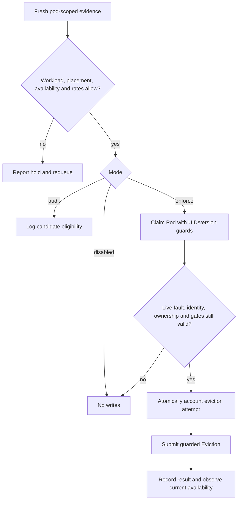
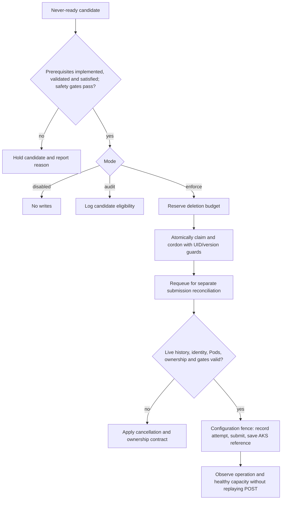

# Node Mitigation

Node-health identifies faults and preserves readiness evidence.
**Node-mitigation decides whether an action is safe and executes it.**
Both run inside `mgmt-agent`, with independent configuration and rollout.
The [shared architecture](node-health.md#architecture-and-responsibilities)
separates observation from action; a health label never authorizes disruption.

This design has two independent mitigators: SWIFT pod eviction and guarded
never-ready machine deletion. It does not provide general draining, direct
Pod/Node/Compute deletion, pool resizing, host commands or automatic escalation.
Supporting rationale and references belong in the
[evidence annex](node-mitigation-evidence.md).

## Shared contracts

| Component | Responsibility |
| --- | --- |
| Detector integration | Shared node-health evidence, correlated by Node/Pod UID, detector and fault timestamps. Labels are summaries, not live heartbeats. |
| Mitigator registry | Tested Go policies selected by stable detector name. Unknown, disabled or conflicting routes cannot authorize actions. |
| Admission | Current evidence, workload policy, placement, availability and disruption allowance. Missing evidence holds the action. |
| Executors | Live identity and ownership checks before API calls; the only mitigation write boundary. |
| Accounting | Atomic reservations, rate history and unresolved AKS operations in `NodeMitigationBudget`. |
| Observation | Current workload availability, operation results and capacity; no saved Pod status or replacement tracking. |

Shared informers and leader election drive level-based reconciliation with at
most one guarded action per pass. Waiting requeues work rather than blocking a
worker. Mitigators return an eligible action or hold reason, not an execution
plan. Budgets prevent overlapping admissions across detectors.

## Modes and configuration

| Mode | Contract |
| --- | --- |
| `disabled` | Default. No mitigation writes; submitted operations remain observable. |
| `audit` | Evaluate each candidate against current state and existing reservations; log `candidateEligible`, hold reason and next eligible time. |
| `enforce` | Permit only the selected mitigators' guarded actions and accounting writes. |

**Audit makes zero mitigation API writes**, including ownership labels, cordon
release, Eviction, AKS requests, budget updates and Kubernetes Events. It does
not reserve hypothetical actions: two candidates can each qualify for one free
slot. Audit counts are not a forecast of admitted actions or recovery.
Node-health retains its separate configuration and metadata writes.

The deployment flag `mgmtAgent.nodeMitigation.enabled` defaults to false and
gates controller enablement and the AKS deletion-role assignment. There is no
second environment-name allowlist. Runtime mode cannot override that flag.
Git/Helm supplies strictly validated, reloadable YAML selecting mitigators,
workloads, disposable agents, healthy floors, concurrency, windows and cooldowns.
Selected actions require explicit valid settings. Invalid configuration reports
an error and retains the last valid value; missing configuration disables writes.

Current configuration applies to work in progress. A pause preserves accounting,
cannot revoke an accepted API request and permits read-only observation only.
One configuration fence covers durable deletion-attempt recording, submission
and operation-reference persistence. A change accepted before that fence
prevents the attempt without an Unknown marker; crashes or uncertain API/status
writes inside it still require reconciliation.

## SWIFT eviction

| Aspect | Design |
| --- | --- |
| Purpose | Rescue an unhealthy Pod without disrupting healthy neighbors. |
| Evidence | The canonical [`swift-pod-sandbox-stalled` signal](node-health.md#swift-pod-sandbox-stalled), independent of the node-wide wedge label. |
| Eligibility | Supported live workload owner and label policy, current fault, feasible placement, minimum availability and eviction-rate allowance. Pod names alone do not authorize action. |
| Action | `policy/v1` Eviction with UID/resourceVersion preconditions. No cordon, drain, direct DELETE, node cleanup or automatic escalation. |
| Outcome | Observe current Deployment availability. A Ready Pod on the original node is acceptable; no particular replacement is tracked. |

Recovery cancels eviction. Ownership removal or takeover cannot authorize another
attempt. Eviction rates are keyed by workload owner and node, survive Pod
recreation/restart, and account for unknown results. Admission does not require
every replica to be Ready, which would prevent rescue of multiple stuck replicas.
Unreleased MTPNC allocations count against NIC capacity; Pod deletion or a fixed
sleep does not prove release.

### Pod protection

- Healthy Pods are not candidates. Finalizers and configured grace periods stay
  intact. Static/mirror Pods, DaemonSets, unsupported owners and stateful/local
  storage require explicit safety policies.
- Pending Pods use Kubernetes' PDB exemption. Running-unready Pods may be
  evictable under the owner's `unhealthyPodEvictionPolicy: AlwaysAllow`; healthy
  Pods still obey the PDB. RBAC, admission and identity checks always apply.
- An eviction denial or HTTP 429 holds the action. Throttling and PDB denial are
  distinct outcomes; neither permits direct DELETE or machine-deletion fallback.
- HyperShift router support depends on the live PDB and per-HCP CPO image,
  not the hypershift-operator image or version name alone. See
  [owner-managed PDB support](node-mitigation-evidence.md#router-pdb-support).

## Never-ready

| Aspect | Design |
| --- | --- |
| Purpose | Remove a machine that failed to join without deleting one that became Ready and later failed. |
| Candidate | The canonical [`never-ready` detector](node-health.md#never-ready). |
| Prerequisites | Complete [readiness history](node-health.md#readiness-history-for-deletion), verified immutable VM identity, validated cordon ownership/release, live Pod policy and capacity/budget admission. |
| Action | Owned cordon, then AKS `agentPools/deleteMachines/action` in a separate reconciliation. No general drain. |
| Gate | Enforcement requires implemented and validated prerequisites. Otherwise evaluate candidates only, without reservations, ownership writes, cordons or AKS submissions. SWIFT is independent. |

### Pods allowed to remain

| Pod category | Policy |
| --- | --- |
| Explicitly approved disposable node-local DaemonSet | May remain and be lost with the machine, without Eviction or PDB protection. |
| Other nonterminal Pod | Blocks deletion, including application Pods, unapproved DaemonSets and unknown/mismatched owners. |
| Terminal Pod | May remain only after finalizer, shutdown and storage checks; hostPath/emptyDir still needs exact disposable approval. |
| Static/mirror Pod or protected shutdown/data requirements | Blocks deletion in every phase, even for an otherwise approved DaemonSet. |

Approval pins namespace, DaemonSet name, live owner UID, node-local role and
SHA256 digests of its template and admitted Pod spec. Normalization excludes
per-node binding and generated service-account volume names, not projection
contents, mounts, injected containers or storage. No implicit owner-kind or
label exemption exists. Changed policy/template/spec requires fresh approval.
Finalizers, persistent/remote/CSI storage, resource claims, debug containers,
terminating Pods and preStop hooks are not disposable exceptions.

### Cordon ownership and cancellation

The ownership label and
`node-mitigation.aro-hcp.azure.com/cordon-reservation` annotation are atomically
patched with `spec.unschedulable=true`. The annotation identifies the budget
reservation key/timestamp; the ledger binds Node UID and original machine.
UID/resourceVersion preconditions protect every claim or release.

| State | Contract |
| --- | --- |
| Existing external cordon | Never adopt or remove it. |
| Owned action | Live label, annotation, cordon and reservation must identify the same Node UID and machine. |
| Unsubmitted admission loses eligibility | Recovery, missing history, a blocking Pod or revoked never-ready authorization cancels admission; do not drain the blocker. |
| Safe cancellation | Release matching cordon and ownership metadata before marking the reservation cancelled. A crash between writes is recovered without reclaiming the unowned, uncordoned Node. |
| Missing Node or replacement UID | Cancel the unsubmitted reservation without modifying a different Node. |
| Missing/foreign ownership | Hold for operator reconciliation rather than uncordoning. |
| Any attempted, pending or unknown deletion | Never automatically uncordon, including after readiness recovery. |
| Audit/disabled | No release writes. Report paused unsubmitted ownership; cancellation needs enforce mode or explicit operator reconciliation. |

Operator takeover removes or changes the reservation annotation.
`kubectl cordon` on an already-cordoned Node is not a distinguishable claim.
The annotation is cooperative ownership, not a lock; removing it cannot cancel
an attempted AKS request.

**Residual scheduling risk is accepted.** Cordon protects ordinary scheduling
during pending deletion, but in-flight bindings, direct `spec.nodeName` placement
and actors bypassing scheduling restrictions can add a blocking Pod after the
final list. That Pod can be lost. AKS supplies neither cordon/drain nor Kubernetes
UID preconditions, Eviction or PDB protection; the final check is not atomic
with machine removal.

### AKS operation contract

The request must target the verified cluster, pool and original immutable VM.
Live Node UID and provider ID must still match the reservation.
A replacement reusing a machine name/provider path is not a retry target.
`202 Accepted` is not deletion completion. Persist the durable attempt and
returned operation reference, poll pending results and never blindly replay a
POST after restart, timeout, lost response or failed reference persistence.
Unknown outcomes retain allowance and require operator reconciliation.

Active reservations are released only after operation-result and healthy-capacity
checks. Successful deletion does not prove replacement capacity or pool-target
restoration. Deletion history remains for its full rolling window.

## Disruption budgets and capacity

| Limit | Contract |
| --- | --- |
| Concurrent deletion | Bound active reservations per pool, zone and cluster, including other unavailable nodes. |
| Rolling deletion | At most `floor(10% * baseline pool target)` per configured window. Retries do not count as another deletion. |
| Small pools | Targets 1-9 permit one per window and one in flight only with Ready replacement capacity and healthy floors. Target zero permits none. |
| Eviction | Independent per-workload/node rates and cooldowns. SWIFT does not reserve a node or consume a deletion slot. |
| Placement | Check CPU/memory, Pod slots, extended resources, init/overhead semantics, affinity, taints, topology and storage. Account for external cordons, maintenance and NotReady nodes. SKU totals alone are insufficient. |

The persisted pool baseline is keyed by full AKS agent-pool resource ID and comes
from fresh `properties.count`, not Node/VMSS counts or autoscaler bounds:

| Observation | Baseline treatment |
| --- | --- |
| Initial target | Persist before reservation, with verified identity and no active scale/upgrade. |
| Lower target | Tighten immediately; existing excess usage blocks new actions. |
| Higher target | Retain the lower baseline until a full stable deletion window, no active scale/upgrade and Ready added capacity. |
| Replacement/surge | Does not increase the target or allowance. |
| Stale/missing state or observation gap | Hold new actions and restart increase-stability observation. Restart gaps cannot count as stable time. |

Refresh pool state before admission/submission. Persist baseline, observed target,
observation time and pending-increase stability. Changes never reset reservations
or history. Insufficient capacity holds without forced scaling; independent
platform operations are outside this controller's deletion budget.

## Durable state and permissions

| State | Lifetime and ownership |
| --- | --- |
| Resource ownership metadata | Mitigation-owned and separate from detector fields; disappearance does not erase accounting. |
| Readiness evidence | Node-health-owned, under its [continuity contract](node-health.md#readiness-history-for-deletion). |
| `NodeMitigationBudget` | Version-checked reservations, baseline, bounded rate/deletion history, original machine identity and AKS attempt/reference/outcome. No Node owner reference, Pod snapshots or execution phase. |
| Completed records | Pruned only after accounting/retention periods; malformed or full accounting holds actions, never resets allowance. |

Leader election and atomic resourceVersion updates coordinate admission. Reserve
before action; uncertain outcomes keep the reservation. A nonempty eviction
ledger requires a valid positive accounting window before any pruning.

| Identity | Permissions |
| --- | --- |
| Mgmt-agent | Kubernetes reads, ownership/cordon patches, Eviction and budget writes; required AKS reads/status and cluster-scoped `deleteMachines` action. Explicit credentials; Helm selects workload identity. |
| Fleet | Read topology/capacity; no machine-deletion execution. |
| Deployment cleanup | Cluster-scoped role-assignment read/delete, with an Azure condition restricting deletion to the dedicated machine-deletion role across principals. No assignment-write or machine-deletion privilege. |

The infrastructure rollout owns **all** assignments of that dedicated role at
the exact cluster scope, including manual grants. Complete paginated discovery
and validation of scope, role, assignment and principal precede mutation.
Enabled retains only the current
canonical assignment; disabled retains none, including rotated principals.
Each target is rechecked; final-set verification is required. Failed discovery,
validation or cleanup fails the rollout.

Azure RBAC scope inherits to descendants, but the helper acts only at the exact
cluster scope. Other scopes/roles, Reader and the role definition stay intact.
Revocation has propagation delay; a runtime pause is not permission revocation.
Contributor, Owner, direct Compute deletion and pool resizing are not required.

## Validation and rollout

Decision and API tests must cover evidence/threshold boundaries, UID/version and
ownership races, recovery, PDB denial/throttling, multiple stuck replicas,
rate-history retention, concurrent reservations and malformed/full budgets.
Never-ready additionally covers the full readiness contract, exact disposable
approvals, release-before-accounting crashes, external/operator cordons,
attempted-deletion holds, AKS identity/retry behavior and the accepted binding race.
Baseline tests cover zero/small/large pools, scale changes, surge and restart gaps.
Audit tests assert zero writes, including Events and cancellation.

Structured logs identify detector, workload/Pod/Node UID, timestamps and
requested/accepted/denied/unknown results. Metric labels stay bounded by action,
outcome and reason, not resource identities. Outcome analysis follows the
[annex methodology](node-mitigation-evidence.md#eviction-outcomes).

Defaults remain disabled. Detection, SWIFT audit/canary and never-ready
enforcement have independent graduation. Live scenarios and environment
enablement require explicit authorization; deployment configuration records
that choice. Never-ready prerequisites cannot be bypassed by mode or permissions.
