# Controller and Resource Data Flow

This reference covers every concrete controller in the current checkout: backend,
fleet, kube-applier, management-agent, sessiongate, and shared informer management.
It maps their inputs, decisions and effects across Cosmos DB, Azure, Cluster Service
and Kubernetes. Source baseline: `7997fa34a240560a792c3dd410396cd7651a9f39`.
Targeted update baseline: `09d331f6162b72103c3c33cce307ab939ed3d958`;
scope: BackupCleanup, its registration and cluster-delete effects.

The generation instructions are maintained in [controller-data-flow.md](prompts/controller-data-flow.md).
The historical filename is retained for existing links.

- [Cosmos request attribution](#request-unit-ru-attribution)
- [Endpoint writes](#1-frontend-endpoint-writes)
- [Controller catalog](#2-complete-controller-catalog)
- [External effects and ownership](#external-effects-and-ownership)
- [Resource lifecycle digraphs](#3-resource-lifecycle-digraphs)
- [Shared fields and ownership](#4-shared-fields-and-ownership)

Cosmos persistence spans the **Resources**, **Billing**, **Fleet**, and
**per-management-cluster kube-applier** containers. Resource replacements generally
use ETag optimistic concurrency and advance `InstanceVersion`; creates, deletes
and transactional batches have their own semantics. A successful Cosmos write of
an intent does not establish that an Azure or Kubernetes resource exists.

## Request Unit (RU) attribution

Sources: [Cosmos metrics policy](../internal/database/cosmosstorage/cosmosmetrics/policy.go),
[client wiring](../internal/database/cosmosstorage/corecosmosstorage/database.go), and
[informer attribution](../internal/database/informers/informerutils/context.go).

Clients constructed through `corecosmosstorage.NewCosmosDatabaseClient` record two
shared, process-wide counters through the same per-retry pipeline policy:

- `cosmos_request_units_total` sums the `x-ms-request-charge` response header
  once per HTTP attempt, including charged failures, query pages, and idle
  changefeed responses. Missing, malformed, negative, or non-finite charges
  are ignored, so this measures reported RUs, not request count.
- `cosmos_requests_total` counts every HTTP attempt that received a response,
  regardless of whether a charge was reported. It exists because a `429` is
  typically rejected before Cosmos DB does any work and usually reports a
  zero or absent charge — `cosmos_request_units_total` alone cannot answer
  "how often was this source throttled", only "how much RU did its throttled
  attempts happen to cost" (usually ~0 regardless of frequency).

Neither instruments credential requests. Both share the same labels:

| Label | Meaning |
|-------|---------|
| `source_kind` | `controller`, `informer`, or `unattributed` |
| `source` | Explicit informer name, otherwise the existing controller context name, otherwise `unknown` |
| `cosmosdb_container` | Actual Cosmos container name, preserving casing; `unknown` when the request has no identifiable container |
| `operation` | `read`, `create`, `upsert`, `replace`, `patch`, `delete`, `query`, `query_plan`, `batch`, `change_feed`, `feed_ranges`, `metadata`, or `unknown` |
| `status_code` | HTTP response status, including failures and `304` |

Cosmos requests made by an informer’s List/Watch operations are attributed to that
informer, even if the context also contains a controller name. Initial lists,
relists, query pages, and asynchronous feed polls belong to the informer, not
to each consuming controller. `ActiveOperations` and `AllOperations` have separate
identities. Controller CRUD, including controller-status persistence, retains
the controller's existing context.

The SDK refreshes its partition-range cache in the background, so those
charges cannot be attributed. They land in `unattributed` / `unknown` and
the amount is small.
Other callers without identity use that same bucket. Requests whose responses
never reach the client cannot contribute to either counter; compare with Cosmos
platform metrics when investigating discrepancies.

Average RU/s by source, deduplicating HA scrapes before summing targets:

```promql
sum by (source_kind, source) (
  max without (prometheus_replica) (
    rate(cosmos_request_units_total[5m])
  )
)
```

Rate of `429` responses by source — a request count, not RU cost:

```promql
sum by (source_kind, source) (
  max without (prometheus_replica) (
    rate(cosmos_requests_total{status_code="429"}[5m])
  )
)
```

---

## 1. Frontend Endpoint Writes

Request-body merging and response helpers live under
[coreapihelpers](../internal/apihelpers/coreapihelpers/); resource-ID and Cosmos
metadata helpers live under [metadataapihelpers](../internal/apihelpers/metadataapihelpers/),
[fleetapihelpers](../internal/apihelpers/fleetapihelpers/) and
[kubeapplierapihelpers](../internal/apihelpers/kubeapplierapihelpers/).
The helper-package move does not change endpoint ownership or transactional boundaries.

### Read-Only Create Fields

For cluster, node-pool and external-auth creates in every supported API version,
the frontend calls `ClearReadOnlyFields()` after successful JSON unmarshaling and
before `ConvertToInternal(nil)`. Supplied `readOnly` fields are discarded rather
than converted or persisted: resource `id`, `type`, `systemData`, provisioning
state, status/conditions where exposed, cluster API/console/issuer URLs and DNS
`baseDomain`, and managed-identity principal/tenant IDs and user-assigned identity
client/principal IDs. `name` is retained for the existing request-path mismatch
check; persisted resource identity still comes from the request path. JSON decode
errors retain their existing handling; clearing does not bypass unmarshaling.

Deployment preflight applies the same clearing before conversion for all three
resource types. It retains `name` for resource routing and restores `type` from
the preflight envelope before validation; it does not persist resources.

Writable customer inputs and their defaulting/validation are unchanged, including
DNS `baseDomainPrefix`, external-auth issuer URL/client IDs, and managed-identity
type/resource-ID selections. The frontend still generates resource metadata,
operation records, active-operation references and initial `Accepted` provisioning
state. Backend controllers remain authoritative for observed endpoints, resolved
identity values and status. This is preventive create-input handling, not a repair
or migration of existing Cosmos documents; PUT-update/PATCH read-only preservation
is unchanged.

### PUT Subscription

**Path:** `PUT /subscriptions/{subscriptionId}`
**Handler:** `ArmSubscriptionPut` ([frontend.go](../frontend/pkg/frontend/frontend.go))
**Write method:** Standalone `Create()` or `Replace()` (not transactional)

| Object | Fields Written |
|--------|---------------|
| `Subscription` | <ul><li>Writable fields from request body (`State`, `Properties.*`)</li><li>Supplied `CosmosMetadata` is zeroed after unmarshal, before deriving `ResourceID` and `PartitionKey` from the request path</li><li>On create: server-owned storage metadata</li><li>On replace: preserves `CosmosMetadata` from existing doc, including its ETag</li></ul> |

Side effect: if `State == Deleted`, calls `DeleteAllResourcesInSubscription` which
transitively deletes all clusters (and their children) via transactional batches.

---

### PUT Cluster (Create)

**Path:** `PUT .../hcpOpenShiftClusters/{name}` (resource does not exist)
**Handler:** `createHCPCluster` ([cluster.go](../frontend/pkg/frontend/cluster.go))
**Write method:** Transactional batch (`AddCreateToTransaction` x2)

| Object | Fields Written |
|--------|---------------|
| `HCPOpenShiftCluster` | <ul><li>`CustomerProperties.*` from request body (unmarshaled, read-only fields cleared before conversion to internal, `EnsureDefaults()` applied)</li><li>`TrackedResource.ID` (from URL resource ID)</li><li>`TrackedResource.Name` (from URL resource ID)</li><li>`TrackedResource.Type` (from URL resource ID)</li><li>`TrackedResource.Location` = `azureLocation`</li><li>`Tags`</li><li>`SystemData.CreatedAt`, `SystemData.CreatedBy`, `SystemData.CreatedByType`</li><li>`SystemData.LastModifiedAt`, `SystemData.LastModifiedBy`, `SystemData.LastModifiedByType`</li><li>`CosmosMetadata.ResourceID`, `CosmosMetadata.PartitionKey`</li><li>`ServiceProviderProperties.ManagedIdentitiesDataPlaneIdentityURL` (from `X-Ms-Identity-Url` header)</li><li>`Identity.UserAssignedIdentities` (cleared then rebuilt via `completeClusterIdentity` from `CustomerProperties.Platform.OperatorsAuthentication.UserAssignedIdentities.ControlPlaneOperators` and `.ServiceManagedIdentity`, without supplied client/principal IDs)</li><li>`ServiceProviderProperties.ActiveOperationID` = new operation's `ResourceID.Name`</li><li>`ServiceProviderProperties.ProvisioningState` = `Accepted`</li></ul> |
| `Operation` | <ul><li>`Request` = `Create`</li><li>`ExternalID` = cluster ARM resource ID</li><li>`InternalID` = empty</li><li>`Status` = `Accepted`</li><li>`TenantID` (from `X-Ms-Home-Tenant-Id` header)</li><li>`ClientID` (from `X-Ms-Client-Object-Id` header)</li><li>`NotificationURI` (from `X-Ms-Async-Notification-Uri` header)</li><li>`StartTime` = now</li><li>`LastTransitionTime` = now</li><li>`OperationID` = generated ARM resource ID</li><li>`ResourceID` = generated ARM resource ID</li><li>`ClientRequestID`, `CorrelationRequestID` (from correlation data)</li></ul> |

---

### PUT Cluster (Update)

**Path:** `PUT .../hcpOpenShiftClusters/{name}` (resource exists)
**Handler:** `updateHCPClusterInCosmos` ([cluster.go](../frontend/pkg/frontend/cluster.go))
**Write method:** Transactional batch (`AddCreateToTransaction` + `AddReplaceToTransaction`)

| Object | Fields Written |
|--------|---------------|
| `HCPOpenShiftCluster` | <ul><li>`CustomerProperties.*` (from request body; `DNS.BaseDomainPrefix` and `Platform.ManagedResourceGroup` carried from old if empty)</li><li>`Tags` (nil in request = keep old; non-nil = replace)</li><li>`SystemData.LastModifiedAt`, `LastModifiedBy`, `LastModifiedByType`</li><li>Read-only fields copied from old via `CopyReadOnlyClusterValues`: `TrackedResource`, `CosmosMetadata`, `Identity` (PrincipalID, TenantID, non-nil UserAssignedIdentity values), `ServiceProviderProperties` (entire deep copy), `Status` (entire deep copy)</li><li>`Identity.UserAssignedIdentities` (cleared then rebuilt via `completeClusterIdentity` with old identity data)</li><li>`ServiceProviderProperties.ActiveOperationID` = new operation's `ResourceID.Name`</li><li>`ServiceProviderProperties.ProvisioningState` = `Accepted`</li></ul> |
| `Operation` | <ul><li>`Request` = `Update`</li><li>`ExternalID` = cluster ARM resource ID</li><li>`InternalID` = empty</li><li>`Status` = `Accepted`</li><li>`TenantID`, `ClientID`, `NotificationURI` (from headers)</li><li>`StartTime`, `LastTransitionTime`, `OperationID`, `ResourceID`, `ClientRequestID`, `CorrelationRequestID`</li></ul> |

---

### PATCH Cluster (Update)

**Path:** `PATCH .../hcpOpenShiftClusters/{name}`
**Handler:** `updateHCPClusterInCosmos` ([cluster.go](../frontend/pkg/frontend/cluster.go))
**Write method:** Transactional batch (`AddCreateToTransaction` + `AddReplaceToTransaction`)

| Object | Fields Written |
|--------|---------------|
| `HCPOpenShiftCluster` | <ul><li>`CustomerProperties.*` (old resource used as base, PATCH body overlaid, then converted to internal)</li><li>`Tags` (nil in request = keep old; non-nil = replace)</li><li>`SystemData.LastModifiedAt`, `LastModifiedBy`, `LastModifiedByType`</li><li>Read-only fields copied from old via `CopyReadOnlyClusterValues`: `TrackedResource`, `CosmosMetadata`, `Identity`, `ServiceProviderProperties`, `Status`</li><li>`Identity.UserAssignedIdentities` (cleared then rebuilt via `completeClusterIdentity` with old identity data)</li><li>`ServiceProviderProperties.ActiveOperationID` = new operation's `ResourceID.Name`</li><li>`ServiceProviderProperties.ProvisioningState` = `Accepted`</li></ul> |
| `Operation` | <ul><li>`Request` = `Update`</li><li>`ExternalID` = cluster ARM resource ID</li><li>`InternalID` = empty</li><li>`Status` = `Accepted`</li><li>`TenantID`, `ClientID`, `NotificationURI`</li></ul> |

---

### DELETE Cluster

**Path:** `DELETE .../hcpOpenShiftClusters/{name}`
**Handler:** `addDeleteClusterToTransaction` ([cluster.go](../frontend/pkg/frontend/cluster.go))
**Write method:** Single transactional batch containing cluster + all child resources

| Object | Fields Written |
|--------|---------------|
| `HCPOpenShiftCluster` | <ul><li>`ServiceProviderProperties.DeletionTimestamp` = now (if nil)</li><li>`ServiceProviderProperties.ActiveOperationID` = new operation's `ResourceID.Name`</li><li>`ServiceProviderProperties.ProvisioningState` = `Deleting`</li><li>`ServiceProviderProperties.UsesNewClusterDeletionApproach` = `true`</li></ul> |
| `Operation` | <ul><li>`Request` = `Delete`</li><li>`ExternalID` = cluster ARM resource ID</li><li>`InternalID` = empty</li><li>`Status` = `Deleting`</li><li>`UsesNewClusterDeletionApproach` = `true`</li><li>`TenantID`, `ClientID`, `NotificationURI` (if from user request)</li></ul> |
| Child `NodePool`s (each) | <ul><li>`ServiceProviderProperties.DeletionTimestamp` = now (if nil)</li><li>`ServiceProviderProperties.ActiveOperationID` = new per-NP delete operation's `ResourceID.Name`</li><li>`Properties.ProvisioningState` = `Deleting`</li><li>`ServiceProviderProperties.UsesNewNodePoolDeletionApproach` = `true`</li></ul> |
| Child `NodePool` `Operation`s (each) | <ul><li>`Request` = `Delete`, `ExternalID`, `Status` = `Deleting`</li><li>`UsesNewNodePoolDeletionApproach` = `true`</li></ul> |
| Child `ExternalAuth`s (each) | <ul><li>`ServiceProviderProperties.DeletionTimestamp` = now (if nil)</li><li>`ServiceProviderProperties.ActiveOperationID` = new per-EA delete operation's `ResourceID.Name`</li><li>`Properties.ProvisioningState` = `Deleting`</li><li>`ServiceProviderProperties.UsesNewExternalAuthDeletionApproach` = `true`</li></ul> |
| Child `ExternalAuth` `Operation`s (each) | <ul><li>`Request` = `Delete`, `ExternalID`, `Status` = `Deleting`</li><li>`UsesNewExternalAuthDeletionApproach` = `true`</li></ul> |
| Canceled `Operation`s | <ul><li>Active operations on the cluster get `Status` = `Canceled`, `LastTransitionTime` = now</li></ul> |

---

### PUT NodePool (Create)

**Path:** `PUT .../nodePools/{name}` (resource does not exist)
**Handler:** `createNodePool` ([node_pool.go](../frontend/pkg/frontend/node_pool.go))
**Write method:** Transactional batch (`AddCreateToTransaction` x2)

| Object | Fields Written |
|--------|---------------|
| `HCPOpenShiftClusterNodePool` | <ul><li>Writable `Properties.*` from request body (unmarshaled, read-only fields cleared before conversion to internal, `EnsureDefaults()` applied)</li><li>`TrackedResource.ID`, `TrackedResource.Name`, `TrackedResource.Type`, `TrackedResource.Location`</li><li>`Tags`, `SystemData`</li><li>`CosmosMetadata.ResourceID`, `CosmosMetadata.PartitionKey`</li><li>`ServiceProviderProperties.ActiveOperationID` = new operation's `ResourceID.Name`</li><li>`Properties.ProvisioningState` = `Accepted`</li></ul> |
| `Operation` | <ul><li>`Request` = `Create`</li><li>`ExternalID` = node pool ARM resource ID</li><li>`InternalID` = empty</li><li>`Status` = `Accepted`</li><li>`TenantID`, `ClientID`, `NotificationURI`</li></ul> |

---

### PUT/PATCH NodePool (Update)

**Path:** `PUT/PATCH .../nodePools/{name}` (resource exists)
**Handler:** `updateNodePoolInCosmos` ([node_pool.go](../frontend/pkg/frontend/node_pool.go))
**Write method:** Transactional batch (`AddCreateToTransaction` + `AddReplaceToTransaction`)

| Object | Fields Written |
|--------|---------------|
| `HCPOpenShiftClusterNodePool` | <ul><li>`Properties.*` (from request; `Version.ID` carried from old if empty, `Platform.SubnetID` carried from old if nil)</li><li>`Tags` (nil in request = keep old; non-nil = replace)</li><li>`SystemData.LastModifiedAt`, `LastModifiedBy`, `LastModifiedByType`</li><li>Read-only fields copied from old via `CopyReadOnlyNodePoolValues`: `TrackedResource`, `CosmosMetadata`, `Identity`, `Properties.ProvisioningState`, `ServiceProviderProperties`, `Status`</li><li>`ServiceProviderProperties.ActiveOperationID` = new operation's `ResourceID.Name`</li><li>`Properties.ProvisioningState` = `Accepted`</li></ul> |
| `Operation` | <ul><li>`Request` = `Update`</li><li>`ExternalID` = node pool ARM resource ID</li><li>`InternalID` = empty</li><li>`Status` = `Accepted`</li></ul> |

---

### DELETE NodePool

**Path:** `DELETE .../nodePools/{name}`
**Handler:** `addDeleteNodePoolToTransaction` ([node_pool.go](../frontend/pkg/frontend/node_pool.go))
**Write method:** Transactional batch

| Object | Fields Written |
|--------|---------------|
| `HCPOpenShiftClusterNodePool` | <ul><li>`ServiceProviderProperties.DeletionTimestamp` = now (if nil)</li><li>`ServiceProviderProperties.ActiveOperationID` = new operation's `ResourceID.Name`</li><li>`Properties.ProvisioningState` = `Deleting`</li><li>`ServiceProviderProperties.UsesNewNodePoolDeletionApproach` = `true`</li></ul> |
| `Operation` | <ul><li>`Request` = `Delete`</li><li>`ExternalID`, `Status` = `Deleting`</li><li>`UsesNewNodePoolDeletionApproach` = `true`</li></ul> |
| Canceled `Operation`s | <ul><li>Active operations on the node pool get `Status` = `Canceled`, `LastTransitionTime` = now</li></ul> |

---

### PUT ExternalAuth (Create)

**Path:** `PUT .../externalAuths/{name}` (resource does not exist)
**Handler:** `createExternalAuth` ([external_auth.go](../frontend/pkg/frontend/external_auth.go))
**Write method:** Transactional batch (`AddCreateToTransaction` x2)

| Object | Fields Written |
|--------|---------------|
| `HCPOpenShiftClusterExternalAuth` | <ul><li>Writable `Properties.*` from request body (unmarshaled, read-only fields cleared before conversion to internal, `EnsureDefaults()` applied)</li><li>`ProxyResource.ID`, `ProxyResource.Name`, `ProxyResource.Type`</li><li>`SystemData`</li><li>`CosmosMetadata.ResourceID`, `CosmosMetadata.PartitionKey`</li><li>`ServiceProviderProperties.ActiveOperationID` = new operation's `ResourceID.Name`</li><li>`Properties.ProvisioningState` = `Accepted`</li></ul> |
| `Operation` | <ul><li>`Request` = `Create`</li><li>`ExternalID` = external auth ARM resource ID</li><li>`InternalID` = empty</li><li>`Status` = `Accepted`</li></ul> |

---

### PUT/PATCH ExternalAuth (Update)

**Path:** `PUT/PATCH .../externalAuths/{name}` (resource exists)
**Handler:** `updateExternalAuthInCosmos` ([external_auth.go](../frontend/pkg/frontend/external_auth.go))
**Write method:** Transactional batch (`AddCreateToTransaction` + `AddReplaceToTransaction`)

| Object | Fields Written |
|--------|---------------|
| `HCPOpenShiftClusterExternalAuth` | <ul><li>`Properties.*` (from request)</li><li>`SystemData.LastModifiedAt`, `LastModifiedBy`, `LastModifiedByType`</li><li>Read-only fields copied from old via `CopyReadOnlyExternalAuthValues`: `ProxyResource`, `CosmosMetadata`, `Properties.ProvisioningState`, `ServiceProviderProperties`, `Status`</li><li>`ServiceProviderProperties.ActiveOperationID` = new operation's `ResourceID.Name`</li><li>`Properties.ProvisioningState` = `Accepted`</li></ul> |
| `Operation` | <ul><li>`Request` = `Update`</li><li>`ExternalID`, `InternalID` = `*externalAuth.ServiceProviderProperties.ClusterServiceID`</li><li>`Status` = `Accepted`</li></ul> |

---

### DELETE ExternalAuth

**Path:** `DELETE .../externalAuths/{name}`
**Handler:** `addDeleteExternalAuthToTransaction` ([external_auth.go](../frontend/pkg/frontend/external_auth.go))
**Write method:** Transactional batch

| Object | Fields Written |
|--------|---------------|
| `HCPOpenShiftClusterExternalAuth` | <ul><li>`ServiceProviderProperties.DeletionTimestamp` = now (if nil)</li><li>`ServiceProviderProperties.ActiveOperationID` = new operation's `ResourceID.Name`</li><li>`Properties.ProvisioningState` = `Deleting`</li><li>`ServiceProviderProperties.UsesNewExternalAuthDeletionApproach` = `true`</li></ul> |
| `Operation` | <ul><li>`Request` = `Delete`</li><li>`ExternalID`, `Status` = `Deleting`</li><li>`UsesNewExternalAuthDeletionApproach` = `true`</li></ul> |
| Canceled `Operation`s | <ul><li>Active operations on the external auth get `Status` = `Canceled`, `LastTransitionTime` = now</li></ul> |

---

### POST RequestAdminCredential

**Path:** `POST .../requestadmincredential`
**Handler:** `ArmResourceActionRequestAdminCredential` ([frontend.go](../frontend/pkg/frontend/frontend.go))
**Write method:** Transactional batch (single item)

| Object | Fields Written |
|--------|---------------|
| `Operation` | <ul><li>`Request` = `RequestCredential`</li><li>`ExternalID` = parent cluster ARM resource ID</li><li>`InternalID` = empty</li><li>`Status` = `Accepted`</li><li>`TenantID`, `ClientID`, `NotificationURI` (from headers)</li></ul> |

No resource document is modified.

---

### POST RevokeCredentials

**Path:** `POST .../revokecredentials`
**Handler:** `ArmResourceActionRevokeCredentials` ([frontend.go](../frontend/pkg/frontend/frontend.go))
**Write method:** Transactional batch (canceled ops + operation + cluster replace)

| Object | Fields Written |
|--------|---------------|
| `HCPOpenShiftCluster` | <ul><li>`ServiceProviderProperties.RevokeCredentialsOperationID` = new operation's `OperationID.Name`</li></ul> |
| `Operation` | <ul><li>`Request` = `RevokeCredentials`</li><li>`ExternalID` = parent cluster ARM resource ID</li><li>`InternalID` = `*cluster.ServiceProviderProperties.ClusterServiceID`</li><li>`Status` = `Accepted`</li></ul> |
| Canceled `Operation`s | <ul><li>Active `RequestCredential` operations get `Status` = `Canceled`, `LastTransitionTime` = now</li></ul> |

### Admin API: GET BackupSchedule

**Path:** `GET /admin/v1/hcp/subscriptions/{subscriptionId}/resourcegroups/{resourceGroupName}/providers/microsoft.redhatopenshift/hcpopenshiftclusters/{resourceName}/backupschedules`
**Handler:** `HCPGetBackupScheduleHandler` ([backups.go](../admin/server/handlers/hcp/backups.go))

| | Object | Fields |
|---|--------|--------|
| Read | `ServiceProviderCluster` | <ul><li>`Spec.BackupState` (returned as schedule state; defaults to `Enabled` if empty)</li><li>`Status.ManagementClusterResourceID` (precondition: must not be nil)</li></ul> |
| Read | `ReadDesire` (kube-applier DB) | <ul><li>`ResourceID.Name` (filtered to backup schedule prefix)</li><li>`Status.KubeContent` (Velero `Schedule` status: `LastBackup`, `Phase`, `Paused`)</li></ul> |

No writes to Cosmos Resources container.

### Admin API: PATCH BackupSchedule

**Path:** `PATCH /admin/v1/hcp/subscriptions/{subscriptionId}/resourcegroups/{resourceGroupName}/providers/microsoft.redhatopenshift/hcpopenshiftclusters/{resourceName}/backupschedules`
**Handler:** `HCPPatchBackupScheduleHandler` ([backups.go](../admin/server/handlers/hcp/backups.go))

| Object | Fields Written |
|--------|---------------|
| `ServiceProviderCluster` | <ul><li>**`Spec.BackupState`** = `Enabled` or `Paused` (from request body)</li></ul> |

### Admin API: GET OnDemandBackups

**Path:** `GET /admin/v1/hcp/subscriptions/{subscriptionId}/resourcegroups/{resourceGroupName}/providers/microsoft.redhatopenshift/hcpopenshiftclusters/{resourceName}/backups`
**Handler:** `HCPGetOnDemandBackupsHandler` ([backups.go](../admin/server/handlers/hcp/backups.go))

| | Object | Fields |
|---|--------|--------|
| Read | `HCPOpenShiftCluster` | <ul><li>`ResourceID` (resolves the target cluster context)</li></ul> |
| Read | `ServiceProviderCluster` | <ul><li>`Status.ManagementClusterResourceID` (precondition: must not be nil)</li></ul> |
| Read | `ReadDesire` (kube-applier DB) | <ul><li>`Tags` (filtered to `ondemandbackup`)</li><li>`ResourceID.Name` (on-demand backup name, prefix trimmed)</li><li>`Status.KubeContent` (Velero `Backup` status: `Phase`, `StartTimestamp`, `CompletionTimestamp`; plus the `hcp-cluster-kms-key-fingerprint` annotation)</li></ul> |

No writes to Cosmos Resources container.

---

## 2. Complete Controller Catalog

The catalog contains **130 entries**: 106 backend instances, 11 fleet controllers,
three kube-applier controller types, seven management-agent controllers/watchers,
two sessiongate controllers and one shared union-informer controller. Dynamic
validation and metrics instances are listed individually; dynamically created
Kubernetes read controllers are described once. Optional, legacy and example
controllers remain in the inventory. External operators are boundaries, not counted
as in-repo controllers. Generic watching/operation wrappers, HTTP servers, informer
factories, leader election and Prometheus collectors are infrastructure rather than
additional business controllers.

### Registration and trigger conventions

| Service | Startup evidence |
|---|---|
| Backend | [backend.go](../backend/pkg/app/backend.go), including conditional deny-assignment registration and all validation/metrics instances |
| Fleet | [manager.go](../fleet/pkg/manager/manager.go) |
| Kube-applier | [kube_applier.go](../kube-applier/pkg/app/kube_applier.go); read manager creates target read controllers dynamically |
| Management-agent | [options.go](../mgmt-agent/cmd/options.go) |
| Sessiongate | [options.go](../sessiongate/cmd/options.go) |

“Cluster”, “node pool”, “external auth”, “credential request” and “credential
revocation” in Trigger identify the resource key passed to the shared watching
wrapper. These wrappers also map related document events onto the owning key;
where supplied, union kube-applier informers add mirrored-resource events.
Controllers using the default active-operation cooldown run at most every 10s
with an active operation and every five minutes without one; see
[cooldown.go](../backend/pkg/utils/controllerutils/cooldown.go).
See [backend controller wrappers](../backend/pkg/utils/controllerutils/) and the
[shared queue implementation](../internal/controllerutils/generic_watching_controller.go).
Intervals below are periodic resyncs unless explicitly called cooldowns, polls or
expiry timers. Returned errors normally cause rate-limited retries; a no-work
return waits for another event/resync. An earliest-recheck gate can suppress work
on a queued key. Fleet stamp wrappers default to a five-minute informer resync.

The wrappers can create/update child `Controller` records for reconciliation
conditions and bookkeeping, even when a syncer has **no domain writes**. Fleet
[stamp](../fleet/pkg/controllers/base/stamp_watching_controller.go) and
[management-cluster](../fleet/pkg/controllers/base/management_cluster_watching_controller.go)
wrappers have the analogous role. Operation controllers watch active operations
and require matching request/resource type and nonterminal status; create/update
pollers also check the resource's active-operation reference. Their
[status helper](../backend/pkg/utils/operationutils/utils.go)
updates operation/resource state transactionally and handles async notification.

Validation instances use the [cluster wrapper](../backend/pkg/controllers/cluster/validation/cluster_validation_controller.go)
or [node-pool wrapper](../backend/pkg/controllers/nodepool/validation/nodepool_validation_controller.go).
They write one named condition in `Status.Validations`, respect result-specified
`EarliestRetryAfter` with delayed enqueue/cooldown, and suppress transient Unknown
results until repeated. The validators' Azure calls are checks, not provisioning.

### Backend: cluster provisioning and Azure resources

#### CreateServiceProviderCluster

[Source](../backend/pkg/controllers/cluster/creation/create_service_provider_cluster_controller.go) · **Trigger:** Cluster; 1m.

Creates the missing `ServiceProviderCluster` document; subsequent controllers own its version, placement and Azure-resource fields.

#### ClusterPendingClusterServiceIDAssign

[Source](../backend/pkg/controllers/cluster/creation/cluster_pending_cluster_service_id_assign_controller.go) · **Trigger:** Cluster; 1m.

For a live cluster with neither confirmed nor pending Cluster Service ID, persists `ServiceProviderProperties.PendingClusterServiceID` before dependent Azure/Cluster Service work.

#### ControlPlaneDesiredVersion

[Source](../backend/pkg/controllers/cluster/version/control_plane_desired_version_controller.go) · **Trigger:** Cluster; 5m, no kube-applier watch.

Requires a service-provider document. Resolves initial and subsequent exact versions using customer `Version.ID`/`ChannelGroup`, update-service graph, active operation and node-pool versions; writes `Spec.ControlPlaneVersion.DesiredVersion` and controller `IntentFailed`. Automatic selection does not downgrade; enforced rollback has separate handling.

#### Placement

[Source](../backend/pkg/controllers/cluster/placement/placement_controller.go) · **Trigger:** Cluster; 5m resync, explicit 29s retry when no fit exists.

Requires both cached cluster documents, unresolved `Spec.ManagementClusterResourceID`, no deletion timestamp and a nonterminal provisioning state. Reads fleet scheduling policy, `Ready`, `CapacityDataCurrent` and `ScalingDataCurrent`. Selects the eligible management cluster with the most available SWIFT NICs (resource-ID order breaks ties); needs zero NICs for non-SWIFT HCPs (`CustomerProperties.Platform.VnetIntegrationSubnetID` is nil), one for SWIFT SingleReplica and three for other SWIFT HCPs. Available capacity subtracts the greater of observed usage/requests, plus reservations for not-ready and pending HCPs, from the scale ceiling. Existing `NotReadyResourceIDs` and `PendingAssignedClusters` reservations use the same per-HCP networking-mode and control-plane-availability rules, conservatively reserving three NICs when the HCP cannot be read from the cache. Zero-NIC requests still require eligible management clusters with nonnegative NIC headroom and retain pending assignment records. CPU/memory and aggregate HCP requirements are not selection criteria yet.

Reserves `ManagementClusterScheduling.Status.PendingAssignedClusters` before replacing `ServiceProviderCluster` with both `Spec.ManagementClusterResourceID` and `Status.Placement.Conditions[CapacityAvailable]=True`. If no fit exists, records False for known blockers/exhaustion or Unknown for incomplete evaluation and enqueues a retry after 29s. The create-operation poller owns the overall deadline and customer-visible failure.

#### ActualHostedCluster

**File:** [actual_hosted_cluster_controller.go](../backend/pkg/controllers/cluster/hostedcluster/actual_hosted_cluster_controller.go)
**Trigger:** Cluster, ServiceProviderCluster, cluster-scoped ManagementClusterContent,
ReadDesire, and ApplyDesire informers; 5-minute resync.

Mirrors the observed HostedCluster so the frontend has a source of management-cluster
state it is allowed to read (see [Why management-cluster state is mirrored onto
ServiceProviderCluster](#why-management-cluster-state-is-mirrored-onto-serviceprovidercluster)).
Leaves the field `nil` until the HostedCluster is observed, and only writes when the observed
object changes. A missing or unsuccessful ReadDesire observation leaves an already-published
mirror in place — those states also cover a cold union informer, so clearing on them would wipe
and rewrite every mirror on each backend restart. A successful empty observation clears the
mirror because it proves the HostedCluster is absent. Deletion does not gate mirroring:
successful observations continue updating the object while the cluster is deleting, and a
successful empty observation retracts it to `nil` for both active and deleting clusters.

| | Object | Fields |
|---|--------|--------|
| Read | `HCPOpenShiftCluster` | Existence only; no deletion gate |
| Read | ReadDesire (HostedCluster) | <ul><li>`Status.Conditions[Successful]` — gates all mirror updates, including clearing empty content</li><li>`Status.KubeContent` — the observed HostedCluster, whole object (`Spec` + `Status`)</li></ul> |
| **Write** | **`ServiceProviderCluster`** | <ul><li>**`Status.ActualHostedCluster`** = the observed HostedCluster, mirrored verbatim (`Spec` + `Status` + `metadata`)</li></ul> |

#### FetchMSIIdentitiesInfo

[Source](../backend/pkg/controllers/cluster/identity/fetch_msi_identities_info.go) · **Trigger:** Cluster; 1m, 12h recheck.

Reads Azure identities for the service-managed and control-plane operator identities; writes resolved resource/client/principal IDs or errors under `Status.MSIManagedIdentities`, plus its earliest recheck. Observes Azure; does not create identities.

#### FetchDataPlaneOperatorsManagedIdentitiesInfo

[Source](../backend/pkg/controllers/cluster/identity/fetch_data_plane_operators_managed_identities_info.go) · **Trigger:** Cluster; 1m, 12h recheck.

Reads the requested data-plane operator identities and writes `Status.DataPlaneOperatorsManagedIdentities.Identities` and its recheck time. No Azure mutation.

#### EnsureManagedResourceGroup

[Source](../backend/pkg/controllers/cluster/azureresources/managed_resource_group_controller.go) · **Trigger:** Cluster; 5m; 10s while provisioning.

Records pending managed resource group intent, gets/creates the Azure resource group with ownership metadata, and confirms `Status.AzureResources.ManagedResourceGroup.AzureResource` only after provisioning succeeds. During deletion it observes absence and clears tracking; it does not delete the Azure group.

#### ClusterDenyAssignment

[Source](../backend/pkg/controllers/cluster/denyassignments/deny_assignment_controller.go) · **Trigger:** Cluster; 1m, 12h recheck; optional registration.

Requires a pending/confirmed Cluster Service ID, confirmed managed resource group and resolved identities. Gets, creates/updates and removes stale Azure deny assignments; tracks pending/confirmed IDs and recheck time in the service-provider cluster. Enabled with the real FPA client; skips deleting clusters.

#### IdentityRoleAssignments

[Source](../backend/pkg/controllers/cluster/roleassignments/role_assignments_controller.go) · **Trigger:** Cluster; 5m, jittered 6h recheck.

Requires the confirmed managed resource group and resolved principals. Gets expected Azure role assignments, persists pending/confirmed IDs, then creates missing assignments. A successful PUT stays pending until a later GET confirms it. Previously confirmed assignments no longer expected are retained; skips deletion and relies on resource-group cleanup.

#### ClusterClusterServiceCreate

[Source](../backend/pkg/controllers/cluster/creation/cluster_cluster_service_create_controller.go) · **Trigger:** Cluster; 1m.

Live-rechecks a nondeleting cluster with a pending ID and no confirmed ID. Requires desired version, selected management cluster/provision shard and deny-assignment precondition when enabled. Adopts by Azure identity metadata or POSTs to Cluster Service; confirms `ClusterServiceID` and clears `PendingClusterServiceID`.

#### ManagementClusterPlacementSync

[Source](../backend/pkg/controllers/cluster/placement/management_cluster_placement_sync.go) · **Trigger:** Cluster; 5m.

After Cluster Service placement is visible, maps its provision shard to the fleet management cluster and records actual `Status.ManagementClusterResourceID`. This is observed placement, not the scheduler's pre-create `Spec` decision.

#### ClusterResources

[Source](../backend/pkg/controllers/clusterresources/cluster_resources_controller.go) · **Trigger:** Cluster; 30s.

Requires observed `Status.ManagementClusterResourceID`; live reconciliation also requires `ClusterServiceID`. Fetches Cluster Service manifests and reconciles tagged `ApplyDesire` documents for namespaces, HostedCluster, node pools, SWIFT networking and supporting objects. Skips absent/deleting node pools; stale intents during live reconciliation use an explicit Delete request and wait for confirmed deletion before document removal.

On cluster deletion, stops fetching manifests and removes all its tagged ApplyDesire documents directly. This stops kube-applier reconciliation but does not delete the Kubernetes objects. Cluster Service delete dispatch waits for those intents to disappear before requesting external teardown. ClusterResources does not create ReadDesires; cluster/node-pool read controllers supply the mirrored observations.

#### CreateClusterScopedReadDesires

[Source](../backend/pkg/controllers/cluster/readdesires/create_cluster_scoped_read_desires_controller.go) · **Trigger:** Cluster; 1m.

Uses Cluster Service ID and management-cluster placement to create per-management-cluster `ReadDesire` documents for HostedCluster, HostedControlPlane and the serving-CA secret. The kube-applier supplies observed content.

#### ServiceProviderClusterPropertiesSync

[Source](../backend/pkg/controllers/cluster/properties/serviceprovidercluster_properties_sync.go) · **Trigger:** Cluster and mirrored reads; 5m.

Reads mirrored Kubernetes content and updates service-provider cluster `Status.HostedClusterNamespace`, `ControlPlaneNamespace`, `ServingCABundle` and other observed properties needed by credentials and operation completion.

#### ClusterPropertiesSync

[Source](../backend/pkg/controllers/cluster/properties/cluster_properties_sync.go) · **Trigger:** Cluster; 5m.

Reads mirrored HostedCluster state and synchronizes cluster service-provider API/console URLs, DNS base domain and issuer URL. These values are not taken from create request bodies. Does not submit a Cluster Service configuration change.

#### ClusterBaseDomainPrefixSync

[Source](../backend/pkg/controllers/cluster/properties/cluster_base_domain_prefix_sync.go) · **Trigger:** Cluster; 5m.

Copies the Cluster Service DNS base-domain prefix into customer `DNS.BaseDomainPrefix` when it must be filled in.

#### ClusterIdentitySync

[Source](../backend/pkg/controllers/cluster/identity/cluster_identity_sync.go) · **Trigger:** Cluster; 60m.

Copies resolved identity information into `HCPOpenShiftCluster.Identity.UserAssignedIdentities` for the ARM representation.

#### ControlPlaneActiveVersions

[Source](../backend/pkg/controllers/cluster/version/control_plane_active_version_controller.go) · **Trigger:** Cluster and mirrored reads; 5m.

Reads cached cluster/provider documents and mirrored HostedCluster history. Writes exact versions with Completed/Partial state into `ServiceProviderCluster.Status.ControlPlaneVersion.ActiveVersions`, and copies desired update channels into `Status.DesiredVersionChannels`. Separately replaces `HCPOpenShiftCluster.Status.ActiveVersions` with distinct major.minor strings for customer responses. Prefers `status.controlPlaneVersion.history`, falling back to `status.version.history`; collects history through the first completed entry. These are observations, not desired-version changes. ETag conflicts wait for a later reconcile; the two document writes are not transactional.

#### TriggerControlPlaneUpgrade

[Source](../backend/pkg/controllers/cluster/version/trigger_control_plane_upgrade_controller.go) · **Trigger:** Cluster; 1m.

Reads the cluster from its informer cache, compares provider desired/active control-plane versions and Cluster Service state, and submits an upgrade policy when needed. Records controller intent failure if rejected.

#### ClusterClusterServiceUpdateDispatch

[Source](../backend/pkg/controllers/cluster/update/cluster_cluster_service_update_dispatch_controller.go) · **Trigger:** Cluster; 1m.

For a live cluster with a Cluster Service ID, compares dispatchable configuration and recorded dispatch state, PATCHes changed Cluster Service configuration, and records the dispatched configuration. Version upgrades have their own controller.

#### DesiredControlPlaneSize

[Source](../backend/pkg/controllers/cluster/properties/desired_control_plane_size_sync.go) · **Trigger:** Cluster; 5m.

Compares desired control-plane size to observed state and updates Cluster Service sizing when they differ.

#### BackupSchedule

[Source](../backend/pkg/controllers/cluster/backups/schedule_controller.go) · **Trigger:** Cluster and mirrored reads; 5m.

Uses `Spec.BackupState`, placement and namespaces to reconcile Velero schedule ApplyDesires and observed status. Handles pause and deletion; kube-applier performs the Kubernetes writes. Default retention is two days for hourly backups, 30 days for daily backups and 90 days for weekly backups; [configuration](../backend/pkg/controllers/cluster/backups/config.go) also supports a short-retention mode.

#### KeyRotationBackup

[Source](../backend/pkg/controllers/cluster/backups/key_rotation_controller.go) · **Trigger:** Cluster and mirrored reads; 5m.

Observes encryption-key rotation and backup state, creates Velero Backup ApplyDesires/ReadDesires, and records completion/cleanup state. Leaves completed backups for Velero TTL cleanup. During cluster deletion, directly purges its desires without deleting Backup CRs; [BackupCleanup](#backupcleanup) may request earlier deletion after the HostedCluster disappears.

### Backend: cluster deletion and operations

#### ClusterClusterServiceDeleteDispatch

[Source](../backend/pkg/controllers/cluster/deletion/cluster_cluster_service_delete_dispatch_controller.go) · **Trigger:** Cluster; 1m.

Requires `UsesNewClusterDeletionApproach`, deletion intent and no dispatch timestamp. Waits for all ClusterResources-tagged ApplyDesires to disappear, then calls Cluster Service DELETE and stamps `ClusterServiceDeletionTimestamp`. A missing ID or external 404 waits up to 120s from first observed deletion after the ApplyDesire gate passes to cover creation races; this is not a dispatch interval.

#### ClusterDeletionClusterServiceIDClearer

[Source](../backend/pkg/controllers/cluster/deletion/cluster_cluster_service_id_clearer.go) · **Trigger:** Cluster; 1m.

After delete dispatch, polls Cluster Service; only a not-found result clears `ServiceProviderProperties.ClusterServiceID`. Other errors retry.

#### ClusterChildResourcesCleanupController

[Source](../backend/pkg/controllers/cluster/deletion/cluster_child_resources_cleanup_controller.go) · **Trigger:** Cluster; 1m.

Requires deletion timestamp, dispatched deletion and cleared Cluster Service ID. Waits for node pools, external auth, credential requests and revocations to be gone. Leaves controller-owned ApplyDesires to their owners and backup schedule desires to BackupSchedule; removes other eligible cluster-scoped intents. Deletes the provider document only after managed-resource-group references, Maestro readonly bundles and cluster-scoped desires are gone.

#### ClusterDeletionController

[Source](../backend/pkg/controllers/cluster/deletion/cluster_deletion_controller.go) · **Trigger:** Cluster; 1m.

Once deletion prerequisites and child cleanup are satisfied, deletes the ARM resource document. Marks the linked billing document deleted first; requires the new deletion approach.

#### OperationClusterCreate

[Source](../backend/pkg/controllers/cluster/operations/operation_cluster_create.go) · **Trigger:** Active operation; 10s.

Combines selected placement, Cluster Service state, mirrored HostedCluster readiness/version, API endpoint, serving CA and confirmed role assignments (nonempty confirmed list, none pending). Placement is checked even before a Cluster Service ID exists. Unresolved placement remains Provisioning until `CreateOperationCompletionDeadline`; without a deadline it keeps waiting. At/after the deadline, `Status.Placement.Conditions[CapacityAvailable]=False` produces the customer-safe `AROHCPCapacityHeavyUse` error; missing/Unknown placement state produces `InternalServerError`. Assigned `Spec.ManagementClusterResourceID` satisfies this check despite a stale condition; other completion checks still apply.

For the matching nonterminal operation, writes status/error/transition time and ARM provisioning state, clears the active-operation reference on terminal state, and sends the async notification. Classified errors are preserved (multiple classified failures become `MultipleErrorsOccurred`); internal placement diagnostics are not copied into the capacity error. Pending HostedCluster version diagnostics describe incomplete history entries and their elapsed time.

#### OperationClusterUpdate

[Source](../backend/pkg/controllers/cluster/operations/operation_cluster_update.go) · **Trigger:** Active operation; 10s.

Observes dispatched configuration and completion; For the matching nonterminal operation, writes operation status/error/transition time and ARM provisioning state, clears the active-operation reference on terminal state, and sends the async notification.

#### OperationClusterDelete

[Source](../backend/pkg/controllers/cluster/operations/operation_cluster_delete.go) · **Trigger:** Active operation; 10s.

Under the new deletion path, waits for the resource document to disappear; retains legacy deletion handling. Timeout diagnostics combine deletion-dispatch progress, live Cluster Service state, remaining descendant resources and mirrored HostedCluster state. For the matching nonterminal operation, writes status/error/transition time and ARM provisioning state, clears the active-operation reference on terminal state, and sends the async notification.

#### ClusterDegradedAggregator

[Source](../backend/pkg/controllers/cluster/status/cluster_degraded_aggregator.go) · **Trigger:** Cluster; 1m.

Aggregates child Controller conditions into the ARM resource `Status.Conditions` Degraded condition; no external mutation.

#### ClusterRequirementsValidAggregator

[Source](../backend/pkg/controllers/cluster/status/cluster_requirements_valid_aggregator.go) · **Trigger:** Cluster; 1m.

Aggregates service-provider validation conditions into the ARM RequirementsValid condition; does not execute Azure validation or provisioning itself.

### Backend: node pools

#### CreateServiceProviderNodePool

[Source](../backend/pkg/controllers/nodepool/creation/create_service_provider_nodepool_controller.go) · **Trigger:** Node pool; 1m.

Creates the missing `ServiceProviderNodePool` document for version and validation state.

#### NodePoolVersion

[Source](../backend/pkg/controllers/nodepool/version/nodepool_version_controller.go) · **Trigger:** Node pool; 1m.

Resolves the requested node-pool version with the cluster's version constraints and writes `Spec.NodePoolVersion.DesiredVersion`.

#### NodePoolActiveVersions

[Source](../backend/pkg/controllers/nodepool/version/nodepool_active_version_controller.go) · **Trigger:** Node pool and mirrored reads; 5m.

Requires a service-provider node pool and populated mirrored NodePool content. Deduplicates valid `status.nodesInfo.nodeVersions[].ocpVersion` values and sorts newest first into `ServiceProviderNodePool.Status.NodePoolVersion.ActiveVersions`. Separately writes full version strings into `HCPOpenShiftClusterNodePool.Status.ActiveVersions` for customer responses, using the cached node-pool document. ETag conflicts defer reconciliation; the two writes are not transactional.

#### TriggerNodePoolUpgrade

[Source](../backend/pkg/controllers/nodepool/version/trigger_node_pool_upgrade_controller.go) · **Trigger:** Node pool; 5m.

Reads the node pool from its informer cache, compares provider desired/active versions and submits the required node-pool upgrade policy to Cluster Service.

#### CreateNodePoolScopedReadDesires

[Source](../backend/pkg/controllers/nodepool/readdesires/create_nodepool_scoped_read_desires_controller.go) · **Trigger:** Node pool; 1m.

Creates the per-management-cluster NodePool `ReadDesire` using parent placement, namespace and node-pool identity. Lowercases the ARM node-pool name when constructing the Kubernetes target to match Cluster Service naming; kube-applier fills in observed status.

#### NodePoolClusterServiceCreate

[Source](../backend/pkg/controllers/nodepool/creation/node_pool_cluster_service_create_controller.go) · **Trigger:** NodePool; 1m.

For a live resource without `ClusterServiceID`, live-reads the resource and requires the parent cluster ID. Adopts the deterministic Cluster Service resource or POSTs it, then persists its ID. Node-pool POST uses customer configuration directly; it does not wait for `NodePoolVersion` to populate a service-provider desired version.

#### NodePoolClusterServiceUpdateDispatch

[Source](../backend/pkg/controllers/nodepool/update/node_pool_cluster_service_update_dispatch_controller.go) · **Trigger:** NodePool; 1m.

For a live resource with its Cluster Service ID, compares dispatchable customer configuration, PATCHes Cluster Service and records the dispatched configuration. Unchanged configuration is a no-op.

#### NodePoolClusterServiceDeleteDispatch

[Source](../backend/pkg/controllers/nodepool/deletion/node_pool_cluster_service_delete_dispatch_controller.go) · **Trigger:** NodePool; 1m.

Requires `UsesNewNodePoolDeletionApproach`, deletion intent and no dispatch timestamp. Calls Cluster Service DELETE and stamps `ClusterServiceDeletionTimestamp`. A missing ID or external 404 waits up to 120s from first observed deletion to cover creation races; this is not a dispatch interval.

#### NodePoolDeletionClusterServiceIDClearer

[Source](../backend/pkg/controllers/nodepool/deletion/node_pool_cluster_service_id_clearer.go) · **Trigger:** NodePool; 1m.

After delete dispatch, polls Cluster Service; only a not-found result clears `ServiceProviderProperties.ClusterServiceID`. Other errors retry.

#### NodePoolChildResourcesCleanupController

[Source](../backend/pkg/controllers/nodepool/deletion/node_pool_child_resources_cleanup_controller.go) · **Trigger:** NodePool; 1m.

Requires deletion timestamp, dispatched deletion and cleared Cluster Service ID. Deletes nested Cosmos resources and node-pool kube-applier desires before removing service-provider state.

#### NodePoolDeletionController

[Source](../backend/pkg/controllers/nodepool/deletion/node_pool_deletion_controller.go) · **Trigger:** NodePool; 1m.

Once deletion prerequisites and child cleanup are satisfied, deletes the ARM resource document. The operation poller observes the missing document to finish the request.

#### OperationNodePoolCreate

[Source](../backend/pkg/controllers/nodepool/operations/operation_node_pool_create.go) · **Trigger:** Active operation; 10s.

Observes Cluster Service and resource readiness; For the matching nonterminal operation, writes operation status/error/transition time and ARM provisioning state, clears the active-operation reference on terminal state, and sends the async notification.

#### OperationNodePoolUpdate

[Source](../backend/pkg/controllers/nodepool/operations/operation_node_pool_update.go) · **Trigger:** Active operation; 10s.

Combines version resolution, Cluster Service state/configuration and mirrored NodePool spec/status. Requires the requested replica count (or autoscaling range), `AllNodesHealthy=True` and `AllMachinesReady=True`; skips both health conditions when replicas are zero and autoscaling is unset. Reports all failing status checks together. For the matching nonterminal operation, writes status/error/transition time and ARM provisioning state, clears the active-operation reference on terminal state, and sends the async notification.

#### OperationNodePoolDelete

[Source](../backend/pkg/controllers/nodepool/operations/operation_node_pool_delete.go) · **Trigger:** Active operation; 10s.

Under the new deletion path, waits for the resource document to disappear; retains legacy deletion handling. For the matching nonterminal operation, writes operation status/error/transition time and ARM provisioning state, clears the active-operation reference on terminal state, and sends the async notification.

#### NodePoolDegradedAggregator

[Source](../backend/pkg/controllers/nodepool/status/nodepool_degraded_aggregator.go) · **Trigger:** NodePool; 1m.

Aggregates child Controller conditions into the ARM resource `Status.Conditions` Degraded condition; no external mutation.

#### NodePoolRequirementsValidAggregator

[Source](../backend/pkg/controllers/nodepool/status/nodepool_requirements_valid_aggregator.go) · **Trigger:** NodePool; 1m.

Aggregates service-provider validation conditions into the ARM RequirementsValid condition; does not execute Azure validation or provisioning itself.

### Backend: external auth

#### ExternalAuthClusterServiceCreate

[Source](../backend/pkg/controllers/externalauth/creation/external_auth_cluster_service_create_controller.go) · **Trigger:** ExternalAuth; 1m.

For a live resource without `ClusterServiceID`, live-reads the resource and requires the parent cluster ID. Adopts the deterministic Cluster Service resource or POSTs it, then persists its ID. External auth has no separate service-provider document; updates use the parent cluster's HostedCluster ReadDesire.

#### ExternalAuthClusterServiceUpdateDispatch

[Source](../backend/pkg/controllers/externalauth/update/external_auth_cluster_service_update_dispatch_controller.go) · **Trigger:** ExternalAuth; 1m.

For a live resource with its Cluster Service ID, compares dispatchable customer configuration, PATCHes Cluster Service and records the dispatched configuration. Unchanged configuration is a no-op.

#### ExternalAuthClusterServiceDeleteDispatch

[Source](../backend/pkg/controllers/externalauth/deletion/external_auth_cluster_service_delete_dispatch_controller.go) · **Trigger:** ExternalAuth; 1m.

Requires `UsesNewExternalAuthDeletionApproach`, deletion intent and no dispatch timestamp. Calls Cluster Service DELETE and stamps `ClusterServiceDeletionTimestamp`. A missing ID or external 404 waits up to 120s from first observed deletion to cover creation races; this is not a dispatch interval.

#### ExternalAuthDeletionClusterServiceIDClearer

[Source](../backend/pkg/controllers/externalauth/deletion/external_auth_cluster_service_id_clearer.go) · **Trigger:** ExternalAuth; 1m.

After delete dispatch, polls Cluster Service; only a not-found result clears `ServiceProviderProperties.ClusterServiceID`. Other errors retry.

#### ExternalAuthChildResourcesCleanupController

[Source](../backend/pkg/controllers/externalauth/deletion/external_auth_child_resources_cleanup_controller.go) · **Trigger:** ExternalAuth; 1m.

Requires deletion timestamp, dispatched deletion and cleared Cluster Service ID. Deletes nested Cosmos resources, including controller state.

#### ExternalAuthDeletionController

[Source](../backend/pkg/controllers/externalauth/deletion/external_auth_deletion_controller.go) · **Trigger:** ExternalAuth; 1m.

Once deletion prerequisites and child cleanup are satisfied, deletes the ARM resource document. The operation poller observes the missing document to finish the request.

#### OperationExternalAuthCreate

[Source](../backend/pkg/controllers/externalauth/operations/operation_external_auth_create.go) · **Trigger:** Active operation; 10s.

A successful Cluster Service GET of external auth is the completion check; this does not wait for downstream authentication rollout readiness. For the matching nonterminal operation, writes operation status/error/transition time and ARM provisioning state, clears the active-operation reference on terminal state, and sends the async notification.

#### OperationExternalAuthUpdate

[Source](../backend/pkg/controllers/externalauth/operations/operation_external_auth_update.go) · **Trigger:** Active operation; 10s.

Combines desired-versus-observed Cluster Service configuration with the parent HostedCluster spec from its ReadDesire (issuer, clients, claims and validation rules). HostedCluster authentication status is not checked. Updates operation and ARM provisioning state, clears the terminal active-operation reference and sends the notification.

#### OperationExternalAuthDelete

[Source](../backend/pkg/controllers/externalauth/operations/operation_external_auth_delete.go) · **Trigger:** Active operation; 10s.

Under the new deletion path, waits for the resource document to disappear; retains legacy deletion handling. For the matching nonterminal operation, writes operation status/error/transition time and ARM provisioning state, clears the active-operation reference on terminal state, and sends the async notification.

#### ExternalAuthDegradedAggregator

[Source](../backend/pkg/controllers/externalauth/status/externalauth_degraded_aggregator.go) · **Trigger:** ExternalAuth; 1m.

Aggregates child Controller conditions into the ARM resource `Status.Conditions` Degraded condition; no external mutation.

### Backend: credential and orphan cleanup

#### ClusterCredentialDeletionMarkerController

[Source](../backend/pkg/controllers/cluster/deletion/cluster_credential_deletion_marker_controller.go) · **Trigger:** Cluster; 1m.

On cluster deletion, stamps child credential request and revocation `Status.DeletionTimestamp` so their own controllers can clean up before cluster child-resource deletion.

#### CleanOrphanedClusterManagedResourceGroup

[Source](../backend/pkg/controllers/cluster/deletion/clean_orphaned_cluster_managed_resource_group_controller.go) · **Trigger:** Subscription; 10m.

Lists regional Azure managed resource groups and live HCP resource references; considers only orphan groups. Default mode only reports them. With `CLEAN_ORPHANED_MANAGED_RESOURCE_GROUPS_MODE=readwrite`, rechecks then begins Azure group deletion and polls it. Skips already-deleting groups; no Cosmos domain write.

### Backend: system-admin credentials

#### SystemAdminCredentialDispatchRequestCredential

[Source](../backend/pkg/controllers/cluster/credentialrequest/operations/dispatch_request_credential.go) · **Trigger:** Active operation; 10s.

For an accepted RequestCredential operation without a request reference, creates an idempotent credential request containing key/CSR and expiry, then records the operation reference. Cancels issuance while the cluster revoke sentinel is set.

#### SystemAdminCredentialOperationRequestCredentialPoll

[Source](../backend/pkg/controllers/cluster/credentialrequest/operations/operation_request_credential.go) · **Trigger:** Active operation; 10s.

Observes the referenced request's Issued/Failed/revocation conditions, constructs the credential response and completes or fails the operation.

#### SystemAdminCredentialDesiresCreator

[Source](../backend/pkg/controllers/cluster/credentialrequest/creation/desires_creator.go) · **Trigger:** Credential request and mirrored reads; 1m.

For a pending request, waits for cluster ID, actual management cluster and control-plane namespace. Creates CSR/CSRApproval ApplyDesires and a CSR ReadDesire nested under the request.

#### SystemAdminCredentialIssuanceObserver

[Source](../backend/pkg/controllers/cluster/credentialrequest/creation/issuance_observer.go) · **Trigger:** Credential request and mirrored reads; 1m.

Reads mirrored CSR approval/certificate; writes request `Status.SignedCertificate` and Issued or Failed condition.

#### SystemAdminCredentialPostIssuanceCleanup

[Source](../backend/pkg/controllers/cluster/credentialrequest/deletion/post_issuance_cleanup.go) · **Trigger:** Credential request; 1m.

For Issued or Failed requests, changes desires to Delete, waits for application and removes desire documents; retains the credential request for its consumers.

#### SystemAdminCredentialClusterDeletionCleanup

[Source](../backend/pkg/controllers/cluster/credentialrequest/deletion/cluster_deletion_cleanup.go) · **Trigger:** Credential request; 1m.

When `Status.DeletionTimestamp` is set, requests Kubernetes deletion through ApplyDesires, waits, removes reads and deletes the request document.

#### SystemAdminCredentialRevokedGC

[Source](../backend/pkg/controllers/cluster/credentialrequest/deletion/revoked_gc.go) · **Trigger:** Credential request; 1h.

Deletes request documents at least 48h after `Spec.CreationTimestamp`, irrespective of current status. Missing creation timestamps are skipped.

#### SystemAdminCredentialDispatchRevokeCredentials

[Source](../backend/pkg/controllers/cluster/credentialrevocation/operations/dispatch_revoke_credentials.go) · **Trigger:** Active operation; 10s.

For the accepted revoke operation matching the cluster sentinel, creates a revocation document, references it from the operation and advances the operation to Deleting.

#### SystemAdminCredentialRevocationMarkRequests

[Source](../backend/pkg/controllers/cluster/credentialrevocation/creation/revocation_mark_requests.go) · **Trigger:** Credential revocation; 1m.

For a live revocation not yet marked, live-lists credential requests and stamps deletion timestamps. Sets CredentialsMarkedForDeletion only after the marking succeeds.

#### SystemAdminCredentialRevocationDesires

[Source](../backend/pkg/controllers/cluster/credentialrevocation/creation/revocation_desires.go) · **Trigger:** Credential revocation; 1m.

Waits for parent placement/namespace and creates CertificateRevocationRequest ApplyDesire and ReadDesire using the revoke-operation suffix.

#### SystemAdminCredentialRevocationCompletion

[Source](../backend/pkg/controllers/cluster/credentialrevocation/deletion/revocation_completion.go) · **Trigger:** Credential revocation and mirrored reads; 1m.

Observes the Kubernetes revocation result, records CertificatesRevoked and combines it with CredentialsMarkedForDeletion to set Complete and the deletion timestamp.

#### SystemAdminCredentialRevocationDeletion

[Source](../backend/pkg/controllers/cluster/credentialrevocation/deletion/revocation_deletion.go) · **Trigger:** Credential revocation; 1m.

For deletion-marked revocations, tears down Kubernetes objects through Delete desires, removes the intents and deletes the revocation document.

#### SystemAdminCredentialOperationRevokeCredentialsPoll

[Source](../backend/pkg/controllers/cluster/credentialrevocation/operations/operation_revoke_credentials.go) · **Trigger:** Active operation; 10s.

Waits for the referenced revocation document to disappear, then clears cluster `RevokeCredentialsOperationID` and completes the operation.

#### DispatchRequestCredential

[Source](../backend/pkg/controllers/cluster/legacycredentialrequest/dispatch_request_credential.go) · **Trigger:** Active operation; 10s; legacy.

Dispatches credential issuance through Cluster Service and records `Operation.InternalID`. Still registered alongside the newer credential-document controllers.

#### OperationRequestCredential

[Source](../backend/pkg/controllers/cluster/legacycredentialrequest/operation_request_credential.go) · **Trigger:** Active operation; 10s; legacy.

Polls the Cluster Service credential request, publishes the credential result and updates operation completion/error state.

### Backend: validation instances

#### ClusterValidationAlwaysSuccessValidation

[Source](../backend/pkg/utils/validationutils/always_success_validation.go) · **Trigger:** Cluster; 1m; result-based retry.

Always reports success; example validation without Azure access. Writes the corresponding service-provider `Status.Validations` condition; no Azure mutation.

#### ClusterValidationAzureResourceProvidersRegistrationValidation

[Source](../backend/pkg/utils/validationutils/azure_rp_registration_validation.go) · **Trigger:** Cluster; 1m; result-based retry.

Reads subscription resource-provider registration states and reports required registrations. Writes the corresponding service-provider `Status.Validations` condition; no Azure mutation.

#### ClusterValidationAzureClusterResourceGroupExistenceValidation

[Source](../backend/pkg/utils/validationutils/azure_cluster_resource_group_existence_validation.go) · **Trigger:** Cluster; 1m; result-based retry.

Reads the customer Azure resource group and validates existence. Writes the corresponding service-provider `Status.Validations` condition; no Azure mutation.

#### ClusterValidationAzureClusterManagedIdentitiesExistenceValidation

[Source](../backend/pkg/utils/validationutils/azure_cluster_mis_existence_validation.go) · **Trigger:** Cluster; 1m; result-based retry.

Reads requested managed identities and reports missing/unavailable identities. Writes the corresponding service-provider `Status.Validations` condition; no Azure mutation.

#### ClusterValidationControlPlaneIdentitiesPermissionsClusterValidation

[Source](../backend/pkg/utils/validationutils/control_plane_identities_permissions_cluster_validation.go) · **Trigger:** Cluster; 1m; result-based retry.

Checks control-plane identities against required actions/data actions and network scopes using Azure access-check APIs. Writes the corresponding service-provider `Status.Validations` condition; no Azure mutation.

#### ClusterValidationDataPlaneIdentitiesPermissionsValidation

[Source](../backend/pkg/utils/validationutils/data_plane_identities_permissions_validation.go) · **Trigger:** Cluster; 1m; result-based retry.

Checks data-plane identity permissions for required resource/network scopes. Writes the corresponding service-provider `Status.Validations` condition; no Azure mutation.

#### NodePoolValidationAzureVMSizeSupportsEphemeralOSDiskValidation

[Source](../backend/pkg/utils/validationutils/azure_nodepool_ephemeral_os_disk_validation.go) · **Trigger:** Node pool; 1m; result-based retry.

Uses cached Azure SKU capabilities to validate the requested ephemeral OS disk. Writes the corresponding service-provider `Status.Validations` condition; no Azure mutation.

#### NodePoolValidationAzureNodePoolVMQuotaValidation

[Source](../backend/pkg/utils/validationutils/azure_nodepool_vm_quota_validation.go) · **Trigger:** Node pool; 1m; result-based retry.

Reads Azure compute usage/limits and cached SKU information to validate node-pool quota. Writes the corresponding service-provider `Status.Validations` condition; no Azure mutation.

#### NodePoolValidationAzureNodePoolNSGBasedRequiredConnectivityValidation

[Source](../backend/pkg/utils/validationutils/azure_nodepool_nsg_based_required_connectivity_validation.go) · **Trigger:** Node pool; 1m; result-based retry.

Reads worker/integration subnets and NSG rules and evaluates required connectivity; does not change the rules. Writes the corresponding service-provider `Status.Validations` condition; no Azure mutation.

### Backend: billing, repair, diagnostics and caches

#### CreateBillingDoc

[Source](../backend/pkg/controllers/billing/create_billing_doc.go) · **Trigger:** Cluster; 1m.

Requires Succeeded provisioning, a ClusterUID and no billing reference. Creates a Billing-container document and sets cluster `BillingDocumentCosmosID`.

#### BackfillClusterUID

[Source](../backend/pkg/controllers/mismatch/backfill_cluster_uid.go) · **Trigger:** Cluster; 60m.

Repairs a missing cluster `ServiceProviderProperties.ClusterUID`: reuses the ID of an active billing document with the same creation time, otherwise generates a UUID. Writes only the cluster document; billing is an input.

#### OrphanedBillingCleanup

[Source](../backend/pkg/controllers/billing/orphaned_billing_cleanup.go) · **Trigger:** Global billing sweep; 60m.

Compares billing references against clusters; stamps `DeletionTime` for orphaned billing documents.

#### PendingCleanup

[Source](../backend/pkg/controllers/cluster/placement/pending_cleanup_controller.go) · **Trigger:** Management cluster; 10m.

For management clusters with pending reservations, removes entries whose service-provider cluster disappeared or whose effective placement points elsewhere (observed placement takes precedence over Spec). For unresolved placement, releases reservations when the cached cluster is deleting or terminal; keeps them while creation is active or the cluster is missing from cache. `CapacityReportingController`, separately, removes reservations once observed.

#### CosmosMigration

[Source](../backend/pkg/controllers/cosmosmigration/cosmos_migration.go) · **Trigger:** Subscription; once per process/key.

Live-reads and reserializes resources recursively, including per-management-cluster kube-applier documents, to migrate their stored representation. Skips TTL documents and retries conflicts.

#### DeleteOrphanedCosmosResources

[Source](../backend/pkg/controllers/mismatch/delete_orphaned_cosmos.go) · **Trigger:** Subscription; 60m.

Scans Resources and kube-applier documents and deletes orphaned children whose parent resources no longer exist.

#### MissingResourceID

[Source](../backend/pkg/controllers/mismatch/missing_resource_id.go) · **Trigger:** Global sweep; 60m.

Logs documents missing resource IDs; deletes only those whose nonempty resource type contains controller or operation. Reports sweep errors and waits for the next sweep instead of immediate requeue.

#### ClusterServiceMatchingClusters

[Source](../backend/pkg/controllers/mismatch/cluster_service_cluster_matching.go) · **Trigger:** Global sweep; 60m.

Finds Cluster Service clusters absent from the Cosmos inventory. Requires a creation timestamp at least one hour old and a live Cosmos not-found recheck using Azure metadata before calling Cluster Service DELETE; missing metadata/errors skip deletion. No Cosmos domain write.

#### DataDump

[Source](../backend/pkg/controllers/datadump/dump_cluster_recursive.go) · **Trigger:** Cluster; 1m.

Logs recursive cluster Cosmos snapshots, including children; no domain mutation.

#### CSStateDump

[Source](../backend/pkg/controllers/datadump/cs_state_dump.go) · **Trigger:** Cluster; 1m.

Reads and logs Cluster Service state; no domain mutation.

#### BillingDump

[Source](../backend/pkg/controllers/datadump/billing_dump.go) · **Trigger:** Cluster; 1m.

Reads and logs billing state; no domain mutation.

#### ManagementClusterDataDump

[Source](../backend/pkg/controllers/datadump/dump_management_cluster.go) · **Trigger:** Management cluster; 5m, 4m cooldown.

Logs management-cluster Cosmos and kube-applier snapshots; no domain mutation.

#### SubscriptionNonClusterDataDump

[Source](../backend/pkg/controllers/datadump/dump_subscription_non_cluster.go) · **Trigger:** Subscription; 5m, 4m cooldown.

Logs subscription-scoped documents outside cluster subtrees; no domain mutation.

#### FPAVirtualMachineResourceSKUsCachedReader

[Source](../backend/pkg/azure/cachedreader/virtual_machine_resource_skus_cached_reader.go) · **Trigger:** Periodic; 5m, 1h cooldown.

Lists Azure virtual-machine SKUs into an in-memory cache used by validation. No Cosmos domain write or Azure mutation.

### Backend: metrics instances

#### OperationPhaseMetrics

[Source](../backend/pkg/controllers/metrics/metrics_controller.go) · **Trigger:** All operations informer.

Maintains Prometheus series for operation phases and removes stale series on deletion. No Cosmos domain write or external mutation.

#### ClusterMetrics

[Source](../backend/pkg/controllers/metrics/metrics_controller.go) · **Trigger:** Cluster informer.

Maintains Prometheus series for cluster provisioning and removes stale series on deletion. No Cosmos domain write or external mutation.

#### ClusterVersionMetrics

[Source](../backend/pkg/controllers/metrics/metrics_controller.go) · **Trigger:** Service-provider cluster informer.

Maintains Prometheus series for versions, using mirrored reads and removes stale series on deletion. No Cosmos domain write or external mutation.

#### ClusterInfoMetrics

[Source](../backend/pkg/controllers/metrics/metrics_controller.go) · **Trigger:** Service-provider cluster informer.

Maintains Prometheus series for cluster identity/placement information and removes stale series on deletion. No Cosmos domain write or external mutation.

#### NodePoolMetrics

[Source](../backend/pkg/controllers/metrics/metrics_controller.go) · **Trigger:** Node pool informer.

Maintains Prometheus series for node-pool provisioning and removes stale series on deletion. No Cosmos domain write or external mutation.

#### ExternalAuthMetrics

[Source](../backend/pkg/controllers/metrics/metrics_controller.go) · **Trigger:** External auth informer.

Maintains Prometheus series for external-auth provisioning and removes stale series on deletion. No Cosmos domain write or external mutation.

### Fleet controllers

#### ClustersServiceRegistrationController

[Source](../fleet/pkg/controllers/clustersserviceregistration/controller.go) · **Trigger:** Stamp watcher.

Requires approved stamp; ensures/updates a Cluster Service provision shard from the management-cluster AKS ID, Maestro consumer and scheduling policy. Writes `Status.ClusterServiceProvisionShardID` and ClustersServiceRegistered condition. A recorded shard that disappears is an error.

#### MaestroRegistrationController

[Source](../fleet/pkg/controllers/maestroregistration/controller.go) · **Trigger:** Stamp watcher.

Requires approved stamp; ensures a Maestro consumer and records registration status for the management cluster.

#### ManagementClusterLifecycleController

[Source](../fleet/pkg/controllers/lifecycle/controller.go) · **Trigger:** Stamp watcher.

Aggregates `ClustersServiceRegistered`, `MaestroRegistered` and `SharedIngressAvailable` into `ManagementCluster.Status.Conditions[Ready]`. Preserves existing Ready until all three conditions exist; thereafter True requires all three True, otherwise Ready becomes False. Placement consumes Ready. No Azure mutation.

#### StampDataDump

[Source](../fleet/pkg/controllers/datadump/stamp_data_dumper.go) · **Trigger:** Stamp; 5m.

Logs stamp and child documents; no domain mutation.

#### EnsureCapacityReadDesireController

[Source](../fleet/pkg/controllers/capacityreporting/create_capacity_report_read_desire_controller.go) · **Trigger:** Management cluster; 10m.

Creates the capacity ReadDesire targeting the singleton Kubernetes CapacityReport named cluster in that management cluster.

#### CapacityReportingController

[Source](../fleet/pkg/controllers/capacityreporting/capacity_reporting_controller.go) · **Trigger:** Management cluster and mirrored reads; 10m.

Requires current CapacityReport. Writes scheduling observed resources, ready/not-ready resource IDs and conditions; drops pending reservations once observed.

#### EnsureSharedIngressReadDesireController

[Source](../fleet/pkg/controllers/sharedingress/create_shared_ingress_read_desire_controller.go) · **Trigger:** Management-cluster informer, stamp key; 10m resync, 5m cooldown.

With a per-management-cluster kube-applier client available, creates or repairs the management-cluster-scoped `sharedingress` ReadDesire targeting Service `hypershift-sharedingress/router`. Compares cached intent and writes Spec only when needed; conflict/precondition races defer to later reconciliation. It observes the router, not provisions it.

#### SharedIngressReportingController

[Source](../fleet/pkg/controllers/sharedingress/shared_ingress_reporting_controller.go) · **Trigger:** ReadDesire and management-cluster events, stamp key; 10m resync, 5m cooldown.

Reads mirrored router Service content and the cached management cluster. A missing ReadDesire leaves status unchanged. Existing intent without mirrored content clears `Status.SharedIngressIPAddresses` and sets `SharedIngressAvailable=False` with reason `SharedIngressIPsNotMirrored`; an observed Service without nonempty IPs uses `SharedIngressIPsUnavailable`. Otherwise copies nonempty load-balancer IPs in order and sets True with `SharedIngressIPsAvailable`. Replaces changed management-cluster status with ETag protection; lifecycle readiness reacts. ReadDesire Successful is diagnostic, not an extra gate on populated content.

#### ManagementClusterScaleCeilingReportingController

[Source](../fleet/pkg/controllers/capacityreporting/scale_ceiling_controller.go) · **Trigger:** Management cluster; 5m.

Reads Azure AKS worker-pool limits and mirrored CapacityReport samples. Prefers live per-node allocatable values when ready nodes exist; otherwise uses cached SKU metadata and the pool's `aks-nic-secondary-count` tag. Uses autoscaling MaxCount when enabled, otherwise Count, to write scheduling `Status.ScaleCeiling.Capacity`, `LastReportedAt` and conditions. New pool-spec/compute helpers do not add a provisioning controller; this controller does not scale AKS.

#### HCPResourceRequirementsController

[Source](../fleet/pkg/controllers/hcpresourcerequirements/controller.go) · **Trigger:** Periodic; configured interval.

Aggregates current CapacityReports with ready HCPs into fleet HCPResourceRequirements average usage/requests, sample size, timestamp and conditions.

#### AMWIngestionScaling

[Source](../fleet/pkg/controllers/amwscaling/controller.go) · **Trigger:** Periodic; configured interval.

Reads Azure Monitor workspace utilization and current metrics-container limits, then raises Azure ingestion limits when thresholds require it. Mutates Azure Monitor accounts/metricsContainers through REST; no Cosmos domain write.

### Kube-applier and shared informer management

#### ApplyDesireController

[Source](../kube-applier/pkg/controllers/apply_desire/controller.go) · **Trigger:** ApplyDesire; 10m.

Executes requested apply/delete operations against the target Kubernetes API and records ApplyDesire success/error and observed execution state in the per-management-cluster container. Removing an intent document is not equivalent to executing a Delete intent.

#### ReadDesireInformerManagingController

[Source](../kube-applier/pkg/controllers/read_desire_manager/controller.go) · **Trigger:** ReadDesire; 10m.

Starts/stops the target Kubernetes informer/controller needed by each requested read; manages process-local watches rather than domain objects.

#### ReadDesireKubernetesController

[Source](../kube-applier/pkg/controllers/read_desire_kubernetes/controller.go) · **Trigger:** Target Kubernetes events; 60s.

Copies target content or absence/error into ReadDesire status/conditions in Cosmos; supplies feedback to backend and fleet. Instances are created dynamically for requested reads.

#### union-kube-applier-informers-controller

[Source](../internal/database/unioninformers/kubeapplier/controller.go) · **Trigger:** Management-cluster informer; backend and fleet.

Adds/removes per-management-cluster Cosmos informer sets as fleet inventory changes. Provides the union listers used by backend/fleet; no domain mutation.

### Management-agent controllers and watchers

#### BackupCleanup

[Source](../mgmt-agent/pkg/controller/backupcleanup/controller.go) - [Startup](../mgmt-agent/cmd/options.go). Registered unconditionally, runs under leader election after all three informer caches sync; no Cosmos reads or writes, including controller-status records.

**Trigger:** `velero/<backup>` keys from Backup add/delete/resource-version changes and HostedCluster add/delete events for recognized backups in that HC namespace. BackupRepository add/delete or changes to preservation/namespace/storage-location association rescan all cached backups; maintenance-status-only updates do not. Startup also enqueues all backups. Velero informers include all Backups and BackupRepositories in `velero`, without label filters or periodic resync; HC updates (including the shared informer's 10m resync) do not enqueue. Pending work polls after 1m; errors use rate-limited retries. DeleteBackupRequests, DataUploads, Restores and DataDownloads have no informer here.

**Recognition and gates:** Live-reads the Backup; requires a nonempty label-valid UID, `spec.storageLocation`, a valid HCP cluster ARM resource ID in `azure.microsoft.com/hcp-cluster-azure-resource-id`, and exactly the two ARO namespaces (either order): HC namespace matching `^ocm-[a-z][a-z0-9]{0,9}-[a-z0-9]{32}$` and a DNS-label-valid control-plane namespace formed as `<hcNamespace>-<suffix>` with a DNS-label-valid suffix. See the [backup builder](../internal/backup/backup.go). Nonconforming backups are left for operator intervention; no HC name is guessed from the suffix. Any HC in the HC namespace, even terminating, preserves the backup. Only a successful, complete live HC list with no items authorizes cleanup, never an informer cache miss or API error.

Presence of `mgmt-agent.aro-hcp.azure.com/preserve-backup`, regardless of value, opts out a Backup or a BackupRepository whose `spec.volumeNamespace` matches either namespace and whose `spec.backupStorageLocation` matches the backup. Repository protection is checked before scanning requests or operations; protected backups wait for informer events without polling. Before each mutation, rechecks the Backup UID/resourceVersion/scope/phase, repository opt-outs and HC absence using live reads; incomplete lists do not authorize mutation.

Backup phases `Completed`, `PartiallyFailed`, `Failed`, `FailedValidation` and `Deleting` permit cleanup. DataUploads are selected by `velero.io/backup-name` using Velero's normalized backup name, not by UID. Restores match `spec.backupName`, or, while that field is empty, `spec.scheduleName` matching the Backup's `velero.io/schedule-name` label; pending schedule-selected restores therefore protect candidate backups. Restores must be `Completed`, `PartiallyFailed`, `Failed` or `FailedValidation`, but even terminal Restores can leave active DataDownloads. Downloads match an associated Restore's name/UID labels or the same source namespace (HC or control-plane) and backup storage location, including when the Restore is gone. Uploads/downloads must be `Completed`, `Failed` or `Canceled`; missing/unknown phases are active and defer cleanup.

**Effects and completion:** Creates a deterministic UID-derived `DeleteBackupRequest` in `velero` with `spec.backupName` and Velero backup-name/UID labels, without a Backup owner reference. Velero, not mgmt-agent, deletes the Backup and its associated backup data. Existing requests are polled; conflicting requests cause error retries. If its matching request is `Processed` but the Backup remains, deletes that request with UID/resourceVersion preconditions, then rechecks eligibility before recreating it on a later pass. A live Backup GET returning NotFound ends work for that key; request success or elapsed time does not prove repository GC completed.

Never deletes Backups directly, BackupRepositories, blob prefixes or repository data. Repositories remain for Velero/Kopia maintenance. This background cleanup is independent of ARM deletion completion and backup TTL. Opt-outs cannot cancel requests already handed to Velero; labels are not a server-side UID fence (Velero resolves `spec.backupName`), and live rechecks cannot eliminate concurrent name reuse or new HCs/opt-outs/operations.

#### SwiftNICController

[Source](../mgmt-agent/pkg/controller/controller.go) · **Trigger:** Node informer.

For nodes lacking the extended capacity, resolves VMSS NIC information from Azure using Node.ProviderID and patches Node status capacity for `aro.openshift.io/swift-nic`. Observes Azure; mutates Kubernetes.

#### node-health

[Source](../mgmt-agent/pkg/controller/nodehealth/controller.go) · **Trigger:** Node/Pod/Event informers; 30s sweep.

Runs the compiled detector registry on cached Node/Pod/Event evidence for SWIFTv2 nodes. Ready nodes use the `swift-vf-teardown` and [cni-plugin-not-initialized](../mgmt-agent/pkg/controller/nodehealth/detectors/cni_plugin_not_initialized.go) pod detectors; non-Ready nodes use `never-ready`. The CNI detector requires at least three distinct nonterminating, nonterminal pods, each with `PodReadyToStartContainers=False` for at least 20 minutes, correlated by UID with matching `NetworkNotReady` events in the last 20 minutes. A recent sandbox success from any pod prevents it firing; event repetition alone does not increase the pod count.

Labels/annotates wedged nodes and emits events/metrics; removes labels on healthy/not-applicable verdicts and leaves them unchanged when evidence is Unknown. It does not cordon, evict or delete nodes. The watched [configuration](../mgmt-agent/pkg/controller/nodehealth/config.go) controls only `enabled` (default false); detector definitions and thresholds are compiled, not runtime-configurable. No Cosmos domain write.

#### capacity-reporting

[Source](../mgmt-agent/pkg/controller/capacityreporting/controller.go) · **Trigger:** Periodic; 30s, 25s timeout.

After informer sync, creates the singleton CapacityReport `cluster`. Every pass reads worker nodes, HCPs, namespace mappings, nonterminal pod requests and pod metrics, then server-side applies status: per-SKU allocatable capacity, requested/used resources, ready/not-ready HCP resource IDs, `LastReportedAt` and `ReportCurrent`. Collection failure retains the last payload/timestamp and writes `ReportCurrent=False`; successful collection writes True. Kube-applier mirrors the report for fleet consumers.

Request and usage aggregation always includes CPU, memory and `aro.openshift.io/swift-nic` quantities, with zero values when no matching workload exists. This stable nonempty map avoids null status writes during server-side apply. The [CRD](../mgmt-agent/deploy/templates/capacityreport-crd.yaml) makes `status.hostedControlPlanes` optional and atomic: the sole writer replaces the complete ready/not-ready grouping on each apply, including transitions to empty lists.

#### KSMHCPController

[Source](../mgmt-agent/pkg/controller/ksmhcp/controller.go) · **Trigger:** HostedControlPlane informer.

For eligible available control planes, reconciles a per-HCP kube-state-metrics Deployment, Service and ServiceMonitor using the service-network-admin-kubeconfig secret. Registration is conditional on the kube-state-metrics option.

#### ConfigMapWatcher

[Source](../mgmt-agent/pkg/controller/cmwatcher.go) · **Trigger:** Router ConfigMap events.

Logs router configuration changes; no Cosmos domain write or resource mutation.

#### PodWatcher

[Source](../mgmt-agent/pkg/controller/podwatcher.go) · **Trigger:** Pod events.

Logs pod state changes; no Cosmos domain write or resource mutation.

#### ResourceWatcher

[Source](../mgmt-agent/pkg/controller/resourcewatcher.go) · **Trigger:** Configured Kubernetes resources and CRDs.

Logs initial lists and watch snapshots through reflectors whose stores retain no object cache and perform no periodic resync replay. Watches discovered matching CRD groups plus explicit namespaces, nodes, config maps, endpoints, PVCs, services, workload controllers, jobs/cronjobs, PodMonitors/ServiceMonitors, network policies and disruption budgets. Newly matching CRDs cause process restart so watches can be rebuilt; no Cosmos domain write.

### Sessiongate controllers

#### SessionControlPlaneController

[Source](../sessiongate/pkg/controller/sessioncontroller.go) · **Trigger:** Session, management-cluster, HCP and CSRApproval events; expiry timer.

The SessionController reconciles one mutation at a time: creates signing requests/approvals and credential secrets, updates Session conditions, expiry and endpoint/credential references, deletes expired sessions and cleans up CSRs. Its ManagementClusterInventory queue maintains target connections. Kubernetes writes only; no Cosmos domain write.

#### DataplaneController

[Source](../sessiongate/pkg/controller/dataplanecontroller.go) · **Trigger:** Session and credential-secret events.

The DataplaneController registers ready session credentials, owner and backend API target in the in-memory proxy registry, removing registrations when no longer usable. No persistent domain mutation.

### External effects and ownership

| Resource / system | Actual mutator | Intent, observation and cleanup |
|---|---|---|
| Azure managed resource group | [EnsureManagedResourceGroup](#ensuremanagedresourcegroup) creates; [CleanOrphanedClusterManagedResourceGroup](#cleanorphanedclustermanagedresourcegroup) deletes confirmed orphans only in readwrite mode | Pending reference is persisted before creation; provisioning success confirms it. Normal deletion relies on external teardown; EnsureManagedResourceGroup only observes absence and clears references. |
| Azure deny assignments | [ClusterDenyAssignment](#clusterdenyassignment) gets/creates/updates/deletes stale assignments | Tracks pending/confirmed IDs. Cluster creation requires no pending entries, a nonempty confirmed list and `EarliestRecheckTime` when enabled. Cluster deletion skips direct assignment cleanup; resource-group deletion cascades. |
| Azure role assignments | [IdentityRoleAssignments](#identityroleassignments) gets and creates missing assignments | Persists intent before PUT; later GET confirms existence. Old confirmed assignments are retained. Cluster creation requires a nonempty confirmed list and no pending assignments. |
| Azure identities, VM SKUs, quota, NSGs and access checks | Identity/validation controllers and SKU cache **observe** | Store resolved identities, validation conditions or memory cache; these checks do not create identities, change NSGs or raise quota. |
| Azure VMSS NICs / AKS pool ceilings | [SwiftNICController](#swiftniccontroller) and [ManagementClusterScaleCeilingReportingController](#managementclusterscaleceilingreportingcontroller) **observe** | The former changes Kubernetes Node capacity; the latter writes Cosmos scheduling capacity. Neither changes Azure VM/pool size. |
| Azure Monitor metrics-container ingestion limits | [AMWIngestionScaling](#amwingestionscaling) reads utilization and updates Azure limits | Periodic fleet controller, outside any single cluster's lifecycle. |
| Cluster Service cluster/node pool/external auth | Create, update-dispatch, upgrade and delete-dispatch controllers call the external API | ID clearers observe 404; operation pollers observe completion. [ClusterServiceMatchingClusters](#clusterservicematchingclusters) also deletes aged, live-rechecked orphan clusters. |
| Cluster Service provision shards / Maestro consumers | Fleet registration controllers ensure external registrations | Fleet management-cluster conditions record readiness for placement. Maestro/work-agent and HyperShift are external components, not repository controllers in this catalog. |
| Kubernetes desired manifests | [ApplyDesireController](#applydesirecontroller) applies/deletes objects | Backend `ClusterResources`, backup and credential controllers write intent documents. An ApplyDesire **Delete request** executes a Kubernetes deletion; removal of the Cosmos intent alone does not. |
| Velero Backups, DeleteBackupRequests and BackupRepositories | [BackupCleanup](#backupcleanup) creates deletion requests and deletes its processed requests for retry; external Velero performs backup/data deletion and Kopia maintenance | Live HC absence, recognized backup scope, terminal phases, no active uploads/restores/downloads and no matching opt-outs gate requests. No Cosmos writes or direct Backup/repository/blob deletion. Backup absence ends reconciliation, not repository GC; repositories are retained and ARM deletion does not wait for this work. |
| Shared-ingress router Service | External management-cluster provisioning creates the Service/load balancer | [EnsureSharedIngressReadDesireController](#ensuresharedingressreaddesirecontroller) creates observation intent; [SharedIngressReportingController](#sharedingressreportingcontroller) mirrors IPs and availability into Fleet. Admin management-cluster responses expose those IPs; these controllers do not create ingress resources. |
| Kubernetes observation | [ReadDesireKubernetesController](#readdesirekubernetescontroller) reads targets | Writes mirrored Cosmos status; never provisions the observed target. The manager and union controller maintain the watches. |
| Kubernetes CapacityReport, Node labels/capacity, monitoring objects | Management-agent controllers | Direct Kubernetes writes; fleet consumes mirrored capacity. [node-health](#node-health) labels/annotates detected SWIFTv2 failures and emits events; mitigation is outside this controller. [capacity-reporting](#capacity-reporting) preserves zero resource quantities and atomically replaces the HCP readiness grouping. |
| Kubernetes Session/CSR/approval/credential secrets | [SessionControlPlaneController](#sessioncontrolplanecontroller) | Direct sessiongate control-plane writes; the dataplane controller maintains only its proxy registry. |

## 3. Resource Lifecycle Digraphs

These are **causal directed graphs, not execution schedules or DAGs**. Controllers
run independently, and observations/retries form cycles. Blue nodes are in-repo
controllers, purple nodes are API actions, orange nodes are external systems or
collapsed external convergence paths, and green nodes are recorded states/results.
A node containing several names is an explicitly collapsed subflow. Solid arrows
show a write/effect or required observation; dashed arrows show feedback/retry.
Multiple prerequisite arrows into a controller must all be satisfied unless marked
conditional. Background validators, diagnostics, backups and metrics are cataloged
above rather than repeated in every typical lifecycle.

The delete views describe resources using `UsesNewClusterDeletionApproach`,
`UsesNewNodePoolDeletionApproach` or `UsesNewExternalAuthDeletionApproach`; legacy
operation paths still exist. Pending operations keep reconciling; errors retry,
and operation-specific failure checks can produce Failed instead of Succeeded.
The 120-second missing-ID/404 creation-race wait in delete dispatchers is distinct
from waiting for external teardown; cluster dispatch starts tracking that wait only
after its ClusterResources ApplyDesire gate passes. Graphs show the usual successful path and
important feedback, not every failure branch.

Render all PNGs with Graphviz installed:

```sh
bash docs/diagrams/controller-flows/render.sh
```

### Cluster create

[Full PNG](diagrams/controller-flows/cluster-create.png) · [Graphviz source](diagrams/controller-flows/cluster-create.dot)

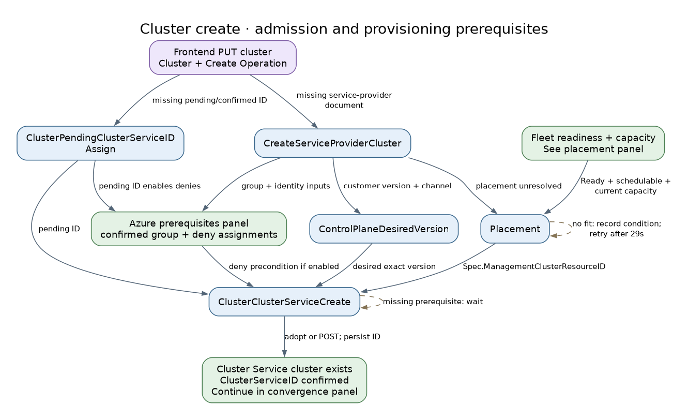

The prerequisites panel separates selected `Spec.ManagementClusterResourceID` from observed placement. The [create controller](../backend/pkg/controllers/cluster/creation/cluster_cluster_service_create_controller.go) requires pending ID, desired version, selected provision shard and, when enabled, the deny-assignment state (no pending entries, a nonempty confirmed list and `EarliestRecheckTime` set). [Placement](../backend/pkg/controllers/cluster/placement/placement_controller.go) supplies the pre-create target; actual placement is learned after Cluster Service creation.

### Cluster create: fleet readiness and placement

[Full PNG](diagrams/controller-flows/fleet-placement.png) · [Graphviz source](diagrams/controller-flows/fleet-placement.dot)

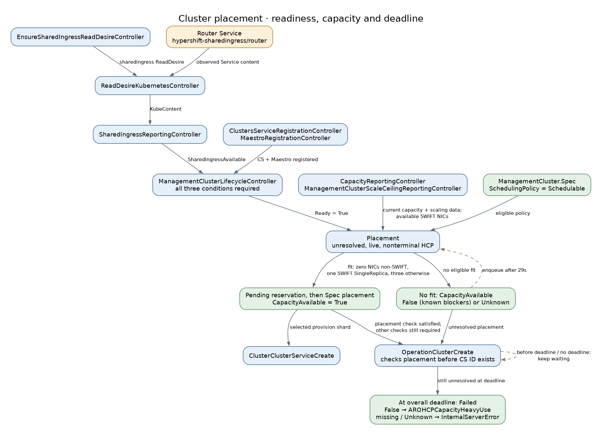

[Shared-ingress observation](../fleet/pkg/controllers/sharedingress/shared_ingress_reporting_controller.go) supplies the third condition required by [lifecycle readiness](../fleet/pkg/controllers/lifecycle/controller.go). Missing registration/ingress conditions preserve the previous Ready value until all exist. A missing ReadDesire also leaves ingress status unchanged; populated content, not its Successful condition, supplies IP evidence.

[Placement](../backend/pkg/controllers/cluster/placement/placement_controller.go) requires schedulable policy, Ready and current capacity/scaling observations. It reserves capacity before writing Spec placement and CapacityAvailable together. No fit records False or Unknown and requeues after 29s. [OperationClusterCreate](../backend/pkg/controllers/cluster/operations/operation_cluster_create.go) uses the overall create deadline to classify unresolved placement; this is not a separate placement timeout. The False/missing/Unknown paths in the graph apply only when no Spec placement was assigned.

### Cluster create: Azure prerequisites

[Full PNG](diagrams/controller-flows/cluster-azure-prerequisites.png) · [Graphviz source](diagrams/controller-flows/cluster-azure-prerequisites.dot)

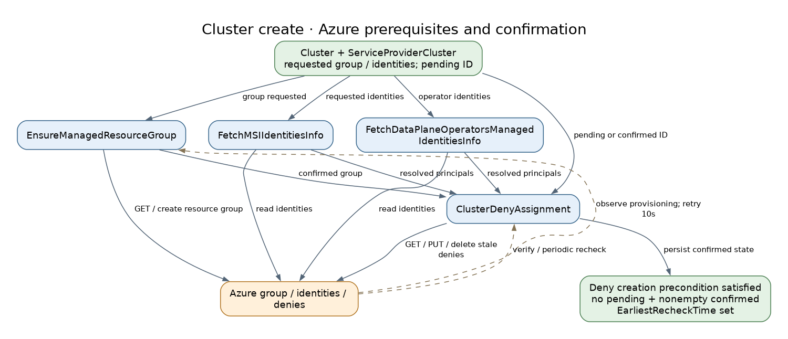

[EnsureManagedResourceGroup](../backend/pkg/controllers/cluster/azureresources/managed_resource_group_controller.go)
records pending intent before Azure creation, then confirms provisioning. Identity
readers supply principals to [ClusterDenyAssignment](../backend/pkg/controllers/cluster/denyassignments/deny_assignment_controller.go).
When deny assignments are enabled, cluster creation waits for no pending entries,
a nonempty confirmed list and `EarliestRecheckTime` set. Azure observation and
periodic verification form feedback loops; a successful request is not always a
confirmed resource.

### Cluster create: convergence and completion

[Full PNG](diagrams/controller-flows/cluster-convergence.png) · [Graphviz source](diagrams/controller-flows/cluster-convergence.dot)

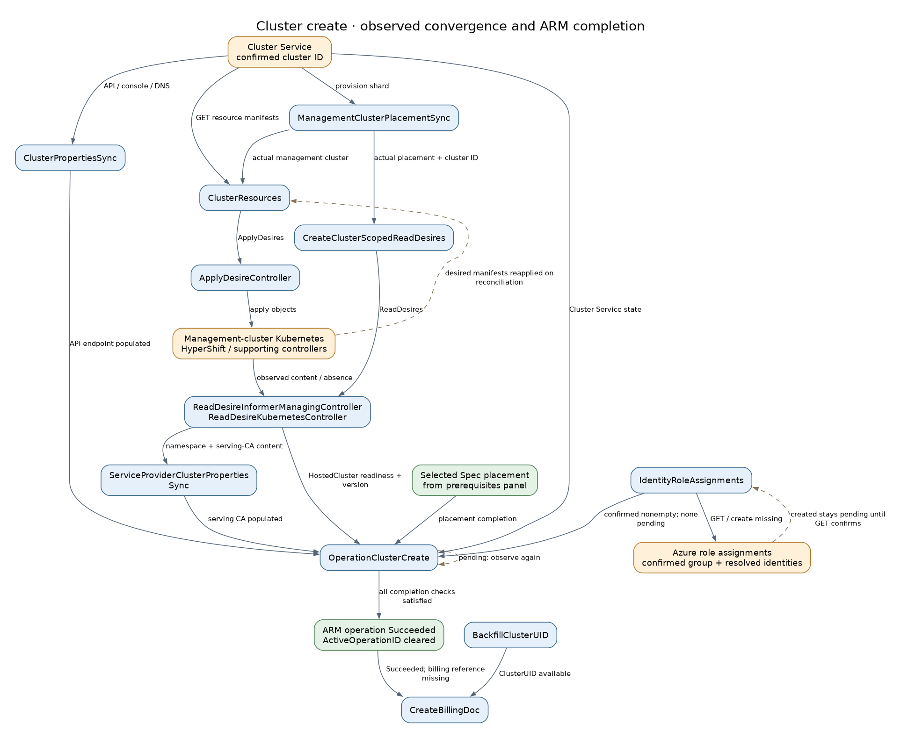

The [operation poller](../backend/pkg/controllers/cluster/operations/operation_cluster_create.go) combines Cluster Service state, HostedCluster observations, API endpoint, serving CA and confirmed role assignments. UID backfill and billing are independent controllers; billing needs both a UID and Succeeded provisioning. The manifest path is collapsed around external Kubernetes/HyperShift reconciliation; a particular deployment may also involve Maestro/work-agent.

### Cluster update

[Full PNG](diagrams/controller-flows/cluster-update.png) · [Graphviz source](diagrams/controller-flows/cluster-update.dot)

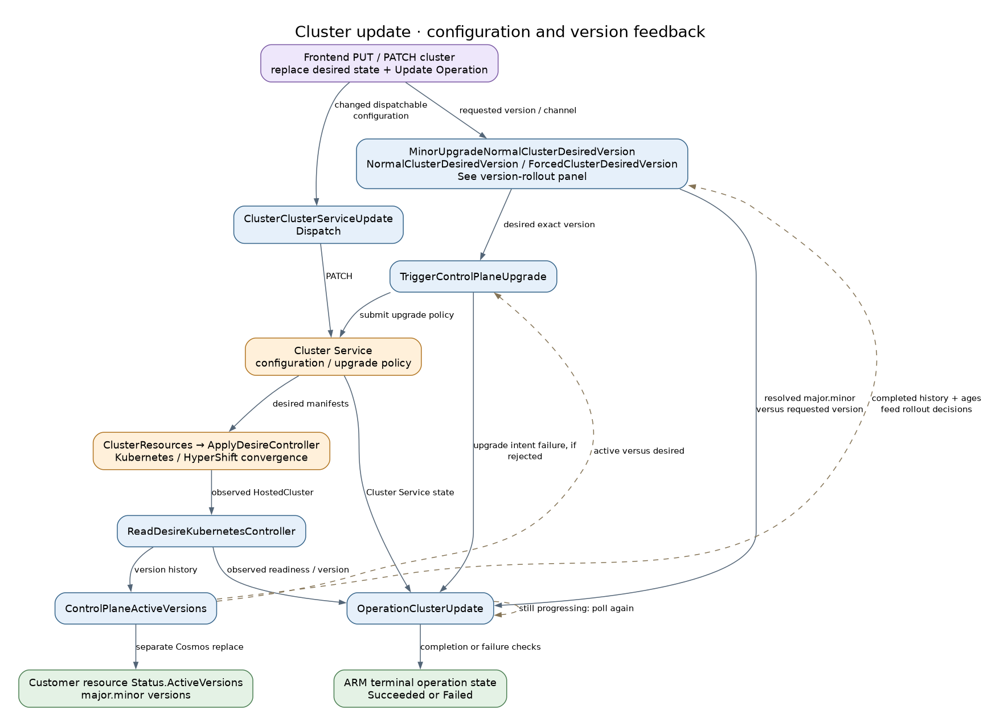

[Desired-version selection](../backend/pkg/controllers/cluster/version/control_plane_desired_version_controller.go), [upgrade dispatch](../backend/pkg/controllers/cluster/version/trigger_control_plane_upgrade_controller.go) and [operation completion](../backend/pkg/controllers/cluster/operations/operation_cluster_update.go) make separate decisions. The graph highlights version/configuration changes; sizing, identities, validation and backup maintenance continue independently.

### Cluster delete

[Full PNG](diagrams/controller-flows/cluster-delete.png) · [Graphviz source](diagrams/controller-flows/cluster-delete.dot)

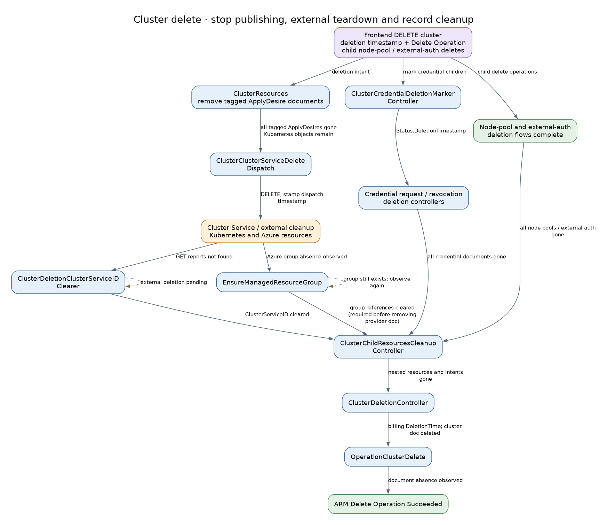

[ClusterResources](../backend/pkg/controllers/clusterresources/cluster_resources_controller.go) first drops its tagged ApplyDesire documents, stopping their reconciliation without deleting their Kubernetes targets. [Delete dispatch](../backend/pkg/controllers/cluster/deletion/cluster_cluster_service_delete_dispatch_controller.go) waits for that intent cleanup before calling Cluster Service DELETE. External components then tear down Kubernetes and Azure resources. [Child cleanup](../backend/pkg/controllers/cluster/deletion/cluster_child_resources_cleanup_controller.go) waits for resource and credential children, and preserves owned ApplyDesires for their controllers and removes provider state only after managed-resource-group references, Maestro readonly bundles and cluster-scoped desires clear. [Managed-resource-group reconciliation](../backend/pkg/controllers/cluster/azureresources/managed_resource_group_controller.go) only observes deletion; it does not issue it. The optional orphan-group cleaner is a background repair path, not a prerequisite for typical deletion.

The separate [BackupCleanup](../mgmt-agent/pkg/controller/backupcleanup/controller.go) branch starts only after live reads confirm no HC remains in the recognized backup's HC namespace, not merely a deletion timestamp. All backup/operation/opt-out gates in its [catalog entry](#backupcleanup) must also pass. It requests Velero deletion without waiting for TTL; pending work polls and processed requests with a remaining Backup are retried. [KeyRotationBackup](../backend/pkg/controllers/cluster/backups/key_rotation_controller.go) only purges its Cosmos desires during cluster deletion. Neither ARM success nor Backup absence proves Kopia GC completion; BackupRepositories remain for maintenance, and this branch does not gate the ARM result.

### Node pool create

[Full PNG](diagrams/controller-flows/nodepool-create.png) · [Graphviz source](diagrams/controller-flows/nodepool-create.dot)

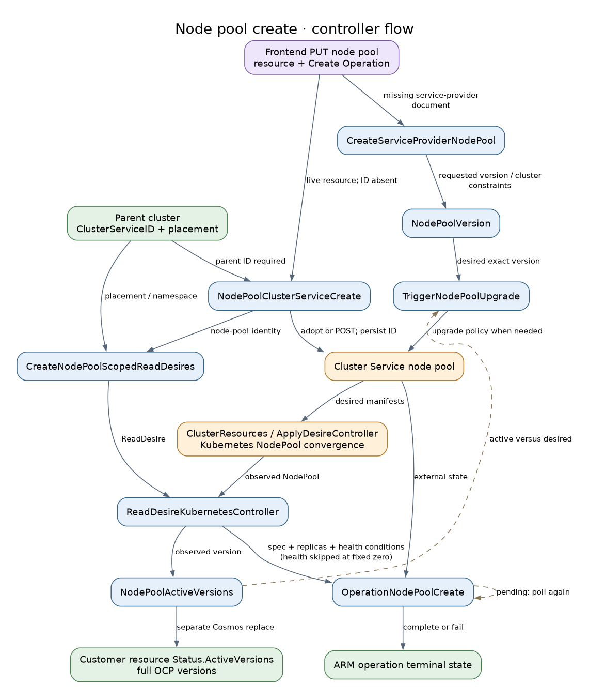

[Node-pool creation](../backend/pkg/controllers/nodepool/creation/node_pool_cluster_service_create_controller.go) needs the parent Cluster Service ID, but POST does not wait for the service-provider desired version. [Create-operation completion](../backend/pkg/controllers/nodepool/operations/operation_node_pool_create.go) uses Cluster Service node-pool status; Kubernetes version observation feeds subsequent upgrade decisions independently.

### Node pool update

[Full PNG](diagrams/controller-flows/nodepool-update.png) · [Graphviz source](diagrams/controller-flows/nodepool-update.dot)

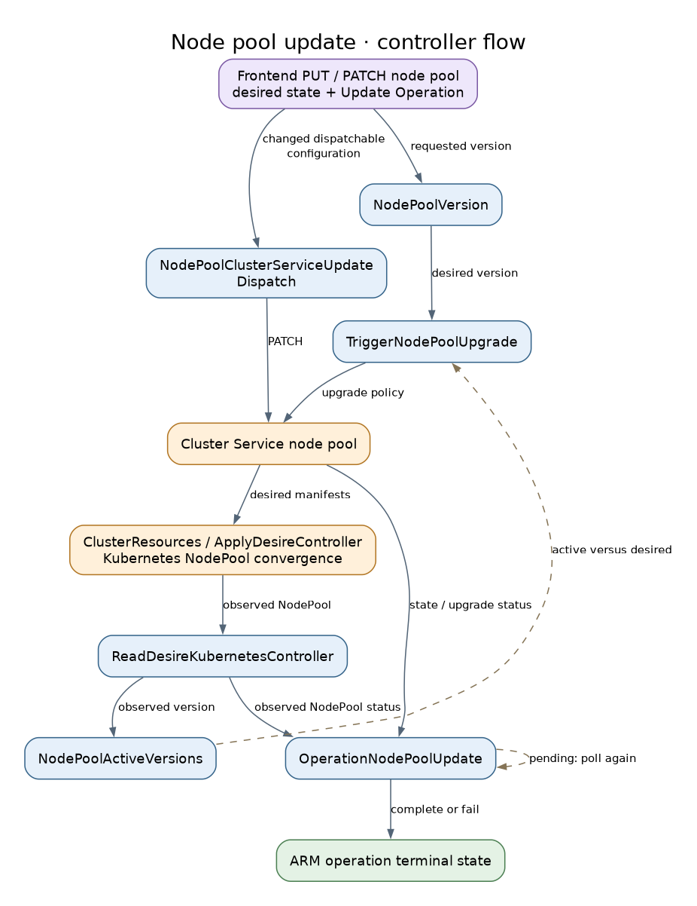

[Update completion](../backend/pkg/controllers/nodepool/operations/operation_node_pool_update.go) combines version resolution, Cluster Service state/configuration and mirrored Kubernetes NodePool checks. [NodePoolVersion](../backend/pkg/controllers/nodepool/version/nodepool_version_controller.go) selects desired state; [NodePoolActiveVersions](../backend/pkg/controllers/nodepool/version/nodepool_active_version_controller.go) records both provider and customer-visible observations. Status completion requires replicas plus AllNodesHealthy and AllMachinesReady; both health checks are skipped for fixed zero replicas.

### Node pool delete

[Full PNG](diagrams/controller-flows/nodepool-delete.png) · [Graphviz source](diagrams/controller-flows/nodepool-delete.dot)

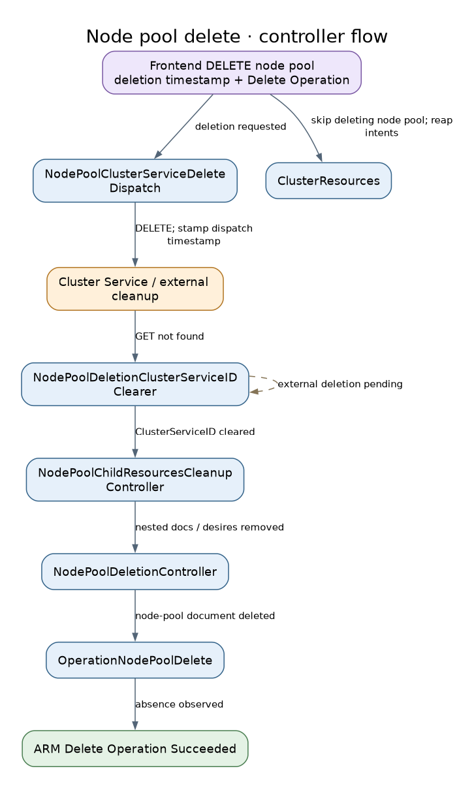

[Node-pool delete dispatch](../backend/pkg/controllers/nodepool/deletion/node_pool_cluster_service_delete_dispatch_controller.go) does not wait for ApplyDesire cleanup. [Child cleanup](../backend/pkg/controllers/nodepool/deletion/node_pool_child_resources_cleanup_controller.go) removes its subtree and desires after the ID is cleared. ClusterResources stops publishing a deleting node pool, while external controllers may still be converging.

### External auth create

[Full PNG](diagrams/controller-flows/externalauth-create.png) · [Graphviz source](diagrams/controller-flows/externalauth-create.dot)

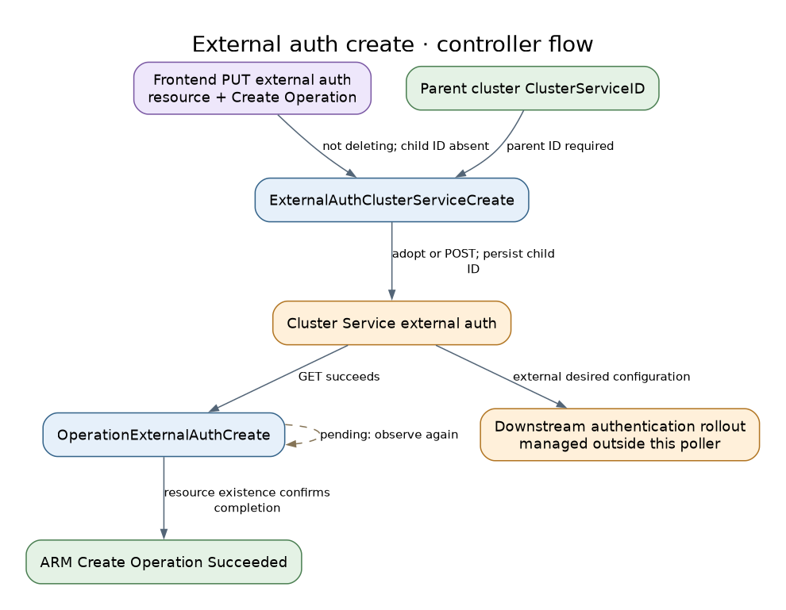

[Create completion](../backend/pkg/controllers/externalauth/operations/operation_external_auth_create.go) succeeds after a Cluster Service GET succeeds. There is no separate ServiceProviderExternalAuth document or external-auth-scoped read pipeline; this completion check does not establish downstream authentication readiness.

### External auth update

[Full PNG](diagrams/controller-flows/externalauth-update.png) · [Graphviz source](diagrams/controller-flows/externalauth-update.dot)

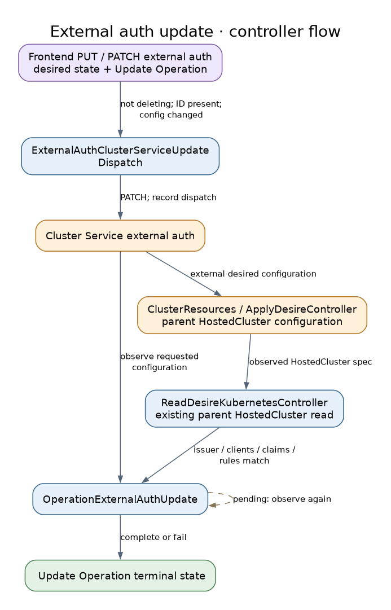

[Update completion checks](../backend/pkg/controllers/externalauth/operations/operation_external_auth_update_state_calculation.go) compare both Cluster Service configuration and the parent HostedCluster spec read through its existing ReadDesire. Authentication status is explicitly not checked. This is stricter than the create poller's existence check, but is still not end-to-end authentication validation.

### External auth delete

[Full PNG](diagrams/controller-flows/externalauth-delete.png) · [Graphviz source](diagrams/controller-flows/externalauth-delete.dot)

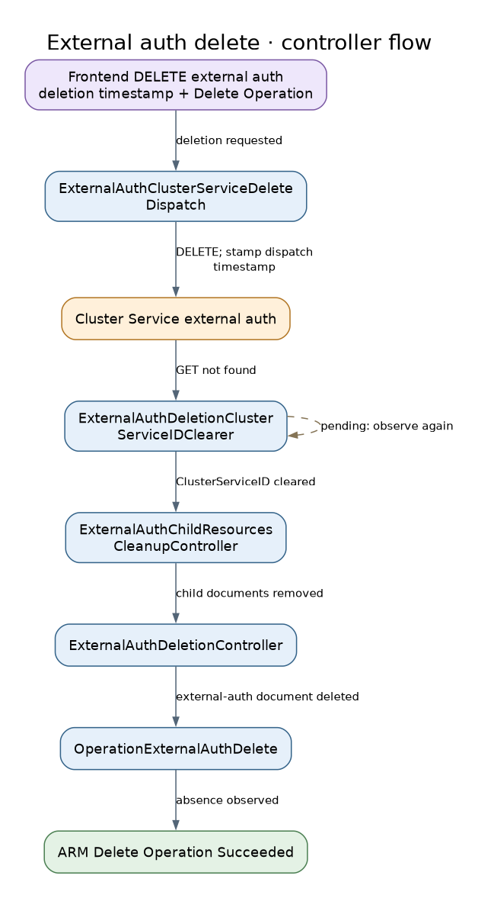

[Delete dispatch](../backend/pkg/controllers/externalauth/deletion/external_auth_cluster_service_delete_dispatch_controller.go), [ID clearing](../backend/pkg/controllers/externalauth/deletion/external_auth_cluster_service_id_clearer.go), child cleanup and document deletion are separate reconciliations. [Operation completion](../backend/pkg/controllers/externalauth/operations/operation_external_auth_delete.go) observes the document disappearing.

## 4. Shared Fields and Ownership

The important distinction is requested state versus externally confirmed state.
The API normally owns customer configuration; controllers fill runtime observations
and operation state. Full-document replacements preserve fields owned by other
actors and use optimistic concurrency; retries must re-read on conflict.

### ARM resource and operation fields

| Field / object | Writers and downstream meaning |
|---|---|
| Cluster `CustomerProperties`; node-pool/external-auth `Properties` | Frontend create/update writes customer intent. [ClusterBaseDomainPrefixSync](#clusterbasedomainprefixsync) fills the generated DNS prefix. Dispatch/version controllers react to relevant differences. |
| Cluster `ServiceProviderProperties.ProvisioningState`; node-pool/external-auth `Properties.ProvisioningState` | Frontend marks Accepted/Deleting; the matching operation controller writes progress/terminal state. This is ARM request state, not a complete inventory of external resources. |
| `ServiceProviderProperties.ActiveOperationID` | Frontend sets the new operation reference; terminal operation updates clear it. Pollers reject superseded operation IDs. |
| `Operation.Status`, `Error`, `LastTransitionTime`, `NotificationURI` | Frontend initializes/cancels requests; operation controllers update status and send/clear async notifications through the shared helper. |
| `ServiceProviderProperties.DeletionTimestamp` and deletion-approach flags | Frontend stamps deletion intent; dispatch, cleanup and final deletion controllers consume it. Deletion timestamp alone does not mean external resources are gone. |
| Cluster `PendingClusterServiceID` / `ClusterServiceID` | [Pending ID assignment](#clusterpendingclusterserviceidassign) reserves the ID. [Cluster creation](#clusterclusterservicecreate) confirms the external ID and clears pending. The [ID clearer](#clusterdeletionclusterserviceidclearer) clears confirmed ID only after external absence. Node-pool/external-auth create and clear controllers similarly share their confirmed-ID fields. |
| `ClusterServiceDeletionTimestamp` | Each delete dispatcher stamps completion of dispatch/creation-race handling; cleanup also requires the confirmed ID cleared. It is not a timestamp of all Azure/Kubernetes deletion. |
| Cluster `ClusterUID`, `BillingDocumentCosmosID`; Billing document `DeletionTime` | [BackfillClusterUID](#backfillclusteruid) repairs UID using billing as input. [CreateBillingDoc](#createbillingdoc) creates billing and links it. [ClusterDeletionController](#clusterdeletioncontroller) and [OrphanedBillingCleanup](#orphanedbillingcleanup) mark billing deleted. |
| Cluster `ServiceProviderProperties.API.URL`, `.Console.URL`, `.DNS.BaseDomain`, `.Platform.IssuerURL` | [ClusterPropertiesSync](#clusterpropertiessync) writes observed values. Frontend clears supplied values on create rather than persisting them; updates preserve stored values. |
| Cluster `Identity.UserAssignedIdentities` | Frontend supplies identity intent without create-body client/principal IDs; [ClusterIdentitySync](#clusteridentitysync) fills resolved identity fields. Updates preserve stored resolved values. Azure identities themselves are not created by that syncer. |
| Cluster/node-pool `Status.ActiveVersions` | [ControlPlaneActiveVersions](#controlplaneactiveversions) writes distinct major.minor cluster versions; [NodePoolActiveVersions](#nodepoolactiveversions) writes full node-pool versions. The 2026-10-01-preview API returns these stored observations through `properties.status.activeVersions`; customer configuration remains separately owned. |
| ARM Degraded / RequirementsValid conditions | Resource-specific aggregators combine Controller or service-provider validation conditions. A validation failure and a reconcile error are separate signals. |

### Service-provider state, fleet and external observations

| Field / object | Writers and downstream meaning |
|---|---|
| Cluster `Spec.ControlPlaneVersion.DesiredVersion` | [ControlPlaneDesiredVersion](#controlplanedesiredversion) selects the exact target. Cluster create and upgrade dispatch consume it. |
| Service-provider cluster `Status.ControlPlaneVersion.ActiveVersions` / `Status.DesiredVersionChannels` | [ControlPlaneActiveVersions](#controlplaneactiveversions) copies exact HostedCluster history and desired channels. Desired target and active history can differ while an upgrade is underway. |
| Node-pool desired / active versions | [NodePoolVersion](#nodepoolversion) writes `Spec.NodePoolVersion.DesiredVersion`; [NodePoolActiveVersions](#nodepoolactiveversions) writes `Status.NodePoolVersion.ActiveVersions`. [TriggerNodePoolUpgrade](#triggernodepoolupgrade) reacts to their difference. |
| Service-provider cluster `Status.Placement.Conditions[CapacityAvailable]` | [Placement](#placement) records True with selected Spec placement, False for known lack of capacity/eligibility, or Unknown for incomplete observations. [OperationClusterCreate](#operationclustercreate) consumes it when placement remains unresolved at the overall deadline. |
| Management cluster `Status.SharedIngressIPAddresses` / `SharedIngressAvailable` / `Ready` | [SharedIngressReportingController](#sharedingressreportingcontroller) copies Service IPs and availability; [ManagementClusterLifecycleController](#managementclusterlifecyclecontroller) combines availability with registrations into Ready. [Admin responses](../admin/server/handlers/stamp/managementcluster.go) expose observed IPs. |
| Cluster `Spec.ManagementClusterResourceID` / `Status.ManagementClusterResourceID` | [Placement](#placement) chooses the target; [ManagementClusterPlacementSync](#managementclusterplacementsync) records Cluster Service reality. Desired placement enables creation; actual placement enables per-cluster kube-applier access. |
| Scheduling `Status.PendingAssignedClusters` | [Placement](#placement) reserves; [CapacityReportingController](#capacityreportingcontroller) removes observed entries; [PendingCleanup](#pendingcleanup) removes missing/misplaced entries and unresolved reservations for deleting/terminal clusters. |
| Scheduling observed capacity / scale ceiling; fleet HCP resource requirements | Fleet capacity and scale-ceiling controllers write observed scheduling inputs. [HCPResourceRequirementsController](#hcpresourcerequirementscontroller) aggregates per-HCP demand. Placement currently chooses on SWIFT NIC availability from the scheduling document; aggregate HCP demand and CPU/memory do not yet decide placement. |
| `Status.AzureResources.ManagedResourceGroup` | [EnsureManagedResourceGroup](#ensuremanagedresourcegroup) writes pending/confirmed reference and clears both after observing deletion. Deny/role assignment controllers need the confirmed group; final provider-document cleanup needs references gone. |
| `Status.AzureResources.DenyAssignments` / `RoleAssignments` | Their respective controllers track `PendingAzureResources` and confirmed `AzureResources`. The role controller confirms newly created assignments in a later observation pass. |
| `Status.MSIManagedIdentities`, `Status.DataPlaneOperatorsManagedIdentities` | Identity fetchers write resolved IDs/errors for assignment and identity-property synchronization. `Spec.EarliestRecheckTimesByController` has independently owned entries for identity and role-assignment controllers; deny assignments keep their own `EarliestRecheckTime` under `Status.AzureResources.DenyAssignments`. |
| `Status.Validations` | Each registered validation writes its own condition in the service-provider cluster or node pool; requirements aggregators consume the set. |
| Cluster `Status.HostedClusterNamespace`, `ControlPlaneNamespace`, `ServingCABundle` | [ServiceProviderClusterPropertiesSync](#serviceproviderclusterpropertiessync) fills these from mirrored reads. Credentials and create-operation completion wait on them. |
| Cluster `Spec.BackupState` | Admin backup PATCH writes Enabled/Paused; [BackupSchedule](#backupschedule) reconciles Velero intent. Mirrored Kubernetes status reports results separately. |
| Velero deletion intent / repository ownership | Management-agent [BackupCleanup](#backupcleanup) directly creates `DeleteBackupRequest.spec.backupName` and retries its processed requests; Velero owns Backup/data deletion. Backup/repository preservation annotations gate new cleanup requests, not already-issued requests or Velero TTL. BackupRepositories remain for Kopia maintenance; no Cosmos field records cleanup or repository GC completion. |
| `ApplyDesire` / `ReadDesire` | Backend/fleet writers own desired content/targets; kube-applier owns execution/observation status. Credential cleanup and stale-resource cleanup during live ClusterResources reconciliation use Delete intents and wait. During whole-cluster deletion, ClusterResources drops its intent documents directly; external components own Kubernetes teardown. |
| Kubernetes CapacityReport | Management-agent [capacity-reporting](#capacity-reporting) server-side applies status, preserving zero CPU/memory/SWIFT-NIC quantities and replacing `hostedControlPlanes` atomically. Kube-applier mirrors it; fleet updates scheduling and resource-requirement documents only from current observations. Collection failures retain the previous payload while setting ReportCurrent=False. |

### Credential and controller bookkeeping

| Field / object | Writers and downstream meaning |
|---|---|
| Cluster `RevokeCredentialsOperationID` | Frontend sets the revoke sentinel; modern revoke-operation completion clears it. New issuance checks it before dispatch. |
| Credential request spec / status | [Credential dispatch](#systemadmincredentialdispatchrequestcredential) creates request material. [Issuance observation](#systemadmincredentialissuanceobserver) writes signed certificate and terminal conditions. Revocation marking and cluster deletion mark requests for cleanup; request controllers remove external artifacts and documents. |
| Credential revocation conditions / deletion timestamp | MarkRequests reports request marking; Completion combines that with observed certificate revocation and sets deletion intent; Deletion removes artifacts/document; operation poller observes disappearance. |
| Child `Controller` conditions and reconcile metadata | Generic wrappers persist bookkeeping; version/other syncers can set intent conditions. Degraded aggregators read them. “No domain write” in the catalog does not imply the wrapper never writes a Controller document. |
| Kubernetes Session status / secrets | Sessiongate's [control-plane controller](#sessioncontrolplanecontroller) owns session expiry, readiness, endpoint and credential references; [DataplaneController](#dataplanecontroller) consumes them to configure its in-memory proxy registry. |

## Regeneration

Use the separate [generation prompt](prompts/controller-data-flow.md). Editable
DOT sources and their PNG renders live together in
[diagrams/controller-flows](diagrams/controller-flows/). Refresh controller inventory,
source evidence, ownership and diagrams together when behavior or registration changes.
