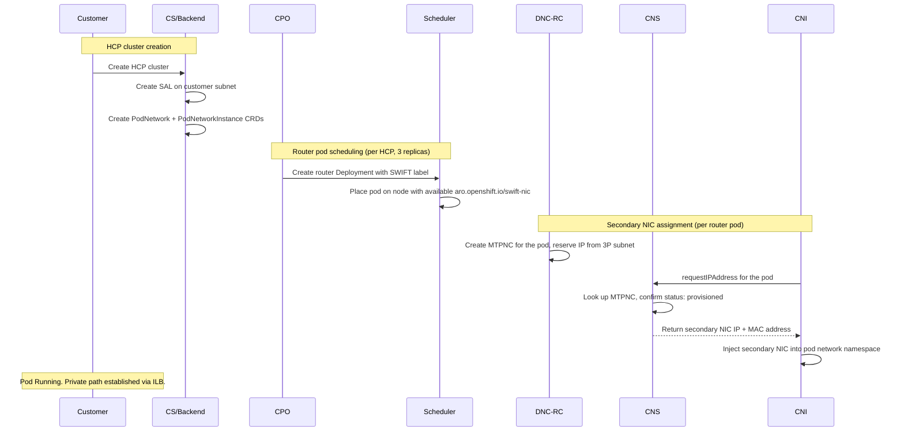

# User Journey: SWIFT Networking

## Contents

- [1. Journey](#1-journey)
- [2. Architecture](#2-architecture)
- [3. SLIs, SLOs, and TSG Routing](#3-slis-slos-and-tsg-routing)
- [4. Escalation](#4-escalation)
- [References](#references)

# 1. Journey

> As an ARO HCP customer, I do not want my network traffic to leave Azure (go over the public internet). This includes:
> 1. Traffic from HCP KAS to NodePools (or workloads running on them)
> 2. Traffic from NodePools (or workloads running on them) to HCP KAS
> 3. Traffic leveraging other private Azure services (e.g. private Key Vaults)
> 4. All traffic for private HCP clusters

> As an ARO HCP SRE, I want SWIFT secondary NIC assignment to succeed within defined latency targets so that private connectivity failures do not block customer access to their HCP clusters.

# 2. Architecture

SWIFT is Azure's multi-tenant networking feature for AKS management clusters. It provides router pods with secondary NICs on the customer's subnet, enabling private routing between the customer VNet and the HCP. Without SWIFT, traffic between customer worker nodes and the HCP would traverse the public internet instead of staying internal to Azure.

SWIFT is transparent to customers when healthy; they never observe it directly. When it fails, the private network path between the customer VNet and the HCP degrades or breaks entirely, affecting connectivity in both directions (Nodes to HCP and HCP to Nodes).

When this flow completes, private connectivity between the customer VNet and the HCP is fully operational in both directions.

> **Note:** Secondary SWIFT NICs appear with empty IP configuration in ARM and the Azure portal by design. `DelegateIPAllocation=true` means DNC-RC programs them via NMAgent. NRP does not touch them. Empty IP config is not a provisioning failure.

## Components

| Component | Where it runs | Owner |
|-----------|---------------|-------|
| **CNS** | DaemonSet on each management cluster worker node | Azure Cloudnet/Container Networking AKS Swift Control Plane |
| **DNC-RC** | AKS customer control plane (AKS-managed, not a pod in the cluster) | Azure Cloudnet/Container Networking AKS Swift Control Plane |
| **DNC** | Azure Container Networking service (AKS infrastructure layer) | Azure Cloudnet/Container Networking AKS Swift Control Plane |
| **NMA** | Azure physical host beneath the AKS worker VM | Azure Compute |
| **NRP** | Azure platform (Azure-wide control plane service) | Azure Cloudnet/NRP |
| **CRP** | Azure platform (Azure-wide control plane service) | Azure Compute |
| **SAL** | ARM resource on the customer subnet | ARO-HCP |
| **mgmt-agent (SwiftNICController)** | Deployment on the management cluster | ARO-HCP |
| **NNC** | Management cluster API server (one per worker node) | Azure Cloudnet/Container Networking AKS Swift Control Plane |
| **MTPNC** | Management cluster API server (one per router pod) | Azure Cloudnet/Container Networking AKS Swift Control Plane |

## Glossary

| Term | Meaning |
|------|---------|
| **AFEC** | Azure Feature Exposure Control: Microsoft's system for registering preview feature flags on Azure subscriptions. SWIFT requires the `NetworkingMultiTenancyPreview` AFEC flag on the management subscription. |
| **CCP (AKS)** | AKS Customer Control Plane: the AKS-managed control plane for a given AKS cluster (in this context, the management cluster). DNC-RC and DNC run inside the AKS CCP. The CCP ID is a hex identifier used to scope Kusto log queries (e.g. `6834682f64206f000129bd12`), discoverable via [ASI](https://aka.ms/asi) by cluster FQDN. Not to be confused with the ARO-HCP Hosted Control Plane. |
| **HCP** | Hosted Control Plane: a customer's OpenShift cluster control plane (kube-apiserver, etcd, etc.) running as pods inside an OCM namespace on the management cluster. Distinct from the AKS CCP, which is the infrastructure layer that hosts the management cluster itself. |
| **2P subnet** | Second-party subnet: the host/infrastructure subnet used by the management cluster's own workloads. |
| **3P subnet** | Third-party subnet: the customer-exclusive subnet used by CX pods, assigned via secondary NICs. |
| **CX pods** | Customer eXclusive pods: pods belonging to a Hosted Control Plane tenant, networked via secondary NICs on the 3P subnet. In ARO-HCP, the CX pod is specifically the **router pod**, the only hosted cluster pod that receives a SWIFT secondary NIC. |
| **CPO** | Control Plane Operator: the HyperShift component that runs inside each HCP namespace on the management cluster and manages the hosted control plane lifecycle. CPO creates the router Deployment and injects the SWIFT pod network instance label onto router pods. |
| **CS** | Cluster Service: the ARO-HCP service responsible for HCP lifecycle operations. For SWIFT, CS creates the SAL, PodNetwork, PodNetworkInstance, and Internal Load Balancer during HCP cluster provisioning. **Note: CS is actively being decommissioned and will be replaced by a Backend (RP) operator.** |
| **ILB** | Internal Load Balancer: a Standard SKU Azure internal load balancer created in the customer's VNet integration subnet during HCP cluster provisioning. Its backend pool contains the three PNI IP addresses (one per router pod replica). Worker nodes reach the kube-apiserver, ignition, OAuth, and Konnectivity endpoints via the `hypershift.local` private DNS zone, which resolves to the ILB frontend IP. |
| **SWIFT / SWIFT V2** | Azure's multi-tenant networking feature for AKS management clusters, enabled via the `NetworkingMultiTenancyPreview` AFEC flag. These terms are used interchangeably; SWIFT V2 is the current implementation version and the term used in component documentation (CNS, DNC-RC, Azure Container Networking TSGs). |

# 3. SLIs, SLOs, and TSG Routing

| SLI | SLO | Alert | TSG |
|-----|-----|-------|-----|
| Router pod startup latency p99 | <= 300s | `userJourneySwiftLatencyP991h5m` / `userJourneySwiftLatencyP996h30m` | [SWIFT Networking TSG](uj-tsg-swift.md#step-1-establish-blast-radius) |
| CNS IP assignment error rate | <= 1% over 28d | `userJourneySwiftErrors1h5m` / `userJourneySwiftErrors6h30m` | [SWIFT Networking TSG](uj-tsg-swift.md#step-3-read-cns-logs-and-classify-the-error) |
| CNS daemonset availability | >= 99.9% over 28d | `SwiftCNSAvailability3d` | [SWIFT Networking TSG](uj-tsg-swift.md#step-2-check-hcp-side-prerequisites) |
| IPs stuck in PendingProgramming | 0 sustained | `SwiftPendingProgramming` | [SWIFT Networking TSG](uj-tsg-swift.md#step-3-read-cns-logs-and-classify-the-error) |
| CNS IP assignment latency p99 | <= 10s over 28d | `userJourneySwiftCNSLatencyP991h5m` / `userJourneySwiftCNSLatencyP996h30m` | [SWIFT Networking TSG](uj-tsg-swift.md#step-3-read-cns-logs-and-classify-the-error) |

User Journey Dashboard: [SWIFT Networking SLO Overview](https://aka.ms/arohcp-dashboard-swift)

> **Measurement note:** the managed components (CNS, DNC-RC, NRP) are largely opaque. The SLIs above measure SWIFT's observable effects (router pod startup latency, NIC assignment rates) rather than SWIFT internals.

> **NodePool caveat:** HCP clusters can be provisioned with zero NodePools. A metric reading zero may mean "nothing to schedule" rather than "broken." Interpret in context.

# 4. Escalation

SWIFT spans ARO-HCP, Azure AKS, and Azure Cloudnet/NRP ownership boundaries. Severity follows the [Azure CEN](https://aka.ms/AzureCEN).

- **Who to engage:** Cloudnet/NRP
    - **Trigger:** DNC NIC/IP exhaustion (ErrorCode 4/135 in CNS logs) with NRP validation failures upstream, or SAL API failures.
    - **Evidence to attach:** CNS log snippet, `cx_pending_programming_ips_v2` graph, blast radius (subscriptions and clusters affected).
    - **How to escalate:** File IcM directly to Cloudnet/NRP. Do not route to DNC, RNM, or SdnPubSub first (lesson from ITN-2026-00158: routing through intermediaries cost several hours).

- **Who to engage:** Azure AKS team (Cloudnet/Container Networking AKS Swift Control Plane)
    - **Trigger:** CNS pod failures, MTPNC not created, DNC-RC errors (connection refused, auth failures), or DNC PubSub context selector loss.
    - **Evidence to attach:** `kubectl describe mtpnc` output, CNS logs, `kubectl get nodeinfo` output, DNC-RC Kusto log snippet.
    - **How to escalate:** File IcM to Cloudnet/Container Networking AKS Swift Control Plane. Informal contact via #external-wg-aro-hcp.

- **Who to engage:** Cloudnet/Vnet (NMAgent team)
    - **Trigger:** CNS logs show `sync host error` or `failed to get nc version list from nmagent`.
    - **Evidence to attach:** CNS log snippet from affected node.
    - **How to escalate:** File IcM to Cloudnet/Vnet.

- **Who to engage:** Cloudnet/NRP and AKS RP team
    - **Trigger:** HCP creation success rate significantly lower in one region than others. NRP Kusto shows `InvalidVMScaleSetNetworkInterfaceConfigurationIPConfigCount`.
    - **Evidence to attach:** Regional creation success rate comparison, NRP Kusto query results, affected subscription IDs and VMSS names.
    - **How to escalate:** File IcM to Cloudnet/NRP and AKS RP team. Request force-reconcile rollout for affected VMSS instances.

For ARO-HCP component ownership questions: [ARO-HCP Component Inventory + Ownership](https://docs.google.com/spreadsheets/d/1Z2uhI3ctbZCF0rOj8B4VsoYx1rR9x_1ZLsbOr6Eug-8/edit?gid=0#gid=0)

# References

- [SWIFT V2 CNS implementation](https://github.com/Azure/azure-container-networking/blob/master/docs/feature/swift-v2/cns.md): CRD definitions, IPAM flow, `requestIPAddress` handler
- [ARO HCP Region Buildout](https://eng.ms/docs/cloud-ai-platform/azure-core/azure-cloud-native-and-management-platform/control-plane-bburns/azure-red-hat-openshift/azure-redhat-openshift-team-doc/hcp/runbooks/buildout/region-buildout): how SWIFT is enabled per region via Geneva Actions
- [Azure Container Networking TSGs: SWIFT V2](https://eng.ms/docs/cloud-ai-platform/azure-core/azure-networking/azure-container-networking-caggar/azure-container-networking/azure-container-networking-tsgs/tsgs/aks/scenarios/swiftv2/swiftv2): DNC-RC, MTPNC, and NC deletion debugging
- [DNC-RC Overview](https://eng.ms/docs/cloud-ai-platform/azure-core/azure-networking/azure-container-networking-caggar/azure-container-networking/azure-container-networking-tsgs/tsgs/aks/dnc-rc/overview): DNC-RC architecture, Kusto log access, NNC data flow
- [ADR-001: ARO HCP Alerting Recommendation for SRE](https://github.com/openshift-online/architecture/pull/79): naming convention, burn-rate tiers, routing lanes
- [ARO HCP Access Guide](https://eng.ms/docs/cloud-ai-platform/azure-core/azure-cloud-native-and-management-platform/control-plane-bburns/azure-red-hat-openshift/azure-redhat-openshift-team-doc/hcp/runbooks/aro-hcp-access-guide): accessing management clusters and monitoring systems
- [HCM Incident Management Process](https://source.redhat.com/groups/public/hybridcloudmanagement/service_delivery_wiki/incident_management_process)
- [ARO Incident Management Procedure](https://docs.google.com/document/d/18AMixaTUUd5Rk12z_GfaujTzYUyFxUBpraoKPK8ku6o/edit)
