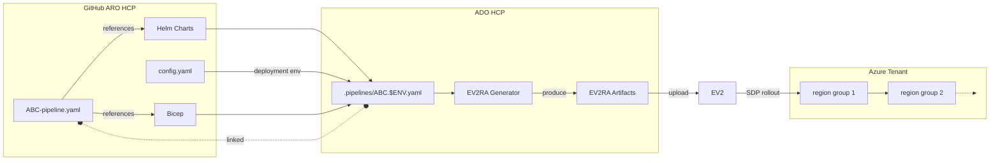

# Deployment via EV2

This document describes the deployment process of ARO HCP instances into Microsoft tenants using EV2 tying in all artifact types and configuration.

> [!NOTE]
> Please note that this document does not cover the following details yet
>
> * using the EV2 portal
> * AME deployments

## Overview

Deployments of ARO HCP instances into Microsoft tenants are managed through a combination of Azure DevOps (ADO) pipelines and [EV2](terminology.md#ev2). Different aspects of an ARO HCP instance, such as infrastructure and services, are deployed by distinct [ADO pipelines](pipelines.md).

Such ADO pipelines consume [Bicep templates](bicep.md), [Helm charts](service-deployment-concept.md#helm-chart), [configuration data](configuration.md), [scripts](pipeline-concept.md#shell-step) and [pipeline.yaml](pipeline-concept.md) definitions from the [ARO HCP repository](https://github.com/Azure/ARO-HCP). These inputs are processed using [custom tools](https://msazure.visualstudio.com/AzureRedHatOpenShift/_git/hcp?path=/ev2/main.go) to generate EV2 artifacts, which define the necessary deployment steps and configurations.

Once the EV2 artifacts are generated, the ADO pipeline uploads them to EV2. EV2 orchestrates the rollout across multiple regions following the [Safe Deployment Practices](terminology.md#safe-deployment-practices), ensuring a controlled, secure and structured deployment flow into all ARO HCP relevant Azure regions.

## Create a New ADO Pipeline for EV2 Deployments

To run a pipeline.yaml file within EV2 we leverage ADO pipelines. Each [pipeline.yaml](pipeline-concept.md) file / target [deployment environment](environments.md#aro-hcp-environment-overview) combination is represented by a dedicated ADO pipeline.

The ARO HCP ADO pipelines are defined as YAML files stored in the [HCP ADO repository](https://msazure.visualstudio.com/AzureRedHatOpenShift/_git/hcp?path=/.pipelines).

1. **Use an existing pipeline as a template** – Find a similar pipeline and modify it to suit your needs. This typically involves adjusting the referenced `pipeline.yaml`.
2. **Submit a pull request (PR)** – Once the modifications are complete, submit a PR with the updated pipeline.
3. **Get the PR merged** – Wait for approval and merging of your PR.
4. **Request pipeline registration** – After the PR is merged, request the MSFT team to register the new pipeline within ADO.

The ADO pipeline will eventually show up [here](https://msazure.visualstudio.com/AzureRedHatOpenShift/_build?definitionScope=%5COneBranch%5Chcp). Make sure to maintain the [pipeline inventory](pipelines.md#pipeline-inventory).

> [!IMPORTANT]
> We need more documentation on how to create the ADO pipeline files, how to control aspects of EV2 and SDP, how to target different environments, ...

## Execute an ADO pipeline

* Go to the respective pipeline in ADO
  * find the links [here](pipelines.md#pipeline-inventory) or ...
  * ... have a look at the [pipelines in ADO](https://msazure.visualstudio.com/AzureRedHatOpenShift/_build?definitionScope=%5COneBranch%5Chcp)
* Click on `Run Pipeline`
* You can customize sources for the pipeline run
  * The pipeline itself is stored in the `HCP` ADO repostitory - if you want to test some changes on the ADO pipeline itself, pick the respective branch from `Branch/tag`
  * The `pipeline.yaml` is stored in the `ARO-HCP` repository - if you want to test changes on a `pipeline.yaml`, Helm charts, scripts or bicep templates, pick the respective branch under `Resource > Azure/ARO-HCP`. Please note that this works only for INT deployments, but not for deployments to higher environments where only the main branch can be used.

Once the ADO pipeline is running, you can observe the progress in the EV2 portal. You can either

* navitate to the [EV2 RA portal](https://ra.ev2portal.azure.net/) directly and find the EV2 run there
* or follow the link shown in the logs of the ADO step `$ENV_Managed_SDP > Ev2_AgentRolloutJob > Ev2RARollout`

## Troubleshooting

## EV2 Artifact generation failed

Issues with EV2 artifact generation can be spotted in the ADO pipeline logs of the `ev2 > build > Generate Ev2 Manifests for xxx` step. It will give you first hints if the problem is with the toolings, the `pipeline.yaml`, any referenced artifacts of the configuration itself.

### Clearing EV2 state

The `pipeline.yaml` step structure influences the generated EV2 `ServiceModel` and `RolloutSpecification` artifacts during EV2 build phase in the ADO pipeline. EV2 has a memory about what these artifacts looked like during previous SDP rollouts. If these artifacts change too much (e.g. steps being removed, renamed, reordered), EV2 will complain during artifact upload (e.g. `$ENV_Managed_SDP > Ev2_AgentRolloutJob > Ev2RARollout`), e.g. `Warnings: ServiceResourceGroupDefinition 'XXX' is being deleted`. While this is a meaningful protection mechanism for production releases, this is expected during development while iterating on the `pipeline.yaml` file.

> [!IMPORTANT]
> The following steps to clear EV2s memory by unregistering artifacts does not delete any deployed resources from Azure. BUT STILL: unregistering artifacts needs to be a concious decision with the implications being well understood in cases where a pipeline is already used in production. Ask for help and reviews if you are unsure!!

The following procedure allows for clearing EV2s memory about previous rollouts.

* [one time prep steps to aquire EV2 tools](https://ev2docs.azure.net/getting-started/tutorial/prepare.html?tabs=tabid-1%2Ctabid-3)
* [activate temporary ARO EV2 membership via PIM](https://msazure.visualstudio.com/AzureRedHatOpenShift/_wiki/wikis/AzureRedHatOpenShift.wiki/702853/Admin-Group)
* [unregister artifacts](https://msazure.visualstudio.com/AzureRedHatOpenShift/_wiki/wikis/AzureRedHatOpenShift.wiki/687243/Create-new-Service-with-Ev2-RA-and-using-Ev2-commands?anchor=unregister-artifact)
  * use `Test` for `<roll out infra>`
  * use `b8e9ef87-cd63-4085-ab14-1c637806568c` for `<service identifier>`
  * the `serviceGroup` from the `pipeline.yaml` for `<Service group name>`
