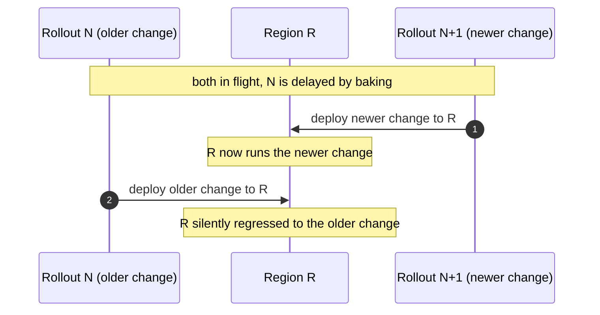
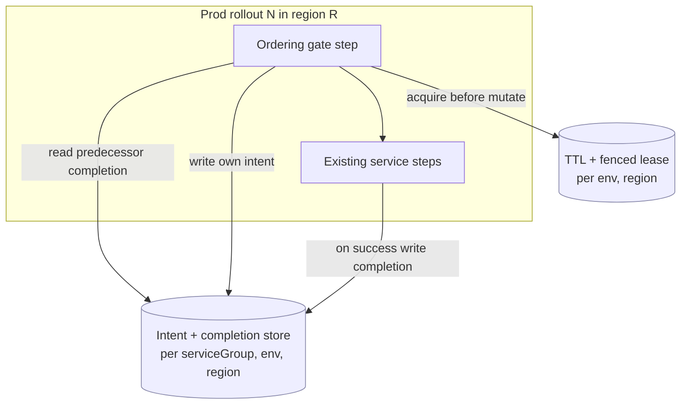
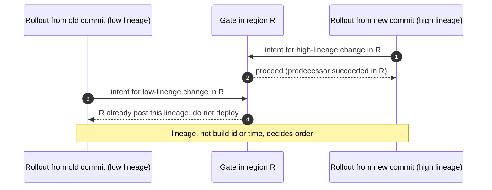
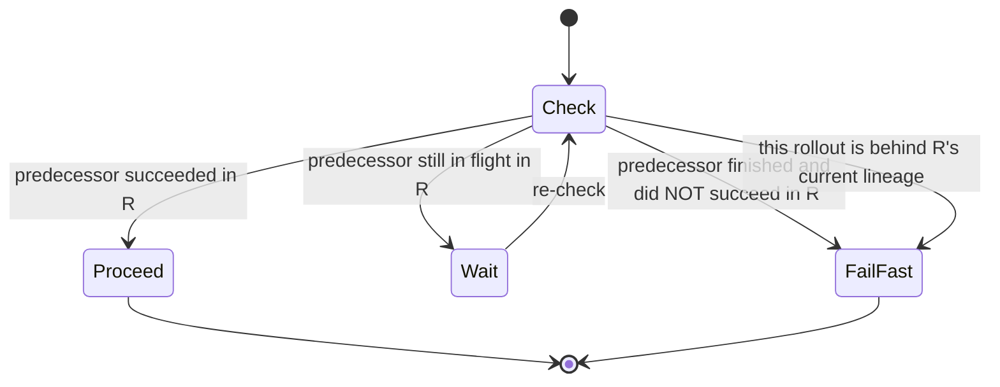
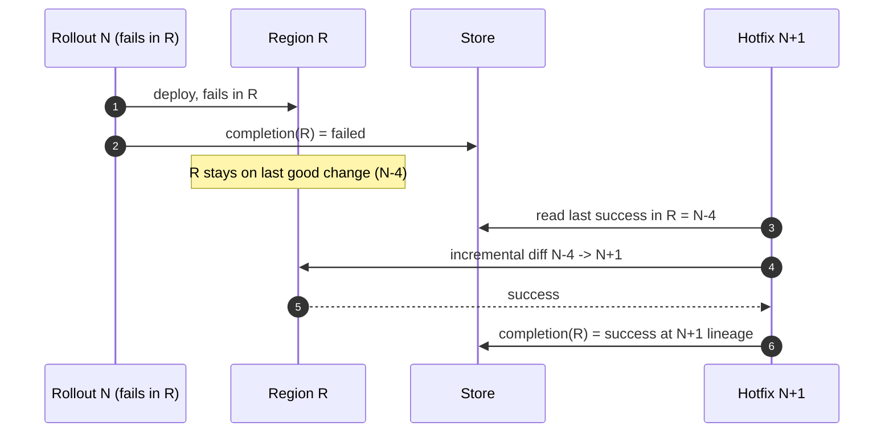
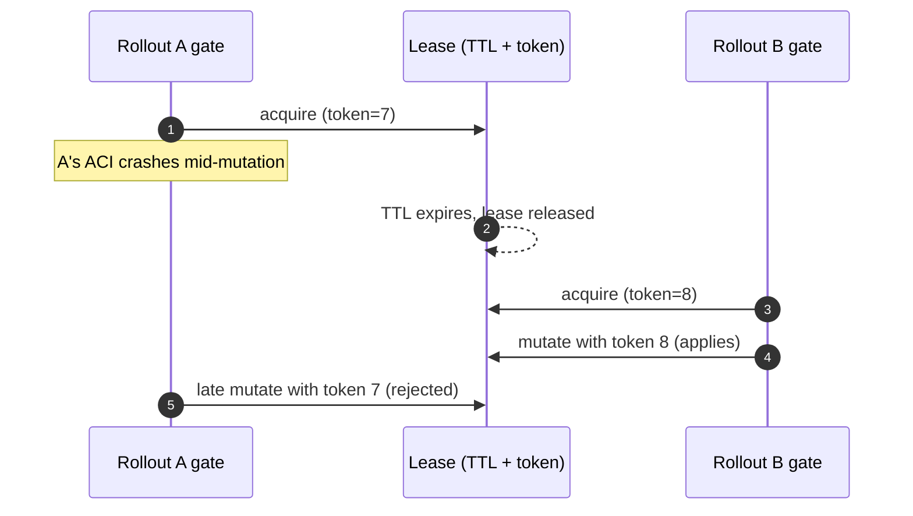
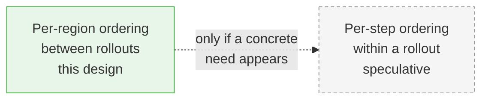

# Per-region rollout ordering for incremental prod rollouts

This document describes how we let several ARO HCP production rollouts run at the
same time while guaranteeing that, in any given region, an older change always
deploys before a newer one. A newer change can never overtake an older one in a
region.

The goal is not a new bespoke gate bolted onto rollouts. The goal is to make our
existing **incremental rollouts** safe to run in prod, continuously and
unattended, several times a day, without an SRE babysitting each one to completion.

This is a design document. The ordering mechanism is implemented in the
[sdp-pipelines](https://dev.azure.com/msazure/AzureRedHatOpenShift/_git/sdp-pipelines?path=/tooling)
EV2 tooling, next to the incremental-rollout generator it builds on. See
[EV2 Deployment](ev2-deployment.md) for the base rollout flow.

## Contents

- [Problem](#problem)
- [Goal](#goal)
- [Background: incremental rollouts and the missing signal](#background-incremental-rollouts-and-the-missing-signal)
- [Design overview](#design-overview)
- [Ordering key: commit lineage](#ordering-key-commit-lineage)
- [The gate: a single immediate predecessor](#the-gate-a-single-immediate-predecessor)
- [Failure and cancellation semantics](#failure-and-cancellation-semantics)
- [Recovery: failed rollouts and hotfixes](#recovery-failed-rollouts-and-hotfixes)
- [Intent and completion store](#intent-and-completion-store)
- [Mutual exclusion: a TTL and fenced lease](#mutual-exclusion-a-ttl-and-fenced-lease)
- [Release mechanism: bounded retries, no central config](#release-mechanism-bounded-retries-no-central-config)
- [EV2 APIs and guarantees](#ev2-apis-and-guarantees)
- [Environments](#environments)
- [Where each piece lives](#where-each-piece-lives)
- [Possible future: step-level ordering](#possible-future-step-level-ordering)
- [Discarded alternatives](#discarded-alternatives)
- [Open items](#open-items)

## Problem

Prod rollouts are long. A single rollout walks every prod region in sequence, and
each region can be held for a long time by validation baking. Two operational
constraints stretch this out further:

- **Read-only weekends.** There is no ARO SL SRE on-call over the weekend, so prod
  rollouts are frozen Friday to Monday. A rollout that starts mid-week can sit
  half-done across the weekend.
- **Baking windows.** Once per-region baking lands, a region is intentionally held
  for hours to days before the rollout advances.

Today the safe way to avoid two rollouts colliding is to wait for the previous
rollout to fully finish before starting the next one. With the constraints above,
that serializes prod to roughly one rollout per week, which is too slow.

We want to **start a new prod rollout while the previous one is still in flight**,
possibly several per day, and let them all complete **unattended**. The risk this
introduces is **ordering**. Without a guard, rollout `N+1` could reach region R and
deploy its change there before rollout `N` has deployed to R, leaving that region
on a newer change than an earlier one shipped. That must never happen.

The failure we are preventing, in one picture:



The region ends on the **older** change because the two rollouts raced. We need R
to accept `N` before `N+1`, every time, without anyone watching.

## Goal

Make incremental rollouts safe to run continuously in prod:

- Start prod rollouts on a schedule (daily or more), overlapping in time.
- Let every region deploy changes in the correct order with no manual sequencing.
- Let rollouts complete **unattended**, including across the weekend freeze.
- Recover cleanly when a rollout fails, including shipping a hotfix on top.

Non-goals:

- Ordering **within** a rollout across steps. That is a possible future extension,
  discussed at the end, and is not part of this design.
- Replacing baking, approvals, or any existing rollout safety control. This sits
  on top of them.

## Background: incremental rollouts and the missing signal

We already generate **incremental rollouts**. The generator compares the digest of
each step against the digest that step last deployed successfully, and only runs
the steps whose content changed. The core of this lives in
[`incremental.go`](https://dev.azure.com/msazure/AzureRedHatOpenShift/_git/sdp-pipelines?path=/tooling/pkg/ev2/manifests/generate/incremental.go):
each step becomes a `StepUpgrade{From: previousDeployment(...), To: {Digest}}`, and
`previousDeployment()` resolves to the **most recent successful rollout** of that
step. A step runs when there is no prior rollout, when the digest differs, or when
the prior record is not well formed. The reason codes are
`no_prior_rollout`, `digest_differs`, and `not_well_formed`
([`rollout.go`](https://dev.azure.com/msazure/AzureRedHatOpenShift/_git/sdp-pipelines?path=/internal/storageaccount/rollout.go)).

The reason we cannot simply run these in prod today is the missing signal Steve
called out: incremental generation assumes it can answer **"did the previous
rollout succeed in this region?"** and act on it. When rollouts overlap, that
answer is not available at plan time, because the predecessor may still be in
flight. Falling back to a full rollout every time is not acceptable either. Full
rollouts are expensive in wall-clock time and, just as importantly, they disturb
Azure resources far more often than we want.

So the design below is about **supplying that missing signal at runtime**: a small
store that records, per region, which change each rollout intends to deploy and
which change actually succeeded, plus a gate that reads it and either proceeds,
waits, or fails fast.

## Design overview

The model presumes **regularity**. Rollouts are scheduled in a known order. When we
schedule rollout `N`, we assume its immediate predecessor by lineage will succeed,
and we generate `N` as the incremental diff on top of it. At runtime, before `N`
touches region R, a small gate step checks the store to confirm the assumption
held **in R**. If it did, `N` proceeds. If the predecessor is still working R, `N`
waits. If the predecessor finished and did **not** succeed in R, `N` fails fast in
R rather than deploying on a stale base.



Three pieces make this work:

1. An **ordering key** derived from commit lineage, so "older" and "newer" are well
   defined and cannot be faked by triggering a rollout from an old commit.
2. A **single immediate predecessor** per rollout, so the gate has exactly one
   thing to check per region and it lines up with the incremental diff.
3. A **store** of intent and completion records that the gate reads and writes,
   protected by a short lease for mutual exclusion.

## Ordering key: commit lineage

The ordering key is **commit lineage**, not the ADO build id.

Build id and wall-clock time are wrong. An SRE can, by mistake or on purpose,
trigger a rollout from an **older** commit. That rollout has a newer build id and a
newer timestamp, but logically older content. If we ordered by build id, that stale
rollout would be treated as the newest and allowed to overwrite regions that
already have newer content. That is exactly the regression we are trying to
prevent.

Lineage is the git ancestry distance along the release branch. We already compute
this in the release dashboard using first-parent ancestry:

- `git log --first-parent --ancestry-path <ref>..<branch>` to walk the path, and
- `git rev-list --first-parent --count <ref>..<branch>` to get the distance,

from
[`candidate_commits_controller.go`](https://dev.azure.com/msazure/AzureRedHatOpenShift/_git/sdp-pipelines?path=/release-dashboard/backend/pkg/controllers/candidate_commits_controller.go).
A rollout for a commit that is an **ancestor** of another is unambiguously older,
regardless of when it was triggered. Ordering by lineage means a rollout launched
from an old commit sorts **behind** the changes that already shipped, so it cannot
jump the queue.



## The gate: a single immediate predecessor

Each rollout has exactly **one** immediate predecessor, its parent by lineage
(`N-1`). Not a set of predecessors. A single immediate predecessor is the robust,
correct model, and it lines up naturally with the incremental diff: `N` is the
diff of `N` on top of `N-1`, so the only thing the gate must confirm in region R is
that `N-1` actually landed in R.

The gate runs as the first step of the rollout in each region and asks one
question per region: **did my immediate predecessor succeed in this region?**



- **Proceed.** The predecessor's completion record for R shows success at the
  expected lineage. `N` deploys R.
- **Wait.** The predecessor has not finished R yet. `N` waits and re-checks. This
  is the normal overlap case and is **not** an error.
- **Fail fast.** The predecessor finished but did not succeed in R, or R has
  already advanced past this rollout's lineage. `N` fails in R immediately rather
  than deploying on a base that no longer holds.

The key distinction, which resolves the tension Steve flagged between "order is an
absolute invariant" and "complete unattended": **waiting is the default, hard
failure is rare.** A predecessor that is merely still running just makes the
successor wait. We only fail the pipeline on a genuine ordering violation, never on
"the predecessor is not done yet."

## Failure and cancellation semantics

The single rule that keeps this simple:

> **Only unfinished lower-lineage rollouts block. A finished rollout, whether it
> succeeded, failed, or was cancelled, never blocks anyone.**

From that rule:

- A **successful** predecessor lets its successor proceed in R.
- A **finished-failed** predecessor is done, so it stops blocking. But because it
  did not succeed in R, its successor's incremental base for R is stale, so the
  successor **fails fast** in R. The region simply stays on the last good change
  until a fix arrives.
- A **cancelled** rollout is finished, so it also stops blocking. Cancelling a
  rollout invalidates the incremental successors that were generated assuming it
  would land, so those successors must be regenerated against the real last-success
  base (see recovery, below). Cancellation never wedges the queue.

This is why cancellation "does not block" but still cannot be ignored: it unblocks
the ordering immediately, and it forces a base recompute for anything generated on
top of it.

## Recovery: failed rollouts and hotfixes

This is the case Steve asked us to design for: `N` fails, and we ship a hotfix.

The foundation is already in the incremental generator: `previousDeployment()`
resolves to the **most recent successful** rollout of a step, not the most recently
**scheduled** one. So the incremental base is naturally "last success," and it is
computed per step. The ordering layer must order on lineage, but base the **diff**
on last-success, per region.

Worked example, ordering left to right by lineage:

```text
... N-4 (last success in R)   N-3   N-2   N-1   N  (fails in R)   N+1 (hotfix)
```



How the questions Steve raised resolve:

- **Does `N` wait on `N-2 .. N-1`?** `N` waits only on predecessors that are still
  **unfinished** in R. Once `N-1` finishes, whatever its result, it stops blocking.
  If `N-1` failed, `N` fails fast in R rather than deploying on a stale base.
- **Why does hotfix `N+1` not concern itself with `N` having failed?** Because `N`
  is **finished**, it does not block. And `N+1`'s incremental base is recomputed to
  the last success in R (`N-4` in the example), so `N+1` skips the failed `N`
  entirely. `N+1` only requires that the last-success record for R is present and
  that no lower-lineage rollout is still working R.

So recovery needs no special "unwind" logic. The generator already bases the diff
on last-success; the ordering layer just has to (1) not block on finished rollouts
and (2) fail fast when a region's base is stale, prompting the hotfix.

## Intent and completion store

To support "an older rollout is still going, wait for it," a successor needs to
know that an earlier rollout **exists and intends to reach this region**, before it
has produced any result. A pure "did it succeed" record is not enough, because a
predecessor that has not started R yet has no success record and no failure record.
So the store holds two kinds of record, keyed by `(serviceGroup, environment,
region)`:

- **Intent.** "Rollout for change C intends to deploy region R." Written by the
  gate when the rollout starts, before it mutates anything.
- **Completion.** "Change C succeeded in region R" (or failed). Written after the
  deploy step finishes.

The gate reads predecessor completion, writes its own intent, deploys, then writes
its own completion. Intent lets a successor see an in-flight predecessor and wait;
completion lets it confirm success and lets the incremental generator find the
last-success base.

This store is **ours**. It is a small storage account we control, not the EV2
central config server. We deliberately do not put this state into EV2 central
config: having an external process mutate central config invites races and a large
blast radius, and there is a reason we do not build on the central config server
today. Keeping our own intent/completion store keeps the blast radius to this one
storage account.

## Mutual exclusion: a TTL and fenced lease

When the gate mutates the store (claim intent, record completion, advance the
region's lineage) it takes a short lease so two overlapping rollouts cannot both
believe they are next in R. The lease must be crash-safe:

- **TTL.** The lease auto-expires. If the step that holds it crashes, or the
  underlying ACI dies, the lease is released on its own and the system does not
  deadlock waiting on a holder that will never come back.
- **Fencing token.** Each acquisition gets a monotonically increasing token. A
  mutation only applies if it carries the current token, so a stalled holder that
  wakes up after its lease expired cannot corrupt state that a newer holder has
  already advanced.



The lease is short-lived and only guards the store mutations. It does not span the
long baking window; the ordering gate, not a held lease, is what enforces sequence
across long waits.

## Release mechanism: bounded retries, no central config

The gate step needs to hold a rollout in R until its predecessor lands, then let it
go. Two things this design explicitly does **not** do:

- It does **not** touch EV2 central config. No `configExists`-style flag flipped by
  an outside process. All coordination goes through our own store, for the
  blast-radius reasons above.
- It does **not** rely on an unbounded `autoRestart` to "hold the step for days for
  free." EV2 restart attempts are **finite** (see the next section), so a gate that
  waits by failing-and-restarting must assume a bounded number of attempts.

So the gate uses **bounded retries**: it waits and re-checks a bounded number of
times, and if it exhausts them without the predecessor landing, the rollout **fails
cleanly** and is rescheduled rather than hanging. In normal operation the gate only
needs to bridge the predecessor's ordinary per-region duration, not the whole
weekend. The weekend freeze is handled by not scheduling across it, not by a step
that sleeps for two days.

## EV2 APIs and guarantees

The pieces this design leans on, and what each guarantees:

- **Per-region rollout status.** We already read per-region status through
  `RegionStatuses`, which lists batched rollouts and fetches their per-region
  statuses
  ([`status/options.go`](https://dev.azure.com/msazure/AzureRedHatOpenShift/_git/sdp-pipelines?path=/tooling/pkg/ev2/rollout/status/options.go),
  [`client.go`](https://dev.azure.com/msazure/AzureRedHatOpenShift/_git/sdp-pipelines?path=/internal/clients/ev2/client.go)).
  This is the read side the gate builds on for confirming a predecessor's regional
  outcome.
- **Incremental generation.** `StepUpgrade{From, To}` with `From =
  previousDeployment()` gives us the last-success base per step
  ([`incremental.go`](https://dev.azure.com/msazure/AzureRedHatOpenShift/_git/sdp-pipelines?path=/tooling/pkg/ev2/manifests/generate/incremental.go)).
- **Restart attempts are finite.** `maxRestartAttempts` in
  [`RolloutPolicy.json`](https://dev.azure.com/msazure/AzureRedHatOpenShift/_git/sdp-pipelines?path=/internal/types/ev2/schemas/RolloutPolicy.json)
  is a required integer, and the region-agnostic spec defines an
  `onLastAutoRestart` incident condition, which means EV2 has a defined **last**
  restart. Restarts are bounded, so the gate cannot lean on them for an unbounded
  hold. This is the concrete result of Steve's ask to check the internal EV2
  codebase for caps.

Open follow-up: confirm the exact `maxRestartAttempts` ceiling and any timeout caps
against the internal EV2 service, so we size bounded retries correctly. Tracked as a
non-blocking item below.

## Environments

The design is **environment-agnostic**. Nothing about lineage ordering, the
intent/completion store, or the lease is prod-specific.

Prod is the **first target** because prod is the multi-region environment where
overlapping long rollouts actually collide. Int and stg are single-region, so the
ordering question degenerates: with one region, "did my predecessor succeed in R"
is the whole story and there is no cross-region race. The same gate runs there
harmlessly and gives us a consistent mechanism everywhere, so we do not special-case
prod in the tooling. We just get the most value from it in prod.

## Where each piece lives

Two things need a home: the coordination **code** (gate step, lease, store client)
and the **store** itself.

- **Code** lives in
  [sdp-pipelines](https://dev.azure.com/msazure/AzureRedHatOpenShift/_git/sdp-pipelines?path=/tooling),
  next to the incremental generator and the EV2 client it reuses. This is the same
  place all EV2 rollout tooling already lives.
- **The gate step** can be attached to the rollout by **topology merging** in
  sdp-pipelines, dangling the step off the existing global service group, rather
  than adding new bicep to this repository's global-infra. This keeps ARO HCP's
  global-infra untouched and keeps the whole mechanism in the tooling repo that
  owns rollout generation.
- **The store** is a small storage account. The preferred option is to provision
  and own it in sdp-pipelines alongside the tooling, for the same reason: keep the
  coordination surface in one place. Provisioning it in ARO HCP global-infra is a
  possible alternative if we decide the store should live with product infra, but
  it is not the default.

For context on the global service group this would attach to: it deploys the global
infrastructure, reconciles the global **Grafana** instance and its roles, and
deploys the **SVC and OCP ACRs**, along with the shared MSI, key vault, DNS, and
encryption key
([`global-pipeline.yaml`](https://github.com/Azure/ARO-HCP/blob/main/dev-infrastructure/global-pipeline.yaml)).
It is not limited to MSI, key vault, DNS, and the encryption key.

## Possible future: step-level ordering

A natural question is whether we later want the same ordering **between steps**
within a rollout, not just between whole rollouts. This is left as a speculative
future direction, not a committed part of this design. There is no clear agreement
that we want per-step locking, and it adds real complexity, so this document scopes
the mechanism to whole-rollout, per-region ordering and leaves step-level ordering
as an open question to revisit only if a concrete need appears.



## Discarded alternatives

- **Order by ADO build id or wall-clock time.** Rejected: a rollout triggered from
  an older commit gets a newer build id and timestamp but older content, so it
  would be allowed to overwrite newer regions. Lineage is the correct key.
- **A set of predecessors per rollout.** Rejected in favor of a single immediate
  predecessor, which is simpler, matches the incremental diff, and gives the gate
  exactly one thing to check per region.
- **Store coordination state in EV2 central config.** Rejected: an external process
  mutating central config invites races and a large blast radius. We keep our own
  small store.
- **Hold a step open via a large `autoRestart` count.** Rejected: EV2 restarts are
  finite (`onLastAutoRestart`), so this is unsafe. We use bounded retries plus
  reschedule, and rely on scheduling to avoid the weekend.
- **Serialize prod to one rollout at a time.** The status quo. Rejected as too slow
  given weekend freezes and baking windows.

## Open items

- Confirm the exact `maxRestartAttempts` ceiling and any per-step timeout caps in
  the internal EV2 service, to size bounded retries. Non-blocking.
- Decide whether the store is provisioned in sdp-pipelines (preferred) or ARO HCP
  global-infra.
- Define the store's record schema and retention (how long intent and completion
  records are kept per region).
