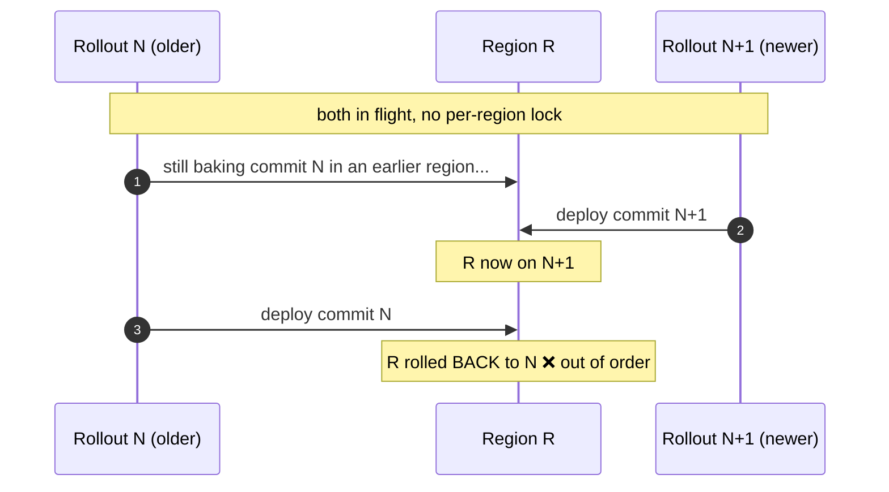
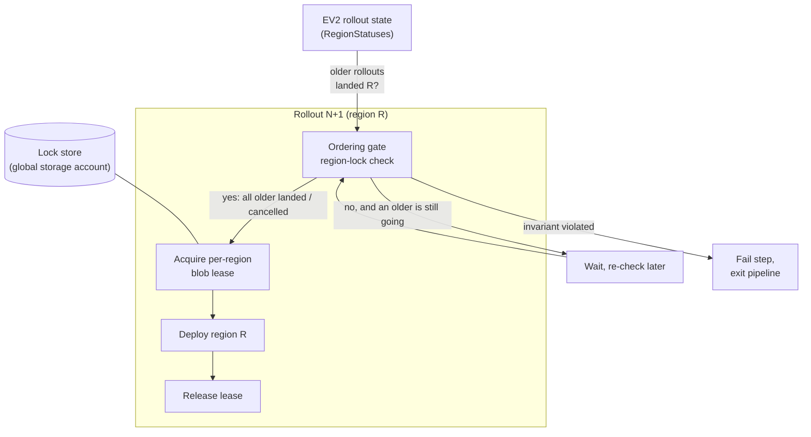
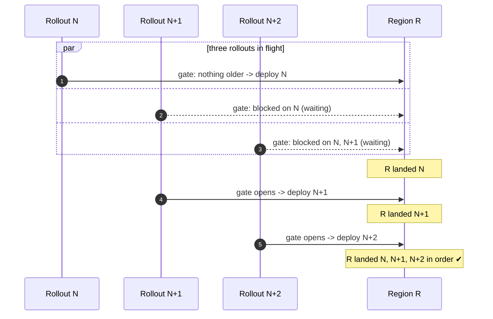
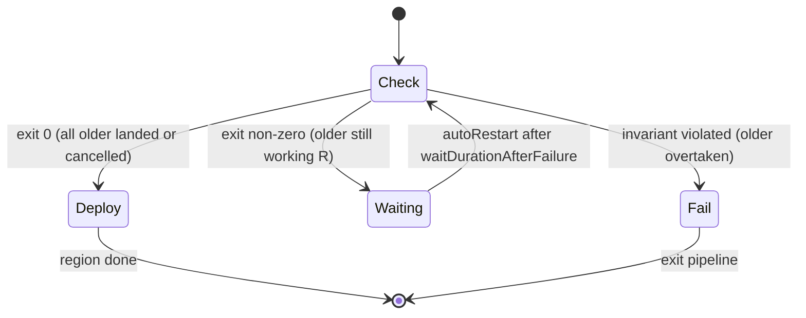
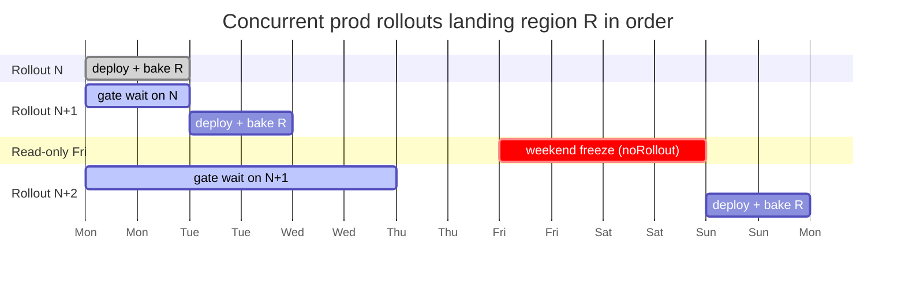
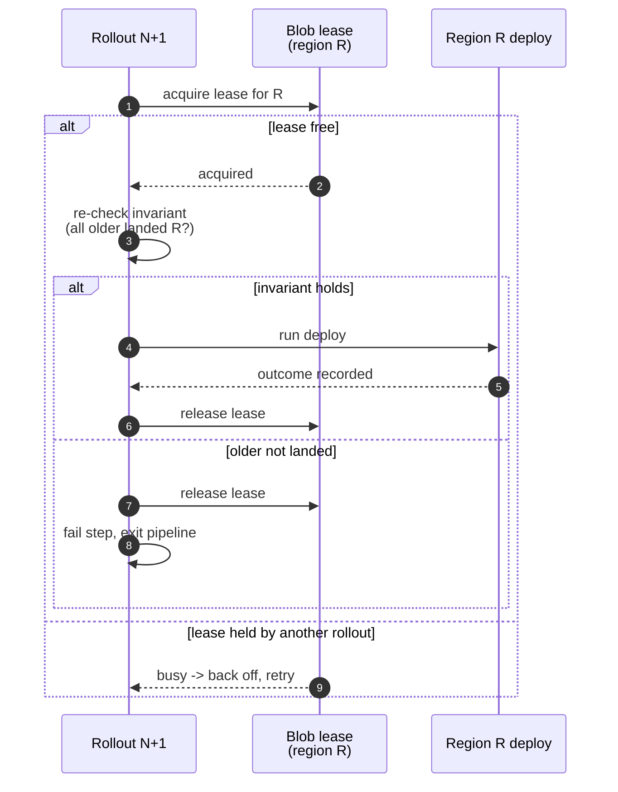
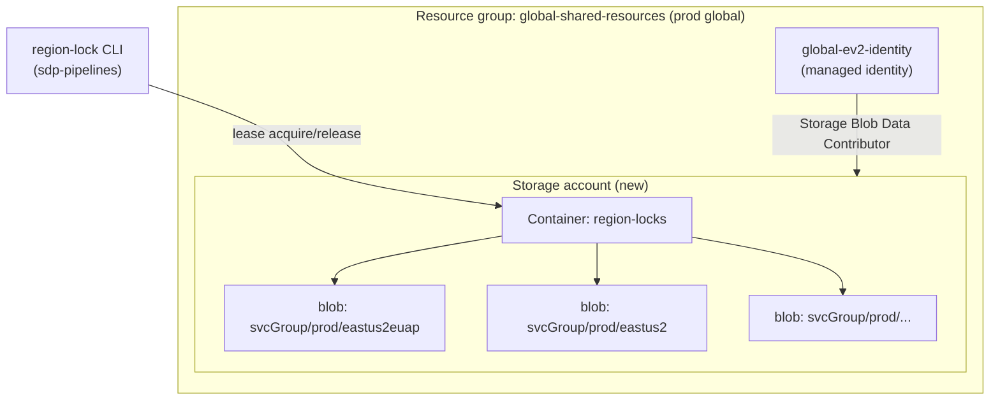
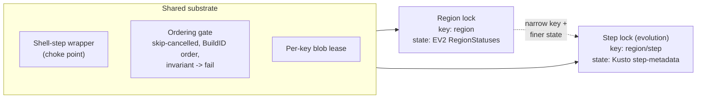

# Per-region EV2 rollout lock

This document describes the design of a **per-region rollout lock** for ARO HCP
production deployments. The lock lets several prod rollouts run at once while
guaranteeing that, in any given region, an older commit always deploys before a
newer one. No newer commit can overtake an older one in a region.

This is a design document. The mechanism is implemented in the
[sdp-pipelines](https://dev.azure.com/msazure/AzureRedHatOpenShift/_git/sdp-pipelines?path=/tooling)
EV2 tooling and the lock-store infrastructure lives in this repository's
[global service group](#lock-store-infrastructure). See
[EV2 Deployment](ev2-deployment.md) for the base rollout flow this builds on.

## Problem

Prod rollouts are long. A single rollout walks every prod region in sequence,
and each region can be held for a long time by validation baking. Two operational
constraints stretch this out further:

- **Read-only Fridays.** There is no ARO SL SRE on-call over the weekend, so prod
  rollouts are frozen from Friday to Monday. A rollout that starts mid-week can sit
  half-done across the weekend.
- **Baking windows.** Once per-region baking lands, a region is intentionally held
  for hours to days before the rollout advances.

Today the safe way to avoid two rollouts colliding is to wait for the previous
rollout to fully finish before starting the next one. With the constraints above,
that serializes prod to roughly one rollout per week, which is too slow.

We want to **start a new prod rollout while the previous one is still in flight**,
possibly several per day, and let them all complete **unattended**. The risk this
introduces is **ordering**: without a guard, rollout `N+1` could reach region R and
deploy commit `N+1` there before rollout `N` has deployed commit `N` to R, leaving
that region on a newer commit than an earlier one shipped. That must never happen.

The failure we are preventing, in one picture:



## Goal

- A **per-region ordering lock** for prod: rollout `N+1` must not begin deploying a
  region until every older in-flight rollout has finished that same region (or was
  cancelled).
- Multiple prod rollouts in flight at once, completing **in commit order, per
  region, unattended.**
- Ordering is an **absolute invariant.** If it cannot be honored, the region step
  **fails and exits the pipeline** rather than deploying out of order.

## Non-goals

- **Not a pipeline-level lock.** Azure DevOps already serializes and skips pipelines.
  This is a finer, per-region guard so region-by-region progress cannot overtake
  itself.
- **Not for int/stg.** Those environments are effectively single-region, so one
  rollout at a time is enough and there is no ordering to enforce. **Prod only.**
- **Cancelled rollouts never block.** A cancelled older rollout is not going to
  finish region R, so it must not hold up its successors. Only in-progress, pending,
  or failed-not-cancelled older rollouts block.

## Background: EV2 has no native cross-rollout region lock

EV2 orchestrates region ordering *within* a single rollout, but it has no primitive
that makes one rollout wait on another rollout's per-region progress. Every
concurrency knob EV2 exposes is scoped to a single rollout:

- **StageMap concurrency** (region/stamp concurrency, promotion, validation baking)
  controls how *one* rollout walks its own regions. It says nothing about a second,
  concurrent rollout over the same region.
- **RolloutPolicy is declarative, not a programmable evaluator.** It has two shapes:
  - `noRollout` is a time-and-location freeze window. This is exactly the mechanism
    behind read-only Fridays and change-freeze (CCOA) windows: it suspends running
    rollouts and blocks new ones during the window. It cannot look at another
    rollout's state.
  - `safeRollout` is static region staging (allowed/disallowed regions, max
    parallelism, region pairs). Also fixed at authoring time, also blind to other
    rollouts.
- **`wait` action with `completeOn: configExists`** holds a step until a named EV2
  configuration setting exists. It is the only unattended, programmable, pre-step
  wait trigger (`manual` needs a human, `incidentResolution` needs an ICM). But the
  setting it waits on has to be published through EV2's configuration service, which
  is external to the rollout and gated behind internal EV2 docs.
- **Health checks** (`restHealthCheck`, `mdmHealthCheck`) are post-deploy monitors,
  capped under 24h. They can gate advancing *past* a region, not *starting* one.

So cross-rollout, per-region mutual exclusion has to be built on top of EV2, using
EV2's own rollout state as the source of truth.

## Design overview

Three parts, layered on the base EV2 flow:

1. An **ordering gate** injected at the head of every prod region. It blocks the
   region until all older in-flight rollouts have landed that region, then lets the
   region deploy. This is where ordering is enforced.
2. A **per-region mutex** (a blob lease) taken around the actual deploy, so two
   rollouts can never write the same region at the same instant during hand-off.
3. A **lock store** (a storage account in the global service group) that backs the
   lease.



## The ordering gate

The gate is the brain. For a rollout deploying region R, it answers one question:
**may I deploy R now?**

Answer *yes* only when, for region R, **every rollout older than me is either done
with R or cancelled.** Otherwise wait. If I have somehow already passed an older
rollout that has not finished R, that is an invariant violation and the step fails.

### Ordering key

Rollouts are ordered by `Umbrella.BuildID`, the ADO build id, which is monotonic
(lower id = older rollout). Rollout `StartTime` is the fallback. The umbrella is
already carried on each region's landed state, so the gate does not need any new
metadata:

```text
Umbrella { AROHCPCommit, SDPPipelinesCommit, BuildID }
```

### Gate logic

```text
CanProceed(region R, me = my BuildID):
  older = rollouts targeting R with BuildID < me
  for each o in older:
    if o is Cancelled:              skip        # never blocks
    if o has landed R (Succeeded):  ok
    else:                           BLOCK       # older still working R -> wait
  if any older non-cancelled rollout is *newer-landed* than me on R:
    FAIL   # ordering already violated -> exit pipeline
  return PROCEED
```

The gate reads live rollout state through the existing `RegionStatuses()` primitive
in the sdp-pipelines EV2 tooling (EV2 REST today; the same shape can be sourced from
Kusto rollout step-metadata later). No new EV2 API is required.

### Why this yields strict order for N concurrent rollouts

Ordering falls out of the gate, not the lock. Each rollout's blocking set contains
its **immediate predecessor**, so the fan-in of N concurrent rollouts chains into
strict commit order automatically. There is no queue or FIFO structure to maintain:

```text
region R:  N blocks on (nothing older)   -> N deploys R
           N+1 blocks on N               -> N+1 deploys R only after N landed R
           N+2 blocks on N and N+1       -> ... after N+1 landed R
```

Because `N+2` blocks on `N+1`, and `N+1` blocks on `N`, the three can be in flight
at once and still land R in the order N, N+1, N+2 with no coordinator.



## Release mechanism: shell gate step + autoRestart

The gate has to hold a region until its predecessor lands it, which can take hours
to days once baking and the weekend freeze are involved. Two facts shape the
mechanism:

- EV2 shell steps have a `maxExecutionTime` and EV2 **terminates** them at timeout.
  A shell step cannot simply busy-wait for days.
- The only native way to hold with *no process* for days is `wait` +
  `configExists`, but publishing the release signal it waits on needs EV2's config
  service, which is gated. See [Open items](#open-items).

So the release mechanism does **not** depend on `configExists`. Instead the gate is
a short, leading shell step that **polls and re-runs**:

- The gate step runs `region-lock check`. If the predecessor has landed R it exits
  `0` and the region deploys.
- If it is not yet R's turn, the step exits non-zero. EV2 `autoRestart` re-runs it
  later: `waitDurationAfterFailure` is the poll interval, `maxRestartAttempts` is
  set high (the schema has no cap), and `skipSucceeded` means only the gate re-runs,
  not completed work. Between attempts there is **no process**, so the hold spans
  hours to days for free.
- Read-only Fridays already freeze all rollouts over the weekend (a `noRollout`
  window), so the gate's *active* wait is realistically under a day; `autoRestart`
  covers the tail.

`wait` + `configExists` stays as a nicer future swap (a process-less native hold
with no retry churn) if the EV2 config-publish path is confirmed. The gate logic is
identical either way; only the EV2-side trigger differs.

The gate step's lifecycle, driven entirely by exit code and `autoRestart`:



Between `Waiting` and the next `Check` there is no running process, so the hold
costs nothing while it spans baking windows and the weekend freeze.

The active wait is bounded in practice, because read-only Fridays freeze everything
over the weekend regardless:



## Mutual exclusion: per-region blob lease

The gate orders the *start* of a region. A short **per-region blob lease** protects
the hand-off window so two rollouts can never deploy the same region at the same
instant:

- Blob path per region: `<serviceGroup>/<env>/<region>`.
- The wrapped deploy step (short, within `maxExecutionTime`) acquires the lease,
  re-checks the ordering invariant, runs the deploy, records the outcome, and
  releases the lease.
- If, at acquire time, any older non-cancelled rollout has not landed R, the step
  **fails and exits the pipeline** — order must never be violated.



## Lock store infrastructure

There is no existing global store to reuse — the global service group today deploys
only a global managed identity, a global Key Vault, DNS, and an encryption key. The
lock needs a small new resource:

- A **storage account** in the `global-shared-resources` resource group (the prod
  global service group), added to `global-infra.bicep`.
- A blob container `region-locks`, one blob per `<serviceGroup>/<env>/<region>`.
- A role assignment granting the global EV2 identity (`global-ev2-identity`)
  **Storage Blob Data Contributor** on the account.



This is the one part of the mechanism that lives in this repository, because ARO HCP
owns the global-infra templates that sdp-pipelines vendors and deploys. The gate
logic, the lease client, and the EV2 step injection live in sdp-pipelines.

## CLI surface

The gate and lease are exposed as a subcommand of the EV2 rollout tooling, mirroring
the existing `status` and `deployed` verbs:

```text
aro ev2 rollout region-lock check    --env prod --region <R>   # gate decision
aro ev2 rollout region-lock acquire  --env prod --region <R>   # take the lease
aro ev2 rollout region-lock release  --env prod --region <R>   # drop the lease
```

`check` is read-only and safe to run anywhere. `acquire`/`release` operate on the
lock store.

## Where each piece lives

| Piece | Repository |
| --- | --- |
| This design doc | ARO HCP (`docs/`) |
| Lock-store storage account + role (bicep) | ARO HCP (`global-infra.bicep`) |
| Gate logic (`region-lock check`) | sdp-pipelines (`tooling`) |
| Blob-lease client (`acquire`/`release`) | sdp-pipelines (`tooling`) |
| EV2 shell-step injection + `autoRestart` wiring | sdp-pipelines (pipeline generation) |

## Evolution to step-level locking

This design is deliberately the **coarsest instance of a reusable substrate**. The
same shell-step wrapper, per-key blob-lease mutex, and ordering-gate algorithm can
be narrowed from *per region* to *per step* to give the step-level lock tracked as a
separate work item. The gate algorithm does not change; only the **lock key** and
the **"landed" state source** do.



What is reused as-is: the wrapper choke point, the gate logic (block older
non-cancelled rollouts that have not landed the key, skip cancelled, order by
`Umbrella.BuildID`, fail on invariant violation), the blob-lease mutex, the
`autoRestart` release mechanism, and the CLI shape.

What changes going region to step:

- **Lock key** narrows from `<serviceGroup>/<env>/<region>` to
  `<serviceGroup>/<env>/<region>/<step>`.
- **State source** moves from per-region EV2 `RegionStatuses()` to **per-step Kusto
  step-metadata**, because per-region rollout status is too coarse to know that an
  individual step landed. Producing that reliable per-step signal is the substrate
  the step-lock work item delivers.
- **Injection points** grow from one per region to one per (region, step).

Practical guidance for the evolution: apply step-locking only to
**ordering-sensitive** steps rather than every step, so lease and evaluation cost
stay bounded and independent/idempotent steps are not needlessly serialized.

## Discarded alternatives

- **A native EV2 per-region lock.** None exists. StageMap concurrency is
  intra-rollout; RolloutPolicy is declarative. Rejected as unavailable.
- **RolloutPolicy `safeRollout` to stage regions.** Static, authoring-time region
  staging. It cannot look at another rollout's per-region state, so it cannot
  enforce cross-rollout order. Rejected.
- **A dynamic `noRollout` freeze controller** that opens/closes freeze windows to
  gate regions. Abuses a coarse, time-based freeze primitive for fine per-region
  ordering, races the EV2 policy cache, and freezes *all* rollouts, not just the
  out-of-order one. Rejected.
- **Health-check gate (`restHealthCheck`/`mdmHealthCheck`).** Post-deploy monitors,
  capped under 24h. They gate advancing past a region, not starting one, and cannot
  hold across baking/weekends. Rejected for the pre-region hold.
- **`wait` + `manual`/`incidentResolution` triggers.** `manual` needs a human, which
  breaks unattended operation; `incidentResolution` needs an ICM. Rejected.
- **A pipeline-level lock.** Too coarse — ADO already serializes pipelines, and this
  would not stop region-by-region overtaking within the allowed concurrency.
  Rejected as out of scope.

## Open items

- **`configExists` publish path.** The one remaining unknown is which config service
  backs EV2 `wait` + `configExists` and how a rollout identity publishes the release
  signal. The docs are gated behind internal EV2 documentation. This does **not**
  block the design: the release mechanism uses the polling shell gate +
  `autoRestart` above and needs no config API. `configExists` is tracked only as a
  future optimization.
