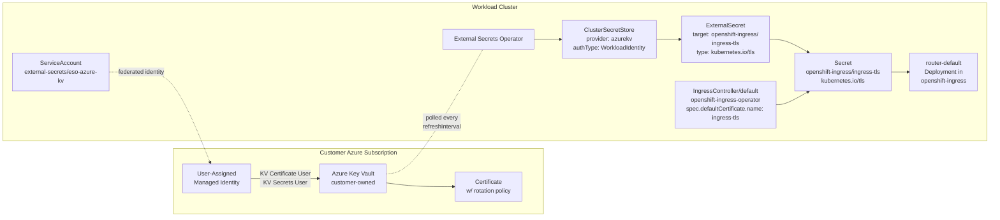

# Design: Customer-Managed Ingress Serving Certificates from Azure Key Vault

## Goal

Let an ARO HCP customer:

1. Store an ingress serving certificate (cert + private key) in an Azure Key
   Vault they own, with an auto-rotation policy configured on the certificate.
2. Have that certificate materialize inside the workload cluster as a standard
   `kubernetes.io/tls` Secret, without the customer having to ship keys to
   Microsoft, Red Hat, or any third party.
3. Point the OpenShift `default` `IngressController` at that Secret so the
   router serves the customer's certificate on `*.apps.<cluster-domain>`.
4. Get rotations performed in Key Vault propagated into the cluster Secret —
   and from there into the running router — automatically, with no SRE
   action and no cluster restart.

## Scope and non-goals

This document is about the **workload cluster's** ingress (`openshift-ingress`
/ the `default` IngressController on the data plane). It is **not** about:

- The service or management cluster's ingress (those are operator-internal and
  already use the Secrets Store CSI driver with the platform Key Vault — see
  [ingress-egress.md](../ingress-egress.md)).
- The HCP control plane TLS (kube-apiserver, etcd, etc.) — those are managed
  by HyperShift and are out of scope here.
- Issuing the certificate itself (we assume the customer's CA workflow is
  already producing a cert into AKV; this design only covers the
  Key-Vault-to-cluster sync).

## Background: why the obvious choice (Secrets Store CSI Driver) is the wrong shape

The closest first-party Azure-supported option is the [Azure Key Vault
Provider for Secrets Store CSI
Driver](https://github.com/Azure/secrets-store-csi-driver-provider-azure)
(the same component used today for the service cluster's Istio gateway). It
supports auto-rotation polling and can sync to a Kubernetes Secret via the
`secretObjects` field on a `SecretProviderClass`.

It is the wrong shape for **this** use case for two reasons:

1. **The synced Kubernetes Secret only exists while a pod actively mounts the
   `SecretProviderClass` volume.** This is by design: the synced Secret is
   ownerRef'd to the consuming pod, and disappears when the last consumer
   does. ([source](https://azure.github.io/secrets-store-csi-driver-provider-azure/docs/configurations/sync-with-k8s-secrets/))
2. **The OpenShift router does not mount its serving certificate via CSI.**
   The cluster-ingress-operator reads `IngressController.spec.defaultCertificate`
   as a Secret reference, copies the material into `openshift-ingress`, and
   projects it into the router pods through its own managed Deployment. The
   customer does not own that Deployment and cannot add CSI volume mounts to
   it.

So with the CSI driver we would need a custom sidecar / dummy pod whose only
job is to "hold the Secret alive" so the router operator can read it. That is
load-bearing complexity for no benefit.

## Chosen mechanism: External Secrets Operator (ESO)

[External Secrets Operator](https://external-secrets.io/) is a CNCF project
with a first-class Azure Key Vault provider. We will require the customer to
install ESO in the workload cluster (via Helm or OperatorHub) and configure:

- One `ClusterSecretStore` (or namespaced `SecretStore`) pointing at the
  customer's AKV, authenticating via Azure **Workload Identity** (federated
  credential bound to a Kubernetes ServiceAccount in the workload cluster).
- One `ExternalSecret` that targets a single AKV certificate, templates the
  PEM into `tls.crt` / `tls.key`, and writes a `kubernetes.io/tls` Secret into
  `openshift-ingress`.

The customer then patches `IngressController/default` in
`openshift-ingress-operator` with `spec.defaultCertificate.name` set to the
Secret name. ESO refreshes on its configured `refreshInterval`; when a new
certificate version appears in AKV the Secret is updated in place, the
cluster-ingress-operator notices the resourceVersion change, and the router
pods reload their serving cert without a restart.

### Why ESO over the CSI driver (and the Arc Secret Store extension)

| Concern | ESO | CSI Driver | Arc Secret Store Ext. |
|---|---|---|---|
| Secret exists without a consumer pod | **Yes** | No (lifecycle bound to a mounting pod) | Yes |
| Works on non-Arc, vanilla OpenShift | **Yes** | Yes | **No** (Arc-only) |
| Produces `kubernetes.io/tls` natively | **Yes** (templated) | Possible via `secretObjects.type` | Yes |
| Workload Identity auth | **Yes** | Yes | Yes |
| Rotation propagation | Poll on `refreshInterval` (configurable, typ. 1h) | Poll, default 2 min | Poll, configurable |
| Fits the OpenShift IngressController contract | **Yes** — Secret-by-reference matches what the operator already wants | Awkward — needs a sidecar to keep the Secret alive | Yes, but cluster must be Arc-enabled |
| CNCF / vendor-neutral | **Yes** (CNCF graduated) | kubernetes-sigs + Azure provider | Microsoft-only |

ESO wins because **it is the only option whose lifecycle model is "a Secret
exists in the cluster because a declarative CR says so," which is exactly the
model the OpenShift Ingress operator already assumes.**

We are not choosing the CSI driver despite it being the in-house standard for
the management/service clusters: those clusters consume the secrets via pods
*we* control (Istio gateway pods, etc.), so the pod-mount lifecycle is fine
there. For customer workload clusters where the consumer is the
operator-managed router, ESO is the right fit.

### Why not cert-manager + an Azure issuer

cert-manager is excellent at *issuing* certificates (ACME, internal CA), but
it does not have a first-class "pull an existing cert from AKV" issuer; that
is a sync problem, not an issuance problem. Customers who want cert-manager
to issue *into* AKV can still do so — this design simply terminates at "a
cert exists in AKV" and handles the sync from there. The two are
complementary, not competing.

## Architecture



### Identity and authorization

- Customer creates a **User-Assigned Managed Identity (UAMI)** in their
  subscription.
- Customer adds a **federated identity credential** on that UAMI whose
  subject is `system:serviceaccount:external-secrets:eso-azure-kv` (or
  whatever SA the customer configures) and whose issuer is the workload
  cluster's OIDC issuer URL. ARO HCP already publishes a public OIDC issuer
  per hosted cluster; this design reuses that.
- Customer grants the UAMI **Key Vault Certificate User** and **Key Vault
  Secrets User** RBAC roles on the AKV (scope at the vault, or per-cert via
  ABAC if they want least privilege).
- The ServiceAccount in the cluster is annotated with the UAMI's client ID
  and tenant ID; ESO's Azure provider picks these up and exchanges the
  projected SA token for a Microsoft Entra token via federation.

No long-lived credentials are stored in the cluster.

### The `ExternalSecret`

AKV stores a certificate as a single object whose `value` is a PFX (PKCS#12)
blob. The associated Key Vault *secret* with the same name returns the same
PFX. ESO's Azure KV provider can fetch the `tls`-typed secret and we use a
template to produce PEM.

Approximate shape (final field names verified against the ESO version we ship
in the test):

```yaml
apiVersion: external-secrets.io/v1
kind: ClusterSecretStore
metadata:
  name: customer-akv
spec:
  provider:
    azurekv:
      authType: WorkloadIdentity
      vaultUrl: https://${KV_NAME}.vault.azure.net
      serviceAccountRef:
        name: eso-azure-kv
        namespace: external-secrets
---
apiVersion: external-secrets.io/v1
kind: ExternalSecret
metadata:
  name: ingress-tls
  namespace: openshift-ingress
spec:
  refreshInterval: 1h
  secretStoreRef:
    name: customer-akv
    kind: ClusterSecretStore
  target:
    name: ingress-tls
    template:
      type: kubernetes.io/tls
      data:
        tls.crt: "{{ .pfx | b64dec | pkcs12cert }}"
        tls.key: "{{ .pfx | b64dec | pkcs12key }}"
  data:
    - secretKey: pfx
      remoteRef:
        key: ${CERT_NAME}
```

The `IngressController` patch:

```yaml
apiVersion: operator.openshift.io/v1
kind: IngressController
metadata:
  name: default
  namespace: openshift-ingress-operator
spec:
  defaultCertificate:
    name: ingress-tls
```

Per the OpenShift docs, the Secret referenced by `spec.defaultCertificate`
lives in `openshift-ingress` and the ingress operator copies/projects it as
needed.

### Rotation flow

1. Customer's AKV rotation policy fires (or the customer manually creates a
   new certificate version). AKV produces a new version of the cert object.
2. AKV returns the **latest version by default** when ESO fetches by name on
   its next `refreshInterval` tick.
3. ESO writes the new `tls.crt` / `tls.key` into the existing Secret object
   (same name, new content, bumped `resourceVersion`).
4. The cluster-ingress-operator watches `IngressController.spec.defaultCertificate`
   and the referenced Secret; on change it reconciles the router config and
   the haproxy router reloads with the new cert.
5. No restart, no SRE involvement.

`refreshInterval` is a trade-off between rotation latency and AKV API
pressure. We will recommend **1 hour** as default; the test uses **30 seconds**
to keep the test runtime bounded.

### Failure modes worth calling out

- **AKV becomes unreachable / RBAC revoked.** ESO surfaces the failure on the
  `ExternalSecret` status; the existing Secret is **not** deleted. The router
  keeps serving the previous cert. We will document this and add an alert
  recommendation.
- **Template fails (e.g. wrong PFX password assumed).** Same as above — no
  destructive update; status carries the error.
- **Cert rotated in AKV but new key is invalid for the existing routes (e.g.
  CN/SAN no longer covers the apps domain).** Not detectable by ESO; the
  router will reload with a cert that doesn't match. Out of scope here, but
  worth a note in customer docs.

## What this design does **not** change

- HyperShift / control plane: untouched.
- ARO HCP RP, frontend, backend: untouched.
- Service cluster Istio ingress: still CSI-driver-based; that decision stands.
- The set of pipelines / Bicep modules in this repo: this is a customer-side
  workflow. The only repo-side change is the e2e test (see
  [e2e-test-plan.md](e2e-test-plan.md)) and any sample customer manifests we
  choose to publish under `docs/` or `demo/`.

## Open questions

1. **Do we want ESO preinstalled by ARO HCP, or is it the customer's job?**
   Recommendation: customer's job, but we publish a known-good manifest and
   test it. Preinstalling pulls ESO into the supported-software surface and
   we don't need that.
2. **Bicep helper module for customers?** Probably yes — a small reusable
   module that takes a vault name + cert name + cluster OIDC issuer URL and
   provisions UAMI + federated credential + role assignments. Out of scope
   for the first cut.
3. **Should we ship a CRD-level conformance test that the
   ServiceAccount → UAMI federation works before applying the
   `ExternalSecret`?** The e2e test will do this implicitly; whether to
   expose it as a customer-facing diagnostic is a follow-up.
