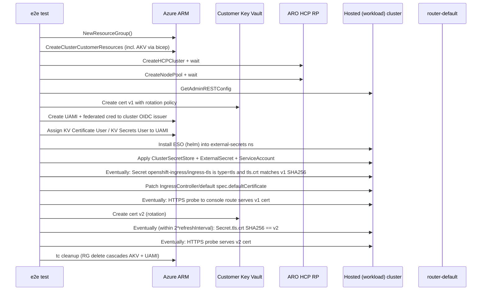

# E2E Test Plan: Customer-Managed Ingress Cert from Azure Key Vault

This document is the implementation plan for a new test under
[`test/e2e/`](../../test/e2e/) that exercises the design in
[design.md](design.md) end-to-end: customer puts a cert in their Key Vault,
the cluster picks it up as a Secret, the router serves it, and a rotation in
Key Vault is reflected in the cluster within the polling interval.

## Test identity

- **File:** `test/e2e/cluster_ingress_cert_from_kv.go` (no `_test.go` suffix
  per [test/AGENTS.md](../../test/AGENTS.md#file-naming-convention))
- **Spec name:** `Customer should be able to source the default ingress
  serving certificate from an Azure Key Vault and have rotations propagate
  automatically`
- **Labels:**
  - `RequireNothing` — per-test cluster (per
    [test/e2e/README.md](../../test/e2e/README.md))
  - `Positive`
  - `High` (not Critical for first cut — promote to Critical once stable)
  - `CreateCluster`
  - `AroRpApiCompatible`

## What the test does, end to end



## Step-by-step

### 1. Provision cluster + nodepool

Follow the pattern in
[`test/e2e/cluster_create_private_kv.go`](../../test/e2e/cluster_create_private_kv.go):

- `tc := framework.NewTestContext()`
- `tc.NewResourceGroup(ctx, "ingress-cert-kv", tc.Location())`
- `framework.NewDefaultClusterParams()`, set `ClusterName = "ingress-cert-kv"`,
  managed RG = `<rg>-managed`.
- `tc.CreateClusterCustomerResources(ctx, ...)` with
  `framework.RBACScopeResourceGroup`.
- `framework.CreateHCPCluster20251223AndWait(...)` with the 45-min timeout
  per [test/AGENTS.md](../../test/AGENTS.md).
- `tc.CreateNodePoolFromParam(ctx, ...)` with 2 replicas.
- `tc.GetAdminRESTConfigForHCPCluster(...)` — 10-min timeout per AGENTS.md.

The customer Key Vault is **already produced** by
[`demo/bicep/customer-infra.bicep`](../../demo/bicep/customer-infra.bicep)
(`cust-kv-${randomSuffix}`). We reuse that vault and add the ingress
certificate as a sibling object alongside the etcd encryption key. No new
bicep module is strictly required for the first cut.

### 2. Create the certificate in AKV with a rotation policy

New helper in [`test/util/framework/`](../../test/util/framework/), e.g.
`keyvault_cert_helper.go`:

- `CreateSelfSignedCertWithRotationPolicy(ctx, kvName, certName, validityDays, renewAtPercent) (sha256, error)`
  - Uses `armkeyvault` / `azcertificates` SDKs.
  - `IssuerParameters.Name = "Self"`.
  - `LifetimeActions = [{ Trigger: { LifetimePercentage: renewAtPercent },
    Action: { ActionType: AutoRenew } }]`.
  - X509 CertificateProperties with SAN `*.apps.<cluster-domain>` — fetch
    the cluster's apps domain from the HCP cluster response
    (`Properties.DNS.BaseDomain` or equivalent on the v20251223 SDK).
  - Returns the SHA-256 of the cert DER for later comparison.

Note on rotation: AKV's auto-renew only fires when the lifetime threshold is
crossed, which is not realistic for a CI run. The test triggers rotation
**explicitly** in step 6 by creating a new version of the cert via the same
issuer — that exercises the same code path on the cluster side (ESO sees a
new latest version) without waiting weeks.

### 3. Create UAMI + federated credential

Reuse `tc.AssignIdentityContainers` or, more likely, add a focused helper:

- Create UAMI in the customer RG.
- Look up the cluster's OIDC issuer URL from the HCP cluster response.
- `az identity federated-credential create` equivalent via SDK:
  - subject: `system:serviceaccount:external-secrets:eso-azure-kv`
  - issuer: cluster OIDC issuer URL
  - audience: `api://AzureADTokenExchange`
- Role assignments at the vault scope:
  - `Key Vault Certificate User`
  - `Key Vault Secrets User`
  (RoleDefinitionId constants — pull from existing identity helpers if they
  already use them; otherwise hardcode the well-known IDs and add a const.)

### 4. Install ESO and apply the customer manifests

Two options. We will use **option A** because it avoids requiring `helm` on
the test runner:

- **(A)** `kubectl apply` the upstream ESO release manifest from
  `external-secrets/external-secrets` for a pinned version. Wait for the
  ESO deployment to be Available.
- (B) Use the helm SDK. Heavier dependency; defer.

Then apply (as raw YAML built in-test):

- Namespace `external-secrets`
- `ServiceAccount external-secrets/eso-azure-kv` with annotations:
  - `azure.workload.identity/client-id: <UAMI client ID>`
  - `azure.workload.identity/tenant-id: <tenant ID>`
- `ClusterSecretStore customer-akv` per [design.md](design.md).
- `ExternalSecret openshift-ingress/ingress-tls` with `refreshInterval: 30s`
  (test-only — see design doc for the production default).

### 5. Verify the Secret materializes and matches AKV v1

Use the pattern from
[`test/e2e/cluster_pullsecret.go`](../../test/e2e/cluster_pullsecret.go)'s
`eventuallyVerify` (referenced in [test/AGENTS.md](../../test/AGENTS.md#logging-in-eventuallypolling-tests))
so we get delta-only logging:

- `Eventually` (timeout 5 min, poll 10s):
  - Secret `openshift-ingress/ingress-tls` exists.
  - `secret.Type == "kubernetes.io/tls"`.
  - `tls.crt` parses as a PEM x509 chain.
  - SHA-256 of the leaf DER matches the value returned in step 2.
- Log a single delta line on each *new* failure reason. Dump
  `ExternalSecret.status.conditions` if the timeout fires.

### 6. Wire to IngressController and verify HTTPS

- Patch `IngressController/default` in `openshift-ingress-operator`:
  ```yaml
  spec:
    defaultCertificate:
      name: ingress-tls
  ```
- `Eventually` (timeout 5 min): HTTPS request to the cluster console route
  (or any `*.apps.<basedomain>` route — the canary route works) returns a
  certificate whose SHA-256 matches v1. Use `tls.Dial` with
  `InsecureSkipVerify: true` to *capture* the served chain (we are validating
  identity by SHA, not by trust).

### 7. Rotate the cert in AKV

- Create a **new version** of the same cert object (same name, same policy).
  AKV will produce a new value; the "latest" pointer moves.
- Capture the new SHA-256.

### 8. Verify rotation lands in cluster

- `Eventually` (timeout = `4 * refreshInterval + 2 min`):
  - `Secret openshift-ingress/ingress-tls`'s `tls.crt` SHA-256 == v2.
- `Eventually` (timeout 5 min): HTTPS probe to the same route returns v2 SHA.
- On failure, dump:
  - `ExternalSecret.status` (refresh time, errors)
  - `Secret` resourceVersion + leaf SHA
  - `IngressController.status`
  - Last router pod log lines for "reload" / "cert" keywords.

### 9. Cleanup

All happens via `tc` resource-group teardown:

- RG delete cascades the AKV (with purge-on-delete left at the customer-infra
  default), the UAMI, and the cluster.
- ESO and the in-cluster resources die with the cluster.

## What this test catches that existing tests do not

- Federated identity from a workload-cluster ServiceAccount to a UAMI with KV
  RBAC works end to end. (Today we have `oidc_issuer_workload_identity.go`
  but it does not exercise KV roles.)
- The router actually consumes a Secret created by a third-party controller
  (not by openshift-installer-time bootstrap).
- Rotation propagation, end to end — the bit that is most often broken
  silently in production. A single SHA comparison after rotation is the only
  cheap test of this.

## Risks and mitigations for the test itself

- **AKV cert provisioning latency.** Self-signed cert creation in AKV is
  usually fast (<10 s), but can spike. Use a 2-min `Eventually` around the
  initial create, not a one-shot call.
- **ESO upstream image availability.** Pin a specific ESO version in the
  applied manifest. Pulling `:latest` from CI is fragile.
- **`*.apps` DNS propagation.** The HCP cluster's `*.apps` wildcard DNS may
  not be resolvable from the test runner immediately after cluster create.
  Reuse whatever `cluster_tls_endpoints.go` already does to wait for the
  ingress endpoint to be reachable.
- **Test runtime.** Per-test cluster + nodepool + ESO install + cert + rotate
  is on the order of 50–60 min. Budget accordingly; do not add `Speed:Slow`
  unless we measure ≥45 min steady-state (it lives in the parallel suite
  otherwise).

## Follow-ups (not blocking the first PR)

- Reusable Bicep module for customers (`docs/ingress-certificates/sample/`
  with `bicep/` + `manifests/`).
- A negative test: rotation when AKV access has been revoked → Secret is
  *not* nuked, router keeps serving the old cert, `ExternalSecret.status`
  reflects the failure.
- A negative test: bad PFX template (wrong password) → same containment
  guarantee.
- Promote label from `High` to `Critical` once the test has been stable for
  N consecutive periodic runs.
