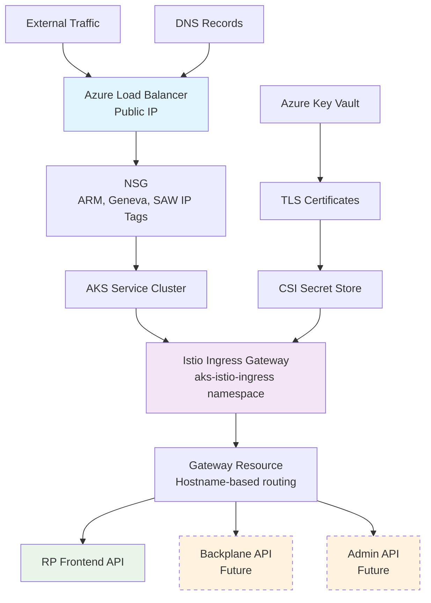
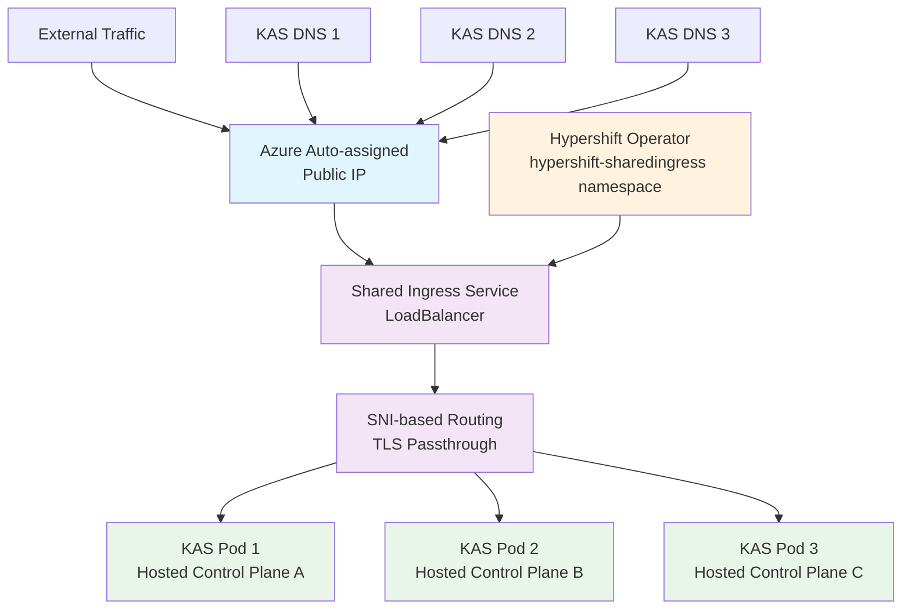
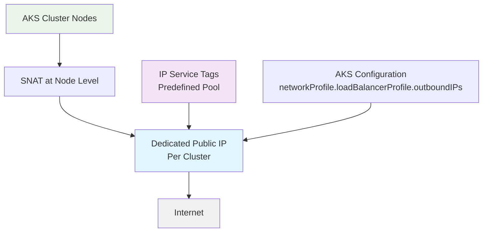

# ARO HCP Infrastructure Ingress and Egress

This document provides an overview of ingress and egress configurations specific to the ARO HCP infrastructure. It is limited to the control plane components and infrastructure of the ARO HCP platform itself and does not address ingress or egress for customer workloads. It covers service clusters, management clusters, and the services deployed within them.

## Ingress

### Service Cluster Ingress

This section describes how ingress traffic targeting ARO HCP services—such as the RP frontend, and eventually the Admin API and Backplane—is handled on service clusters. A shared Istio ingress gateway is deployed per service cluster to expose these components securely via a dedicated public IP.

ARO HCP service clusters expose selected control plane services through a shared Istio ingress gateway. This gateway acts as the central entry point for external traffic targeting these services. This ingress gateway is deployed into the `aks-istio-ingress` namespace and is currently responsible only for exposing the RP frontend API. In the future, the same gateway will also serve the Backplane and Admin API, and the structure of the associated Helm chart will be re-evaluated accordingly.

Ingress traffic is routed through a `Service` of type `LoadBalancer`, backed by a public IP address provisioned during cluster setup using Azure Bicep scripts. This IP is not dynamically assigned by AKS but drawn from a registered pool via IP service tags. DNS records are managed for this IP, specifically for the RP frontend hostname.

Currently, routing is limited to a single service. However, the architecture anticipates hostname-based routing as additional services are exposed. A Gateway resource is already deployed, although today it does not yet define multiple hostnames or virtual services for distinct components.

Access to the ingress IP is controlled via an NSG that allows traffic only from specific Azure IP service tags—those representing ARM, Geneva, and SAW devices. TLS termination is handled directly in Istio using certificates sourced from Azure Key Vault and mounted into the pod via CSI Secret Store.

### Management Cluster Ingress

#### Shared ingress for public HCP KAS

This section describes the shared ingress model used for public Hosted Control Planes (HCPs) in ARO HCP. In this model, all Kubernetes API Server (KAS) traffic for public HCPs enters the management cluster through a single, shared public IP address. This approach centralizes ingress for hosted control planes, simplifying exposure and routing while relying on TLS SNI to direct traffic to the appropriate control plane.

Each ARO HCP management cluster exposes the Kubernetes API servers (KAS) of its hosted control planes (HCPs) through a single, shared ingress service. These KAS are the primary targets of ingress traffic. This ingress is deployed automatically by the Hypershift operator and resides in the `hypershift-sharedingress` namespace. The deployment is entirely managed by the Hypershift lifecycle and does not involve custom automation or provisioning from the SRE team.

The shared ingress is implemented as a Kubernetes `Service` of type `LoadBalancer`. The public IP backing this service is assigned by Azure automatically at creation time. For each hosted control plane, a DNS record is created that resolves to the shared ingress IP of the respective management cluster.

Traffic routing is handled via SNI, allowing the shared ingress to securely direct traffic to the correct control plane based on the TLS handshake. TLS is not terminated at the ingress but is instead passed through to the individual KAS pods, which handle authentication and authorization.

There are no NSGs explicitly protecting the ingress public IP. The LoadBalancer is exposed to the public internet, but access control and verification are enforced by the KAS instances themselves.

#### Swift ingress for public HCP KAS

The architecture has not evolved enough to provide documentation for Swift ingress. This section will be updated in the future when Swift ingress is implemented, but TLDR: Swift ingress will be a dedicated ingress for private HCP KAS.

## Egress

Each service and management cluster in ARO HCP is assigned a dedicated public IP address for egress traffic. These IPs are provisioned via Azure Bicep and allocated from a predefined pool using IP service tags (`svc.aks.clusterOutboundIPAddressIPTags` and `mgmt.aks.clusterOutboundIPAddressIPTags` configuration options). The egress IP is assigned directly to the AKS cluster using the `networkProfile.loadBalancerProfile.outboundIPs` configuration.

All cluster nodes use this public IP for outbound internet access. This is achieved by associating the egress IP with the AKS node pool, allowing traffic to be SNATed at the node level. As a result, the subnet in which the AKS cluster resides does not require a default route for outbound traffic. This method is preferred over subnet-level routing due to security guidelines enforced by Microsoft.

There are no NSGs or firewall rules defined to restrict or filter outbound traffic.

## IP Service Tag Overview

ARO HCP uses Azure IP service tags for managing and categorizing public IP allocations consistently across clusters. These service tags are predefined labels associated with address pools registered in the Azure platform. When provisioning public IPs for ingress or egress, ARO HCP refers to specific service tag names. This ensures that IPs are allocated from controlled pools and makes it easier to trace and manage IP usage across different environments.

Service tags also play a role in NSG rules, e.g. as described in the [service cluster ingress section](#service-cluster-ingress), ingress is restricted to traffic originating from Azure services such as ARM, Geneva, or SAW devices by referencing their respective service tags.

The following table shows the IP service tags used for different environments and cluster types in ARO HCP:

| Environment | Cluster Type | Ingress IP Service Tag | Egress IP Service Tag |
|-------------|--------------|------------------------|----------------------|
| **MSFT INT** | Service Cluster (SVC) | `FirstPartyUsage:/NonProd` | `FirstPartyUsage:/NonProd` |
| **MSFT INT** | Management Cluster (MGMT) | *Auto-assigned* | `FirstPartyUsage:/NonProd` |
| **MSFT STG** | Service Cluster (SVC) | `FirstPartyUsage:/aro-hcp-prod-inbound-svc` | `FirstPartyUsage:/aro-hcp-prod-outbound-svc` |
| **MSFT STG** | Management Cluster (MGMT) | *Auto-assigned* | `FirstPartyUsage:/aro-hcp-prod-outbound-cx` |
