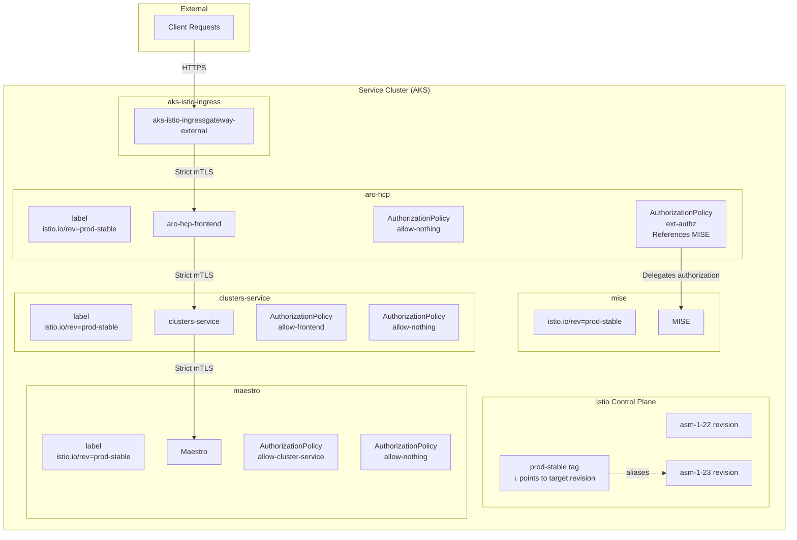

# Istio Usage in ARO HCP

## Introduction

The ARO HCP architecture integrates Istio as a core component to secure and manage service-to-service communication within the control plane. Istio is only used on the service cluster. It is not deployed on the management clusters.

Istio was introduced to fulfill two critical requirements in ARO HCP:

* **Intra-cluster traffic security:** In the absence of OCM AMS, which traditionally handled authorization logic between components such as CS and Maestro, Istio authorization policies provide controls for communication within the service cluster. This ensures only explicitly allowed service interactions can occur.

* **Ingress with delegated authorization:** For handling incoming traffic to the RP, Istio’s ingress gateway is used in combination with its external authorization capability. This allows the RP frontend to delegate authorization decisions to [MISE](https://aka.ms/mise) while maintaining a secure, scalable entry point into the system.

This document outlines the key mechanisms used to operate and manage Istio within the ARO HCP project, including mesh versioning strategies, workload integration, policy enforcement, and ingress configuration.

## Architecture Overview

The following diagram illustrates the Istio architecture within the ARO HCP service cluster. It highlights the key components, their interactions, and the flow of traffic through the mesh.

## Installation and Configuration

Istio is installed and configured through a three-part process involving infrastructure provisioning and in-cluster setup:

* **AKS service mesh add-on installation:** The AKS-managed Istio plugin is enabled via Bicep within the AKS deployment process. The specific Istio versions to be installed are defined in the [configuration management](configuration.md) under `svc.istio.versions`. This setup allows for multiple Istio versions to coexist to enable upgrade scenarios.

* **In-cluster configuration via Helm:** Post-installation configuration is handled through a Helm chart maintained under the `istio` folder repository. This chart sets up mesh-wide strict mTLS and configures Istio’s external authorization feature.

* **Revision management**: Post-installation script to manage Istio revision tags and workload transition between Istio versions. This is done via the `istio.sh` script located in the `dev-infrastructure/scripts` directory. The script uses `istioctl tag` to manage Istio revision tags and orchestrate workload migrations. See the [Mesh Management with Revisions](#mesh-management-with-revisions) section for more details.

## Mesh Management with Revisions

We use Istio revision tags to manage mesh versions in a safe and upgradeable manner. This approach enables parallel installation of multiple Istio versions and controlled migration of workloads between them.

Istio revisions follow the AKS plugin naming convention (e.g. `asm-1-23`). These are installed declaratively through Bicep using the `svc.istio.versions` value from the configuration, which allows the cluster to host multiple Istio revisions simultaneously. The `svc.istio.targetVersion` field specifies which revision should be used for active workloads. This version is aliased to a stable tag (e.g., `prod-stable`) using `istioctl tag` via the `istio.sh` script.

Namespaces opt into a specific mesh by setting the `istio.io/rev` label to the stable alias (e.g., `prod-stable`). This decouples workload configuration from specific version identifiers and simplifies transitions during upgrades.

The typical upgrade process consists of the following steps:

1. **Prepare Configuration:** A PR is opened to update `svc.istio.versions` with the new Istio version and to set `svc.istio.targetVersion` to that version. The AKS cluster version must support the targeted Istio version.
2. **Rollout Execution:** After merging the PR, the rollout pipeline installs the new revision and invokes `dev-infrastructure/scripts/istio.sh`. This script updates the alias tag and gracefully restarts all workloads linked to the previous mesh version.
3. **Cleanup:** Once the new version is verified, a follow-up PR removes the old revision from `svc.istio.versions`. The next pipeline run removes the obsolete revision from the cluster.

Before any revision alias is moved or workloads are restarted, `istio.sh` verifies the health and readiness of the target mesh defined by `svc.istio.targetVersion`. This ensures a safe transition and reduces the risk of service disruption during upgrades. If issues arise during an upgrade, the `svc.istio.targetVersion` can be reverted. This causes the revision tag to point back to the previous revision, allowing workloads to seamlessly revert to the old mesh while retaining the new version on-cluster for analysis.

This upgrade mechanism is tightly integrated with the cluster management pipeline [svc-pipeline.yaml](../dev-infrastructure/svc-pipeline.yaml). All operations, including tagging and workload restarts, are idempotent and safe to re-run, ensuring consistent and predictable mesh transitions.

## Workload Mesh Integration

Workload integration with the Istio mesh is achieved through namespace-level opt-in via revision-based labeling. Each service component's `Makefile` is responsible for applying the `istio.io/rev` label to its deployment namespace. This label points to the currently active Istio revision alias (e.g., `prod-stable`), which is sourced from the configuration and passed into the Makefile environment.

Istio sidecar injection is enabled automatically for all pods within a labeled namespace. No explicit pod-level annotations are required. This approach ensures consistent and centralized control over mesh participation.

## Traffic Control and Security

Istio is used to enforce strict service-to-service communication policies within the service cluster. Each service component is responsible for defining their own `AuthorizationPolicy` resources as part of its Helm chart, adhering to the following principles:

* **Default deny:** Every namespace must include a `deny all` policy to ensure that no traffic is permitted unless explicitly allowed.
* **Per-workload allow policies:** Workloads that need to receive traffic must define one or more `AuthorizationPolicy` rules. These are scoped using selectors based on workload labels and may restrict traffic by port or even specific HTTP paths (e.g., `/metrics` for Prometheus scraping).

Traffic origin is validated using `source.principal` fields where applicable, restricting access based on the SPIFFE identity tied to the source workload’s namespace and service account. This provides a strong and auditable trust boundary between services.

## Ingress Management

Ingress traffic to the service cluster is handled through a single shared Istio ingress gateway. This gateway is configured to terminate TLS traffic and route external requests to the RP frontend.

The Istio `Gateway` and `VirtualService` are currently defined as part of the RP frontend’s Helm chart. TLS termination occurs at the Istio ingress gateway itself, using a certificate sourced from the regional service Key Vault.

The ingress traffic path is as follows:

* Requests arrive at the public ingress IP of the AKS cluster.
* Traffic is forwarded to the Istio ingress gateway.
* The gateway routes the request through the mesh to the RP frontend service.
* ... but only after MISE authorized the request using the external authorization policy

As of now, the ingress setup supports only the RP frontend. However, the architecture is expected to evolve to accommodate additional services such as the admin API and backplane. Future revisions may refactor gateway and routing ownership to a shared location to better support multi-ingress scenarios.
