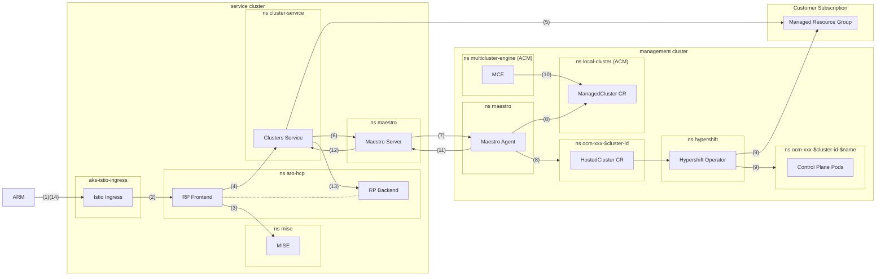

# ARO HCP High Level Cluster Creation Flow

This document describes the high level cluster creation flow of an ARO HCP cluster. It is meant to be a quick reference for developers and engineers working on the ARO HCP service. It is not a comprehensive overview of the ARO HCP architecture or a complete SOP/TSG for debugging during oncall.

The individual components are described in the [service components overview (todo)](service-components.md). The flowchart below shows the rough flow of the cluster creation process through the individual service components. Helpful debug commands are provided for each component in their respective sections.

## Cluster Creation Flow Happy Path in a Nutshell

1. A cluster creation request from ARM enters the ARO HCP service on the istio ingress
2. The request is routed to the RP frontend
3. The Istio sidecar of the RP frontend delegates authentication to MISE running as an ext-auth provider
4. The frontend conducts a preflight check towards Clusters Service, stores a record in CosmosDB on success and issues a request to Clusters Service to create the cluster
5. Clusters Service prepares a managed resource group in the customers subscription and creates the cloud resources for the cluster
6. Clusters Service posts `ManifestWork` containing `HosterCluster` Hypershift CRs and other supporting resources to the Maestro Server
7. The Maestro Server posts transfers the `ManifestWork` to the Maestro Agent via Eventgrid Namespaces MQTT
8. The Maestro Agent applies the `ManifestWork`, creating the `ocm-xxx-${CLUSTER_ID}` namespace, the Hypershift `HostedCluster` CR, supporting secrets and configmaps as well as the `ManagedCluster` MCE CR.
9. The Hypershift operator picks up on the `HostedCluster` CR, creates the `ocm-xxx-${CLUSTER_ID}-${CLUSTER_NAME}` namespace, the control plane deployments within it and supporting cloud resources in the managed resource group of the customer
10. MCE picks up on the finished `HostedCluster` provisioning and updates the `ManagedCluster` CR.
11. The Maestro Agent transfers all status updates from `HostedCluster`, `ManagedCluster` and other `ManifestWork` resources back to the Maestro Server via Eventgrid Namespaces MQTT
12. CS notices the status updates and updates the cluster records
13. The RP backend notices the status update in CS and updates the cluster record in CosmosDB
14. The RP frontend now reports the cluster as `Provisioned` to ARM



## RP Frontend

### Port Forward to the RP Frontend

In order to access the RP frontend without going through ARM, you can port forward to the service. This is useful for debugging and testing purposes, especially in non-production environments where there is no ARM route to the service.
Keep in mind that the port-forwarded service does not require authentication and does not enforce authorization!

```sh
kubectl port-forward -n aro-hcp svc/aro-hcp-frontend 8443:8443
```

### Query the State of an HCP

You can query the state of a hosted control plane by sending a GET request to the port-forwarded service. The URL should include the resource ID of the hosted control plane you want to query, so something matching this:

```sh
RESOURCE_ID="/subscriptions/.../resourceGroups/.../providers/Microsoft.RedHatOpenshift/hcpOpenShiftClusters/..."
curl -s localhost:8443${RESOURCE_ID}$?api-version=2024-06-10-preview | jq
```

Noteworthy fields:

* `.id` - the resource ID of the hosted control plane
* `.properties.provisioningState` - the provisioning state of the hosted control plane
* `.properties.api.url` - the HCP KAS URL
* `.properties.dns.baseDomain` - the base DNS zone for the HCP (exists in our infrastructure)

## Clusters Service

### Port Forward to Clusters Service

In order to access Clusters Service for debugging purposes, you can port forward to the service.
Keep in mind that the port-forwarded service does not require authentication and does not enforce authorization!

```sh
kubectl port-forward -n cluster-service svc/clusters-service 8001:8000
```

### Query the State of an HCP

To query the state of an HCP on the Clusters Service, you can use the following command based on information from the HCP resource ID.

```sh
export HCP_SUBSCRIPTION_ID=$(echo "$RESOURCE_ID" | cut -d'/' -f3)
export HCP_RESOURCE_GROUP_NAME=$(echo "$RESOURCE_ID" | cut -d'/' -f5)

curl -sG http://localhost:8001/api/clusters_mgmt/v1/clusters --data-urlencode "search=azure.subscription_id='$HCP_SUBSCRIPTION_ID' and azure.resource_group_name='$HCP_RESOURCE_GROUP_NAME'" | jq
```

>[!NOTE]
> This command does not filter on the resource name of the HCP because the search in CS does not offer filter functionality on the `azure.resource_name` field yet. As long as there is only one HCP resource per resource group, this is not a problem.

Noteworthy fields:

* `.id` - the Clusters Service ID of the hosted control plane - this is not the Azure Resource ID of the HCP!!
* `.href` - the base resource URL for the HCP in Clusters Service - needed if you want to query for subresources
* `.status` - contains details about the state of the HCP, including provisioning errors
* `.azure.subscription_id` - the Azure subscription ID of the customer
* `.azure.resource_group_name` - the Azure resource group name within the customer subscription, where the HCP was created
* `.azure.resource_name` - the Azure resource name of the HCP

### Query for the Management Cluster of an HCP

Once you have clusters `.href`, you can query the provision shard endpoint to find details about the management cluster of an HCP.

```sh
curl -sG http://localhost:8001/${CLUSTER_HREF}/provision_shard | jq
```

Currently this endpoint does not return yet direct management cluster metadata, but the management cluster can be inferred from the stamp number at the end of the CX KV URL `.azure_shard.cx_managed_identities_key_vault_url`. Look for a management cluster in the same region that has the same stamp number in the AKS name and/or the Azure resource group.

## Maestro Server

### Port Forward to the Maestro Server

The Maestro Server is not exposed at all outside of the service cluster, as it is usually only used by the Clusters Service and Backplane. In order to access it for debugging purposes, you can port forward to the service.
Keep in mind that the port-forwarded service does not require authentication and does not enforce authorization!

```sh
kubectl port-forward -n maestro svc/maestro 8002:8000
```

### Query for ManifestWork

To query for the `ManifestWork` Clusters Service creates in Maestro for an HCP, you can use the following command based on information from the HCP Clusters Service resource ID. This ID can be queried using the approach described in the [Query the State of an HCP on Clusters Service](#query-the-state-of-an-hcp-on-clusters-service) section and looking for the `id` field.

```sh
curl -sG http://localhost:8002/api/maestro/v1/resource-bundles --data-urlencode "search=payload->'metadata'->'labels'->>'api.openshift.com/id'='${CLUSTERS_SERVICE_ID}'" | jq
```

Noteworthy fields:

* `.updated_at` - the time when the resource bundle received an update
* `.status` - the status of the resource bundle
* `.status.conditions` - the conditions of `Manifestwork` - e.g. was it applied correctly on the management cluster?
* `.status.resourceStatus[].statusFeedback.values[].fieldValue.jsonRaw | fromjson | .resourceStatus.manifests[].statusFeedback` - the contents of the innermost resource status feedback

## Maestro Agent

### Check Maestro Agent Logs

The Maestro Agent runs on the management cluster in the `maestro` namespace. To check the logs of the Maestro Agent, you can use the following command:

```sh
kubectl logs -n maestro deployment/maestro-agent -c maestro-agent
```

## ACM

### Query for ManifestWork on the Management Cluster

The `ManifestWork` from Maestro can be found on the management cluster in the `local-cluster` namespace. They share the same labels as the resource bundles in Maestro. To list all `ManifestWork` for a Clusters Service cluster ID, you can use the following command:

```sh
kubectl get manifestwork -l "api.openshift.com/id=${CLUSTERS_SERVICE_ID}" -n local-cluster
```

### Query for ManagedClusters on the Management Cluster

Each HCP is represented by a `ManagedCluster` ACM CR on the management cluster. To list all `ManagedCluster` resources, you can use the following command:

```sh
kubectl get managedclusters
```

Expect to see one `ManagedCluster` per HCP named after the Clusters Service cluster ID.

## Hypershift

### List Hypershift HostedCluster CRs

```sh
kubectl get hostedclusters -A
```

This shows the `HostedCluster` resources in the `ocm-xxx-${CLUSTER_ID}` namespace.

### Check on control plane pods

The `ocm-xxx-${CLUSTER_ID}-${CLUSTERNAME}` namespace contains the hosted control plane (e.g. pods, secrets, ...).

```sh
kubectl get pods -n ocm-xxx-${CLUSTER_ID}-${CLUSTER_NAME}
```

The `ocm-xxx-${CLUSTER_ID}-${CLUSTERNAME}` namespace contains the hosted control plane (e.g. pods, secrets, ...).
