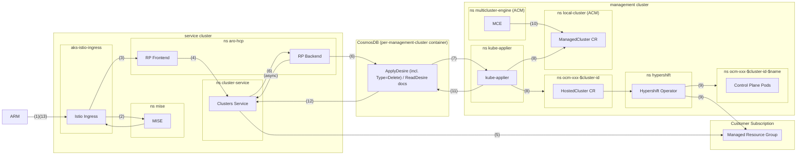

# ARO HCP High Level Cluster Creation Flow

This document describes the high level cluster creation flow of an ARO HCP cluster. It is meant to be a quick reference for developers and engineers working on the ARO HCP service. It is not a comprehensive overview of the ARO HCP architecture or a complete SOP/TSG for debugging during oncall.

The individual components are described in the [service components overview](../service-components.md). The flowchart below shows the rough flow of the cluster creation process through the individual service components. Helpful debug commands are provided for each component in their respective sections.

> [!IMPORTANT]
> **Maestro → kube-applier migration in progress.**
> The cross-cluster resource delivery mechanism is being migrated from Maestro to `kube-applier` as part of [ARO-27402 "Remove Maestro from the ARO HCP architecture"](https://issues.redhat.com/browse/ARO-27402). This document describes the **target** kube-applier flow, with the legacy Maestro path retained below for reference while the migration is in flight.
>
> Current state (as of this revision):
> - **Reads are live on kube-applier** — `ReadDesire` has replaced Maestro read-only bundles ([#5238](https://github.com/Azure/ARO-HCP/pull/5238)).
> - **The write/apply path is still dual-run and flag-gated.** Clusters Service continues to deliver `ManifestWork` via Maestro until the manifest-delivery migration ([ARO-27507](https://issues.redhat.com/browse/ARO-27507)) and phased rollout ([ARO-27509](https://issues.redhat.com/browse/ARO-27509)) complete. During this window, both paths may be active depending on the region and per-operation feature flags.
> - **Maestro decommissioning** (Maestro Server/Agent, EventGrid MQTT, Maestro PostgreSQL) is tracked by [ARO-27508](https://issues.redhat.com/browse/ARO-27508) and has not yet started.
>
> Maestro's responsibilities are being split across several components: `kube-applier` (cross-cluster apply/delete/read), the **fleet controller** (management cluster registration & lifecycle), and **mgmt-agent** (management-cluster-local operations). See the `kube-applier` design docs — [`kube-applier/docs/01-overview.md`](../../kube-applier/docs/01-overview.md) and [`kube-applier/docs/08-rollout.md`](../../kube-applier/docs/08-rollout.md) — for the authoritative design and the phased rollout plan.

## Cluster Creation Flow Happy Path in a Nutshell

<!-- BEGIN GENERATED: happy-path (derived from source; regenerate via the "Generation Prompt" at the bottom of this file — do not hand-edit) -->
1. A cluster creation request from ARM enters the ARO HCP service on the istio gateway
2. ExternalAuthorizer rules apply to all requests that hit the istio gateway, and are redirected to MISE to ensure the request comes from ARM
3. On success, the request is routed to the RP frontend
4. The frontend conducts a preflight check towards Clusters Service and then issues a request to Clusters Service to create the cluster. It then stores both an Operation record and an HCPOpenShiftCluster record in CosmosDB on success. The frontend returns a 201 response to ARM and a reference to the long-running operation.
    - (Async) From this point forward, Backend sees the CosmosDB Operation record and asynchronously calls CS to determine current provisioning state and updates the HCPOpenShiftCluster so the customer has live feedback on status of the long-running request.
    - (Async) At the same time, ARM will automatically issue polling GET requests to the OperationStatus resources on the customer's behalf (to the Frontend) so they see this status in live time.
5. Clusters Service prepares a managed resource group in the customers subscription and creates the cloud resources for the cluster
6. Clusters Service produces the desired management-cluster content (the `HostedCluster` Hypershift CRs and other supporting resources). The ARO HCP Backend converts this content into declarative `ApplyDesire` documents and writes them to the per-management-cluster CosmosDB container. (Deletions are expressed as `ApplyDesire` documents with `Type=Delete`.)
7. `kube-applier`, running on the target management cluster, reads the `ApplyDesire` documents from CosmosDB and reconciles them against the local kube-apiserver. Reconciliation is dispatched on the document `Type`: `Type=ServerSideApply` documents are applied via Server-Side Apply, while `Type=Delete` documents are reconciled via the delete path.
8. Applying the desired resources creates the `ocm-xxx-${CLUSTER_ID}` namespace, the Hypershift `HostedCluster` CR, supporting secrets and configmaps, as well as the `ManagedCluster` MCE CR.
9. The Hypershift operator picks up on the `HostedCluster` CR, creates the `ocm-xxx-${CLUSTER_ID}-${CLUSTER_NAME}` namespace, the control plane deployments within it and supporting cloud resources in the managed resource group of the customer
10. MCE picks up on the finished `HostedCluster` provisioning and updates the `ManagedCluster` CR.
11. `kube-applier` reports apply status back as conditions written into the same CosmosDB documents, and mirrors live management-cluster object state (e.g. `HostedCluster`, `ManagedCluster` status) back to the service side via `ReadDesire` documents.
12. CS/Backend read the reported status from CosmosDB and update the cluster records
13. The Backend ultimately reports the updated CS status and completes the asynchronous Operation. ARM reports the Operation as successful and returns the OperationResult. The RP frontend now reports the cluster as `Provisioned` to ARM for all future requests.
<!-- END GENERATED: happy-path -->

> [!NOTE]
> **Legacy Maestro path (dual-run).** Until [ARO-27507](https://issues.redhat.com/browse/ARO-27507)/[ARO-27509](https://issues.redhat.com/browse/ARO-27509) complete, the write path for steps 6–8 and 11–12 may still run through Maestro instead of `kube-applier`:
> - (6) Clusters Service posts `ManifestWork` containing the Hypershift CRs and supporting resources to the Maestro Server.
> - (7) The Maestro Server transfers the `ManifestWork` to the Maestro Agent via EventGrid Namespaces MQTT.
> - (8) The Maestro Agent applies the `ManifestWork` on the management cluster.
> - (11) The Maestro Agent transfers status updates back to the Maestro Server via EventGrid Namespaces MQTT.
> - (12) CS notices the status updates and updates the cluster records.
>
> See the [Maestro Server](#maestro-server-legacy), [Maestro Agent](#maestro-agent-legacy), and [ACM](#acm-legacy-manifestwork) sections below for debugging the legacy path.

<!-- BEGIN GENERATED: flow-diagram (nodes/edges mirror the "Cluster Create Flow" digraph in ../cosmos-data-flow.md; regenerate via the "Generation Prompt" at the bottom of this file — do not hand-edit) -->

```mermaid
---
config:
  layout: dagre
---
flowchart LR
arm["ARM"]
subgraph customer_subscription["Customer Subscription"]
  subgraph managed_resourcegroup["Managed Resource Group"]
  end
end
subgraph svc_cluster["service cluster"]
    subgraph istio_ns["aks-istio-ingress"]
        istio_ingress["Istio Ingress"]
    end
    subgraph mise_ns["ns mise"]
        mise["MISE"]
    end
    subgraph rp_ns["ns aro-hcp"]
        direction LR
        rp_backend["RP Backend"]
        rp_frontend["RP Frontend"]
    end
    subgraph cs_ns["ns cluster-service"]
        cs["Clusters Service"]
    end
 end
 subgraph cosmos["CosmosDB (per-management-cluster container)"]
    desires["ApplyDesire (incl. Type=Delete) / ReadDesire docs"]
 end
 subgraph mgmt_cluster["management cluster"]
    subgraph kube_applier_ns["ns kube-applier"]
        kube_applier["kube-applier"]
    end
    subgraph acm_mce_ns["ns multicluster-engine (ACM)"]
        mce["MCE"]
    end
    subgraph hypershift_ns["ns hypershift"]
        hypershift["Hypershift Operator"]
    end
    subgraph hypershift_hcp_ns["ns ocm-xxx-$cluster-id"]
        hostedcluster_cr["HostedCluster CR"]
    end
    subgraph hypershift_cp_ns["ns ocm-xxx-$cluster-id-$name"]
        cp_pods["Control Plane Pods"]
    end
    subgraph local_cluster_ns["ns local-cluster (ACM)"]
        managed_cluster_cr["ManagedCluster CR"]
    end
 end
 arm -- (1)(13) --> istio_ingress -- (2) --> mise
 mise --> istio_ingress -- (3) --> rp_frontend -- (4) --> cs
 cs -- (5) --> managed_resourcegroup
 cs -- (6) --> rp_backend -- (6) --> desires
 rp_backend -- (async) --> cs
 desires -- (7) --> kube_applier

 mce -- (10) --> managed_cluster_cr
 kube_applier -- (8) --> hypershift_hcp_ns
 kube_applier -- (8) --> managed_cluster_cr
 hostedcluster_cr --> hypershift
 hypershift -- (9) --> managed_resourcegroup
 hypershift -- (9) --> hypershift_cp_ns
 kube_applier -- (11) --> desires
 desires -- (12) --> cs
```
<!-- END GENERATED: flow-diagram -->

## RP Frontend

### Port Forward to the RP Frontend

In order to access the RP frontend without going through ARM, you can port forward to the service. This is useful for debugging and testing purposes, especially in non-production environments where there is no ARM route to the service.
Keep in mind that the port-forwarded service does not require authentication and does not enforce authorization!

```sh
kubectl port-forward -n aro-hcp svc/aro-hcp-frontend 8443:8443
```

### Query the State of an HCP

You can query the state of a hosted control plane by sending a GET request to the port-forwarded service. The URL should include the resource ID of the hosted control plane you want to query, so something matching this:

```sh
RESOURCE_ID="/subscriptions/.../resourceGroups/.../providers/Microsoft.RedHatOpenshift/hcpOpenShiftClusters/..."
curl -s localhost:8443${RESOURCE_ID}$?api-version=2024-06-10-preview | jq
```

Noteworthy fields:

* `.id` - the resource ID of the hosted control plane
* `.properties.provisioningState` - the provisioning state of the hosted control plane
* `.properties.api.url` - the HCP KAS URL
* `.properties.dns.baseDomain` - the base DNS zone for the HCP (exists in our infrastructure)

## Clusters Service

### Port Forward to Clusters Service

In order to access Clusters Service for debugging purposes, you can port forward to the service.
Keep in mind that the port-forwarded service does not require authentication and does not enforce authorization!

```sh
kubectl port-forward -n clusters-service svc/clusters-service 8001:8000
```

### Query the State of an HCP

To query the state of an HCP on the Clusters Service, you can use the following command based on information from the HCP resource ID.

```sh
export HCP_SUBSCRIPTION_ID=$(echo "$RESOURCE_ID" | cut -d'/' -f3)
export HCP_RESOURCE_GROUP_NAME=$(echo "$RESOURCE_ID" | cut -d'/' -f5)

curl -sG http://localhost:8001/api/aro_hcp/v1alpha1/clusters --data-urlencode "search=azure.subscription_id='$HCP_SUBSCRIPTION_ID' and azure.resource_group_name='$HCP_RESOURCE_GROUP_NAME'" | jq
```

>[!NOTE]
> This command does not filter on the resource name of the HCP because the search in CS does not offer filter functionality on the `azure.resource_name` field yet. As long as there is only one HCP resource per resource group, this is not a problem.

Noteworthy fields:

* `.id` - the Clusters Service ID of the hosted control plane - this is not the Azure Resource ID of the HCP!!
* `.href` - the base resource URL for the HCP in Clusters Service - needed if you want to query for subresources
* `.status` - contains details about the state of the HCP, including provisioning errors
* `.azure.subscription_id` - the Azure subscription ID of the customer
* `.azure.resource_group_name` - the Azure resource group name within the customer subscription, where the HCP was created
* `.azure.resource_name` - the Azure resource name of the HCP

### Query for the Management Cluster of an HCP

Once you have clusters `.href`, you can query the provision shard endpoint to find details about the management cluster of an HCP.

```sh
curl -sG http://localhost:8001/${CLUSTER_HREF}/provision_shard | jq
```

Currently this endpoint does not return yet direct management cluster metadata, but the management cluster can be inferred from the stamp number at the end of the CX KV URL `.azure_shard.cx_managed_identities_key_vault_url`. Look for a management cluster in the same region that has the same stamp number in the AKS name and/or the Azure resource group.

## kube-applier

`kube-applier` runs on each management cluster and reconciles the declarative "desire" documents (`ApplyDesire` with `Type=ServerSideApply` or `Type=Delete`, and `ReadDesire`) stored in that cluster's dedicated CosmosDB container against the local kube-apiserver. Status is written back as `metav1.Condition` slices into the same documents. See [`kube-applier/docs/01-overview.md`](../../kube-applier/docs/01-overview.md) for the full design.

### Check kube-applier Logs

`kube-applier` runs on the management cluster. To check its logs:

<!-- BEGIN GENERATED: kube-applier-debug (namespace/deployment/container names derived from deployment manifests / topology config; regenerate via the "Generation Prompt" at the bottom of this file — do not hand-edit) -->
```sh
kubectl logs -n kube-applier deployment/kube-applier -c kube-applier
```

> [!NOTE]
> TODO: confirm the exact namespace/deployment/container names and add commands for inspecting the CosmosDB desire documents (`ApplyDesire`/`DeleteDesire`/`ReadDesire`) and their reported conditions once the write path is fully rolled out. Track under [ARO-27507](https://issues.redhat.com/browse/ARO-27507).
<!-- END GENERATED: kube-applier-debug -->

## Maestro Server (legacy)

> [!WARNING]
> The Maestro path is being decommissioned ([ARO-27508](https://issues.redhat.com/browse/ARO-27508)). These sections apply only while the legacy dual-run path is still active.

### Port Forward to the Maestro Server

The Maestro Server is not exposed at all outside of the service cluster, as it is usually only used by the Clusters Service and Backplane. In order to access it for debugging purposes, you can port forward to the service.
Keep in mind that the port-forwarded service does not require authentication and does not enforce authorization!

```sh
kubectl port-forward -n maestro svc/maestro 8002:8000
```

### Query for ManifestWork

To query for the `ManifestWork` Clusters Service creates in Maestro for an HCP, you can use the following command based on information from the HCP Clusters Service resource ID. This ID can be queried using the approach described in the [Query the State of an HCP on Clusters Service](#query-the-state-of-an-hcp-on-clusters-service) section and looking for the `id` field.

```sh
curl -sG http://localhost:8002/api/maestro/v1/resource-bundles --data-urlencode "search=payload->'metadata'->'labels'->>'api.openshift.com/id'='${CLUSTERS_SERVICE_ID}'" | jq
```

Noteworthy fields:

* `.updated_at` - the time when the resource bundle received an update
* `.status` - the status of the resource bundle
* `.status.conditions` - the conditions of `Manifestwork` - e.g. was it applied correctly on the management cluster?
* `.status.resourceStatus[].statusFeedback.values[].fieldValue.jsonRaw | fromjson | .resourceStatus.manifests[].statusFeedback` - the contents of the innermost resource status feedback

## Maestro Agent (legacy)

### Check Maestro Agent Logs

The Maestro Agent runs on the management cluster in the `maestro` namespace. To check the logs of the Maestro Agent, you can use the following command:

```sh
kubectl logs -n maestro deployment/maestro-agent -c maestro-agent
```

## ACM (legacy ManifestWork)

### Query for ManifestWork on the Management Cluster

The `ManifestWork` from Maestro can be found on the management cluster in the `local-cluster` namespace. They share the same labels as the resource bundles in Maestro. To list all `ManifestWork` for a Clusters Service cluster ID, you can use the following command:

```sh
kubectl get manifestwork -l "api.openshift.com/id=${CLUSTERS_SERVICE_ID}" -n local-cluster
```

### Query for ManagedClusters on the Management Cluster

Each HCP is represented by a `ManagedCluster` ACM CR on the management cluster. To list all `ManagedCluster` resources, you can use the following command:

```sh
kubectl get managedclusters
```

Expect to see one `ManagedCluster` per HCP named after the Clusters Service cluster ID.

## Hypershift

### List Hypershift HostedCluster CRs

```sh
kubectl get hostedclusters -A
```

This shows the `HostedCluster` resources in the `ocm-xxx-${CLUSTER_ID}` namespace.

### Check on control plane pods

The `ocm-xxx-${CLUSTER_ID}-${CLUSTERNAME}` namespace contains the hosted control plane (e.g. pods, secrets, ...).

```sh
kubectl get pods -n ocm-xxx-${CLUSTER_ID}-${CLUSTER_NAME}
```

The `ocm-xxx-${CLUSTER_ID}-${CLUSTERNAME}` namespace contains the hosted control plane (e.g. pods, secrets, ...).

## Generation Prompt

The regions of this document between `<!-- BEGIN GENERATED: ... -->` and
`<!-- END GENERATED: ... -->` markers were generated by Claude Code from source.
All other prose (the intro, the migration/legacy callouts, and the per-component
narrative and debug commentary) is hand-maintained and must be preserved.

To regenerate, paste the prompt below into a conversation rooted in the ARO-HCP
repo. See `CLAUDE.md` ("HCP Cluster Creation Flow Documentation") for when to run it.

```
Update docs/ops/hcp-cluster-creation-flow.md. Only modify the content between the
<!-- BEGIN GENERATED: <region> --> and <!-- END GENERATED: <region> --> markers.
Do NOT change any text outside the markers: leave the intro, the section order,
all headings, and every [!IMPORTANT]/[!NOTE]/[!WARNING] callout verbatim.
Regenerate each region from source:

1. happy-path — Derive the ordered, numbered cluster-create steps (ARM -> istio ->
   MISE -> RP frontend -> Clusters Service -> Backend -> Cosmos desire documents ->
   kube-applier -> Hypershift/MCE -> status back) from:
   - frontend/pkg/frontend/ (cluster.go, frontend.go) for the request path,
   - backend/pkg/controllers/ (creation, apply-desire, read-desire,
     management-cluster, status-aggregator controllers) for the async flow,
   - the kube-applier desire model and Clusters Service management-cluster content
     endpoints.
   Keep the existing numbered narrative style (1..N). While Maestro and kube-applier
   dual-run, keep the write-path steps describing kube-applier and leave the legacy
   Maestro description in the [!NOTE] callout (which is hand-maintained, outside the
   markers). Remove the legacy note only after ARO-27508 lands.

2. flow-diagram — Regenerate the mermaid graph so its nodes and edges match the
   controller-gating order in the "Cluster Create Flow" digraph of
   docs/cosmos-data-flow.md (each edge is a gate: a field written by one actor that
   enables the next). Keep the existing service-cluster / management-cluster subgraph
   layout and step-number edge labels.

3. kube-applier-debug — Fill the namespace, deployment, and container names in the
   kube-applier debug commands from the deployment manifests / topology config
   (search config/ and the kube-applier component dir), not from memory. Document
   desire document types as `ApplyDesire` (with Type=ServerSideApply or Type=Delete)
   and `ReadDesire`, not `DeleteDesire` (which doesn't exist as a separate type).
   Replace the TODO note with real inspection commands once the names are confirmed.

Preserve this Generation Prompt section at the bottom of the file so it can be
edited and re-run.
```
