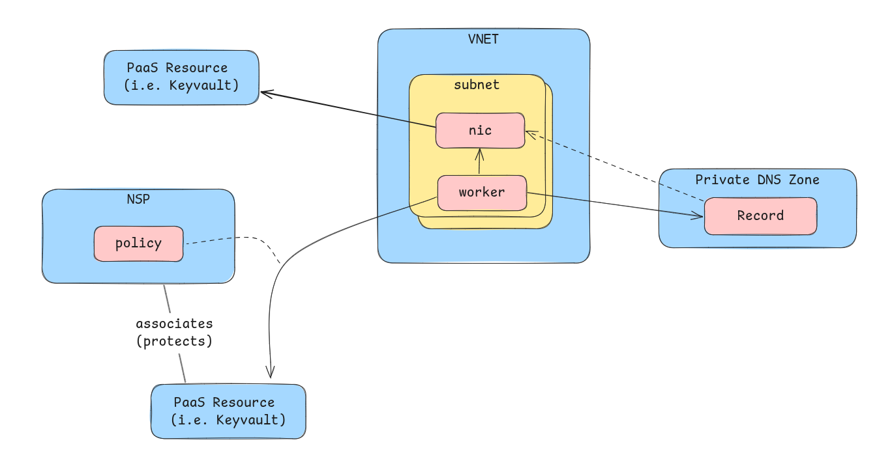

# Network Security

This documentation should provide a high level overview on the tools and concepts used for securing Platform as a Service (PaaS) resources. The goal of this document is not to explain these technologies in detail. For this refer to:

- https://learn.microsoft.com/en-us/azure/private-link/private-link-overview
- https://learn.microsoft.com/en-us/azure/private-link/private-endpoint-overview
- https://learn.microsoft.com/en-us/azure/private-link/network-security-perimeter-concepts

## Network Security Perimeter

The Network Security Perimeter allows organizations to define a logical network isolation boundary for PaaS, such as Azure Storage accounts and KeyVaults, that are deployed outside a virtual network. It restricts public network access to PaaS resources within the perimeter, but you can exempt access by using explicit access rules for public inbound and outbound traffic.

### Granting access

Access to PaaS resources from AKS Clusters is granted using subscription property in NSP access policies. Examples:

Granting access from the same Subscription as the NSP resides in:

```bicep
subscriptions: [
    subscription().id
]
```

... additionally in grant access from other subscriptions as well. The subscription id must be passed in via parameter.

```bicep
subscriptions: [
    serviceClusterSubscriptionId
    subscription().id
]
```

EV2 needs acces to some key vaults in order to manage them. For securing that access a list of service tags that should get access can be leveraged for this.

## Private Endpoint

Private endpoint traffic is considered highly secure and therefore isn't subject to Network Security Perimeter rules.

A private endpoint grants access to a PaaS resource by creating a VNET local IP with an DNS record.

### Deployment

We provide a module that helps creating all resource required for a private endpoint: `private-endpoint.bicep`. See that module and it's usage for more details on the resource involved.

## Comparison

Using an NSP a resource can be associated to an NSP and a policy can be configured for it. That policy can restrict/allow certain traffic. This does not require additional resource except for the NSP and the PaaS Resource itself.

In contrast using a private endpoint additional resources are needed. Using bicep we deploy a NIC into the subnet of the worker nodes. Additionally we have a private DNS zone, that has a record for the private endpoint secured resources pointing to the nic. That NIC then redirects traffic to the PaaS resource.



## Access overview

| Subscription | Type | Service | Connectivity | Secured By |
| ------------ | ---- | ------- | ------------ | ---------- |
| Global | KeyVault | aro-hcp-global | Imagesync | NSP |
| Service | KeyVault | SVC AKS etcd | SVC AKS | NSP |
| Service | CosmosDB | Resource Provider DB | SVC AKS | NSP |
| Service | Postgres | Maestro DB | SVC AKS | PE |
| Service | Eventgrid | Maestro | SVC AKS</br> MGMT AKS | PE |
| Service | Postgres | Clusters Service DB | SVC AKS | PE |
| Service | Storage Account | OIDC | SVC AKS | PE |
| Management | KeyVault | cx-msi | SVC AKS</br> MGMT AKS</br> EV2 | NSP |
| Management | KeyVault | msi | SVC AKS</br> MGMT AKS</br> EV2 | NSP |
| Management | KeyVault | MGTM AKS etcd | MGMT AKS | NSP |
| Management | KeyVault | MGTM | MGMT AKS | NSP |

## Choosing between the two

The general decision should be:

- Use NSP if you need access from outside a known subscription, i.e. access from EV2.
- Use Private endpoint for any other cases.
