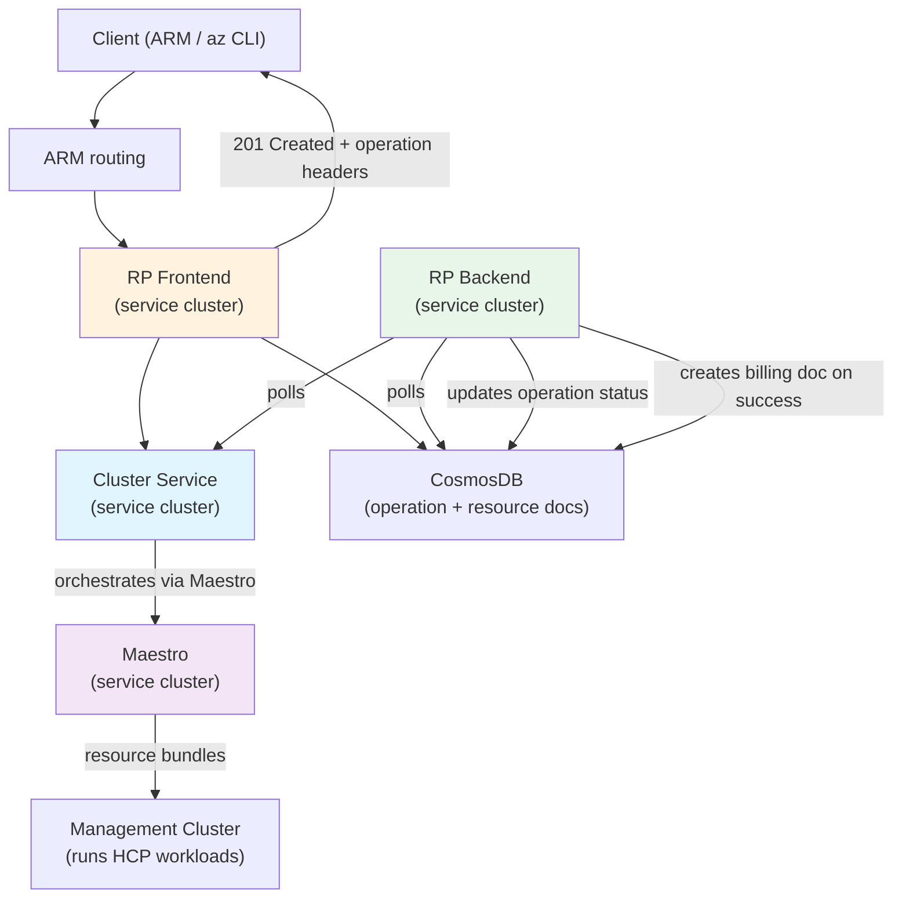
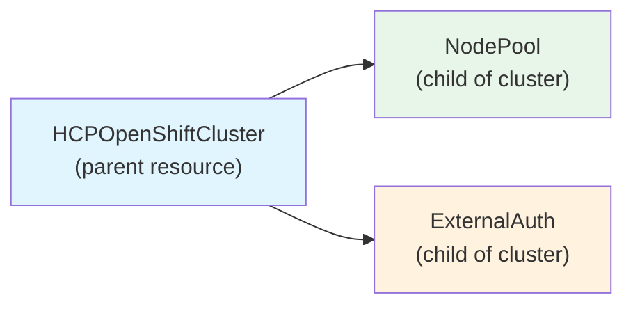
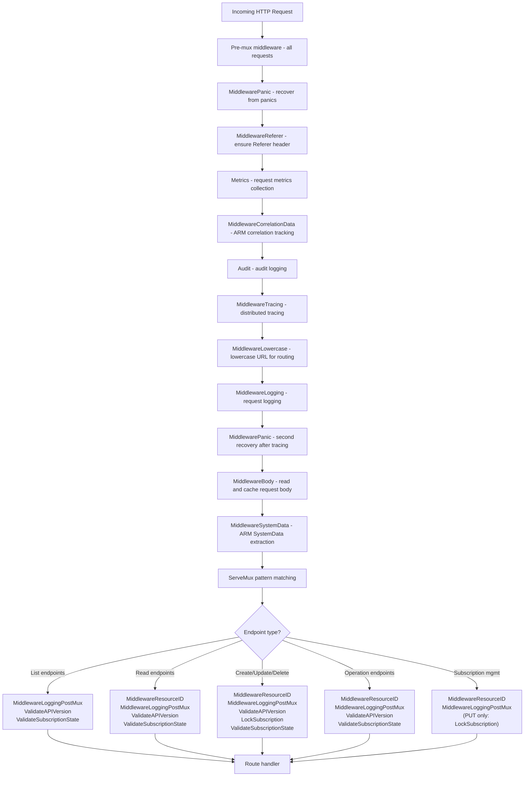
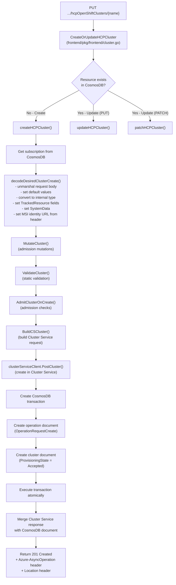
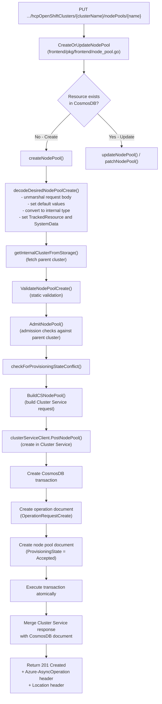
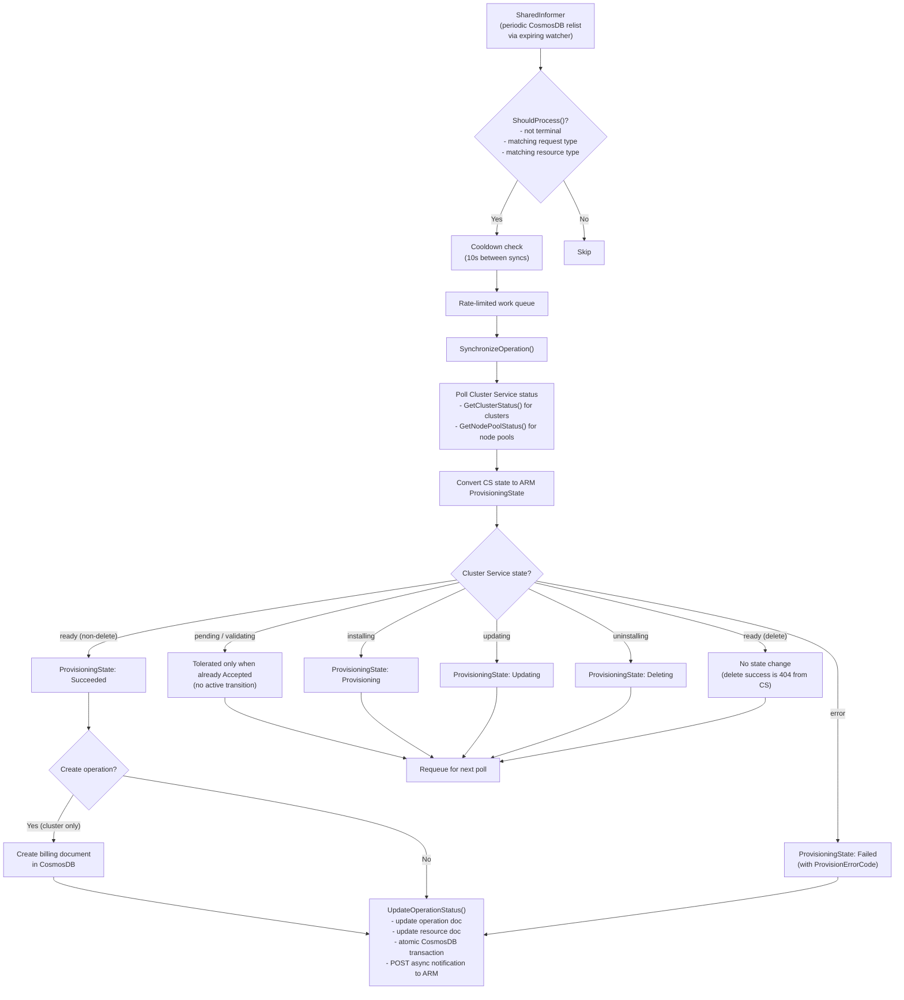
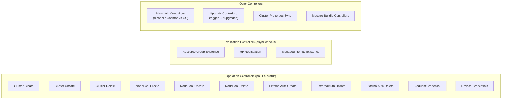
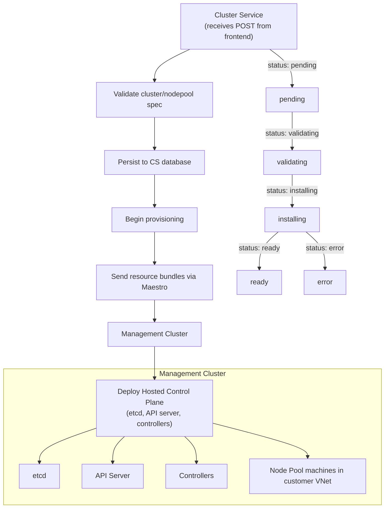
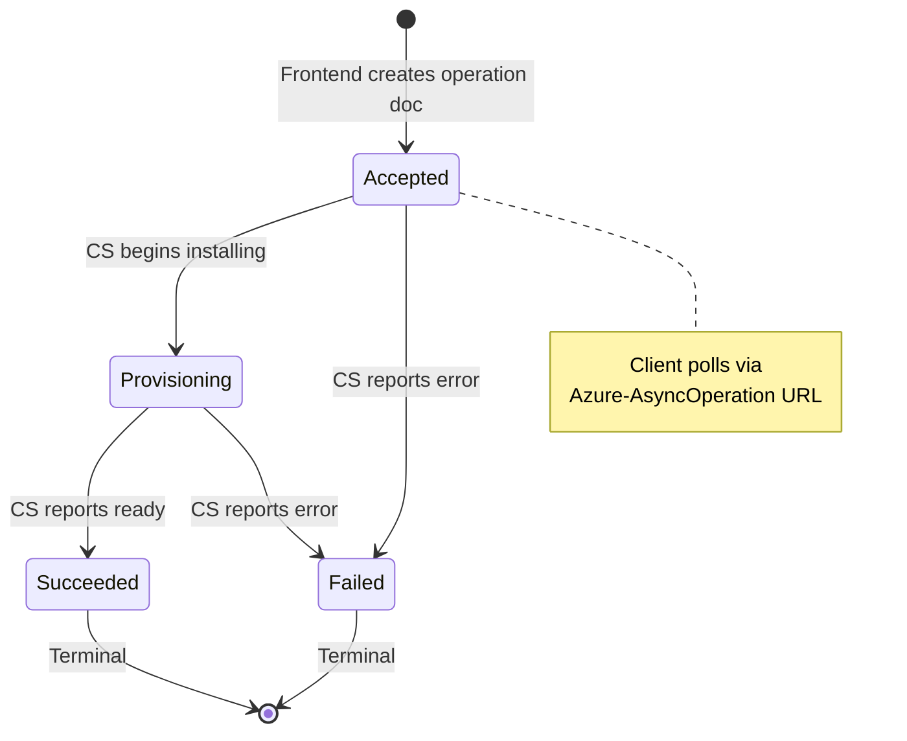

# ARO-HCP Resource Creation Flow

This document describes how resources are created in the ARO-HCP architecture, from API request through async completion. Detailed creation flow diagrams are provided for HCPOpenShiftCluster and NodePool. ExternalAuth follows the same general pattern (frontend validation, Cluster Service POST, CosmosDB transaction, backend polling).

## Overview

## Resource Types

- **HCPOpenShiftCluster** - The hosted control plane cluster. Parent resource.
- **NodePool** - Worker node pools. Child of a cluster.
- **ExternalAuth** - External authentication configurations (OIDC providers). Child of a cluster.

## Frontend Middleware Chain

All requests pass through pre-mux middleware. Post-mux middleware varies by endpoint type.

## HCPOpenShiftCluster Creation

## NodePool Creation

## Backend: Async Operation Processing

The backend runs as a set of Kubernetes-style controllers on the service cluster. Controllers use SharedInformers backed by CosmosDB via periodic relists (expiring watchers that trigger 410 Gone to force relist), not a native change feed.

## Backend Controllers

## Cluster Service and Maestro Role

Cluster Service is the core orchestrator for HCP lifecycle. When the frontend POSTs a new cluster or node pool to Cluster Service:

## Async Operation Lifecycle

## Key Differences from Classic ARO-RP

| Aspect | Classic ARO-RP | ARO-HCP |
|--------|---------------|---------|
| Control plane | Runs on dedicated VMs in customer VNet | Hosted on management cluster (HCP) |
| Backend | Directly installs cluster (phases, bootstrap VM) | Delegates to Cluster Service, polls for status |
| Install orchestration | RP backend runs install steps (Hive/Podman) | Cluster Service + Maestro + management cluster |
| Database | CosmosDB (single document per cluster) | CosmosDB (separate operation + resource docs, transactions) |
| Operation model | Provisioning state on cluster doc, polled via async op record | Dedicated operation documents, periodic relist via expiring watchers triggers controllers |
| Node pools | Managed by machine-api operator after bootstrap | First-class ARM resource with own lifecycle |
| Resource types | OpenShiftCluster only | HCPOpenShiftCluster, NodePool, ExternalAuth |
