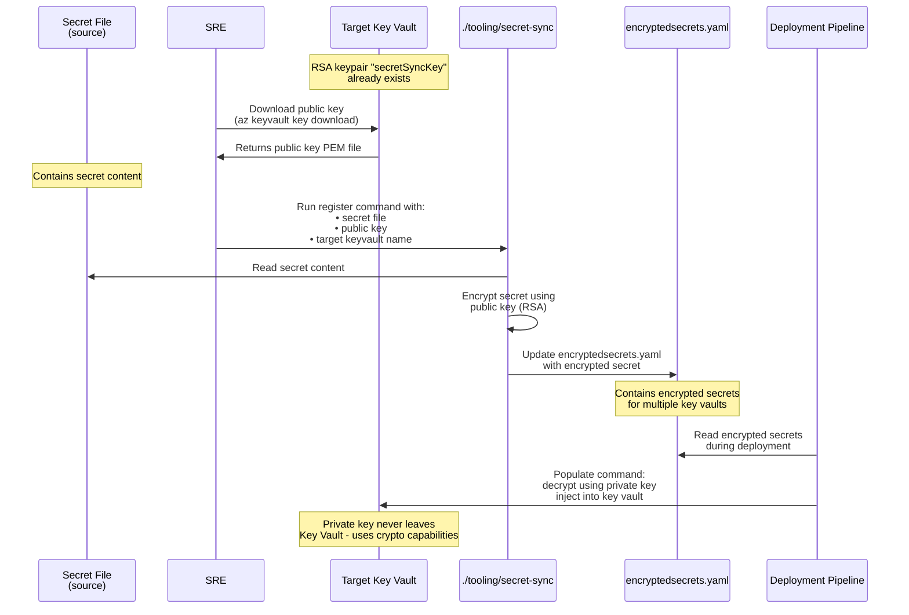

# Secret Synchronization

This document describes the process of populating ARO HCP Key Vaults with secrets.

## High level concept

Secrets are encrypted using the public part of RSA. We can generate RSA Key Pair by creating a key in Azure Key Vault.

For this we'd have to do:

- Create an RSA key in Key Vault (target key vault for secret)
- Download the Public key and store in this repo
- Use `./tooling/secret-sync register` to encrypt a secret using this key
- In target environment use `./tooling/secret-sync populate` to populate secrets into the target key vault

> [!NOTE]
> The `populate` command is idempotent. Also the private key never leaves the target key vault but we use Key Vaults crypto capabilities to inject the public key encrypted secrets.



## Public Key Retrieval

You can use the following cli command to download a public key (run from repo root). Need to adapt parameters accordingly.

```bash
KEYVAULT=arohcp${DEPLOY_ENV}-global # e.g. arohcpdev-global
az keyvault key download --vault-name ${KEYVAULT} -n secretSyncKey -f ${KEYVAULT}-public-key.pem
```

For MSFT environments, activating PIM or requesting a JIT is required to download the public key.

## Register a Secret

To register a secret for a key vault instance, prepare a file that contains the secret content.

```sh
./tooling/secret-sync register \
    --cloud public \
    --config-file dev-infrastructure/data/encryptedsecrets.yaml \
    --keyvault ${KEYVAULT} \
    --secret-file ${FILE_WITH_SECRET_CONTENT} \
    --secret-name ${SECRET_NAME_IN_KV} \
    --public-key-file ${KEYVAULT}-public-key.pem
```

> [!IMPORTANT]
> Make yourself aquinted with the encoding need of the respective secret. Some secrets are expected to be base64 encoded. In doubt, check the current content of the `aroghcpdev-global` key vault.

> [!TIP]
Specifying `--public-key-file` is only required the first time. Once there is a record for the key vault in the config file, this parameter can be omitted.

## Rotation a Secret

In order to rotate a secret, repeat the process described in [Register a Secret](#register-a-secret) with the new secret content.

## Rotate a Public Key

In case the encryption key for a key vault needs to be rotated, [retrieve the new public key](#public-key-retrieval) and [register all secrets again](#register-a-secret).
