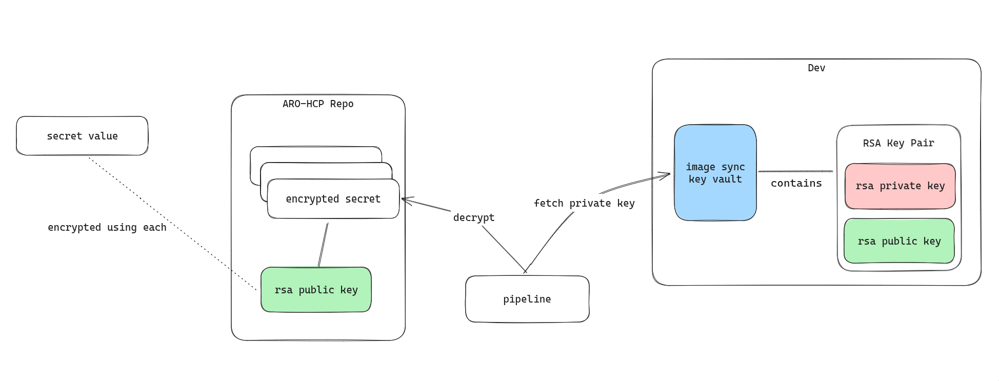

# Secret Synchronization


## High level concept

Secrets are encrypted using the public part of RSA. We can generate RSA Key Pair by creating a key in Azure Key Vault.

For this we'd have to do:

 * Create an RSA key in Key Vault (target key vault for secret)
 * Download the Public key and store in this repo
 * Use `./tooling/secret-sync` to encrypt a secret using this key
 * In target environment use `./tooling/secret-sync` to decrypt this secret and store it in the target key vault




## Public Key Storage

You can use the following cli command to download a public key (run from repo root). Need to adapt parameters accordingly.

```bash
DEPLOY_ENV=dev
KEYVAULT=arohcpdev-global
KEYNAME=secretSyncKey
az keyvault key download --vault-name $KEYVAULT -n $KEYNAME -f ./dev-infrastructure/data/keys/${DEPLOY_ENV}_${KEYVAULT}_${KEYNAME}.pem
```

## Secret storage and rotation

Encrypted secrets can be stored under `./dev-infrastructure/data/encryptedsecrets/`. The directoy has subfolders:
- Deployment environment
- Keyvault Name

So, there is a folder for each Key Vault. Every file in the last directory is expected to be a secret. All secrets are discovered and synced into the corresponding key vault.

### Rotation

In order to rotate a secret, create a new secret and store it under a different name in the encryptedsecrets folder.

After running the secrets sync pipeline, the new secret should be available and you can update the reference to this secret in the configuration file.

## Encrypting a secret

In order to encrypt a secret use the `encrypt-all.sh` script. Example usage:

`echo "foo" | ./tooling/secret-sync/encrypt-all.sh testing.enc`

> [!IMPORTANT]
> Make yourself aquinted with the encoding need of the respective secret. Some secrets are expected to be base64 encoded. In doubt, check the current content of the `aroghcpdev-global` key vault.

This will encrypt the secret `foo` using all keys stored in `data/keys` and store it encrypted under `data/encryptedsecrets`.

> [!TIP]
> If you run `encrypt-all.sh` the content of all files in `data/encryptedsecrets` will change even though the plaintext secret did not. This is expected.
