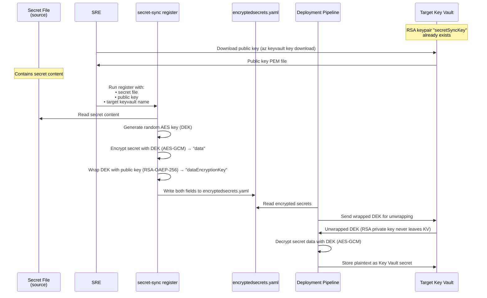

# Secret Synchronization

This document describes how secrets are stored in this repository and deployed into ARO HCP Key Vaults.

## How It Works

Secrets (pull credentials, tokens, passwords, etc.) need to live in Azure Key Vaults so that pipelines and services can use them at runtime. But we also need them checked into the repo so deployments are reproducible. The solution is **envelope encryption**: secrets are encrypted locally and committed to [`dev-infrastructure/data/encryptedsecrets.yaml`](../dev-infrastructure/data/encryptedsecrets.yaml), then decrypted into the target Key Vault during deployment.

- An RSA key pair (`secretSyncKey`) lives in each environment's global Key Vault
- The private key never leaves the Key Vault
- You encrypt secrets locally using the public key and commit the ciphertext
- At deploy time, `global-pipeline.yaml` runs a `SecretSync` action that asks the Key Vault to decrypt using its private key and injects the plaintext as a Key Vault secret

The target key vaults (one per environment) in `encryptedsecrets.yaml` are:

| Key Vault | Environment |
|---|---|
| `arohcpdev-global` | dev |
| `arohcpint-global` | int |
| `arohcpstg-global` | stg |
| `arohcpprod-global` | prod |

### Register vs Populate

| Command | Needs KV access? | What it does |
|---|---|---|
| `register` | No | Encrypts locally using the public key (pure math, no network required) |
| `populate` | Yes | Calls the KV crypto API to unwrap the DEK using the private key, then AES-decrypts locally and stores the plaintext in KV |

An SRE can run `register` from any machine, commit the result, and the deployment pipeline handles `populate` in the target environment where it has the necessary identity/permissions.

### Why Two Encryption Keys?

Each secret in `encryptedsecrets.yaml` has two fields: `data` and `dataEncryptionKey`. This is envelope encryption:

1. **Data Encryption Key (DEK)** — a random AES key generated per secret. It encrypts the actual secret content using AES-GCM. This is the `data` field.
2. **Key Encryption Key (KEK)** — the RSA key pair `secretSyncKey` that lives in the target Key Vault. The DEK is encrypted (wrapped) with the KEK's public key using RSA-OAEP-256. This is the `dataEncryptionKey` field.

Why not just RSA-encrypt the secret directly? RSA has a size limit (a few hundred bytes for RSA-2048). Envelope encryption removes that limit — the AES key is small enough for RSA, and AES can encrypt data of any size.

At deploy time, the `populate` command sends the wrapped DEK to Key Vault for unwrapping (the private RSA key never leaves Key Vault). Key Vault returns the plain DEK, and `populate` uses it locally to AES-decrypt the secret data, then stores the plaintext back into Key Vault as a regular secret.


```mermaid
sequenceDiagram
    participant SF as Secret File<br/>(source)
    participant SRE
    participant Tool as secret-sync register
    participant Repo as encryptedsecrets.yaml
    participant Pipeline as Deployment Pipeline
    participant KV as Target Key Vault

    Note over KV: RSA keypair "secretSyncKey"<br/>already exists

    SRE->>KV: Download public key (az keyvault key download)
    KV->>SRE: Public key PEM file

    Note over SF: Contains secret content

    SRE->>Tool: Run register with:<br/>• secret file<br/>• public key<br/>• target keyvault name
    Tool->>SF: Read secret content
    Tool->>Tool: Generate random AES key (DEK)
    Tool->>Tool: Encrypt secret with DEK (AES-GCM) → "data"
    Tool->>Tool: Wrap DEK with public key (RSA-OAEP-256) → "dataEncryptionKey"
    Tool->>Repo: Write both fields to encryptedsecrets.yaml

    Pipeline->>Repo: Read encrypted secrets
    Pipeline->>KV: Send wrapped DEK for unwrapping
    KV->>Pipeline: Unwrapped DEK (RSA private key never leaves KV)
    Pipeline->>Pipeline: Decrypt secret data with DEK (AES-GCM)
    Pipeline->>KV: Store plaintext as Key Vault secret
```

## Adding a New Secret

### 1. Build the tool

```sh
cd tooling/secret-sync
make
cd ../..
```

### 2. Get the public key (first time only per vault)

The public key is already embedded in `encryptedsecrets.yaml` under each vault's `keyEncryptionKey` field. You only need to download it if you're targeting a vault that doesn't have an entry yet, or if the key was rotated.

```bash
KEYVAULT=arohcpdev-global  # adjust for target env
az keyvault key download --vault-name ${KEYVAULT} -n secretSyncKey -f ${KEYVAULT}-public-key.pem
```

For int/stg/prod (MSFT environments) you'll need PIM/JIT access first.

### 3. Prepare the secret content

#### Adding a new secret

Write the secret value to a file:

```sh
echo -n "my-secret-value" > /tmp/my-secret.txt
# OR for file-based secrets like a JSON pull secret:
cp ~/my-pull-secret.json /tmp/my-secret.txt
```

> [!IMPORTANT]
> Some secrets are expected to be base64-encoded before registration. Check what format the consuming service expects — look at existing secrets in the target Key Vault for reference.

#### Updating or appending to an existing secret

First, fetch the current value:

```sh
az keyvault secret show \
    --vault-name ${KEYVAULT} \
    --name ${SECRET_NAME} \
    --query value -o tsv > /tmp/my-secret.txt
```

If the secret is base64-encoded, decode before editing, then re-encode after:

```sh
# Decode
base64 -d < /tmp/my-secret.txt > /tmp/decoded-secret.txt

# ... edit /tmp/decoded-secret.txt ...

# Re-encode
base64 -i /tmp/decoded-secret.txt -o /tmp/my-secret.txt
```

### 4. Register the secret

Run once per target environment. The `--cloud` flag must match: `dev` for the dev vault, `public` for int/stg/prod.

```sh
# Dev
./tooling/secret-sync/secret-sync register \
    --cloud dev \
    --config-file dev-infrastructure/data/encryptedsecrets.yaml \
    --keyvault arohcpdev-global \
    --secret-file /tmp/my-secret.txt \
    --secret-name my-new-secret \
    --public-key-file arohcpdev-global-public-key.pem  # omit if vault already in yaml

# Int (public cloud)
./tooling/secret-sync/secret-sync register \
    --cloud public \
    --config-file dev-infrastructure/data/encryptedsecrets.yaml \
    --keyvault arohcpint-global \
    --secret-file /tmp/my-secret.txt \
    --secret-name my-new-secret
```

Repeat for each environment you need to target (`arohcpstg-global`, `arohcpprod-global`).

The command is idempotent — re-running with the same secret name overwrites the encrypted value. This is also how rotation works.

> [!TIP]
> Clean up your plaintext secret file after use.

## Rotate the Public Key

If the Key Vault's RSA key needs rotation, [download the new public key](#2-get-the-public-key-first-time-only-per-vault) and [re-register all secrets](#4-register-the-secret).

## Creating a Registry Service Account

The `component-sync-pull-secret` contains credentials for `registry.redhat.io`, obtained via a Red Hat registry service account. To create or rotate one:

1. Log in to the [Red Hat Customer Portal](https://access.redhat.com) with a Red Hat account.
2. Navigate to the [Registry Service Account management page](https://access.redhat.com/terms-based-registry/).
3. Click **New Service Account**, provide a name and description.
4. After creation, go to the **Docker Configuration** tab and download the JSON.
5. Base64-encode the Docker config JSON and [register it as a secret](#register-a-secret) under the name `component-sync-pull-secret`.

For the full guide, see [Creating Registry Service Accounts](https://access.redhat.com/articles/RegistryAuthentication#creating-registry-service-accounts-6) in the Red Hat documentation.

## Validating Encrypted Secrets

See [`tooling/secret-sync/README.md`](../tooling/secret-sync/README.md#validating-encrypted-secrets) for how to run `make test-decrypt` to validate encrypted secrets.
