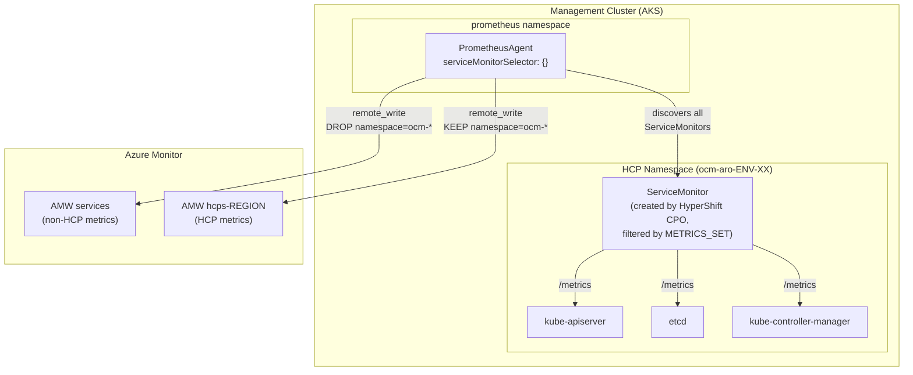

# HCP Metrics Architecture

How metrics flow from Hosted Control Plane (HCP) components to Azure Monitor, and how to extend what we collect.

## Architecture



### How it works

1. **HyperShift's control-plane-operator** creates a ServiceMonitor per HCP namespace for each component (KAS, etcd, KCM). This happens unconditionally — `--platform-monitoring` does not affect it.

2. The **`METRICS_SET` environment variable** on the HyperShift Operator controls which `metricRelabelings` are applied to those ServiceMonitors. We use `SRE`, which loads its config from the `sre-metric-set` ConfigMap in the `hypershift` namespace.

3. **PrometheusAgent** (in `prometheus` namespace) discovers all ServiceMonitors via an empty selector and scrapes them.

4. PrometheusAgent **remote_writes** to two Azure Monitor Workspaces, routed by namespace:
   - `namespace=~"ocm-.*"` → `hcps-REGION` workspace (HCP metrics)
   - everything else → `services` workspace (management cluster metrics)

### What METRICS_SET controls

| Value | Behavior |
|-------|----------|
| `Telemetry` (default) | Hardcoded `keep` rule: 3 KAS metrics only |
| **`SRE`** (our setting) | Reads `metricRelabelings` from `sre-metric-set` ConfigMap |
| `All` | Drops only legacy/renamed metrics, keeps everything else |

### AMA (Azure Monitor Agent)

AMA's `controlplane-*` settings (`controlplane-apiserver`, `controlplane-etcd`, etc.) scrape the **AKS management cluster's own control plane** — the AKS apiserver that manages the management cluster itself. These have no overlap with HCP metrics.

## File Locations

| What | Where |
|------|-------|
| SRE metric allowlist | `hypershiftoperator/deploy/templates/sre-metric-set.configmap.yaml` |
| HyperShift install flags | `hypershiftoperator/deploy/templates/installer.job.yaml` |
| PrometheusAgent spec | `observability/prometheus/deploy/templates/prometheus.yaml` |
| KSM custom resource state | `observability/prometheus/values-mgmt.yaml` |
| AMA config | `observability/prometheus/deploy/templates/ama-metrics-settings-configmap.yaml` |
| Grafana dashboards | `observability/grafana-dashboards/<folder>/` |
| Dashboard registration | `observability/observability.yaml` → `grafana-dashboards.dashboardFolders` |
| Alert rules | `observability/alerts/` |
| Alert registration | `observability/observability.yaml` → `prometheusRules.rulesFolders` |
| Recording rules (HCP workspace) | `observability/observability-hcp.yaml` |
| Generated Bicep alerting rules | `dev-infrastructure/modules/metrics/rules/generatedPrometheusAlertingRules.bicep` |
| DCR/DCE routing (Azure) | `dev-infrastructure/modules/metrics/datacollection.bicep` |

## SOPs

### Adding a new KAS/etcd/KCM metric

Edit `hypershiftoperator/deploy/templates/sre-metric-set.configmap.yaml`. Add the metric name to the appropriate component's `keep` regex.

Example — adding `apiserver_admission_controller_admission_duration_seconds_bucket` to the KAS allowlist:

```yaml
kubeAPIServer:
  - action: "keep"
    regex: "(apiserver_request_total|...|apiserver_admission_controller_admission_duration_seconds_bucket)"
    sourceLabels: ["__name__"]
```

Then update the Helm fixture and deploy:

```bash
make update-helm-fixtures
# Deploy to your environment:
make pipeline/HypershiftOperator DEPLOY_ENV=pers
```

The new metric will appear in the `hcps-REGION` Azure Monitor Workspace after the next ServiceMonitor reconciliation and scrape cycle (~2-5 min).

**Cardinality warning**: Every metric you add is scraped per-HCP. A histogram with 10 buckets and 5 label dimensions across 200 HCPs produces significant cardinality. Prefer `_count` and `_sum` over `_bucket` unless you need percentile queries. If you must add buckets, consider a `drop` rule for unused `le` values (see the existing bucket drop rule in the ConfigMap).

### Adding a new Grafana dashboard

1. Create a JSON dashboard file in the appropriate folder under `observability/grafana-dashboards/`. For HCP metrics, use `kas-monitor/`.

2. If you created a new folder, register it in `observability/observability.yaml`:
   ```yaml
   grafana-dashboards:
     dashboardFolders:
     - name: My New Folder
       path: ./grafana-dashboards/my-new-folder
   ```

3. Use template variables for datasource and cluster selection. Recommended regex filters:

   | Variable | Regex | Shows |
   |----------|-------|-------|
   | datasource | `^Managed_Prometheus_hcps-.*$` | HCP data sources |
   | datasource | `^Managed_Prometheus_services-.*$` | Service data sources |
   | cluster | `^.*-mgmt-\\d+$` | Management clusters |
   | cluster | `^.*-svc-\\d+$` | Service clusters |

4. Deploy:
   ```bash
   make infra.monitoring DEPLOY_ENV=pers
   ```

### Adding a new alert rule

1. Create a `PrometheusRule` YAML in `observability/alerts/`. Follow the naming convention: `<Name>-prometheusRule.yaml`.

2. Create a matching test file: `<Name>-prometheusRule_test.yaml`. See existing test files for the format (`rule_files`, `evaluation_interval`, `tests` with `input_series` and `alert_rule_test`).

3. Register the rule file in `observability/observability.yaml` under `prometheusRules.rulesFolders`.

4. Generate the Bicep rules and run tests:
   ```bash
   cd observability && make alerts
   ```
   This runs `promtool` tests, processes all PrometheusRules, and regenerates `dev-infrastructure/modules/metrics/rules/generatedPrometheusAlertingRules.bicep`.

5. For HCP-workspace rules (metrics from `ocm-*` namespaces), register in `observability/observability-hcp.yaml` instead.

### Verifying which metrics are available

After deploying the SRE metric set, check what's actually being scraped:

```bash
# Get mgmt cluster kubeconfig
make infra.mgmt.aks.kubeconfigfile

# Check ServiceMonitor metricRelabelings in an HCP namespace
kubectl -n <ocm-aro-*-namespace> get servicemonitor -o yaml

# Verify the ConfigMap is loaded
kubectl -n hypershift get configmap sre-metric-set -o yaml

# Query Azure Monitor (via Grafana or az cli) for a metric that was
# previously filtered out by the Telemetry set:
#   apiserver_request_duration_seconds_count{namespace=~"ocm-.*"}
```
