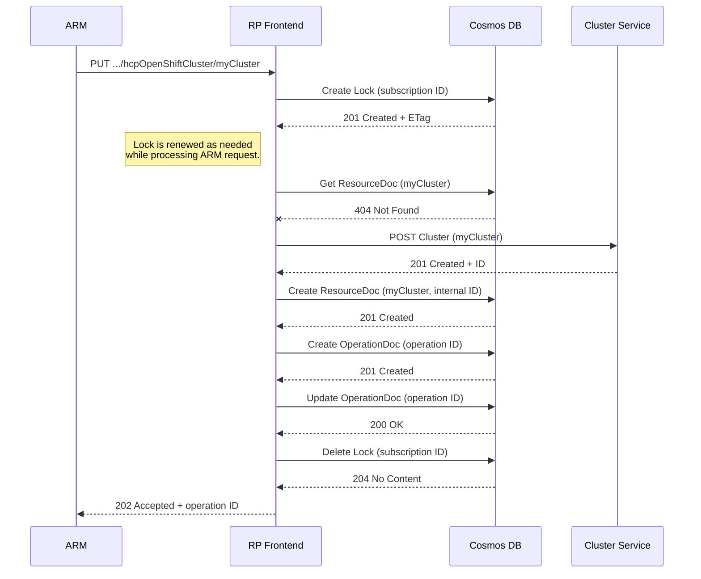
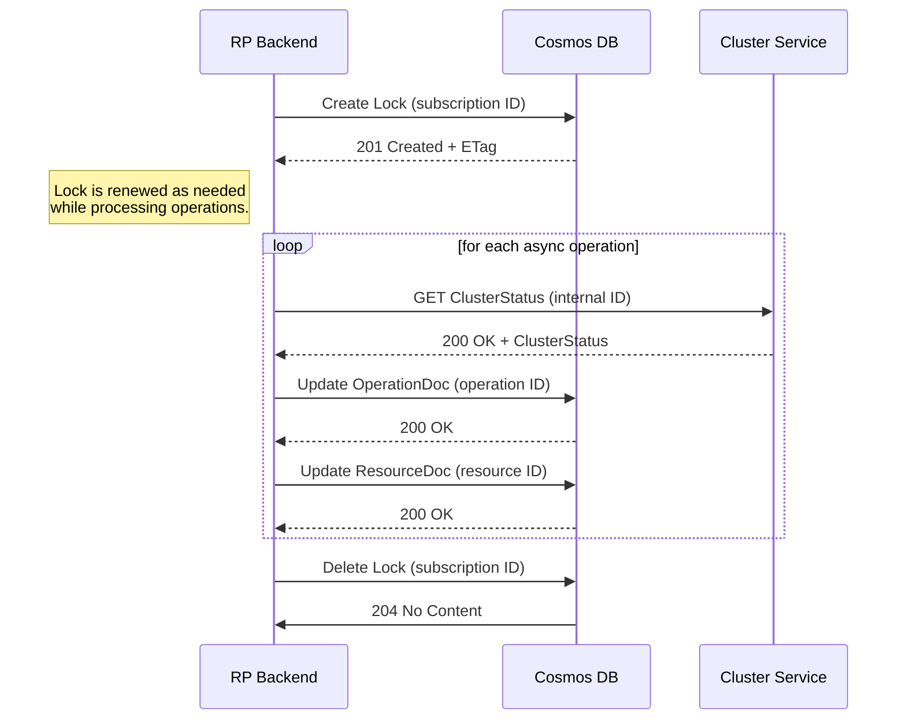
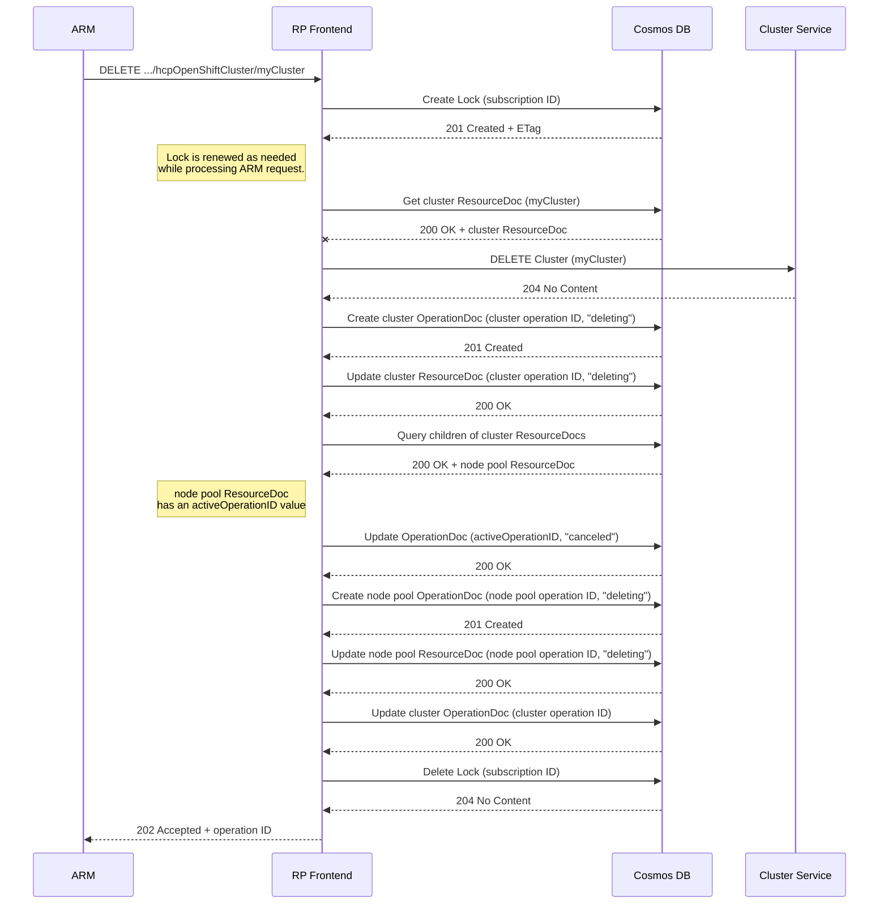
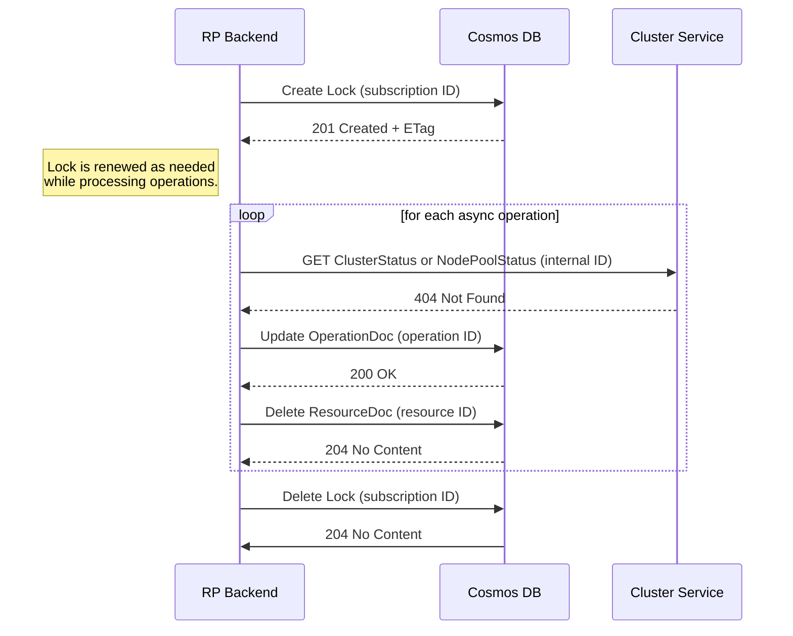

# Asynchronous Operations in the ARO-HCP Resource Provider

This document aims to capture the design decisions that went into the asynchronous operations implementation in the ARO-HCP frontend and backend components.

It assumes the reader has a basic understanding of ARM's asynchronous operations contract. The [Azure Resource Manager Resource Provider Contract](https://github.com/cloud-and-ai-microsoft/resource-provider-contract/blob/master/v1.0/async-api-reference.md)<sup>(RPC)</sup> is the best reference for this.

> [!NOTE]
> Links to the Resource Provider Contract have a <sup>(RPC)</sup> superscript and require a Microsoft Enterprise Managed User (EMU) GitHub account – aka `b-yourname@microsoft.com`. Visit https://aka.ms/copilot/vendors to request membership in the GitHub Copilot for Vendors entitlement.

The first thing to say is the design (especially the backend's design) is less than optimal due to several constraints:

1. Cluster Service currently has no update notification mechanism for clients. This means polling is required to get status updates on asynchronous operations in progress, and polling introduces latency in propagating status updates to end users and updating Azure billing records.
  
2. Microsoft's official [Azure SDK for Go](https://github.com/Azure/azure-sdk-for-go) is lagging behind Microsoft's Azure SDK for other languages like [.NET](https://github.com/azure/azure-sdk-for-net) and [Python](https://github.com/Azure/azure-sdk-for-python) in its Cosmos DB support. In particular, there is no support for [change feeds](https://learn.microsoft.com/en-us/azure/cosmos-db/change-feed) whatsoever, not even [limited support for the pull model only](https://github.com/Azure/azure-sdk-for-go/issues/21686). This means, once again, polling. Polling Cosmos DB for new Azure subscriptions and polling for new asynchronous operations. Again, more latency.

## Cosmos DB Data Model

If you're not accustomed to schema-free databases, [Data modeling in Azure Cosmos DB](https://learn.microsoft.com/en-us/azure/cosmos-db/nosql/modeling-data) is a recommended read.

I'm no Cosmos DB expert, but I have picked up a few nuggets of wisdom from experience.

The first thing is finding the right partitioning strategy in a Cosmos DB container is critical, especially when mostly limited to single-partition queries. Advanced Cosmos DB features like [stored procedures](https://learn.microsoft.com/en-us/azure/cosmos-db/nosql/how-to-write-stored-procedures-triggers-udfs) and especially [transactional batch operations](https://learn.microsoft.com/en-us/azure/cosmos-db/nosql/transactional-batch) are limited in scope to a single logical partition within a single container.

The second thing is documents in a Cosmos DB container – aside from a few [system-generated fields](https://learn.microsoft.com/en-us/rest/api/cosmos-db/documents) – are free-form JSON blobs. Unlike with tables in a schema-based database, [documents within a Cosmos DB container do not have to be homogeneous](https://learn.microsoft.com/en-us/azure/cosmos-db/nosql/modeling-data#distinguish-between-different-document-types). This is worth taking advantage of considering the aforementioned scoping constraints.

With these points in mind, ARO-HCP has settled on the following data model.

### Containers

The ARO-HCP resource provider interacts with the following containers:

#### Resources
"Resources" is the primary container where all the registered Azure subscriptions, hosted control plane (HCP) cluster and node pool metadata, and asynchronous operation tracking that the ARO-HCP resource provider is responsible for live.

The container is partitioned by Azure subscription ID and has a default [Time-to-Live (TTL)](https://learn.microsoft.com/en-us/azure/cosmos-db/nosql/time-to-live) of -1, meaning documents within this container do not automatically expire by default.

Documents in this container consist of an outer "envelope" with fixed fields, and an inner "payload" whose fields are dictated by the resource type declared in the "envelope" section.

##### Resources Envelope

Let's take a closer look at the outer "envelope" of a document in the "Resources" container:
```
{
    "id":            <uuid>,                  (1)
    "partitionKey":  <Azure subscription ID>, (2)
    "resourceType":  <Azure resource type>,   (3)
    "properties": {                           (4)
        ... payload section ...
    },
    "ttl":           <optional, in seconds>,  (5)
    "_etag" and other system-generated fields
}
```
1. The `id` field is a lowercased [128-bit UUID](https://rfc-editor.org/rfc/rfc4122.html) (e.g. "`xxxxxxxxx-xxxx-xxxx-xxxx-xxxxxxxxxxxx`"), generated by the RP when necessary. Depending on the resource type, the `id` value may be significant.

   For Azure subscriptions, the `id` is the Azure subscription ID (and therefore matches the `partitionKey` field).

   For asynchronous operations, the `id` is the asynchronous operation ID.  It is also the last path segment of the endpoint URL(s) returned to ARM in the `Location` and `Azure-AsyncOperation` response headers.

   The `id` value is _not_ significant for hosted control plane clusters and node pools.

2. The `partitionKey` field is an Azure subscription ID, which itself is a [128-bit UUID](https://rfc-editor.org/rfc/rfc4122.html) (e.g. "`xxxxxxxxx-xxxx-xxxx-xxxx-xxxxxxxxxxxx`"), also lowercased.
    
3. The `resourceType` field is a lowercased Azure resource type, including the namespace.

   For example, a document for an Azure subscription will have a `resourceType` value of "`microsoft.resources/subscriptions`".
    
4. The `properties` field is the "payload" section. Its content depends on the envelope's `resourceType` field. More on this below.

5. The `ttl` (time-to-live) field is only used for asynchronous operation documents, which automatically expire after 7 days.

   See the Azure documentation: [Time to Live (TTL) in Azure Cosmos DB](https://learn.microsoft.com/en-us/azure/cosmos-db/nosql/time-to-live)
 
##### Azure Subscriptions

Resource type:
* `microsoft.resources/subscriptions`

It's worth noting that because the "Resources" container is partitioned by Azure subscription ID, there is only one Azure subscription document per logical partition.

The "payload" section for an Azure subscription document is the full, verbatim content of a subscription PUT request. The [Resource Provider Contract](https://github.com/cloud-and-ai-microsoft/resource-provider-contract/blob/master/v1.0/subscription-lifecycle-api-reference.md#request)<sup>(RPC)</sup> has all the details about the content stored here. The top-level `state` field is the only field that's significant to the ARO-HCP resource provider as the subscription state influences the resource provider's behavior in request handling and implicit resource cleanup within the subscription.

##### Hosted Control Plane Clusters and Node Pools

Resource types:
* `microsoft.redhatopenshift/hcpopenshiftclusters`
* `microsoft.redhatopenshift/hcpopenshiftclusters/nodepools`

The primary purpose of a hosted control plane cluster or node pool (a.k.a. "resource") document is to serve as a cross-reference from Azure's resource identifier to OpenShift Cluster Manager (OCM)'s resource identifier.

The "payload" section of the document is as follows:
```
{
    "resourceId":        <Azure resource ID>                    (1)
    "internalId":        <OpenShift Cluster Manager API path>   (2)
    "activeOperationId": <ID of active async operation, if any> (3)
    "provisioningState": <status of last async operation>       (4)
    "identity":          <Azure managed service identity>       (5)
    "systemData":        <Azure system metadata>                (6)
    "tags":              <Azure resource tags>                  (7)
}
```
<a name="resource-document-resourceid-field"></a>

1. The `resourceId` field is the Azure resource ID for the hosted control plane cluster or node pool. It is also the ARO-HCP resource provider's API path for the resource:
   ```
   /subscriptions/{subscription_id}/resourceGroups/{resource_group_name}/providers/Microsoft.RedHatOpenShift/hcpOpenShiftClusters/{cluster_name}[/nodePools/{node_pool_name}]
   ```
   The casing is preserved from the original PUT request that created the resource, so we use a case-insensitive string match when querying for the resource ID.

<a name="resource-document-internalid-field"></a>

2. The `internalId` field is the OpenShift Cluster Manager's API path for the hosted control plane cluster or node pool:
   ```
   /api/aro_hcp/v1alpha1/clusters/{cluster_id}[/node_pools/{node_pool_id}]
   ```
   Within the ARO-HCP resource provider we call this the "internal ID" since it is hidden from the end-user.

<a name="resource-document-activeoperationid-field"></a>

3. The `activeOperationId` field refers to the `id` field of the Cosmos DB document representing the current asynchronous operation acting on the resource. In Azure there can only be one active operation on a resource at a time. This field is removed when the active asynchronous operation reaches a terminal state.

<a name="resource-document-provisioningstate-field"></a>

4. The `provisioningState` field stays synchronized with the [`status` field](#operation-document-status-field) of the Cosmos DB document representing the latest asynchronous PUT, PATCH, or DELETE operation initiated on the resource. The reason the value is duplicated here is to preserve the last operation's terminal status, potentially beyond the [limited lifespan](#operation-document-time-to-live) of asynchronous operation documents.

5. The `identity` field persists the remaining [managed service identity](https://azure.github.io/typespec-azure/docs/libraries/azure-resource-manager/reference/data-types/#Azure.ResourceManager.CommonTypes.ManagedServiceIdentity) fields that the ARO-HCP resource provider _does not_ pass to Cluster Service. In particular this field holds the managed service identity type, and the principal ID and tenant ID of any system-assigned identity, but _not_ the user-assigned identities map. At present the only purpose of this field is to help faithfully reproduce the managed service identity data that was provided in the body of the PUT request that created the resource.

6. The `systemData` field persists the content of the most recent ARM-provided `x-ms-arm-resource-system-data` HTTP request header for the resource.

   This is a [requirement for all Azure resource providers](https://github.com/cloud-and-ai-microsoft/resource-provider-contract/blob/master/v1.0/common-api-contracts.md#system-metadata-for-all-azure-resources)<sup>(RPC)</sup>:
   > The systemData object should be defined in the resource swagger and persisted in provider storage to serve on all responses for the resource (GET, PUT, PATCH).
   
   Cluster Service does not handle Azure system metadata so the ARO-HCP resource provider must persist it.

7. The `tags` field persists the set of [user-provided tags for the resource](https://learn.microsoft.com/en-us/azure/azure-resource-manager/management/tag-resources), which is just a key/value map.

   All "tracked" resource types in Azure (which include hosted control plane clusters and node pools) are required to support resource tagging. Cluster Service does not handle Azure resource tags so the ARO-HCP resource provider must persist it.

##### Asynchronous Operations

Resource type:
* `microsoft.redhatopenshift/hcpoperationsstatus`

<a name="operation-document-time-to-live"></a>

Asynchronous operation documents automatically expire after 7 days, by way of the [time-to-live ("ttl") field](https://learn.microsoft.com/en-us/azure/cosmos-db/nosql/time-to-live). By extension, asynchronous operation status endpoints returned to ARM in the `Location` and `Azure-AsyncOperation` response headers also expire after 7 days since failure to find the operation document in Cosmos DB results in a "404 Not Found" HTTP response.

The "payload" section of an asynchronous operation document includes all the information needed to respond to status requests from ARM on the endpoint returned through the `Azure-AsyncOperation` response header. The response body format for these status requests is described in the [Resource Provider Contract](https://github.com/cloud-and-ai-microsoft/resource-provider-contract/blob/master/v1.0/async-api-reference.md#azure-asyncoperation-resource-format)<sup>(RPC)</sup>. The "payload" section does not follow the response body format exactly. Instead, it has the following fields:
```
{
    "tenantId":           <Azure tenant ID>                    (1)
    "clientId":           <Azure client ID>                    (2)
    "request":            "Create"|"Update"|"Delete"           (3)
    "externalId":         <Azure resource ID>                  (4)
    "internalId":         <OpenShift Cluster Manager API path> (5)
    "operationId":        <operation status endpoint, if any>  (6)
    "notificationUri":    <async operation callback URI>       (7)
    "startTime":          <RFC 3339 timestamp>                 (8)
    "lastTransitionTime": <RFC 3339 timestamp>                 (9)
    "status":             <provisioning state>                 (10)
    "error":              <OData error, if any>                (11)
}
```

<a name="operation-document-tenantid-field"></a>

1. The `tenantId` field records the tenant ID of the subscription from which the operation was initiated. The value is copied from the `x-ms-home-tenant-id` request header and is used to validate access to the operation's status endpoint.

   The field is only set for explicitly requested asynchronous operations. See "[Explicit vs Implicit Operations](#explicit-vs-implicit-operations)" below.

<a name="operation-document-clientid-field"></a>

2. The `clientId` field records the object ID of the client Java Web Token (JWT) that initiated the operation. The value is copied from the `x-ms-client-object-id` request header and is used to validate access to the operation's status endpoint.

   The field is only set for explicitly requested asynchronous operations. See "[Explicit vs Implicit Operations](#explicit-vs-implicit-operations)" below.

<a name="operation-document-request-field"></a>

3. The `request` field captures the nature of the operation. Valid values are "Create", "Update", "Delete", "RequestCredential", and "RevokeCredentials".

4. The `externalID` field is the same as the [`resourceID` field](#resource-document-resourceid-field) in hosted control plane cluster and node pool documents.

5. The `internalID` field is the same as the [`internalID` field](#resource-document-internalid-field) in hosted control plane cluster and node pool documents.

<a name="operation-document-operationid-field"></a>

6. The `operationID` field is the status endpoint returned to ARM in the `Azure-AsyncOperation` response header.

   The field is only set for explicitly requested asynchronous operations. See "[Explicit vs Implicit Operations](#explicit-vs-implicit-operations)" below.

7. The `notificationUri` field is for ARM's [Async Operation Callbacks](https://eng.ms/docs/products/arm/api_contracts/asyncoperationcallback) protocol. This is an opt-in ARM feature that ARO-HCP has not yet onboarded to as of this writing, but the API contract has been implemented nonetheless. The value is copied from the `Azure-AsyncNotificationUri` request header, if present.

8. The `startTime` field is an [RFC 3339](https://www.rfc-editor.org/rfc/rfc3339.html) formatted UTC timestamp marking the start of the operation.

9. The `lastTransitionTime` field is an [RFC 3339](https://www.rfc-editor.org/rfc/rfc3339.html) formatted UTC timestamp marking the most recent change to the `status` field. When the operation status becomes terminal (`Succeeded`, `Failed`, or `Canceled`), the `lastTransitionTime` field effectively marks the end of the operation since there will be no further `status` changes.

<a name="operation-document-status-field"></a>

10. The `status` field indicates the current state of the operation.

    Valid values are divided into "non-terminal" and "terminal" states. A "non-terminal" state signals to ARM that the operation is still in progress, and a "terminal" state signals to ARM that the operation has completed. An operation in a "non-terminal" state can transition to another "non-terminal" state or to a "terminal" state. An operation in a "terminal" state cannot transition to any other state.

    Each Azure resource provider is free to choose its own set of "non-terminal" states. For ARO-HCP, these are "Accepted", "Deleting", "Provisioning", and "Updating".

    The set of "terminal" states, on the other hand, is [mandated by ARM](https://github.com/cloud-and-ai-microsoft/resource-provider-contract/blob/master/v1.0/async-api-reference.md#provisioningstate-property)<sup>(RPC)</sup> to be "Succeeded", "Failed", and "Canceled".

    If the operation was initiated by a PUT, PATCH, or DELETE request on a cluster or node pool resource, then the `status` field is synchronized to the [`provisioningState` field](#resource-document-internalid-field) of the associated resource document.

<a name="operation-document-error-field"></a>

11. The `error` field contains the structured error section of the [operation resource format](https://github.com/cloud-and-ai-microsoft/resource-provider-contract/blob/master/v1.0/async-api-reference.md#azure-asyncoperation-resource-format)<sup>(RPC)</sup>. This is set when the operation status becomes `Failed` or `Canceled`. See [Error Response Content](https://github.com/cloud-and-ai-microsoft/resource-provider-contract/blob/master/v1.0/common-api-details.md#error-response-content)<sup>(RPC)</sup> for more details about the error structure.

#### Locks

The "Locks" container serves as a synchronization mechanism to control write access to the "[Resources](#resources)" container across participating pods. I say "participating" because the "Locks" container has no inherent power to enforce exclusive write access. It's merely a protocol that the ARO-HCP resource provider's frontend and backend pods abide by.

The design is based on the [Cloud Distributed Lock pattern for Cosmos DB](https://github.com/briandunnington/CloudDistributedLock/) by Brian Dunnington.  (See also [this YouTube video](https://www.youtube.com/live/Hreew-l5rCQ?si=2-_yVhR6Zxicj4l1) of Brian demoing the pattern.) The pattern leverages two built-in features of Cosmos DB: 1. [Time to Live (TTL)](https://learn.microsoft.com/en-us/azure/cosmos-db/nosql/time-to-live) to automatically expire lock documents, and 2. [Optimistic Concurrency Control](https://learn.microsoft.com/en-us/azure/cosmos-db/nosql/database-transactions-optimistic-concurrency#optimistic-concurrency-control) to resolve competing requests.

Here's how it works for the ARO-HCP resource provider pods:

Like the "Resources" container, the "Locks" container is partitioned by Azure subscription ID. Documents in the "Locks" container use identical IDs and partition keys, so there can be only one document (or "lock") per logical partition.

When a pod wants to write data to the "Resources" container, it attempts to create a document in the "Locks" container using the same partition key it will use to write to the "Resources" container. If the pod succeeds in creating the document, then it effectively holds a lock over the corresponding partition in the "Resources" container.

Documents in the "Locks" container are very simple. In addition to the [system-generated fields](https://learn.microsoft.com/en-us/rest/api/cosmos-db/documents) in all Cosmos DB documents, there is also a `ttl` or [Time to Live](https://learn.microsoft.com/en-us/azure/cosmos-db/nosql/time-to-live) field set to the default TTL of the "Locks" container (currently 10 seconds), and an `owner` field set to the name of the pod that created the document. (The `owner` field is not part of the lock protocol; it is informational only.)

Simply creating a lock document is not sufficient to hold the lock. If the critical section of code being protected by the lock takes longer to execute than the lock document's `ttl` value, the owner pod must renew the lock before the lock document expires. Renewing the lock involves upserting the same lock document with the lock's entity tag (`_etag`) system field as the [if-match](https://www.rfc-editor.org/rfc/rfc9110.html#name-if-match) precondition. If successful, the Cosmos DB service will automatically update the lock document's timestamp (`_ts`) field and thereby extend the document's life by its `ttl` value. If the precondition fails, that means another pod has acquired the lock.

When the pod that created the lock document completes its critical section, it releases the lock by deleting the lock document, again with the lock's entity tag (`_etag`) system field as the [if-match](https://www.rfc-editor.org/rfc/rfc9110.html#name-if-match) precondition. The precondition ensures the lock document is only deleted if it is still owned by the pod attempting the deletion.

The short time-to-live of lock documents acts as a fail-safe. In the event the pod that created the lock document crashes or becomes blocked, the lock document will quickly expire and be deleted by the Cosmos DB service, thereby freeing up the logical partition for another pod to create a lock document.

## Asynchronous Operation Flow

The best way to illustrate how asynchronous operations are handled by the ARO-HCP resource provider is to walk through a few examples. First, however, it's important to understand the roles of the ARO-HCP frontend and backend pods with respect to asynchronous operations.

The frontend pods collectively serve as a load-balanced endpoint for communication with the Azure Resource Manager (ARM). When a request from ARM arrives that will be handled as a long-running operation, the frontend pod will first create an [asynchronous operation document](#asynchronous-operations) in Cosmos DB and then initiate the ARM asynchronous protocol by returning a "201 Created" or "202 Accepted" status code and `Azure-AsyncOperation` and `Location` response headers. (See the [Asynchronous API Reference](https://github.com/cloud-and-ai-microsoft/resource-provider-contract/blob/master/v1.0/async-api-reference.md)<sup>RPC</sup> for details about this protocol.) As ARM then begins polling for status updates on the operation, the frontend pods will read back the asynchronous operation document from Cosmos DB and convert it to the response format ARM expects.

That's the extent of what the frontend pods do with asynchronous operation documents. The rest is handled by the lead backend pod.  (The lead backend pod is determined by the leader election protocol using [Kubernetes lease objects](https://kubernetes.io/docs/concepts/architecture/leases/).)

The lead backend pod periodically iterates over all registered Azure subscriptions and looks for any asynchronous operation documents in Cosmos DB with a non-terminal status.  It then queries Cluster Service for the current status of the resource the operation is acting on.  If the backend receives an updated status for the resource, it updates the asynchronous operation document.

Now let's walk through a few concrete examples.

### Create an HCP OpenShift Cluster

#### RP Frontend Pod

Below is a sequence diagram of the initial PUT request from ARM to create an HCP OpenShift cluster. It shows Cosmos DB documents being created but omits some of the document fields for brevity. We will cover this in more detail below.



<a name="create-cluster-frontend-step-1"></a>

1. The first Cosmos DB document to be created is in the [Locks](#locks) container. This is handled by middleware code in the resource provider's frontend pod that received the PUT request from ARM and effectively locks write access to the logical partition of the [Resources](#resources) container corresponding to the Azure subscription ID from the request.

2. The frontend pod then checks for a [resource document](#hosted-control-plane-clusters-and-node-pools) in Cosmos DB whose [resourceId field](#resource-document-resourceid-field) matches (case-insensitively) the URL path from the PUT request. In this case Cosmos DB will respond with a "404 Not Found" status, indicating that this is indeed a resource _creation_ request (as opposed to a resource _update_ request).

3. Not shown in the sequence diagram is the "static validation" phase. This is where the frontend pod validates the PUT request body has correctly formatted JSON, that it conforms to the requested API version, that fields are syntactically correct (e.g. some fields expect IPv4 CIDR notation), and that semantic rules are satisfied (e.g. the value for a "max" field is not less than the value for a "min" field). If validation fails, the frontend pod immediately responds with a "400 Bad Request" status — along with detailed error messages in the JSON body — and processing stops, except for releasing the Azure subscription lock from step 1.

4. The frontend pod constructs a Cluster Service cluster object in memory and submits it to Cluster Service in a POST request. Cluster Service performs its own static validation on the POST request body (it calls this "pre-flight validation") and, if successful, responds with a full cluster object that includes its own newly-assigned cluster ID. The frontend pod extracts the [HREF property](https://pkg.go.dev/github.com/openshift-online/ocm-sdk-go/arohcp/v1alpha1#Cluster.HREF) from the cluster object, which depicts the full URL path of the cluster's REST endpoint in Cluster Service, including the cluster ID (`/api/aro_hcp/v1alpha1/clusters/{cluster_id}`). We refer to this URL path as the cluster's "internal ID" (as opposed to the cluster's "external ID" which is its Azure resource ID).

5. With the cluster's internal ID in hand, the frontend pod can now persist cluster data to Cosmos DB. It creates two documents:
   1. A permanent [resource document](#hosted-control-plane-clusters-and-node-pools) to hold the cluster's external (Azure resource) ID, it's internal (Cluster Service) ID, and Azure metadata that is not passed to Cluster Service. The document will look something like:

      ```
      {
        "id": "7dd5e2c2-1b22-4068-bfc6-a4c31f885dee",
        "partitionKey": "1d3378d3-5a3f-4712-85a1-2485495dfc4b",
        "resourceType": "microsoft.redhatopenshift/hcpopenshiftclusters",
        "properties": {
          "resourceId": "/subscriptions/1d3378d3-5a3f-4712-85a1-2485495dfc4b/.../hcpOpenShiftClusters/myCluster",
          "internalId": "/api/aro_hcp/v1alpha1/clusters/{cluster_id}",
          "activeOperationId": "69d4b377-481a-49b2-9005-4f64d7726dff",
          "provisioningState": "Accepted",
          "identity": { managed identity data from request body },
          "systemData": { x-ms-arm-resource-system-data header content },
          "tags": { resource tags from request body }
        },
        ... other system-generated fields ...
      }
      ```

   2. A transient [asynchronous operation document](#asynchronous-operations) document to track the ongoing cluster creation operation. The document will look something like:

      ```
      {
        "id": "69d4b377-481a-49b2-9005-4f64d7726dff",
        "partitionKey": "1d3378d3-5a3f-4712-85a1-2485495dfc4b",
        "resourceType": "microsoft.redhatopenshift/hcpoperationsstatus",
        "properties" {
          "request": "Create",
          "externalId": "/subscriptions/1d3378d3-5a3f-4712-85a1-2485495dfc4b/.../hcpOpenShiftClusters/myCluster",
          "internalId": "/api/aro_hcp/v1alpha1/clusters/{cluster_id}",
          "startTime": "2025-03-14T01:59:26Z",
          "lastTransitionTime": "2025-03-14T01:59:26Z",
          "status": "Accepted"
        },
        "ttl": 604800,
        ... other system-generated fields ...
      }
      ```

   There's a few correlations between the two documents to notice:
   * The `partitionKey` is the same in both documents and is equal to the subscription ID of the Azure resource ID. This means both documents exist in the same logical partition in Cosmos DB; a partition allocated exclusively for that Azure subscription.
   * The [resource document](#hosted-control-plane-clusters-and-node-pools)'s `activeOperationId` references the `id` of the [asynchronous operation document](#asynchronous-operations).
   * The `provisioningState` and `status` fields are both `"Accepted"`. All asynchronous operations resulting from PUT, PATCH, or POST requests from ARM begin in this state. It indicates that Cluster Service has, at least initially, accepted the frontend pod's request.

<a name="create-cluster-frontend-step-6"></a>

6. This is a bit of an implementation detail, but in addition to responding to ARM with a "201 Created" status and an `Azure-AsyncOperation` header, the frontend pod updates the [asynchronous operation document](#asynchronous-operations) it just created with additional details: the tenant ID and client ID of the identity that made the request, and the status endpoint returned in the `Azure-AsyncOperation` header. We call this "exposing" the operation; it effectively has a REST endpoint that ARM can poll.

   The document update looks as follows (shown in [JSON Patch](https://jsonpatch.com/) format):

   ```
   [
     {
       "op": "add",
       "path": "/properties/clientId",
       "value": value from request header x-ms-client-object-id
     },
     {
       "op": "add",
       "path": "/properties/tenantId",
       "value": value from request header x-ms-home-tenant-id
     },
     {
       "op": "add",
       "path": "/properties/operationId",
       "value": "/subscriptions/1d3378d3-5a3f-4712-85a1-2485495dfc4b/.../hcpOperationStatuses/69d4b377-481a-49b2-9005-4f64d7726dff"
     }
   ]
   ```

   Notice the last segment of the `operationId` endpoint path is equal to the document's `id`. This allows the frontend pods to easily find the correct Cosmos DB document when processing a GET request to the `operationId` endpoint.

7. With the ARM PUT response prepared and the Cosmos DB documents created, the last step for the frontend pod is to delete the [Locks](#locks) container document created in [step 1](#create-cluster-frontend-step-1). This effectively unlocks write access to the corresponding logical partition of the [Resources](#resources) container.

#### RP Backend Pod

As the lead backend pod periodically iterates over logical partitions corresponding to Azure subscriptions in the [Resources](#resources) container, it will query the partition for [asynchronous operation documents](#asynchronous-operations) with a non-terminal status. We'll begin the interaction sequence as it processes those query results:



1. As with the frontend pod, the first thing the lead backend pod does is create a Cosmos DB document in the [Locks](#locks) container for the Azure subscription being processed. Again, this effectively locks write access to the corresponding logical partition of the [Resources](#resources) container.

2. The backend pod then iterates over all [asynchronous operation documents](#asynchronous-operations) from the query result. This is what the loop in the sequence diagram is meant to depict.

   Henceforth, however, we'll only focus on the cluster creation operation document that the frontend pod just created:

   ```
   {
     "id": "69d4b377-481a-49b2-9005-4f64d7726dff",
     "partitionKey": "1d3378d3-5a3f-4712-85a1-2485495dfc4b",
     "resourceType": "microsoft.redhatopenshift/hcpoperationsstatus",
     "properties" {
       "request": "Create",
       "clientId": value from request header x-ms-client-object-id,
       "tenantId": value from request header x-ms-home-tenant-id,
       "externalId": "/subscriptions/1d3378d3-5a3f-4712-85a1-2485495dfc4b/.../hcpOpenShiftClusters/myCluster",
       "internalId": "/api/aro_hcp/v1alpha1/clusters/{cluster_id}",
       "operationId": "/subscriptions/1d3378d3-5a3f-4712-85a1-2485495dfc4b/.../hcpOperationStatuses/69d4b377-481a-49b2-9005-4f64d7726dff",
       "startTime": "2025-03-14T01:59:26Z",
       "lastTransitionTime": "2025-03-14T01:00:00Z",
       "status": "Accepted"
     },
     "ttl": 604800,
     ... other system-generated fields ...
   }
   ```

3. The backend pod now requests a [ClusterStatus](https://pkg.go.dev/github.com/openshift-online/ocm-sdk-go/arohcp/v1alpha1#ClusterStatus) object from Cluster Service, which is a child of the cluster's "internal ID" (REST endpoint `/api/aro_hcp/v1alpha1/cluster/{cluster_id}/status`).

<a name="create-cluster-backend-step-4"></a>

4. Let's suppose the first time the [ClusterStatus](https://pkg.go.dev/github.com/openshift-online/ocm-sdk-go/arohcp/v1alpha1#ClusterStatus) is retrieved, the value of its [State](https://pkg.go.dev/github.com/openshift-online/ocm-sdk-go/arohcp/v1alpha1#ClusterStatus.State) field is `"installing"`. This value maps to the ARM provisioning state `"Provisioning"`. So the backend pod makes the following update to the operation document (shown in [JSON Patch](https://jsonpatch.com/) format):

   ```
   [
     {
       "op": "replace",
       "path": "/properties/status",
       "value": "Provisioning"
     },
     {
       "op": "replace",
       "path": "/properties/lastTransitionTime",
       "value": "2025-03-14T01:01:00Z"
     }
   ]
   ```

   Notice the `lastTransitionTime` timestamp is bumped to (let's pretend) the current time: one minute after the document was created.

5. Next, the backend pod attempts to update the cluster's [resource document](#hosted-control-plane-clusters-and-node-pools) to synchronize its `provisioningState` field with the operation's status. But it does so with a precondition that the `activeOperationId` value is still equal to our operation document ID, in case cluster creation was superseded by a request to delete the unfinished cluster.

   ```
   [
     {
       "op": "replace",
       "path": "/properties/provisioningState",
       "value": "Provisioning"
     }
   ]
   ```

6. Lastly, after processing the other [asynchronous operation documents](#asynchronous-operations) from the query result, the backend pod deletes the [Locks](#locks) container document. This effectively unlocks write access to the corresponding logical partition of the [Resources](#resources) container.

The above interaction sequence details a single iteration of the lead backend pod over operations in an Azure subscription. Let's suppose on the next iteration, the value of the [State](https://pkg.go.dev/github.com/openshift-online/ocm-sdk-go/arohcp/v1alpha1#ClusterStatus.State) field in [step 4](#create-cluster-backend-step-4) is now `"ready"`. This value maps to the ARM provisioning state `"Succeeded"`, which is terminal. The rest of the interaction sequence proceeds as normal. But because the operation's status is now terminal, it will be excluded from any further processing by the backend pod on subsequent iterations.

This effectively ends the asynchronous cluster creation operation. The [asynchronous operation document](#asynchronous-operations) will remain accessible to the frontend pods to use in responding to operation status requests from ARM until its [Time to Live](https://learn.microsoft.com/en-us/azure/cosmos-db/nosql/time-to-live) expires, after which the document will be automatically deleted by the Cosmos DB service.

### Delete an HCP OpenShift Cluster and Node Pool

For the next scenario, let's suppose the ARO-HCP resource provider receives a request from ARM to delete the cluster we just created. The cluster itself has no asynchronous operation in progress — it's provisioning state is `"Succeeded"` — but it does have a child node pool resource which is still being created.

An Azure resource can only have one asynchronous operation acting upon the resource at a time. Normally when an asynchronous operation is already in progress, further requests to update the resource are rejected until the in-progress operation reaches a terminal state. But deletions are special. Deletion requests are always accepted. Any in-progress operation gets cancelled. In this example the node pool's creation operation will be cancelled.

#### Explicit vs Implicit Operations

Deletion is where the difference between explicit and implicit operations is most prominent. [This was hinted at in the previous example](#create-cluster-frontend-step-6), but here we will explain the distinction more clearly.

All [asynchronous operation documents](#asynchronous-operations) in Cosmos DB are initially created as _implicit_ operations. This just means ARM clients cannot request the operation's status because 1) its existence has not been revealed through a `Location` or `Azure-AsyncOperation` response header and, moreover, 2) the document's [tenantId](#operation-document-tenantid-field), [clientId](#operation-document-clientid-field), and [operationId](#operation-document-operationid-field) fields have not yet been set, so the frontend pods would reject requests for the operation's status anyway.

The frontend pods only "expose" operations that were _explicitly_ requested. Exposing an operation just means fulfilling the criteria above so ARM clients can request the operation's status. Specifically, 1) revealing the operation ID as part of a `Location` or `Azure-AsyncOperation` response header, and 2) patching the operation document to add values for the [tenantId](#operation-document-tenantid-field), [clientId](#operation-document-clientid-field), and [operationId](#operation-document-operationid-field) fields.

Importantly, the ARO-HCP backend does not distinguish between explicit and implicit operations. All non-terminal operations are processed the same.

As the lead backend pod iterates over [asynchronous operation documents](#asynchronous-operations), it queries Cluster Service for the status of each resource. In the case of a resource deletion operation — where the [request field](#operation-document-request-field) of the operation document is "Delete" — if Cluster Service responds to the request with a "404 Not Found" status, that indicates the resource was successfully deleted. The lead backend pod will update the [status field](#operation-document-status-field) of the operation document to "Successful" and _delete_ the associated [resource document](#hosted-control-plane-clusters-and-node-pools).

The scenario we're considering entails _two_ resource deletion operations: one for the cluster and one for its child node pool. The frontend pod received an _explicit_ request from ARM to delete the cluster, but deleting a parent resource also _implicitly_ deletes any child resources.

For proper bookkeeping in Cosmos DB we ultimately want the backend pod to delete both the cluster's resource document and the child node pool's resource document. In order to induce this outcome the frontend pod processing the ARM deletion request will create a separate [asynchronous operation document](#asynchronous-operations) for each resource to be deleted. But only the cluster's operation document will be exposed; the node pool's operation document will remain implicit.

> [!NOTE]
> As an aside, subscription deletion works similarly. It is the resource provider's responsibility to delete all tracked resources within the deleted subscription, so whichever frontend pod receives the subscription deletion request will create a set of [asynchronous operation documents](#asynchronous-operations) — one for each and every cluster and node pool resource in the subscription — all having their [request field](#operation-document-request-field) set to "Delete". (This, of course, in addition to requesting deletion of the _actual_ resources through Cluster Service.) The lead backend pod will process all of these operation documents and eventually delete their associated [resource documents](#hosted-control-plane-clusters-and-node-pools). But because the resource deletions were implicitly triggered by the subscription deletion, all of the resulting operations will remain implicit.

#### RP Frontend Pod

Let's get back to the example scenario. Below is a sequence diagram of the initial DELETE request from ARM to delete an HCP OpenShift cluster and its child node pool. As before, it shows Cosmos DB documents being created but omits some of the document fields for brevity.



<a name="delete-cluster-frontend-step-1"></a>

1. As in the [previous example](#create-cluster-frontend-step-1), the first step is to create a document in the [Locks](#locks) container to gain exclusive write access to the logical partition of the [Resources](#resources) container corresponding to the Azure subscription ID from the request.

2. The frontend pod then fetches the [resource document](#hosted-control-plane-clusters-and-node-pools) from Cosmos DB whose [resourceId field](#resource-document-resourceid-field) matches (case-insensitively) the URL path from the DELETE request. Now, a non-existent resource is as good as a deleted resource. So if Cosmos DB were to respond here with a "404 Not Found" status, then the frontend pod would respond to the ARM request with a "204 No Content" status, delete the lock document, and be done. But let's assume Cosmos DB returns the resource document.

3. The frontend pod then issues a DELETE request to Cluster Service using the [internalID](#resource-document-internalid-field) field from the resource document. This single request will delete the actual hosted control plane cluster along with any node pools associated with the cluster. Cluster Service responds immediately with a "204 No Content" status, but the actual resource deletions happen asynchronously.

   It's not that simple for the ARO-HCP resource provider. Because each node pool is its own individually tracked Azure resource, we must track the deletion progress of the cluster itself and each of its node pools as separate asynchronous operations.

4. We stated previously the cluster itself has no asynchronous operation in progress prior to deletion, so the frontend pod can proceed directly to creating the [asynchronous operation document](#asynchronous-operations). The document will look something like:

   ```
   {
     "id": "e2f8f733-dd90-49b0-8b2b-f390b42aa339",
     "partitionKey": "1d3378d3-5a3f-4712-85a1-2485495dfc4b",
     "resourceType": "microsoft.redhatopenshift/hcpoperationsstatus",
     "properties": {
       "request": "Delete",
       "externalId": "/subscriptions/1d3378d3-5a3f-4712-85a1-2485495dfc4b/.../hcpOpenShiftClusters/myCluster",
       "internalId": "/api/aro_hcp/v1alpha1/clusters/{cluster_id}",
       "startTime": "2025-03-14T04:00:00Z",
       "lastTransitionTime": "2025-03-14T04:00:00Z",
       "status": "Deleting"
     },
     "ttl": 604800,
     ... other system-generated fields ...
   }
   ```

   The frontend pod will also update the cluster's resource document as follows (shown in [JSON Patch](https://jsonpatch.com/) format):

   ```
   [
     {
       "op": "replace",
       "path": "/properties/provisioningState",
       "value": "Deleting"
     },
     {
       "op": "replace",
       "path": "/properties/activeOperationId",
       "value": "e2f8f733-dd90-49b0-8b2b-f390b42aa339"
     }
   ]
   ```

   Notice the `activeOperationId` field is now set to the `id` field of the new operation document.

5. Now comes the bookkeeping. The frontend pod must create an asynchronous operation for each child resource of the cluster being deleted. It queries Cosmos DB for all [resource documents](#hosted-control-plane-clusters-and-node-pools) where the [resourceId field](#resource-document-resourceid-field) begins with the cluster's resource ID _plus a trailing slash_. The trailing slash ensures the cluster itself is not included in the query result.
  
   The frontend pod would then execute the following steps for each child resource in the query result, but since there's only one child resource in this scenario we've omitted the loop from the interaction diagram.

6. We stated previously the child node pool is still being created. That means Cosmos DB will contain a [resource document](#hosted-control-plane-clusters-and-node-pools) for the node pool, with its [activeOperationId](resource-document-activeoperationid-field) field referencing an [asynchronous operation document](#asynchronous-operations) for the node pool creation. The resource document will look something like:

   ```
   {
     "id": "232b461a-c339-4992-a207-80f24c214422",
     "partitionKey": "1d3378d3-5a3f-4712-85a1-2485495dfc4b",
     "resourceType": "microsoft.redhatopenshift/hcpopenshiftclusters/nodepools",
     "properties": {
       "resourceId": "/subscriptions/1d3378d3-5a3f-4712-85a1-2485495dfc4b/.../hcpOpenShiftClusters/myCluster/nodePools/myNodePool",
       "internalId": "/api/aro_hcp/v1alpha1/clusters/{cluster_id}/node_pools/{node_pool_id}",
       "activeOperationId": "09256d1f-404f-4900-8fda-ba35e74e2816",
       "provisioningState": "Provisioning",
       "identity": { managed identity data from request body },
       "systemData": { x-ms-arm-resource-system-data header content },
       "tags": { resource tags from request body }
     },
     ... other system-generated fields ...
   }
   ```

   And the asynchronous operation document will look something like:

   ```
   {
     "id": "09256d1f-404f-4900-8fda-ba35e74e2816",
     "partitionKey": "1d3378d3-5a3f-4712-85a1-2485495dfc4b",
     "resourceType": "microsoft.redhatopenshift/hcpoperationsstatus",
     "properties": {
       "request": "Create",
       "externalId": "/subscriptions/1d3378d3-5a3f-4712-85a1-2485495dfc4b/.../hcpOpenShiftClusters/myCluster/nodePools/myNodePool",
       "internalId": "/api/aro_hcp/v1alpha1/clusters/{cluster_id}/node_pools/{node_pool_id}",
       "startTime": "2025-03-14T03:50:00Z",
       "lastTransitionTime": "2025-03-14T03:51:00Z",
       "status": "Provisioning"
     },
     "ttl": 604800,
     ... other system-generated fields ...
   }
   ```

   So before creating a new asynchronous operation to delete the node pool, the frontend pod must cancel the unfinished creation operation by updating the operation document as follows (shown in [JSON Patch](https://jsonpatch.com/) format):

   ```
   [
     {
       "op": "replace",
       "path": "/properties/status",
       "value": "Canceled",
     },
     {
       "op": "add",
       "path": "/properties/error",
       "value": {
         "code": "Canceled",
         "message": "This operation was superseded by another",
       }
     }
   ]
   ```

   Note, "Canceled" is a terminal operation status and requires the operation's [error field](#operation-document-error-field) to be set.

8. Next the frontend pod creates a new [asynchronous operation document](#asynchronous-operations) for the child node pool deletion. The document will look something like:

   ```
   {
     "id": "3d689ed1-f3cb-4823-9220-c65923383ea6",
     "partitionKey": "1d3378d3-5a3f-4712-85a1-2485495dfc4b",
     "resourceType": "microsoft.redhatopenshift/hcpoperationsstatus",
     "properties": {
       "request": "Delete",
       "externalId": "/subscriptions/1d3378d3-5a3f-4712-85a1-2485495dfc4b/.../hcpOpenShiftClusters/myCluster/nodePools/myNodePool",
       "internalId": "/api/aro_hcp/v1alpha1/clusters/{cluster_id}/node_pools/{node_pool_id}",
       "startTime": "2025-03-14T04:00:01Z",
       "lastTransitionTime": "2025-03-14T04:00:01Z",
       "status": "Deleting"
     },
     "ttl": 604800,
     ... other system-generated fields ...
   }
   ```

   The frontend pod will also update the node pool's resource document as follows (shown in [JSON Patch](https://jsonpatch.com/) format):

   ```
   [
     {
       "op": "replace",
       "path": "/properties/provisioningState",
       "value": "Deleting"
     },
     {
       "op": "replace",
       "path": "/properties/activeOperationId",
       "value": "3d689ed1-f3cb-4823-9220-c65923383ea6"
     }
   ]
   ```

   Notice the `activeOperationId` field is now set to the `id` field of the new operation document.

9. Now the frontend pod, in addition to responding to ARM with a "202 Accepted" status and an `Azure-AsyncOperation` header, exposes the [asynchronous operation document](#asynchronous-operations) for the cluster deletion as described in the [previous section](#explicit-vs-implicit-operations) so that the ARM client can request status updates on the cluster deletion operation.

   The document update looks as follows (shown in [JSON Patch](https://jsonpatch.com/) format):

   ```
   [
     {
       "op": "add",
       "path": "/properties/clientId",
       "value": value from request header x-ms-client-object-id
     },
     {
       "op": "add",
       "path": "/properties/tenantId",
       "value": value from request header x-ms-home-tenant-id
     },
     {
       "op": "add",
       "path": "/properties/operationId",
       "value": "/subscriptions/1d3378d3-5a3f-4712-85a1-2485495dfc4b/.../hcpOperationStatuses/e2f8f733-dd90-49b0-8b2b-f390b42aa339"
     }
   ]
   ```

10. With the ARM DELETE response prepared and the Cosmos DB documents created, the last step for the frontend pod is to delete the [Locks](#locks) container document created in [step 1](#delete-cluster-frontend-step-1). This effectively unlocks write access to the corresponding logical partition of the [Resources](#resources) container.

#### RP Backend Pod

The lead backend pod's role in resource deletion is not too dissimilar from the [previous example](#rp-backend-pod). The main difference is how it handles a "404 Not Found" response from Cluster Service when requesting a [ClusterStatus](https://pkg.go.dev/github.com/openshift-online/ocm-sdk-go/arohcp/v1alpha1#ClusterStatus) or [NodePoolStatus](https://pkg.go.dev/github.com/openshift-online/ocm-sdk-go/arohcp/v1alpha1#NodePoolStatus) object when looping over [asynchronous operation documents](#asynchronous-operations).

The full interaction sequence is show below, but we'll only elaborate on the interactions within the loop:



1. The backend pod will be looping over (at least) two [asynchronous operation documents](#asynchronous-operations): one for the cluster deletion and one for the cluster's node pool deletion. For brevity we'll focus only on the cluster deletion, but the node pool deletion is handled similarly.  Once again the operation document for the cluster deletion looks something like:

   ```
   {
     "id": "e2f8f733-dd90-49b0-8b2b-f390b42aa339",
     "partitionKey": "1d3378d3-5a3f-4712-85a1-2485495dfc4b",
     "resourceType": "microsoft.redhatopenshift/hcpoperationsstatus",
     "properties": {
       "request": "Delete",
       "externalId": "/subscriptions/1d3378d3-5a3f-4712-85a1-2485495dfc4b/.../hcpOpenShiftClusters/myCluster",
       "internalId": "/api/aro_hcp/v1alpha1/clusters/{cluster_id}",
       "startTime": "2025-03-14T04:00:00Z",
       "lastTransitionTime": "2025-03-14T04:00:00Z",
       "status": "Deleting"
     },
     "ttl": 604800,
     ... other system-generated fields ...
   }
   ```

2. The backend pod requests a [ClusterStatus](https://pkg.go.dev/github.com/openshift-online/ocm-sdk-go/arohcp/v1alpha1#ClusterStatus) object from Cluster Service for the deleting cluster, but finds that Cluster Service has responded with a "404 Not Found" status. Normally the backend pod would log the error and continue its loop, but because the operation document's [request field](#operation-document-request-field) is "Delete", a "404 Not Found" status from Cluster Service indicates a successful deletion. The backend pod, therefore, makes the following update to the operation document (shown in [JSON Patch](https://jsonpatch.com/) format):

   ```
   [
     {
       "op": "replace",
       "path": "/properties/status",
       "value": "Successful"
     },
     {
       "op": "replace",
       "path": "/properties/lastTransitionTime",
       "value": "2025-03-14T04:10:00Z"
     }
   ]
   ```

3. Finally, the cluster resource is gone, so rather than synchronizing the operation status to the [resource document](#hosted-control-plane-clusters-and-node-pools) as it would for other types of operations, the backend pod now deletes the resource document. Consequently, further requests on the cluster resource from ARM will appropriately be responded to by the frontend pods with a "404 Not Found" status.
