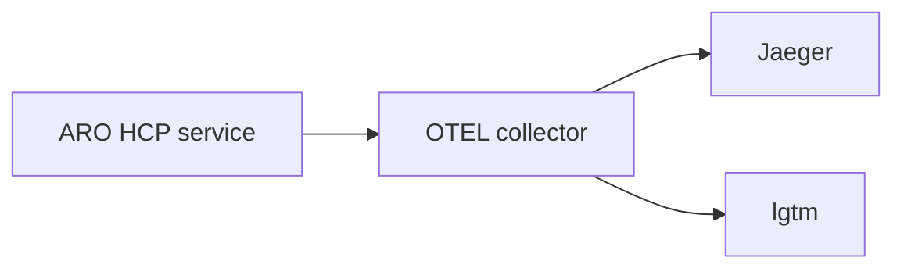

# Observability for developer environments

This page explains the tracing setup for ARO HCP in [personal developer environments](../dev-infrastructure/docs/development-setup.md).

## Pre-requisites

* `KUBECONFIG` environment variable set to the location of the Service Cluster's kubeconfig file.

## Tracing

The ARO resource provider Frontend & Backend, Clusters Service and Maestro are
all instrumented with the Go OpenTelemetry SDK for traces. By default, these
services aren't configured to export traces, except for personal developer
environments where the [Jaeger](https://www.jaegertracing.io/) and Grafana
[lgtm](https://github.com/grafana/docker-otel-lgtm) backends are used.


### Installation

To deploy the tracing components, run:

```
make deploy
```



The `observability` namespace contains a service named `ingest` which accepts otlp via gRPC and HTTP and points to the OpenTelemetry collector.

### OpenTelemetry collector

The OpenTelemetry collector is used to receive traces from the ARO-HCP components and dispatch them to the trace backends (Jaeger and lgtm).

### Jaeger all-in-one

Jaeger receives traces from the OpenTelemetry collector, store them in-memory and provides visualization and query capabilities.

After installation, we can access the UI using `kubectl port-forward`:

```
kubectl port-forward -n observability svc/jaeger 16686:16686
```

Open http://localhost:16686 in your browser to access the Jaeger UI.


##### lgtm

The lgtm deployment embeds Grafana (visualization) + Tempo (trace storage) +
Loki (logs storage) + Prometheus (metrics storage).

We can access the Grafana UI using  `kubectl port-forward`:

```
kubectl port-forward -n observability svc/lgtm 3000:3000
```

#### Configuration of the ARO services

The export of the trace information is configured by environment variables for
the RP Frontend/Backend, maestro server and command-line arguments for the
Clusters Service.

#### Generate Traces

Traces are automatically generated for every incoming HTTP request (sampling
rate: 100%). A simple way to generate incoming requests is to follow the [demo
instructions](../../demo/README.md).

#### Common Attributes

A list of relevant span and resource attributes that are likely propagated to the next service via baggage can be found [here](tracing-common-attributes.md)
