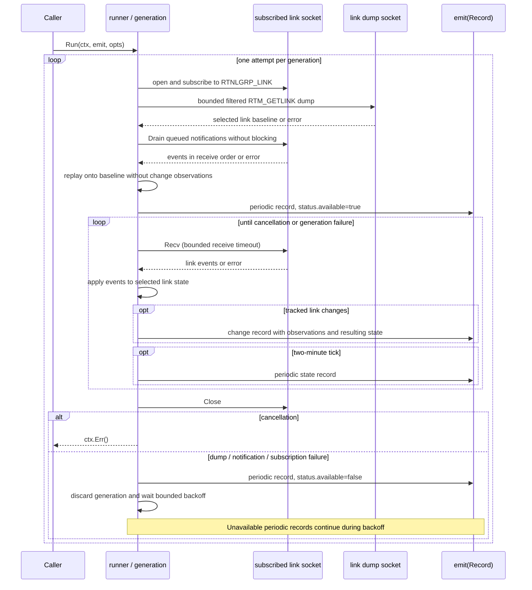

# netwatch Interaction Diagram

`Run` owns the monitor and tracked link state on one goroutine. It calls
`emit` synchronously. There is no separate notification-reader goroutine,
userspace event channel, or address-state collector.

The subscription is opened before the baseline dump. Notifications accumulate
in its kernel socket buffer while the separate dump socket is read. `Drain`
then receives queued notifications until the socket would block. Replaying
these events reconstructs current selected state; it does not establish which
changes occurred after the dump, so replay emits no change observations.

Kernel overflow, malformed relevant notifications, dump failure, and
subscription failure invalidate the generation. The runner emits unavailable
status without stale state, then opens a new subscription and rebuilds from
scratch. Backoff doubles to a cap and resets after a generation has reached
available state. The periodic ticker is serviced between receives and during
retry backoff; collection and replay are synchronous.

The emitter's session ID and record sequence persist across generations.
`last_applied_notification` is generation-local and resets on reconstruction;
it is not a kernel sequence number or proof of lossless event history.
