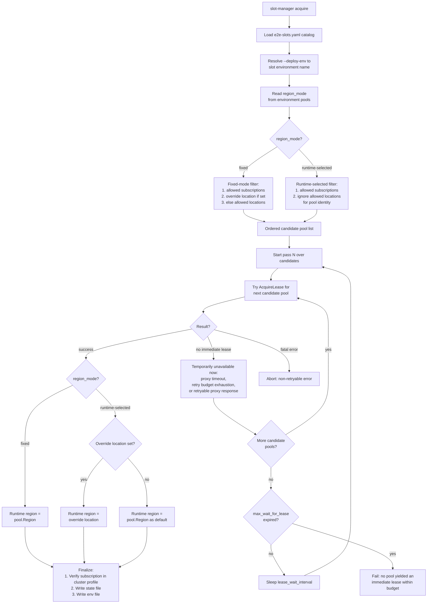

# Slot Manager — Design Context

## Status

The slot-based runtime leasing foundation is code complete but still
pending test/merge. It scales customer-subscription usage and later
enables deterministic failover/failback.

## Epic Goals (E2E-relevant subset)

1. Support environment-appropriate use of subscription and region coordinates across E2E execution.
2. Increase total CI throughput without sacrificing reproducibility or debuggability.
3. Make subscription and region routing deterministic.
4. Use provision-phase health rather than full test pass rate for region/pool health decisions.
5. Leave room for future automation only after the signal quality is good enough.

## Non-goals

- Full automation in phase 1.
- Replacing Boskos global ownership model.
- Solving all test flakes inside functional test logic.

## Design Principles

- Determinism over randomness.
- Manual controls first, automation after signal quality is proven.
- Region health is based on provision outcomes only.
- Model capacity as composite subscription+region cells where that is the natural execution unit.
- Keep Boskos and CI global config minimal and stable.
- Prefer config-driven and inventory-driven selection over ad hoc runtime overrides.

## Vault Cluster Profile Secret Contract

The cluster profile secret provides the authoritative customer-subscription
inventory for slot-based routing.

- **Customer subscription shard keys**
  - `customer-shardN-subscription-id`
  - `customer-shardN-subscription-name`
  - Examples:
    - `customer-shard1-subscription-id`
    - `customer-shard1-subscription-name`
    - `customer-shard2-subscription-id`
  - These keys declare the pool of customer subscriptions that E2E jobs can consume through slot-based routing and leasing.

- E2E slot logic and related tooling select from the `customer-shardN-*` inventory when deciding which customer subscription pool a leased slot belongs to.

## E2E Tests: Multi-Subscription and Multi-Region

### Why this workstream exists

Even after infrastructure is decoupled, E2E scale is still limited by the
**customer subscription** and sometimes the **region** where tests create
and manage HCP clusters.

The test-side design therefore introduces a runtime leasing model that can
scale independently from the infrastructure-subscription work.

### Current design

- The canonical E2E slot inventory lives in ARO-HCP.
- Runtime leasing is done through `aro-hcp-tests slot-manager` and the ci-operator Boskos proxy.
- The E2E workflow in `openshift/release` uses dedicated acquire/release steps that wrap the CLI.
- Pool selection is now driven by an explicit selector contract:
  - `ALLOWED_SUBSCRIPTIONS`
    - candidate-pool allowlist keyed by catalog `subscription_name`
  - `ALLOWED_LOCATIONS`
    - fixed-mode candidate-pool allowlist keyed by region
  - `MULTISTAGE_PARAM_OVERRIDE_LOCATION`
    - highest-precedence concrete runtime location
    - when set it overrides `ALLOWED_LOCATIONS` for fixed-mode pool selection
    - for runtime-selected pools it does not change pool identity, but it does become the concrete runtime location
- The runtime env contract is intentionally narrow and non-secret:
  - `CUSTOMER_SUBSCRIPTION`
  - `SELECTED_LOCATION`
  - `LEASED_MSI_CONTAINERS`
  - `ARO_HCP_E2E_SLOT_NAME`
  - `ARO_HCP_E2E_SLOT_RESOURCE_TYPE`
- Downstream `openshift/release` steps still mostly consume `LOCATION` today, so the release-side scripts map `SELECTED_LOCATION` back into `LOCATION` where needed.

### Coordinate model by environment

- **Subscription coordinate**
  - The main reason to add more customer subscriptions is to bypass Azure role-assignment limit pressure and unlock higher E2E suite parallelism while still keeping enough job concurrency.
- **Region coordinate**
  - **DEV**
    - Start with one primary region and one backup region.
    - Failover is manual first.
    - Keep the door open to several active primary regions later if that becomes useful.
  - **INT / STG**
    - Region remains fixed to `uksouth` because these are persistent environments that only exist in `uksouth`.
    - These environments use gating tests that are triggered on demand after service rollout through Gangway-backed execution of the `aro-hcp-e2e` jobs in `openshift/release`.
    - `stg` also has periodic E2E jobs pinned to `uksouth` today, declared in `release/ci-operator/config/Azure/ARO-HCP/Azure-ARO-HCP-main__periodic.yaml`.
  - **PROD**
    - Prod has presence in many regions, so region is a real routing coordinate here.
    - `prod` also has periodic E2E jobs pinned to `uksouth` today, declared in `release/ci-operator/config/Azure/ARO-HCP/Azure-ARO-HCP-main__periodic.yaml`.
    - Concurrency for a particular region is usually `1` (although it can be higher for `uksouth` due to periodics), but several customer subscriptions are still needed to run tests against multiple prod regions concurrently.
    - The expectation is that Gangway-triggered prod gating jobs set `MULTISTAGE_PARAM_OVERRIDE_LOCATION` per target region when invoking the job. `slot-manager acquire` gives that override precedence over `ALLOWED_LOCATIONS` on the acquire side, and the leased slot then exports the authoritative runtime `SELECTED_LOCATION` for downstream steps.
    - This also means we need to watch for any step that bypasses that contract and accidentally uses a stale/default `LOCATION` instead of the release-mapped `SELECTED_LOCATION`.

### Pool selection and lease acquisition flow

### Current implementation state

- The current branch now implements the broader slot-based runtime leasing model:
  - canonical slot catalog and `slot-manager` CLI,
  - `region_mode: fixed|runtime-selected` plus optional `identity_provisioning_region`,
  - Boskos managed-block sync/validation tooling,
  - release step wiring,
  - formalized non-secret runtime contract centered on `SELECTED_LOCATION`.
- Multi-pool candidate selection and fallback are implemented:
  - fixed-mode environments filter candidate pools by `ALLOWED_SUBSCRIPTIONS` and either `ALLOWED_LOCATIONS` or `MULTISTAGE_PARAM_OVERRIDE_LOCATION`, then try pools in catalog order,
  - runtime-selected environments use `ALLOWED_SUBSCRIPTIONS` for pool identity, ignore `ALLOWED_LOCATIONS` for candidate selection, and use `MULTISTAGE_PARAM_OVERRIDE_LOCATION` only as the concrete runtime location,
  - current `openshift/release` dev rollout pins the normal `e2e-parallel` job to the first dev pool on `ARO HCP E2E Hosted Clusters (EA Subscription)` in `centralus`,
  - the separate `e2e-parallel-multipool` job exercises only the additional pools on `ARO HCP E2E Hosted Clusters 2 (EA Subscription)` in `centralus` and `westus3`.
- Pool fallback is now adapted to the Boskos proxy's blocking acquire behavior:
  - the proxy does not reliably give `slot-manager` a distinct immediate "pool exhausted" signal for candidate failover,
  - each candidate pool probe is therefore bounded by `lease-proxy-timeout` and interpreted through the client-side `ErrLeasePoolUnavailableNow` classification,
  - timeout-budget exhaustion and retryable proxy/server failures now mean "this pool did not yield an immediate lease now; try the next candidate pool",
  - one full pass over the candidate pools is the retry unit when every candidate is temporarily unavailable.
- Waiting is now explicit and separated from transient proxy/network retry handling:
  - per-request `lease-proxy-timeout` plus exponential backoff covers one bounded probe of a single candidate pool,
  - repeated full-pass waiting now uses `lease_wait_interval` and `max_wait_for_lease`,
  - the default per-pool `lease-proxy-timeout` is now `30s`,
  - the current defaults are `lease_wait_interval=1m` and `max_wait_for_lease=30m`,
  - `max_wait_for_lease=0` means wait forever,
  - `openshift/release` now exposes `ARO_HCP_SLOT_MANAGER_LEASE_WAIT_INTERVAL` and `ARO_HCP_SLOT_MANAGER_MAX_WAIT_FOR_LEASE` as optional per-job overrides.
- Current rollout limitation:
  - migration is still staged while legacy leases are retired, so the active slot inventory is being brought up gradually even though the code path now supports the broader multi-pool model.

### Dev subscription onboarding note

- Adding a new **dev** customer subscription to the slot catalog is **not** sufficient by itself.
- Historical reference: commit `d6f6aede7eab13c9d591048d08f87ceb2cd1023e` ("Additional subscription for dev/operator roles") captured the same requirement when the original extra hosted-cluster/E2E subscription was introduced.
- In addition to catalog, Vault, and Boskos updates, the new subscription must also be wired into the dev identity/bootstrap layer:
  - add the subscription to the relevant `assignableScopes` for the dev mock/operator roles,
  - grant the corresponding dev first-party, ARM-helper, and MSI-mock identities access on that subscription.
- Without that bootstrap, local/dev flows can fail with Azure `AuthorizationFailed` errors even though the slot inventory itself is correct.

## Open Decisions and Deferred Work

- **Lease timeout tuning**
  - Lease acquisition timeout is no longer a platform unknown because the Boskos proxy client is under ARO-HCP control.
  - Initial bounded waiting defaults are now implemented: `lease_wait_interval=1m`, `max_wait_for_lease=30m`, and `0` means wait forever.
  - The remaining choice is whether real CI data justifies different defaults or per-job overrides for particular environments.
- **Automation level**
  - Manual controls and manual failover come first.
  - Automated routing should only be introduced after enough telemetry and operational experience exist.
