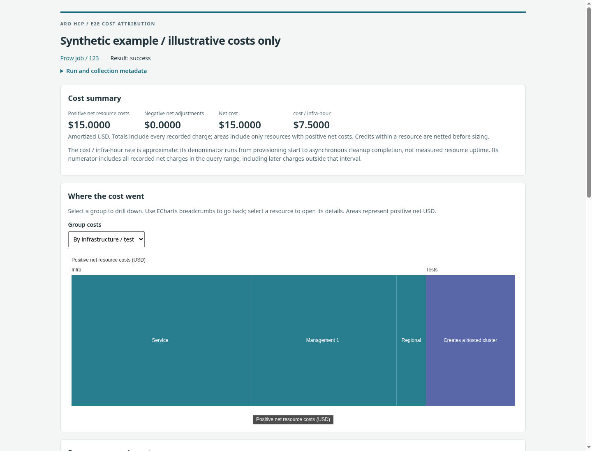

# E2E Cost Reports

Two small CLIs collect Azure-reported amortized costs for an ARO HCP
`pull-ci-Azure-ARO-HCP-main-e2e-parallel` PR job and render an offline HTML report.
Collection and rendering are separate so UI changes need no Azure refetch.

## Usage

Prerequisites: the repository's Go toolchain (see `go.work`), Azure CLI, and an
existing login with the permissions described below.

From this directory:

```bash
go build -o e2e-cost-gather ./cmd/e2e-cost-gather
go build -o e2e-cost-render ./cmd/e2e-cost-render

AZURE_CONFIG_DIR="$HOME/.azure-redhat" ./e2e-cost-gather \
  --job https://prow.ci.openshift.org/view/gs/test-platform-results-public/pr-logs/pull/Azure_ARO-HCP/6976/pull-ci-Azure-ARO-HCP-main-e2e-parallel/2100537004893671424 \
  --output run-data.json

# Run even when gather returned a nonzero status: the snapshot includes errors.
./e2e-cost-render --input run-data.json --output cost-summary.html
```

The collector uses existing Azure CLI credentials (`az login`) and honors
`AZURE_CONFIG_DIR`. It does not change the CLI's default subscription. The account
needs Cost Management access to each identified subscription, including
any applicable EA charge-visibility permissions. Resolving redacted infrastructure
subscriptions also requires read access to the run's Kusto service-log database
and network connectivity to that endpoint. No subscription overrides or
account-wide discovery are performed. Collection has a 30-minute default timeout,
configurable with `--timeout`.

The renderer needs no credentials or network. ECharts, CSS, data, and license notices
are embedded in the HTML. Both outputs are atomically replaced and private (0600)
by default: they contain resource IDs and negotiated pricing. No output is published.

## Reading the Report

Use **Group costs** above the treemap to switch between:

- **By infrastructure / test:** Infra or Tests, then cluster or test name, resource
  group, resource type, and individual resource.
- **By resource type:** aggregate each Azure resource type across the entire run,
  then drill into individual resources, labeled with their resource groups.

Click a rectangle to drill down and use the breadcrumbs to return. Clicking an
individual resource opens its full ID, ownership, and daily meter charges below.
Only one resource detail panel is mounted at a time, independently of the inventory
pages; `#resource-G-R` links also open that resource directly.

Expand **Resource group inventory** or **All resources** to browse the saved data.
These tables are mounted only on first expansion, with Prev/Next pagination of 25
groups or 50 resources. The selected resource's meter table shows 50 rows per page.
Counts show all matches and the current range; changing pages replaces rows rather
than accumulating them. Search covers every record, including off-page resources,
meter fields, and group attribution, with a short typing debounce. Group search
also finds empty groups. Zero costs, credits, and resources without billing records
remain searchable even though they have no treemap area.

The compact inventory data is embedded once, with ownership stored per group, not
repeated for each resource. Browsing requires JavaScript but never fetches data or
assets. Without JavaScript, the summary and diagnostics remain readable. Errors and
warnings appear at the top; informational collection notes are collapsed at the
bottom. Re-rendering an existing snapshot needs no schema migration or data refetch.

To try the renderer without Azure access, use the fictional example:

```bash
./e2e-cost-render --input examples/run-data.json --output cost-summary.html
```



To iterate on the UI, rebuild only `e2e-cost-render` and rerun it against your saved
JSON. Do not rerun gather unless you want refreshed artifacts and billing data.

## Attribution

The hierarchy is `Infra / Tests`, then cluster/regional infrastructure or full test
name, resource group, Azure resource type, and individual resource. Test attempts
are combined. Infra includes service and management AKS node groups; Tests includes
customer and RP-managed groups. Shared infrastructure and pooled identity groups
are explicitly excluded, not allocated a fraction of their bill.

Inputs come from the run's provisioning configuration, deployment timing, original
test timing, JSON test logs, deployment dumps, OpenShift Infrastructure objects,
and targeted backend snapshots. Artifacts may contain gzip regardless of extension.
Directory presence or an arbitrary resource reference alone does not prove ownership.

When infrastructure subscription UUIDs are missing or redacted, the collector
queries historical `kubeAudit.resourceId` values in the Kusto endpoint and database
recorded in the provision config. Queries use the run's bounded infrastructure
interval and exact AKS name/resource-group pairs from config and deployment steps.
Each pair must resolve to exactly one subscription; ambiguous or partial query
results are errors. No billing data from unrelated subscriptions is searched.

The regional RG is assumed to use the **service cluster's subscription** for this
job. Each AKS-managed RG inherits its own parent cluster's subscription. These
assumptions and successful historical lookups are displayed in group attribution
notes. Service and management clusters are resolved independently rather than
assigning every group the first subscription found.

Because customer group names are unique to a run, exact `<customer>--managed` and
`<customer>-managed` candidates can fill missing managed-group evidence when billing
confirms them in the same subscription. Such attribution is visibly labeled.
AKS groups use the deployed `-aks1` convention unless an explicit node group is
available. Explicit ownership and shared exclusions take precedence over heuristics;
ambiguous ownership is an error. Random or truncated managed names still require
artifact evidence. A heuristic resolves a missing single-cluster mapping only when
exactly one candidate is confirmed for that customer group.

## Billing

The collector requests subscription-scoped Azure Cost Details reports with
`AmortizedCost`, splitting the inclusive UTC job-start-day through collection-day
window by calendar month. It streams the reports and discards unrelated rows.
Only render-ready resource/meter/day aggregates are saved, never raw reports,
logs, access tokens, or signed download URLs.

- USD only: use USD billing amounts or an explicit Azure `costInUsd` field. No
  local currency conversion or retail-price estimation.
- All reported lifecycle costs are included, even after Prow completion.
- Positive **net resource** costs determine treemap area. Negative resource totals
  remain in the inventory and accounting reconciliation; explicit zero and absent
  billing records are distinct.
- Charges without a resource ID remain under their known owned RG and meter category.
- Usage on UTC days after job completion gets a visual warning. Daily records cannot
  distinguish same-day cleanup tails or prove a resource still exists.
- Cost / infra-hour uses provisioning pod start through final cleanup pod completion.
  It is approximate: cleanup does not wait for deletion. Later charges remain in
  its numerator. Missing timing omits this optional metric.
- Billing can arrive late and be revised. A successfully collected range is not a
  finalized invoice. Cost Details supports at most 13 months of historical data;
  unsupported windows or compressed report formats produce explicit errors.

## Failures and Snapshots

Gather writes a versioned JSON snapshot even when preconditions fail, then exits
nonzero. Missing subscription identity, required artifacts, ambiguous ownership,
and billing failures are structured diagnostics. Successfully collected branches
remain visible as **known subtotals**, never a full run total. Renderer failures
(invalid JSON/version/currency) leave an existing HTML output untouched.

The example job's infrastructure subscription selectors are redacted, but its
historical AKS audit records can recover the identities for all seven infrastructure
groups, including the regional RG via the service-cluster assumption above. Its
test subscription is present in original timing artifacts. If Kusto is unreachable,
access is denied, or logs have expired, the affected groups remain unavailable and
the report displays errors. Descriptive config labels are not treated as account
names, and the current checkout is never used to guess subscription IDs.

Rerunning gather creates a fresh snapshot. There is no resume, cache, or backfill
merge. The saved file contains only fields used by the report, not an archive for
replaying discovery. Discovery errors tied to unresolved groups include enough
context to explain them in the UI.

## Verification

```bash
go test -race ./...
go vet ./...
E2E_COST_BROWSER=/usr/bin/google-chrome go test -race ./...

# Optional public-artifact check, without Azure billing calls:
E2E_COST_LIVE_DISCOVERY=1 go test -run TestDiscoverLive -v .
```

Tests cover artifact formats and pagination, ownership and exclusions, heuristics,
monthly windows, asynchronous reports, USD and signed amounts, partial failures,
credential isolation, escaping, and desktop/mobile chart interactions. Browser checks
exercise 600+ resources, off-page search, bounded group/resource/meter pagination,
lazy inventories, hash links, and single-resource selection. The live
discovery test is opt-in because public artifacts may expire or change.

The pinned chart runtime and upstream notices are documented in `assets/README.md`.
