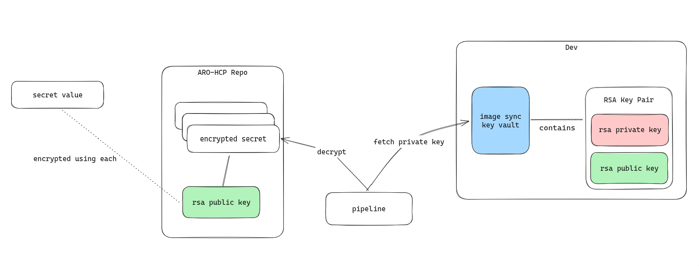

## Secret sync flow

## General flow



Secrets are encrypted using the public part of RSA. We can generate RSA Key Pair by creating a key in Azure Key Vault. 

For this we'd have to do:

 * Create an RSA key in Key Vault (target key vault for secret)
 * Download the Public key and store in this repo
 * Use `encrypt.sh` to encrypt a secret using this Certificate
 * In target environment use `decrypt.sh` to decrypt this secret and store it in the target key vault


## Planned Pipeline

There should be a pipeline step to sync secrets, something like this:

```YAML
name: decrypt-secret
action: Shell
command: decrypt.sh ./data/secrets/secret.enc $KEYVAULT $PRIVATEKEYSECRET
variables:
    - name: SECRETS
    configRef: secretsSync.secrets
    - name: KEYVAULT
    configRef: secretsSync.keyvault
    - name: PRIVATEKEYSECRET
    configRef: secretsSync.privateKeySecret
```

The configRef contains an array of secret names, i.e.: `quay-pull.enc`. The script will look for thee encrypted content under `data/secrets/$region-short` and will write these content to the key vault, using the same name as the secret name. This requires the extension `.enc` in the file, the filename without suffix is used as key name for the secret to create.

